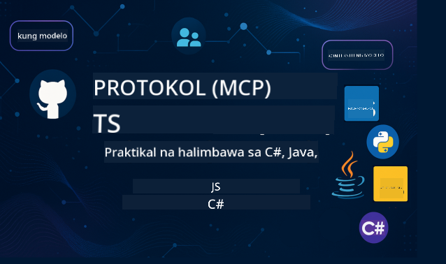

<!--
CO_OP_TRANSLATOR_METADATA:
{
  "original_hash": "2a21391378c12ecfef50f866329dfde0",
  "translation_date": "2025-05-17T05:31:41+00:00",
  "source_file": "README.md",
  "language_code": "tl"
}
-->

Sundin ang mga hakbang na ito para makapagsimula sa paggamit ng mga resource na ito:
1. **Fork ang Repositoryo**: I-click ang 
2. **Clone ang Repositoryo**: `git clone https://github.com/microsoft/mcp-for-beginners.git`
3. [**Sumali sa Microsoft Azure AI Foundry Discord at makipagtagpo sa mga eksperto at kapwa developer**](https://discord.com/invite/ByRwuEEgH4)

### 🌐 Suporta sa Maraming Wika

#### Sinusuportahan sa pamamagitan ng GitHub Action (Automated & Laging Napapanahon)
[French](../fr/README.md) | [Spanish](../es/README.md) | [German](../de/README.md) | [Russian](../ru/README.md) | [Arabic](../ar/README.md) | [Persian (Farsi)](../fa/README.md) | [Urdu](../ur/README.md) | [Chinese (Simplified)](../zh/README.md) | [Chinese (Traditional, Macau)](../mo/README.md) | [Chinese (Traditional, Hong Kong)](../hk/README.md) | [Chinese (Traditional, Taiwan)](../tw/README.md) | [Japanese](../ja/README.md) | [Korean](../ko/README.md) | [Hindi](../hi/README.md) | [Bengali](../bn/README.md) | [Marathi](../mr/README.md) | [Nepali](../ne/README.md) | [Punjabi (Gurmukhi)](../pa/README.md) | [Portuguese (Portugal)](../pt/README.md) | [Portuguese (Brazil)](../br/README.md) | [Italian](../it/README.md) | [Polish](../pl/README.md) | [Turkish](../tr/README.md) | [Greek](../el/README.md) | [Thai](../th/README.md) | [Swedish](../sv/README.md) | [Danish](../da/README.md) | [Norwegian](../no/README.md) | [Finnish](../fi/README.md) | [Dutch](../nl/README.md) | [Hebrew](../he/README.md) | [Vietnamese](../vi/README.md) | [Indonesian](../id/README.md) | [Malay](../ms/README.md) | [Tagalog (Filipino)](./README.md) | [Swahili](../sw/README.md) | [Hungarian](../hu/README.md) | [Czech](../cs/README.md) | [Slovak](../sk/README.md) | [Romanian](../ro/README.md) | [Bulgarian](../bg/README.md) | [Serbian (Cyrillic)](../sr/README.md) | [Croatian](../hr/README.md) | [Slovenian](../sl/README.md)
# 🚀 Ang Pinaka-komprehensibong Gabay sa Model Context Protocol (MCP) Kurikulum para sa mga Baguhan

## **Matutunan ang MCP gamit ang Mga Halimbawa ng Kodigo sa C#, Java, JavaScript, Python, at TypeScript**

## 🧠 Pangkalahatang-ideya ng Model Context Protocol Kurikulum

Ang **Model Context Protocol (MCP)** ay isang makabagong balangkas na idinisenyo upang i-standardize ang mga interaksyon sa pagitan ng mga AI na modelo at mga client na aplikasyon. Ang open-source na kurikulum na ito ay nag-aalok ng isang naka-istrukturang landas sa pag-aaral, na may kasamang mga praktikal na halimbawa ng pag-coding at mga tunay na kaso ng paggamit, sa mga sikat na programming language tulad ng C#, Java, JavaScript, TypeScript, at Python.

Kung ikaw ay isang AI developer, system architect, o software engineer, ang gabay na ito ay ang iyong kumpletong mapagkukunan para sa pag-master ng mga pangunahing kaalaman sa MCP at mga estratehiya sa implementasyon.

## 🔗 Opisyal na Mga Mapagkukunan ng MCP

- 📘 [MCP Documentation](https://modelcontextprotocol.io/) – Mga detalyadong tutorial at gabay ng gumagamit  
- 📜 [MCP Specification](https://spec.modelcontextprotocol.io/) – Arkitektura ng protocol at mga teknikal na sanggunian  
- 🧑‍💻 [MCP GitHub Repository](https://github.com/modelcontextprotocol) – Mga open-source na SDK, kasangkapan, at halimbawa ng kodigo  

## 🧭 Kumpletong Istruktura ng MCP Kurikulum

### 📌 [Panimula sa MCP](./00-Introduction/README.md)

- Ano ang Model Context Protocol?
- Bakit mahalaga ang standardisasyon sa AI pipelines
- Mga praktikal na kaso ng paggamit at benepisyo ng MCP

### 🧩 [Paliwanag ng mga Pangunahing Konsepto](./01-CoreConcepts/README.md)

- Pag-unawa sa client-server na arkitektura sa MCP
- Mga pangunahing bahagi ng protocol: mga kahilingan, tugon, at mga schema
- Mga pattern ng pagmemensahe at palitan ng data sa MCP

### 🔐 [Seguridad sa MCP](./02-Security/readme.md)

- Pagkilala sa mga banta sa seguridad sa loob ng mga sistemang batay sa MCP
- Mga teknik at pinakamahusay na kasanayan para sa pag-secure ng mga implementasyon

### 🚀 [Pagsisimula sa MCP](./03-GettingStarted/README.md)

- Pagsasaayos ng kapaligiran at configuration
- Paglikha ng mga pangunahing MCP server at client
- Pagsasama ng MCP sa mga umiiral na aplikasyon

#### 🧮 Mga Proyekto ng Halimbawa ng MCP Calculator:

  
<strong>I-explore ang mga Implementasyon ng Kodigo ayon sa Wika</strong>

  - [Halimbawa ng C# MCP Server](./03-GettingStarted/samples/csharp/README.md)
  - [Java MCP Calculator](./03-GettingStarted/samples/java/calculator/README.md)
  - [JavaScript MCP Demo](./03-GettingStarted/samples/javascript/README.md)
  - [Python MCP Server](../../03-GettingStarted/samples/python/mcp_calculator_server.py)
  - [Halimbawa ng TypeScript MCP](./03-GettingStarted/samples/typescript/README.md)

### 🛠️ [Praktikal na Implementasyon](./04-PracticalImplementation/README.md)

- Paggamit ng mga SDK sa iba't ibang wika
- Pag-debug, pagsubok, at pag-validate
- Paggawa ng mga reusable na prompt template at workflow

#### 💡 Mga Proyekto ng Advanced MCP Calculator:

  
<strong>I-explore ang mga Advanced na Halimbawa</strong>

  - [Advanced na Halimbawa ng C#](./04-PracticalImplementation/samples/csharp/README.md)
  - [Halimbawa ng Java Container App](./04-PracticalImplementation/samples/java/containerapp/README.md)
  - [Advanced na Halimbawa ng JavaScript](./04-PracticalImplementation/samples/javascript/README.md)
  - [Kumplikadong Implementasyon ng Python](../../04-PracticalImplementation/samples/python/mcp_sample.py)
  - [Halimbawa ng TypeScript Container](./04-PracticalImplementation/samples/typescript/README.md)

### 🎓 [Mga Advanced na Paksa sa MCP](./05-AdvancedTopics/README.md)

- Mga multi-modal na AI workflow at extensibility
- Mga estratehiya para sa ligtas na pag-scale
- MCP sa mga enterprise ecosystem

### 🌍 [Mga Ambag ng Komunidad](./06-CommunityContributions/README.md)

- Paano mag-ambag ng kodigo at dokumento
- Pakikipagtulungan sa pamamagitan ng GitHub
- Mga pagpapahusay at feedback na pinamumunuan ng komunidad

### 📈 [Mga Insight mula sa Maagang Pag-aampon](./07-CaseStudies/README.md)

- Mga tunay na implementasyon at kung ano ang nagtagumpay
- Pagbuo at pag-deploy ng mga solusyong batay sa MCP
- Mga uso at hinaharap na roadmap

### 📏 [Pinakamahusay na Kasanayan para sa MCP](./08-BestPractices/README.md)

- Pag-tune at pag-optimize ng performance
- Pagdidisenyo ng mga fault-tolerant na sistema ng MCP
- Mga estratehiya sa pagsubok at resilience

### 📊 [Mga Pag-aaral ng Kaso ng MCP](./09-CaseStudy/Readme.md)

- Malalalim na pag-aaral sa mga arkitektura ng solusyon ng MCP
- Mga blueprint ng deployment at mga tip sa pagsasama
- Mga anotadong diagram at walkthrough ng proyekto

## 🎯 Mga Kinakailangan para sa Pag-aaral ng MCP

Upang masulit ang kurikulum na ito, dapat kang magkaroon ng:

- Pangunahing kaalaman sa C#, Java, o Python
- Pag-unawa sa client-server na modelo at mga API
- (Opsyonal) Pagkakakilala sa mga konsepto ng machine learning

## 🛠️ Paano Epektibong Gamitin ang Kurikulum na Ito

Bawat aralin sa gabay na ito ay naglalaman ng:

1. Malinaw na paliwanag ng mga konsepto ng MCP  
2. Mga live na halimbawa ng kodigo sa iba't ibang wika  
3. Mga ehersisyo para makabuo ng tunay na mga aplikasyon ng MCP  
4. Mga karagdagang mapagkukunan para sa mga advanced na nag-aaral  

## 📜 Impormasyon sa Lisensya

Ang nilalamang ito ay lisensyado sa ilalim ng **MIT License**. Para sa mga tuntunin at kundisyon, tingnan ang [LICENSE](../../LICENSE).

## 🤝 Mga Alituntunin sa Pag-ambag

Ang proyektong ito ay tumatanggap ng mga kontribusyon at mungkahi. Karamihan sa mga kontribusyon ay nangangailangan sa iyo na sumang-ayon sa isang Contributor License Agreement (CLA) na nagdedeklara na mayroon kang karapatan na, at talagang ginagawa, ibigay sa amin ang mga karapatan na gamitin ang iyong kontribusyon. Para sa mga detalye, bisitahin ang <https://cla.opensource.microsoft.com>.

Kapag nagsumite ka ng isang pull request, ang isang CLA bot ay awtomatikong tutukuyin kung kailangan mong magbigay ng CLA at palamutihan ang PR nang naaangkop (hal., pagsusuri ng katayuan, komento). Sundin lamang ang mga tagubilin na ibinigay ng bot. Kakailanganin mo lamang itong gawin nang isang beses sa lahat ng mga repo na gumagamit ng aming CLA.

Ang proyektong ito ay nagpatibay ng [Microsoft Open Source Code of Conduct](https://opensource.microsoft.com/codeofconduct/). Para sa karagdagang impormasyon, tingnan ang [Code of Conduct FAQ](https://opensource.microsoft.com/codeofconduct/faq/) o makipag-ugnayan sa [opencode@microsoft.com](mailto:opencode@microsoft.com) para sa anumang karagdagang mga tanong o komento.

## ™️ Paalala sa Trademark

Ang proyektong ito ay maaaring naglalaman ng mga trademark o logo para sa mga proyekto, produkto, o serbisyo. Ang awtorisadong paggamit ng mga trademark o logo ng Microsoft ay napapailalim sa at dapat sumunod sa [Microsoft's Trademark & Brand Guidelines](https://www.microsoft.com/legal/intellectualproperty/trademarks/usage/general). Ang paggamit ng mga trademark o logo ng Microsoft sa mga binagong bersyon ng proyektong ito ay hindi dapat magdulot ng pagkalito o magpahiwatig ng sponsorship ng Microsoft. Ang anumang paggamit ng mga third-party na trademark o logo ay napapailalim sa mga patakaran ng mga third-party na iyon.

**Paunawa**:  
Ang dokumentong ito ay isinalin gamit ang AI translation service na [Co-op Translator](https://github.com/Azure/co-op-translator). Bagaman sinisikap naming maging tumpak, mangyaring tandaan na ang awtomatikong pagsasalin ay maaaring maglaman ng mga error o hindi pagkaka-tugma. Ang orihinal na dokumento sa kanyang katutubong wika ang dapat ituring na mapagkakatiwalaang pinagmulan. Para sa mahalagang impormasyon, inirerekomenda ang propesyonal na pagsasalin ng tao. Hindi kami mananagot para sa anumang hindi pagkakaintindihan o maling interpretasyon na dulot ng paggamit ng pagsasaling ito.