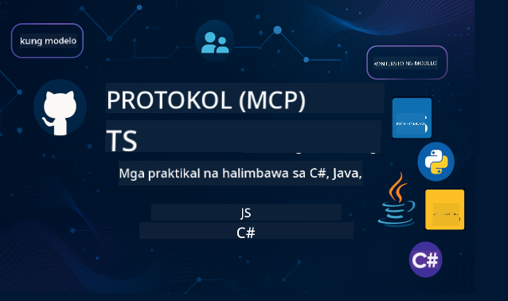

<!--
CO_OP_TRANSLATOR_METADATA:
{
  "original_hash": "866c8877136cb03e1efb9ad633a2f0a6",
  "translation_date": "2025-08-26T18:06:13+00:00",
  "source_file": "README.md",
  "language_code": "tl"
}
-->
 

Sundin ang mga hakbang na ito upang magsimula sa paggamit ng mga resources na ito:
1. **I-Fork ang Repository**: I-click 
2. **I-clone ang Repository**:   `git clone https://github.com/microsoft/mcp-for-beginners.git`
3. [**Sumali sa Azure AI Foundry Discord at makipag-ugnayan sa mga eksperto at kapwa developer**](https://discord.com/invite/ByRwuEEgH4)

### 🌐 Suporta sa Multi-Language

#### Sinusuportahan sa pamamagitan ng GitHub Action (Automated at Laging Napapanahon)

 [Arabic](../ar/README.md) | [Bengali](../bn/README.md) | [Bulgarian](../bg/README.md) | [Burmese (Myanmar)](../my/README.md) | [Chinese (Simplified)](../zh/README.md) | [Chinese (Traditional, Hong Kong)](../hk/README.md) | [Chinese (Traditional, Macau)](../mo/README.md) | [Chinese (Traditional, Taiwan)](../tw/README.md) | [Croatian](../hr/README.md) | [Czech](../cs/README.md) | [Danish](../da/README.md) | [Dutch](../nl/README.md) | [Finnish](../fi/README.md) | [French](../fr/README.md) | [German](../de/README.md) | [Greek](../el/README.md) | [Hebrew](../he/README.md) | [Hindi](../hi/README.md) | [Hungarian](../hu/README.md) | [Indonesian](../id/README.md) | [Italian](../it/README.md) | [Japanese](../ja/README.md) | [Korean](../ko/README.md) | [Malay](../ms/README.md) | [Marathi](../mr/README.md) | [Nepali](../ne/README.md) | [Norwegian](../no/README.md) | [Persian (Farsi)](../fa/README.md) | [Polish](../pl/README.md) | [Portuguese (Brazil)](../br/README.md) | [Portuguese (Portugal)](../pt/README.md) | [Punjabi (Gurmukhi)](../pa/README.md) | [Romanian](../ro/README.md) | [Russian](../ru/README.md) | [Serbian (Cyrillic)](../sr/README.md) | [Slovak](../sk/README.md) | [Slovenian](../sl/README.md) | [Spanish](../es/README.md) | [Swahili](../sw/README.md) | [Swedish](../sv/README.md) | [Tagalog (Filipino)](./README.md) | [Thai](../th/README.md) | [Turkish](../tr/README.md) | [Ukrainian](../uk/README.md) | [Urdu](../ur/README.md) | [Vietnamese](../vi/README.md)

# 🚀 Kurikulum ng Model Context Protocol (MCP) para sa mga Baguhan

## **Matutunan ang MCP gamit ang mga Halimbawa ng Code sa C#, Java, JavaScript, Rust, Python, at TypeScript**

## 🧠 Pangkalahatang-ideya ng Kurikulum ng Model Context Protocol

Ang **Model Context Protocol (MCP)** ay isang makabagong framework na idinisenyo upang gawing standard ang interaksyon sa pagitan ng mga AI model at client application. Ang open-source na kurikulum na ito ay nag-aalok ng isang organisadong landas sa pag-aaral, na may kasamang mga praktikal na halimbawa ng code at mga tunay na kaso ng paggamit, sa mga sikat na programming language tulad ng C#, Java, JavaScript, TypeScript, at Python.

Kung ikaw ay isang AI developer, system architect, o software engineer, ang gabay na ito ang iyong komprehensibong resource para ma-master ang mga pangunahing kaalaman at estratehiya sa implementasyon ng MCP.

## 🔗 Opisyal na Mga Resource ng MCP

- 📘 [Dokumentasyon ng MCP](https://modelcontextprotocol.io/) – Detalyadong mga tutorial at user guide  
- 📜 [MCP Specification](https://modelcontextprotocol.io/docs/) – Arkitektura ng protocol at mga teknikal na reference  
- 📜 [Orihinal na MCP Specification](https://spec.modelcontextprotocol.io/) – Legacy na teknikal na reference (maaaring may karagdagang detalye)  
- 🧑‍💻 [MCP GitHub Repository](https://github.com/modelcontextprotocol) – Open-source na mga SDK, tools, at halimbawa ng code
- 🌐 [Komunidad ng MCP](https://github.com/orgs/modelcontextprotocol/discussions) – Sumali sa mga talakayan at mag-ambag sa komunidad

## 🧭 Pangkalahatang-ideya ng Kurikulum ng MCP

### 📚 Kumpletong Estruktura ng Kurikulum

| Module | Paksa | Deskripsyon | Link |
|--------|-------|-------------|------|
| **Module 1-3: Mga Pangunahing Kaalaman** | | | |
| 00 | Panimula sa MCP | Pangkalahatang-ideya ng Model Context Protocol at kahalagahan nito sa AI pipelines | [Basahin pa](./00-Introduction/README.md) |
| 01 | Paliwanag sa Mga Pangunahing Konsepto | Masusing pagtalakay sa mga pangunahing konsepto ng MCP | [Basahin pa](./01-CoreConcepts/README.md) |
| 02 | Seguridad sa MCP | Mga banta sa seguridad at pinakamahusay na mga kasanayan | [Basahin pa](./02-Security/README.md) |
| 03 | Pagsisimula sa MCP | Setup ng environment, mga pangunahing server/client, integrasyon | [Basahin pa](./03-GettingStarted/README.md) |
| **Module 3: Pagbuo ng Iyong Unang Server at Client** | | | |
| 3.1 | Unang Server | Gumawa ng iyong unang MCP server | [Gabay](./03-GettingStarted/01-first-server/README.md) |
| 3.2 | Unang Client | Bumuo ng isang pangunahing MCP client | [Gabay](./03-GettingStarted/02-client/README.md) |
| 3.3 | Client na may LLM | Isama ang mga large language model | [Gabay](./03-GettingStarted/03-llm-client/README.md) |
| 3.4 | Integrasyon ng VS Code | Gamitin ang MCP server sa VS Code | [Gabay](./03-GettingStarted/04-vscode/README.md) |
| 3.5 | stdio Server | Gumawa ng mga server gamit ang stdio transport | [Gabay](./03-GettingStarted/05-stdio-server/README.md) |
| 3.6 | HTTP Streaming | Mag-implement ng HTTP streaming sa MCP | [Gabay](./03-GettingStarted/06-http-streaming/README.md) |
| 3.7 | AI Toolkit | Gamitin ang AI Toolkit sa MCP | [Gabay](./03-GettingStarted/07-aitk/README.md) |
| 3.8 | Pagsusuri | Subukan ang implementasyon ng iyong MCP server | [Gabay](./03-GettingStarted/08-testing/README.md) |
| 3.9 | Deployment | I-deploy ang MCP server sa production | [Gabay](./03-GettingStarted/09-deployment/README.md) |
| **Module 4-5: Praktikal at Advanced** | | | |
| 04 | Praktikal na Implementasyon | Mga SDK, debugging, pagsusuri, reusable na prompt template | [Basahin pa](./04-PracticalImplementation/README.md) |
| 05 | Mga Advanced na Paksa sa MCP | Multi-modal AI, scaling, enterprise use | [Basahin pa](./05-AdvancedTopics/README.md) |
| 5.1 | Integrasyon sa Azure | Integrasyon ng MCP sa Azure | [Gabay](./05-AdvancedTopics/mcp-integration/README.md) |
| 5.2 | Multi-modality | Paggamit ng maraming modality | [Gabay](./05-AdvancedTopics/mcp-multi-modality/README.md) |
| 5.3 | OAuth2 Demo | Mag-implement ng OAuth2 authentication | [Gabay](./05-AdvancedTopics/mcp-oauth2-demo/README.md) |
| 5.4 | Root Contexts | Unawain at i-implement ang root contexts | [Gabay](./05-AdvancedTopics/mcp-root-contexts/README.md) |
| 5.5 | Routing | Mga estratehiya sa routing ng MCP | [Gabay](./05-AdvancedTopics/mcp-routing/README.md) |
| 5.6 | Sampling | Mga teknik sa sampling sa MCP | [Gabay](./05-AdvancedTopics/mcp-sampling/README.md) |
| 5.7 | Scaling | Palawakin ang implementasyon ng MCP | [Gabay](./05-AdvancedTopics/mcp-scaling/README.md) |
| 5.8 | Seguridad | Mga advanced na konsiderasyon sa seguridad | [Gabay](./05-AdvancedTopics/mcp-security/README.md) |
| 5.9 | Web Search | Mag-implement ng kakayahan sa web search | [Gabay](./05-AdvancedTopics/web-search-mcp/README.md) |
| 5.10 | Realtime Streaming | Bumuo ng realtime streaming functionality | [Gabay](./05-AdvancedTopics/mcp-realtimestreaming/README.md) |
| 5.11 | Realtime Search | Mag-implement ng realtime search | [Gabay](./05-AdvancedTopics/mcp-realtimesearch/README.md) |
| 5.12 | Entra ID Auth | Authentication gamit ang Microsoft Entra ID | [Gabay](./05-AdvancedTopics/mcp-security-entra/README.md) |
| 5.13 | Integrasyon sa Foundry | Integrasyon sa Azure AI Foundry | [Gabay](./05-AdvancedTopics/mcp-foundry-agent-integration/README.md) |
| 5.14 | Context Engineering | Mga teknik para sa epektibong context engineering | [Gabay](./05-AdvancedTopics/mcp-contextengineering/README.md) |
| **Module 6-10: Komunidad at Mga Pinakamahusay na Kasanayan** | | | |
| 06 | Mga Ambag ng Komunidad | Paano mag-ambag sa ecosystem ng MCP | [Gabay](./06-CommunityContributions/README.md) |
| 07 | Mga Aral mula sa Maagang Paggamit | Mga kwento ng tunay na implementasyon | [Gabay](./07-LessonsFromEarlyAdoption/README.md) |
| 08 | Mga Pinakamahusay na Kasanayan para sa MCP | Performance, fault-tolerance, resilience | [Gabay](./08-BestPractices/README.md) |
| 09 | Mga Kaso ng Pag-aaral ng MCP | Mga praktikal na halimbawa ng implementasyon | [Gabay](./09-CaseStudy/README.md) |
| 10 | Hands-on Workshop | Pagbuo ng MCP Server gamit ang AI Toolkit | [Lab](./10-StreamliningAIWorkflowsBuildingAnMCPServerWithAIToolkit/README.md) |

### 💻 Mga Proyekto ng Halimbawa ng Code

#### Mga Pangunahing Halimbawa ng MCP Calculator

| Wika | Deskripsyon | Link |
|----------|-------------|------|
| C# | Halimbawa ng MCP Server | [Tingnan ang Code](./03-GettingStarted/samples/csharp/README.md) |
| Java | MCP Calculator | [Tingnan ang Code](./03-GettingStarted/samples/java/calculator/README.md) |
| JavaScript | MCP Demo | [Tingnan ang Code](./03-GettingStarted/samples/javascript/README.md) |
| Python | MCP Server | [Tingnan ang Code](../../03-GettingStarted/samples/python/mcp_calculator_server.py) |
| TypeScript | Halimbawa ng MCP | [Tingnan ang Code](./03-GettingStarted/samples/typescript/README.md) |
| Rust | Halimbawa ng MCP | [Tingnan ang Code](./03-GettingStarted/samples/rust/README.md) |

#### Mga Advanced na Implementasyon ng MCP

| Wika | Deskripsyon | Link |
|----------|-------------|------|
| C# | Advanced Sample | [View Code](./04-PracticalImplementation/samples/csharp/README.md) |
| Java with Spring | Halimbawa ng Container App | [View Code](./04-PracticalImplementation/samples/java/containerapp/README.md) |
| JavaScript | Advanced Sample | [View Code](./04-PracticalImplementation/samples/javascript/README.md) |
| Python | Komplikadong Implementasyon | [View Code](../../04-PracticalImplementation/samples/python/READMEmd) |
| TypeScript | Halimbawa ng Container | [View Code](./04-PracticalImplementation/samples/typescript/README.md) |

## 🎯 Mga Kinakailangan para sa Pag-aaral ng MCP

Para masulit ang kurikulum na ito, dapat kang magkaroon ng:

- Pangunahing kaalaman sa programming sa kahit isa sa mga sumusunod na wika: C#, Java, JavaScript, Python, o TypeScript
- Pag-unawa sa client-server model at APIs
- Pamilyar sa mga konsepto ng REST at HTTP
- (Opsyonal) Background sa mga konsepto ng AI/ML

- Sumali sa aming mga talakayan sa komunidad para sa suporta

## 📚 Gabay sa Pag-aaral at Mga Mapagkukunan

Ang repository na ito ay naglalaman ng iba't ibang mapagkukunan upang matulungan kang mag-navigate at matuto nang epektibo:

### Gabay sa Pag-aaral

Isang komprehensibong [Gabay sa Pag-aaral](./study_guide.md) ang magagamit upang matulungan kang mag-navigate sa repository na ito nang epektibo. Ang gabay ay naglalaman ng:

- Isang visual na mapa ng kurikulum na nagpapakita ng lahat ng mga paksang saklaw
- Detalyadong pagkakahati ng bawat seksyon ng repository
- Gabay kung paano gamitin ang mga sample na proyekto
- Mga inirerekomendang landas sa pag-aaral para sa iba't ibang antas ng kasanayan
- Karagdagang mapagkukunan upang madagdagan ang iyong paglalakbay sa pag-aaral

### Changelog

Pinapanatili namin ang isang detalyadong [Changelog](./changelog.md) na nagtatala ng lahat ng mahahalagang update sa mga materyales ng kurikulum, kabilang ang:

- Mga bagong karagdagan sa nilalaman
- Mga pagbabago sa istruktura
- Mga pagpapabuti sa tampok
- Mga update sa dokumentasyon

## 🛠️ Paano Gamitin ang Kurikulum na Ito nang Epektibo

Ang bawat aralin sa gabay na ito ay naglalaman ng:

1. Malinaw na paliwanag ng mga konsepto ng MCP  
2. Mga live na halimbawa ng code sa iba't ibang wika  
3. Mga ehersisyo para bumuo ng mga tunay na MCP application  
4. Karagdagang mapagkukunan para sa mga advanced na mag-aaral

## Mga Kaganapan 

### [MCP Dev Days Hulyo 2025](https://developer.microsoft.com/en-us/reactor/series/S-1563/)
#### [➡️Panoorin On Demand - MCP Dev Days](https://developer.microsoft.com/en-us/reactor/series/S-1563/)
Maghanda para sa dalawang araw ng malalim na teknikal na kaalaman, koneksyon sa komunidad, at hands-on na pag-aaral sa MCP Dev Days, isang virtual na kaganapan na nakatuon sa Model Context Protocol (MCP) — ang umuusbong na pamantayan na nag-uugnay sa mga AI model at ang mga tool na kanilang ginagamit.
Maaari mong panoorin ang MCP Dev Days sa pamamagitan ng pagrehistro sa aming pahina ng kaganapan: https://aka.ms/mcpdevdays. 

#### [Araw 1: MCP Productivity, DevTools, & Community:](https://developer.microsoft.com/en-us/reactor/series/S-1563/)

Nakatuon sa pagbibigay kapangyarihan sa mga developer na gamitin ang MCP sa kanilang workflow bilang developer at sa pagdiriwang ng kamangha-manghang komunidad ng MCP. Makakasama ang mga miyembro ng komunidad at mga kasosyo tulad ng Arcade, Block, Okta, at Neon upang makita kung paano sila nakikipagtulungan sa Microsoft upang hubugin ang isang bukas, extensible na ekosistema ng MCP. Mga demo sa totoong mundo sa VS Code, Visual Studio, GitHub Copilot, at mga sikat na tool ng komunidad
Praktikal, context-driven na workflow bilang developer
Mga sesyon na pinangungunahan ng komunidad at mga insight
Kung nagsisimula ka pa lang sa MCP o gumagawa na gamit ito, ang Araw 1 ay magbibigay ng inspirasyon at mga actionable na takeaway.

#### [Araw 2: Bumuo ng MCP Servers nang may Kumpiyansa](https://developer.microsoft.com/en-us/reactor/series/S-1563/)

Para sa mga tagabuo ng MCP. Magpapalalim kami sa mga estratehiya sa implementasyon at pinakamahusay na kasanayan para sa paglikha ng MCP servers at pagsasama ng MCP sa iyong mga workflow ng AI.

#### Mga Paksa:

- Pagbuo ng MCP Servers at pagsasama ng mga ito sa mga karanasan ng agent
- Prompt-driven na pag-unlad
- Mga pinakamahusay na kasanayan sa seguridad
- Paggamit ng mga building blocks tulad ng Functions, ACA, at API Management
- Pag-align ng registry at mga tool (1P + 3P)

Kung ikaw ay isang developer, tagabuo ng tool, o strategist ng produkto ng AI, ang araw na ito ay puno ng mga insight na kailangan mo upang bumuo ng scalable, secure, at future-ready na mga solusyon sa MCP.

### MCP Boot Camp Agosto 2025
Matuto sa mga intensive na video session kung paano gumawa ng MCP servers, isama sa VS Code, at mag-deploy nang propesyonal sa Azure batay sa nilalaman mula sa MCP para sa Beginners na kurikulum. Umalis na may praktikal na kasanayan sa isang teknolohiya na ginagamit na ng mga pangunahing kumpanya.

#### [➡️Panoorin On Demand MCP Bootcamp | English](https://developer.microsoft.com/en-us/reactor/series/s-1568/)
#### [➡️Panoorin On Demand MCP Bootcamp | Brasil](https://developer.microsoft.com/en-us/reactor/series/S-1566/)
#### [➡️Panoorin On Demand MCP Bootcamp | Spanish](https://developer.microsoft.com/en-us/reactor/series/S-1567/)

## 🌟 Pasasalamat sa Komunidad

Salamat sa Microsoft Valued Professional [Shivam Goyal](https://www.linkedin.com/in/shivam2003/) para sa pag-aambag ng mahahalagang halimbawa ng code. 

## 📜 Impormasyon sa Lisensya

Ang nilalamang ito ay lisensyado sa ilalim ng **MIT License**. Para sa mga tuntunin at kundisyon, tingnan ang [LICENSE](../../LICENSE).

## 🤝 Mga Alituntunin sa Pag-aambag

Ang proyektong ito ay tumatanggap ng mga kontribusyon at mungkahi. Karamihan sa mga kontribusyon ay nangangailangan sa iyo na sumang-ayon sa isang
Contributor License Agreement (CLA) na nagsasaad na mayroon kang karapatan, at aktwal na ginagawa, na bigyan kami
ng mga karapatan na gamitin ang iyong kontribusyon. Para sa mga detalye, bisitahin ang 
<https://cla.opensource.microsoft.com>.

Kapag nagsumite ka ng pull request, awtomatikong matutukoy ng CLA bot kung kailangan mong magbigay
ng CLA at palamutihan ang PR nang naaangkop (hal., status check, komento). Sundin lamang ang mga tagubilin
na ibinigay ng bot. Kailangan mo lamang gawin ito nang isang beses sa lahat ng mga repo na gumagamit ng aming CLA.

Ang proyektong ito ay nagpatibay ng [Microsoft Open Source Code of Conduct](https://opensource.microsoft.com/codeofconduct/).
Para sa karagdagang impormasyon tingnan ang [Code of Conduct FAQ](https://opensource.microsoft.com/codeofconduct/faq/) o
makipag-ugnayan sa [opencode@microsoft.com](mailto:opencode@microsoft.com) para sa anumang karagdagang tanong o komento.

## 📂 Istruktura ng Repository

Ang repository ay nakaayos tulad ng sumusunod:

- **Core Curriculum (00-10)**: Ang pangunahing nilalaman na nakaayos sa sampung sunud-sunod na mga module
- **images/**: Mga diagram at ilustrasyon na ginagamit sa buong kurikulum
- **translations/**: Suporta sa multi-language na may automated na mga pagsasalin
- **translated_images/**: Lokal na bersyon ng mga diagram at ilustrasyon
- **study_guide.md**: Komprehensibong gabay sa pag-navigate sa repository
- **changelog.md**: Talaan ng lahat ng mahahalagang pagbabago sa mga materyales ng kurikulum
- **mcp.json**: Configuration file para sa MCP specification
- **CODE_OF_CONDUCT.md, LICENSE, SECURITY.md, SUPPORT.md**: Mga dokumento ng pamamahala ng proyekto

## 🎒 Iba Pang Kurso
Ang aming koponan ay gumagawa ng iba pang mga kurso! Tingnan ang:

- [AI Agents Para sa Mga Baguhan](https://github.com/microsoft/ai-agents-for-beginners?WT.mc_id=academic-105485-koreyst)
- [Generative AI para sa Mga Baguhan gamit ang .NET](https://github.com/microsoft/Generative-AI-for-beginners-dotnet?WT.mc_id=academic-105485-koreyst)
- [Generative AI para sa Mga Baguhan gamit ang JavaScript](https://github.com/microsoft/generative-ai-with-javascript?WT.mc_id=academic-105485-koreyst)
- [Generative AI para sa Mga Baguhan](https://github.com/microsoft/generative-ai-for-beginners?WT.mc_id=academic-105485-koreyst)
- [Generative AI para sa Mga Baguhan gamit ang Java](https://github.com/microsoft/generative-ai-for-beginners-java?WT.mc_id=academic-105485-koreyst)
- [ML para sa Mga Baguhan](https://aka.ms/ml-beginners?WT.mc_id=academic-105485-koreyst)
- [Data Science para sa Mga Baguhan](https://aka.ms/datascience-beginners?WT.mc_id=academic-105485-koreyst)
- [AI para sa Mga Baguhan](https://aka.ms/ai-beginners?WT.mc_id=academic-105485-koreyst)
- [Cybersecurity para sa Mga Baguhan](https://github.com/microsoft/Security-101?WT.mc_id=academic-96948-sayoung)
- [Web Dev para sa Mga Baguhan](https://aka.ms/webdev-beginners?WT.mc_id=academic-105485-koreyst)
- [IoT para sa Mga Baguhan](https://aka.ms/iot-beginners?WT.mc_id=academic-105485-koreyst)
- [XR Development para sa Mga Baguhan](https://github.com/microsoft/xr-development-for-beginners?WT.mc_id=academic-105485-koreyst)
- [Mastering GitHub Copilot para sa AI Paired Programming](https://aka.ms/GitHubCopilotAI?WT.mc_id=academic-105485-koreyst)
- [Mastering GitHub Copilot para sa C#/.NET Developers](https://github.com/microsoft/mastering-github-copilot-for-dotnet-csharp-developers?WT.mc_id=academic-105485-koreyst)
- [Piliin ang Iyong Sariling Copilot Adventure](https://github.com/microsoft/CopilotAdventures?WT.mc_id=academic-105485-koreyst)

## ™️ Paalala sa Trademark

Ang proyektong ito ay maaaring naglalaman ng mga trademark o logo para sa mga proyekto, produkto, o serbisyo. Ang awtorisadong paggamit ng mga trademark o logo ng Microsoft ay napapailalim sa at dapat sumunod sa
[Microsoft's Trademark & Brand Guidelines](https://www.microsoft.com/legal/intellectualproperty/trademarks/usage/general).
Ang paggamit ng mga trademark o logo ng Microsoft sa mga binagong bersyon ng proyektong ito ay hindi dapat magdulot ng kalituhan o magpahiwatig ng sponsorship ng Microsoft.
Ang anumang paggamit ng mga trademark o logo ng third-party ay napapailalim sa mga patakaran ng mga third-party na iyon.

---

**Paunawa**:  
Ang dokumentong ito ay isinalin gamit ang AI translation service na [Co-op Translator](https://github.com/Azure/co-op-translator). Bagama't sinisikap naming maging tumpak, tandaan na ang mga awtomatikong pagsasalin ay maaaring maglaman ng mga pagkakamali o hindi pagkakatugma. Ang orihinal na dokumento sa kanyang katutubong wika ang dapat ituring na opisyal na sanggunian. Para sa mahalagang impormasyon, inirerekomenda ang propesyonal na pagsasalin ng tao. Hindi kami mananagot sa anumang hindi pagkakaunawaan o maling interpretasyon na dulot ng paggamit ng pagsasaling ito.