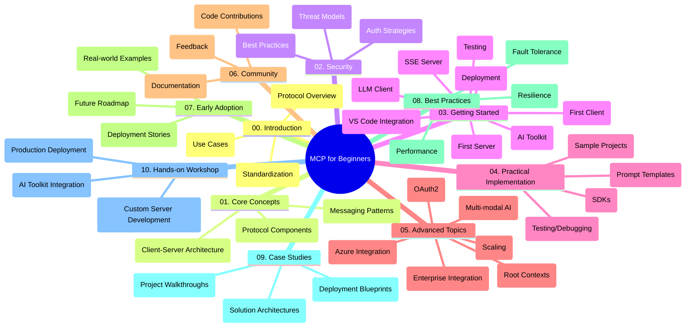

<!--
CO_OP_TRANSLATOR_METADATA:
{
  "original_hash": "a607d4febc94caee9a12b77795f7fc9a",
  "translation_date": "2025-07-13T15:17:03+00:00",
  "source_file": "study_guide.md",
  "language_code": "tl"
}
-->
# Model Context Protocol (MCP) para sa mga Baguhan - Gabay sa Pag-aaral

Ang gabay na ito ay nagbibigay ng pangkalahatang ideya tungkol sa istruktura at nilalaman ng repository para sa kurikulum na "Model Context Protocol (MCP) para sa mga Baguhan." Gamitin ang gabay na ito upang mas madali mong ma-navigate ang repository at magamit nang husto ang mga available na resources.

## Pangkalahatang-ideya ng Repository

Ang Model Context Protocol (MCP) ay isang standard na framework para sa pakikipag-ugnayan sa pagitan ng mga AI model at mga client application. Ang repository na ito ay naglalaman ng komprehensibong kurikulum na may mga praktikal na halimbawa ng code sa C#, Java, JavaScript, Python, at TypeScript, na idinisenyo para sa mga AI developer, system architect, at software engineer.

## Visual Curriculum Map

## Istruktura ng Repository

Ang repository ay nakaayos sa sampung pangunahing seksyon, bawat isa ay tumutokoy sa iba't ibang aspeto ng MCP:

1. **Introduction (00-Introduction/)**
   - Pangkalahatang ideya ng Model Context Protocol
   - Bakit mahalaga ang standardisasyon sa AI pipelines
   - Mga praktikal na gamit at benepisyo

2. **Core Concepts (01-CoreConcepts/)**
   - Arkitektura ng client-server
   - Pangunahing bahagi ng protocol
   - Mga pattern ng messaging sa MCP

3. **Security (02-Security/)**
   - Mga banta sa seguridad sa mga sistemang batay sa MCP
   - Mga pinakamahusay na kasanayan para sa pag-secure ng mga implementasyon
   - Mga estratehiya sa authentication at authorization

4. **Getting Started (03-GettingStarted/)**
   - Pagsasaayos at konfigurasyon ng environment
   - Paggawa ng mga basic MCP server at client
   - Integrasyon sa mga umiiral na aplikasyon
   - Mga subseksyon para sa unang server, unang client, LLM client, VS Code integration, SSE server, AI Toolkit, testing, at deployment

5. **Practical Implementation (04-PracticalImplementation/)**
   - Paggamit ng SDKs sa iba't ibang programming language
   - Mga teknik sa debugging, testing, at validation
   - Paggawa ng reusable prompt templates at workflows
   - Mga sample na proyekto na may mga halimbawa ng implementasyon

6. **Advanced Topics (05-AdvancedTopics/)**
   - Multi-modal AI workflows at extensibility
   - Mga secure na estratehiya sa scaling
   - MCP sa mga enterprise ecosystem
   - Mga espesyal na paksa kabilang ang Azure integration, multi-modality, OAuth2, root contexts, routing, sampling, scaling, security, web search integration, at streaming.

7. **Community Contributions (06-CommunityContributions/)**
   - Paano mag-ambag ng code at dokumentasyon
   - Pakikipagtulungan sa pamamagitan ng GitHub
   - Mga pagpapabuti at feedback mula sa komunidad

8. **Lessons from Early Adoption (07-LessonsfromEarlyAdoption/)**
   - Mga totoong implementasyon at kwento ng tagumpay
   - Paggawa at pag-deploy ng mga solusyong batay sa MCP
   - Mga trend at roadmap para sa hinaharap

9. **Best Practices (08-BestPractices/)**
   - Pag-tune ng performance at optimization
   - Pagdidisenyo ng fault-tolerant na mga MCP system
   - Mga estratehiya sa testing at resilience

10. **Case Studies (09-CaseStudy/)**
    - Malalimang pag-aaral sa mga arkitektura ng MCP solution
    - Mga blueprint sa deployment at mga tip sa integrasyon
    - Mga annotated na diagram at walkthrough ng proyekto

11. **Hands-on Workshop (10-StreamliningAIWorkflowsBuildingAnMCPServerWithAIToolkit/)**
    - Komprehensibong hands-on workshop na pinagsasama ang MCP at Microsoft AI Toolkit para sa VS Code
    - Paggawa ng matatalinong aplikasyon na nag-uugnay ng AI models sa mga totoong gamit
    - Mga praktikal na module na sumasaklaw sa mga pundamental, custom server development, at mga estratehiya sa production deployment

## Mga Sample na Proyekto

Kasama sa repository ang iba't ibang sample na proyekto na nagpapakita ng implementasyon ng MCP sa iba't ibang programming language:

### Basic MCP Calculator Samples
- C# MCP Server Example
- Java MCP Calculator
- JavaScript MCP Demo
- Python MCP Server
- TypeScript MCP Example

### Advanced MCP Calculator Projects
- Advanced C# Sample
- Java Container App Example
- JavaScript Advanced Sample
- Python Complex Implementation
- TypeScript Container Sample

## Karagdagang Resources

Kasama sa repository ang mga sumusuportang resources:

- **Images folder**: Naglalaman ng mga diagram at ilustrasyon na ginamit sa buong kurikulum
- **Translations**: Suporta sa maraming wika gamit ang automated na pagsasalin ng dokumentasyon
- **Opisyal na MCP Resources**:
  - [MCP Documentation](https://modelcontextprotocol.io/)
  - [MCP Specification](https://spec.modelcontextprotocol.io/)
  - [MCP GitHub Repository](https://github.com/modelcontextprotocol)

## Paano Gamitin ang Repository na Ito

1. **Sunod-sunod na Pag-aaral**: Sundan ang mga kabanata mula 00 hanggang 10 para sa maayos na pag-aaral.
2. **Pokus sa Partikular na Wika**: Kung interesado ka sa isang partikular na programming language, tingnan ang mga sample directories para sa mga implementasyon sa iyong gustong wika.
3. **Praktikal na Implementasyon**: Magsimula sa seksyong "Getting Started" para i-setup ang iyong environment at gumawa ng unang MCP server at client.
4. **Mas Malalim na Pagsisid**: Kapag komportable ka na sa mga batayan, tuklasin ang mga advanced topics para palawakin ang iyong kaalaman.
5. **Pakikilahok sa Komunidad**: Sumali sa [Azure AI Foundry Discord](https://discord.com/invite/ByRwuEEgH4) para makipag-ugnayan sa mga eksperto at kapwa developer.

## Pag-aambag

Malugod na tinatanggap ng repository na ito ang mga kontribusyon mula sa komunidad. Tingnan ang seksyong Community Contributions para sa gabay kung paano mag-ambag.

---

*Ang gabay na ito ay ginawa noong Hunyo 11, 2025, at nagbibigay ng pangkalahatang ideya ng repository hanggang sa petsang iyon. Maaaring may mga pagbabago o update sa nilalaman ng repository mula noon.*

**Paalala**:  
Ang dokumentong ito ay isinalin gamit ang AI translation service na [Co-op Translator](https://github.com/Azure/co-op-translator). Bagamat nagsusumikap kami para sa katumpakan, pakatandaan na ang mga awtomatikong pagsasalin ay maaaring maglaman ng mga pagkakamali o di-tumpak na impormasyon. Ang orihinal na dokumento sa orihinal nitong wika ang dapat ituring na pangunahing sanggunian. Para sa mahahalagang impormasyon, inirerekomenda ang propesyonal na pagsasalin ng tao. Hindi kami mananagot sa anumang hindi pagkakaunawaan o maling interpretasyon na maaaring magmula sa paggamit ng pagsasaling ito.