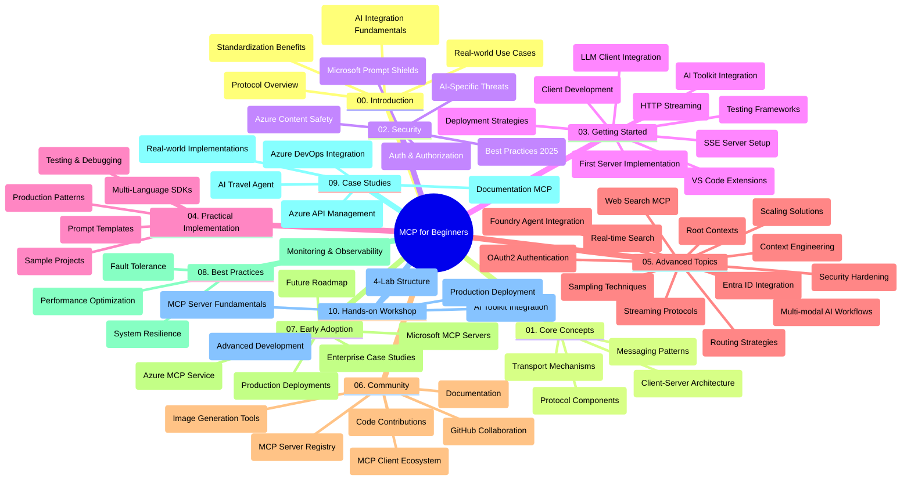

<!--
CO_OP_TRANSLATOR_METADATA:
{
  "original_hash": "e2c6ed897fa98fa08e0146101776c7ff",
  "translation_date": "2025-07-18T10:14:07+00:00",
  "source_file": "study_guide.md",
  "language_code": "tl"
}
-->
# Model Context Protocol (MCP) para sa mga Baguhan - Gabay sa Pag-aaral

Ang gabay na ito ay nagbibigay ng pangkalahatang ideya tungkol sa estruktura at nilalaman ng repository para sa kurikulum na "Model Context Protocol (MCP) para sa mga Baguhan." Gamitin ang gabay na ito upang mas madali mong ma-navigate ang repository at magamit nang husto ang mga available na resources.

## Pangkalahatang-ideya ng Repository

Ang Model Context Protocol (MCP) ay isang standard na balangkas para sa pakikipag-ugnayan sa pagitan ng mga AI model at mga client application. Orihinal itong ginawa ng Anthropic, at ngayon ay pinamamahalaan ng mas malawak na MCP community sa pamamagitan ng opisyal na GitHub organization. Ang repository na ito ay naglalaman ng komprehensibong kurikulum na may mga hands-on na halimbawa ng code sa C#, Java, JavaScript, Python, at TypeScript, na idinisenyo para sa mga AI developer, system architect, at software engineer.

## Visual Curriculum Map

## Estruktura ng Repository

Ang repository ay nakaayos sa sampung pangunahing seksyon, bawat isa ay tumutok sa iba't ibang aspeto ng MCP:

1. **Introduction (00-Introduction/)**
   - Pangkalahatang ideya ng Model Context Protocol
   - Bakit mahalaga ang standardisasyon sa AI pipelines
   - Mga praktikal na gamit at benepisyo

2. **Core Concepts (01-CoreConcepts/)**
   - Client-server architecture
   - Pangunahing bahagi ng protocol
   - Mga pattern ng messaging sa MCP

3. **Security (02-Security/)**
   - Mga banta sa seguridad sa mga sistemang batay sa MCP
   - Pinakamahuhusay na kasanayan para sa pag-secure ng mga implementasyon
   - Mga estratehiya sa authentication at authorization
   - **Komprehensibong Dokumentasyon sa Seguridad**:
     - MCP Security Best Practices 2025
     - Azure Content Safety Implementation Guide
     - MCP Security Controls and Techniques
     - MCP Best Practices Quick Reference
   - **Pangunahing Paksa sa Seguridad**:
     - Prompt injection at tool poisoning attacks
     - Session hijacking at confused deputy problems
     - Token passthrough vulnerabilities
     - Labis na permiso at access control
     - Seguridad sa supply chain para sa mga AI component
     - Integrasyon ng Microsoft Prompt Shields

4. **Getting Started (03-GettingStarted/)**
   - Pagsasaayos ng environment at configuration
   - Paggawa ng mga basic MCP server at client
   - Integrasyon sa mga umiiral na aplikasyon
   - May mga seksyon para sa:
     - Unang implementasyon ng server
     - Pag-develop ng client
     - Integrasyon ng LLM client
     - Integrasyon sa VS Code
     - Server-Sent Events (SSE) server
     - HTTP streaming
     - Integrasyon ng AI Toolkit
     - Mga estratehiya sa testing
     - Mga gabay sa deployment

5. **Practical Implementation (04-PracticalImplementation/)**
   - Paggamit ng SDKs sa iba't ibang programming language
   - Debugging, testing, at validation techniques
   - Paggawa ng reusable prompt templates at workflows
   - Mga sample na proyekto na may mga halimbawa ng implementasyon

6. **Advanced Topics (05-AdvancedTopics/)**
   - Mga teknik sa context engineering
   - Integrasyon ng Foundry agent
   - Multi-modal AI workflows
   - Mga demo ng OAuth2 authentication
   - Real-time search capabilities
   - Real-time streaming
   - Implementasyon ng root contexts
   - Mga estratehiya sa routing
   - Sampling techniques
   - Mga paraan ng scaling
   - Mga konsiderasyon sa seguridad
   - Integrasyon ng Entra ID security
   - Integrasyon ng web search

7. **Community Contributions (06-CommunityContributions/)**
   - Paano mag-ambag ng code at dokumentasyon
   - Pakikipagtulungan sa pamamagitan ng GitHub
   - Mga pagpapabuti at feedback mula sa komunidad
   - Paggamit ng iba't ibang MCP client (Claude Desktop, Cline, VSCode)
   - Paggamit ng mga kilalang MCP server kabilang ang image generation

8. **Lessons from Early Adoption (07-LessonsfromEarlyAdoption/)**
   - Mga totoong implementasyon at kwento ng tagumpay
   - Paggawa at pag-deploy ng mga solusyong batay sa MCP
   - Mga trend at roadmap para sa hinaharap
   - **Microsoft MCP Servers Guide**: Komprehensibong gabay sa 10 production-ready na Microsoft MCP server kabilang ang:
     - Microsoft Learn Docs MCP Server
     - Azure MCP Server (15+ specialized connectors)
     - GitHub MCP Server
     - Azure DevOps MCP Server
     - MarkItDown MCP Server
     - SQL Server MCP Server
     - Playwright MCP Server
     - Dev Box MCP Server
     - Azure AI Foundry MCP Server
     - Microsoft 365 Agents Toolkit MCP Server

9. **Best Practices (08-BestPractices/)**
   - Pag-tune at pag-optimize ng performance
   - Pagdidisenyo ng fault-tolerant na MCP system
   - Mga estratehiya sa testing at resilience

10. **Case Studies (09-CaseStudy/)**
    - Sample ng Azure API Management integration
    - Sample ng travel agent implementation
    - Integrasyon ng Azure DevOps sa YouTube updates
    - Mga halimbawa ng dokumentasyon sa MCP implementation
    - Mga halimbawa ng implementasyon na may detalyadong dokumentasyon

11. **Hands-on Workshop (10-StreamliningAIWorkflowsBuildingAnMCPServerWithAIToolkit/)**
    - Komprehensibong hands-on workshop na pinagsasama ang MCP at AI Toolkit
    - Paggawa ng matatalinong aplikasyon na nag-uugnay ng AI models sa mga totoong gamit
    - Mga praktikal na module na sumasaklaw sa mga pundasyon, custom server development, at mga estratehiya sa production deployment
    - **Estruktura ng Lab**:
      - Lab 1: MCP Server Fundamentals
      - Lab 2: Advanced MCP Server Development
      - Lab 3: AI Toolkit Integration
      - Lab 4: Production Deployment and Scaling
    - Paraan ng pag-aaral gamit ang lab na may sunud-sunod na mga tagubilin

## Karagdagang Resources

Kasama sa repository ang mga sumusuportang resources:

- **Images folder**: Naglalaman ng mga diagram at ilustrasyon na ginamit sa buong kurikulum
- **Translations**: Suporta sa maraming wika na may automated na pagsasalin ng dokumentasyon
- **Opisyal na MCP Resources**:
  - [MCP Documentation](https://modelcontextprotocol.io/)
  - [MCP Specification](https://spec.modelcontextprotocol.io/)
  - [MCP GitHub Repository](https://github.com/modelcontextprotocol)

## Paano Gamitin ang Repository na Ito

1. **Sunud-sunod na Pag-aaral**: Sundan ang mga kabanata mula 00 hanggang 10 para sa maayos na pag-aaral.
2. **Pokus sa Partikular na Wika**: Kung interesado ka sa isang partikular na programming language, tingnan ang mga sample directory para sa mga implementasyon sa iyong nais na wika.
3. **Praktikal na Implementasyon**: Magsimula sa seksyong "Getting Started" para i-setup ang iyong environment at gumawa ng unang MCP server at client.
4. **Mas Malalim na Pagsisid**: Kapag komportable ka na sa mga batayan, tuklasin ang mga advanced topics para palawakin ang iyong kaalaman.
5. **Pakikilahok sa Komunidad**: Sumali sa MCP community sa pamamagitan ng GitHub discussions at Discord channels para makipag-ugnayan sa mga eksperto at kapwa developer.

## MCP Clients at Mga Tools

Sinasaklaw ng kurikulum ang iba't ibang MCP clients at tools:

1. **Opisyal na Clients**:
   - Visual Studio Code
   - MCP sa Visual Studio Code
   - Claude Desktop
   - Claude sa VSCode
   - Claude API

2. **Community Clients**:
   - Cline (terminal-based)
   - Cursor (code editor)
   - ChatMCP
   - Windsurf

3. **Mga Tool para sa Pamamahala ng MCP**:
   - MCP CLI
   - MCP Manager
   - MCP Linker
   - MCP Router

## Mga Kilalang MCP Server

Ipinapakilala ng repository ang iba't ibang MCP server, kabilang ang:

1. **Opisyal na Microsoft MCP Servers**:
   - Microsoft Learn Docs MCP Server
   - Azure MCP Server (15+ specialized connectors)
   - GitHub MCP Server
   - Azure DevOps MCP Server
   - MarkItDown MCP Server
   - SQL Server MCP Server
   - Playwright MCP Server
   - Dev Box MCP Server
   - Azure AI Foundry MCP Server
   - Microsoft 365 Agents Toolkit MCP Server

2. **Opisyal na Reference Servers**:
   - Filesystem
   - Fetch
   - Memory
   - Sequential Thinking

3. **Image Generation**:
   - Azure OpenAI DALL-E 3
   - Stable Diffusion WebUI
   - Replicate

4. **Mga Development Tools**:
   - Git MCP
   - Terminal Control
   - Code Assistant

5. **Mga Espesyal na Server**:
   - Salesforce
   - Microsoft Teams
   - Jira & Confluence

## Pag-aambag

Malugod na tinatanggap ng repository na ito ang mga kontribusyon mula sa komunidad. Tingnan ang seksyong Community Contributions para sa mga gabay kung paano epektibong makapag-ambag sa MCP ecosystem.

## Changelog

| Petsa | Mga Pagbabago |
|-------|---------------|
| Hulyo 18, 2025 | - In-update ang estruktura ng repository para isama ang Microsoft MCP Servers Guide - Idinagdag ang komprehensibong listahan ng 10 production-ready na Microsoft MCP server - Pinahusay ang seksyon ng Popular MCP Servers gamit ang Opisyal na Microsoft MCP Servers - In-update ang Case Studies section gamit ang mga aktwal na halimbawa ng file - Idinagdag ang detalye ng Lab Structure para sa Hands-on Workshop |
| Hulyo 16, 2025 | - In-update ang estruktura ng repository upang ipakita ang kasalukuyang nilalaman - Idinagdag ang seksyon ng MCP Clients at Tools - Idinagdag ang seksyon ng Popular MCP Servers - In-update ang Visual Curriculum Map na may lahat ng kasalukuyang paksa - Pinahusay ang Advanced Topics section na may lahat ng espesyal na larangan - In-update ang Case Studies upang ipakita ang mga aktwal na halimbawa - Nilinaw ang pinagmulan ng MCP bilang gawa ng Anthropic |
| Hunyo 11, 2025 | - Unang paglikha ng gabay sa pag-aaral - Idinagdag ang Visual Curriculum Map - Inilatag ang estruktura ng repository - Kasama ang mga sample na proyekto at karagdagang resources |

---

*Ang gabay na ito ay na-update noong Hulyo 18, 2025, at nagbibigay ng pangkalahatang ideya ng repository hanggang sa petsang iyon. Maaring ma-update ang nilalaman ng repository pagkatapos ng petsang ito.*

**Paalala**:  
Ang dokumentong ito ay isinalin gamit ang AI translation service na [Co-op Translator](https://github.com/Azure/co-op-translator). Bagamat nagsusumikap kami para sa katumpakan, pakatandaan na ang mga awtomatikong pagsasalin ay maaaring maglaman ng mga pagkakamali o di-tumpak na impormasyon. Ang orihinal na dokumento sa orihinal nitong wika ang dapat ituring na pangunahing sanggunian. Para sa mahahalagang impormasyon, inirerekomenda ang propesyonal na pagsasalin ng tao. Hindi kami mananagot sa anumang hindi pagkakaunawaan o maling interpretasyon na maaaring magmula sa paggamit ng pagsasaling ito.