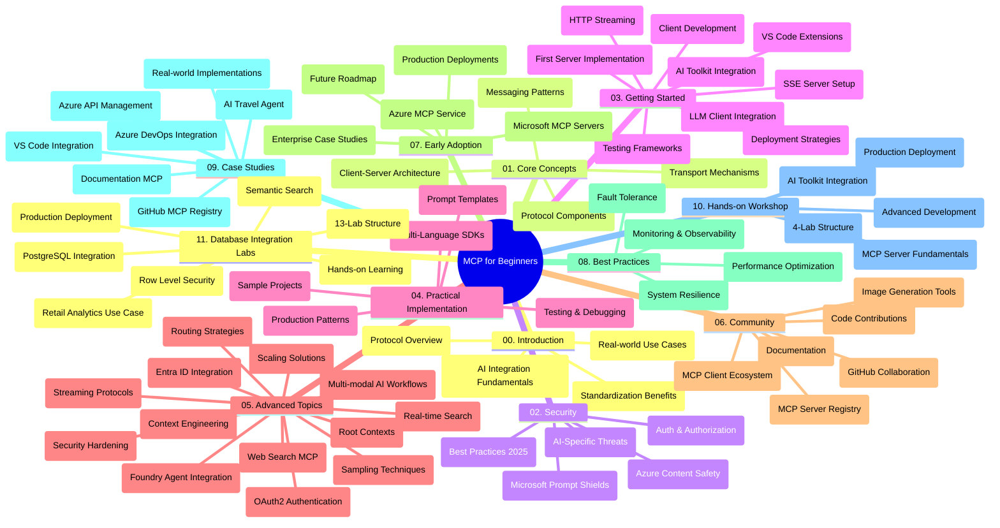

<!--
CO_OP_TRANSLATOR_METADATA:
{
  "original_hash": "aa1ce97bc694b08faf3018bab6d275b9",
  "translation_date": "2025-09-30T19:28:58+00:00",
  "source_file": "study_guide.md",
  "language_code": "tl"
}
-->
# Model Context Protocol (MCP) para sa mga Baguhan - Gabay sa Pag-aaral

Ang gabay sa pag-aaral na ito ay nagbibigay ng pangkalahatang ideya tungkol sa istruktura ng repositoryo at nilalaman para sa kurikulum na "Model Context Protocol (MCP) para sa mga Baguhan." Gamitin ang gabay na ito upang epektibong mag-navigate sa repositoryo at masulit ang mga magagamit na mapagkukunan.

## Pangkalahatang Ideya ng Repositoryo

Ang Model Context Protocol (MCP) ay isang pamantayang balangkas para sa interaksyon sa pagitan ng mga AI model at mga client application. Unang nilikha ng Anthropic, ang MCP ay kasalukuyang pinapanatili ng mas malawak na komunidad ng MCP sa pamamagitan ng opisyal na organisasyon sa GitHub. Ang repositoryo na ito ay nagbibigay ng komprehensibong kurikulum na may mga praktikal na halimbawa ng code sa C#, Java, JavaScript, Python, at TypeScript, na idinisenyo para sa mga AI developer, system architect, at software engineer.

## Visual Curriculum Map

## Istruktura ng Repositoryo

Ang repositoryo ay nakaayos sa labing-isang pangunahing seksyon, bawat isa ay nakatuon sa iba't ibang aspeto ng MCP:

1. **Panimula (00-Introduction/)**
   - Pangkalahatang ideya ng Model Context Protocol
   - Bakit mahalaga ang standardisasyon sa mga AI pipeline
   - Mga praktikal na kaso ng paggamit at benepisyo

2. **Mga Pangunahing Konsepto (01-CoreConcepts/)**
   - Arkitektura ng client-server
   - Mga pangunahing bahagi ng protocol
   - Mga pattern ng pagmemensahe sa MCP

3. **Seguridad (02-Security/)**
   - Mga banta sa seguridad sa mga sistemang batay sa MCP
   - Mga pinakamahusay na kasanayan para sa pagpapatupad ng seguridad
   - Mga estratehiya sa authentication at authorization
   - **Komprehensibong Dokumentasyon sa Seguridad**:
     - MCP Security Best Practices 2025
     - Azure Content Safety Implementation Guide
     - MCP Security Controls and Techniques
     - MCP Best Practices Quick Reference
   - **Mga Pangunahing Paksa sa Seguridad**:
     - Prompt injection at tool poisoning attacks
     - Session hijacking at confused deputy problems
     - Token passthrough vulnerabilities
     - Labis na pahintulot at kontrol sa access
     - Seguridad ng supply chain para sa mga AI component
     - Microsoft Prompt Shields integration

4. **Pagsisimula (03-GettingStarted/)**
   - Pag-set up ng environment at configuration
   - Paglikha ng mga pangunahing MCP server at client
   - Integrasyon sa mga umiiral na application
   - Kasama ang mga seksyon para sa:
     - Unang implementasyon ng server
     - Pag-develop ng client
     - Integrasyon ng LLM client
     - VS Code integration
     - Server-Sent Events (SSE) server
     - HTTP streaming
     - AI Toolkit integration
     - Mga estratehiya sa testing
     - Mga alituntunin sa deployment

5. **Praktikal na Implementasyon (04-PracticalImplementation/)**
   - Paggamit ng mga SDK sa iba't ibang programming language
   - Mga teknik sa debugging, testing, at validation
   - Pagbuo ng mga reusable prompt template at workflow
   - Mga sample na proyekto na may mga halimbawa ng implementasyon

6. **Mga Advanced na Paksa (05-AdvancedTopics/)**
   - Mga teknik sa context engineering
   - Integrasyon ng Foundry agent
   - Multi-modal na AI workflow
   - Mga demo ng OAuth2 authentication
   - Mga kakayahan sa real-time na paghahanap
   - Real-time na streaming
   - Implementasyon ng root contexts
   - Mga estratehiya sa routing
   - Mga teknik sa sampling
   - Mga pamamaraan sa scaling
   - Mga konsiderasyon sa seguridad
   - Entra ID security integration
   - Web search integration

7. **Mga Ambag ng Komunidad (06-CommunityContributions/)**
   - Paano mag-ambag ng code at dokumentasyon
   - Pakikipagtulungan sa pamamagitan ng GitHub
   - Mga enhancement at feedback na pinamumunuan ng komunidad
   - Paggamit ng iba't ibang MCP client (Claude Desktop, Cline, VSCode)
   - Paggawa gamit ang mga sikat na MCP server kabilang ang image generation

8. **Mga Aral mula sa Maagang Paggamit (07-LessonsfromEarlyAdoption/)**
   - Mga implementasyon sa totoong mundo at mga kwento ng tagumpay
   - Pagbuo at pag-deploy ng mga solusyong batay sa MCP
   - Mga trend at hinaharap na roadmap
   - **Microsoft MCP Servers Guide**: Komprehensibong gabay sa 10 production-ready na Microsoft MCP server kabilang ang:
     - Microsoft Learn Docs MCP Server
     - Azure MCP Server (15+ specialized connectors)
     - GitHub MCP Server
     - Azure DevOps MCP Server
     - MarkItDown MCP Server
     - SQL Server MCP Server
     - Playwright MCP Server
     - Dev Box MCP Server
     - Azure AI Foundry MCP Server
     - Microsoft 365 Agents Toolkit MCP Server

9. **Mga Pinakamahusay na Kasanayan (08-BestPractices/)**
   - Pag-tune ng performance at optimization
   - Pagdidisenyo ng mga fault-tolerant na MCP system
   - Mga estratehiya sa testing at resilience

10. **Mga Pag-aaral ng Kaso (09-CaseStudy/)**
    - **Pitong komprehensibong pag-aaral ng kaso** na nagpapakita ng versatility ng MCP sa iba't ibang sitwasyon:
    - **Azure AI Travel Agents**: Multi-agent orchestration gamit ang Azure OpenAI at AI Search
    - **Azure DevOps Integration**: Pag-aautomat ng mga proseso ng workflow gamit ang YouTube data updates
    - **Real-Time Documentation Retrieval**: Python console client na may streaming HTTP
    - **Interactive Study Plan Generator**: Chainlit web app na may conversational AI
    - **In-Editor Documentation**: VS Code integration na may GitHub Copilot workflows
    - **Azure API Management**: Enterprise API integration na may paglikha ng MCP server
    - **GitHub MCP Registry**: Pag-develop ng ecosystem at agentic integration platform
    - Mga halimbawa ng implementasyon na sumasaklaw sa enterprise integration, developer productivity, at ecosystem development

11. **Hands-on Workshop (10-StreamliningAIWorkflowsBuildingAnMCPServerWithAIToolkit/)**
    - Komprehensibong hands-on workshop na pinagsasama ang MCP sa AI Toolkit
    - Pagbuo ng mga intelligent na application na nag-uugnay sa mga AI model sa mga totoong tool
    - Mga praktikal na module na sumasaklaw sa mga pundasyon, custom server development, at mga estratehiya sa production deployment
    - **Istruktura ng Lab**:
      - Lab 1: Mga Pundasyon ng MCP Server
      - Lab 2: Advanced MCP Server Development
      - Lab 3: AI Toolkit Integration
      - Lab 4: Production Deployment at Scaling
    - Diskarte sa pag-aaral na batay sa lab na may mga hakbang-hakbang na tagubilin

12. **MCP Server Database Integration Labs (11-MCPServerHandsOnLabs/)**
    - **Komprehensibong 13-lab na landas sa pag-aaral** para sa pagbuo ng production-ready na MCP server na may PostgreSQL integration
    - **Implementasyon ng retail analytics sa totoong mundo** gamit ang Zava Retail use case
    - **Mga pattern na pang-enterprise** kabilang ang Row Level Security (RLS), semantic search, at multi-tenant na access sa data
    - **Kumpletong Istruktura ng Lab**:
      - **Labs 00-03: Mga Pundasyon** - Panimula, Arkitektura, Seguridad, Pag-set up ng Environment
      - **Labs 04-06: Pagbuo ng MCP Server** - Disenyo ng Database, Implementasyon ng MCP Server, Pag-develop ng Tool
      - **Labs 07-09: Mga Advanced na Tampok** - Semantic Search, Testing & Debugging, VS Code Integration
      - **Labs 10-12: Production & Best Practices** - Deployment, Monitoring, Optimization
    - **Mga Teknolohiyang Saklaw**: FastMCP framework, PostgreSQL, Azure OpenAI, Azure Container Apps, Application Insights
    - **Mga Layunin sa Pag-aaral**: Production-ready na MCP server, mga pattern ng database integration, AI-powered analytics, enterprise security

## Karagdagang Mapagkukunan

Ang repositoryo ay naglalaman ng mga sumusuportang mapagkukunan:

- **Folder ng Mga Imahe**: Naglalaman ng mga diagram at ilustrasyon na ginamit sa buong kurikulum
- **Mga Pagsasalin**: Multi-language support na may automated translations ng dokumentasyon
- **Opisyal na Mapagkukunan ng MCP**:
  - [MCP Documentation](https://modelcontextprotocol.io/)
  - [MCP Specification](https://spec.modelcontextprotocol.io/)
  - [MCP GitHub Repository](https://github.com/modelcontextprotocol)

## Paano Gamitin ang Repositoryo na Ito

1. **Sequential Learning**: Sundin ang mga kabanata nang sunod-sunod (00 hanggang 11) para sa isang istrukturadong karanasan sa pag-aaral.
2. **Pagtuon sa Wika**: Kung interesado ka sa isang partikular na programming language, tuklasin ang mga direktoryo ng sample para sa mga implementasyon sa iyong gustong wika.
3. **Praktikal na Implementasyon**: Simulan sa seksyong "Getting Started" upang i-set up ang iyong environment at lumikha ng iyong unang MCP server at client.
4. **Advanced na Pagsisiyasat**: Kapag komportable ka na sa mga pangunahing kaalaman, sumisid sa mga advanced na paksa upang palawakin ang iyong kaalaman.
5. **Pakikilahok sa Komunidad**: Sumali sa komunidad ng MCP sa pamamagitan ng mga talakayan sa GitHub at mga channel sa Discord upang makipag-ugnayan sa mga eksperto at kapwa developer.

## MCP Client at Mga Tool

Ang kurikulum ay sumasaklaw sa iba't ibang MCP client at tool:

1. **Opisyal na Client**:
   - Visual Studio Code 
   - MCP sa Visual Studio Code
   - Claude Desktop
   - Claude sa VSCode 
   - Claude API

2. **Mga Client ng Komunidad**:
   - Cline (terminal-based)
   - Cursor (code editor)
   - ChatMCP
   - Windsurf

3. **Mga Tool sa Pamamahala ng MCP**:
   - MCP CLI
   - MCP Manager
   - MCP Linker
   - MCP Router

## Mga Sikat na MCP Server

Ang repositoryo ay nagpapakilala ng iba't ibang MCP server, kabilang ang:

1. **Opisyal na Microsoft MCP Server**:
   - Microsoft Learn Docs MCP Server
   - Azure MCP Server (15+ specialized connectors)
   - GitHub MCP Server
   - Azure DevOps MCP Server
   - MarkItDown MCP Server
   - SQL Server MCP Server
   - Playwright MCP Server
   - Dev Box MCP Server
   - Azure AI Foundry MCP Server
   - Microsoft 365 Agents Toolkit MCP Server

2. **Opisyal na Reference Server**:
   - Filesystem
   - Fetch
   - Memory
   - Sequential Thinking

3. **Image Generation**:
   - Azure OpenAI DALL-E 3
   - Stable Diffusion WebUI
   - Replicate

4. **Mga Tool sa Pag-develop**:
   - Git MCP
   - Terminal Control
   - Code Assistant

5. **Mga Specialized Server**:
   - Salesforce
   - Microsoft Teams
   - Jira & Confluence

## Pag-aambag

Ang repositoryo na ito ay tumatanggap ng mga ambag mula sa komunidad. Tingnan ang seksyong Community Contributions para sa gabay kung paano epektibong mag-ambag sa ecosystem ng MCP.

## Changelog

| Petsa | Mga Pagbabago |
|------|---------||
| Setyembre 29, 2025 | - Idinagdag ang seksyong 11-MCPServerHandsOnLabs na may komprehensibong 13-lab na landas sa pag-aaral ng database integration - In-update ang Visual Curriculum Map upang isama ang Database Integration Labs - Pinahusay ang istruktura ng repositoryo upang ipakita ang labing-isang pangunahing seksyon - Idinagdag ang detalyadong paglalarawan ng PostgreSQL integration, retail analytics use case, at mga pattern na pang-enterprise - In-update ang gabay sa pag-navigate upang isama ang mga seksyon 00-11 |
| Setyembre 26, 2025 | - Idinagdag ang GitHub MCP Registry case study sa seksyong 09-CaseStudy - In-update ang Case Studies upang ipakita ang pitong komprehensibong pag-aaral ng kaso - Pinahusay ang mga paglalarawan ng pag-aaral ng kaso na may mga partikular na detalye ng implementasyon - In-update ang Visual Curriculum Map upang isama ang GitHub MCP Registry - Binago ang istruktura ng gabay sa pag-aaral upang ipakita ang pokus sa ecosystem development |
| Hulyo 18, 2025 | - In-update ang istruktura ng repositoryo upang isama ang Microsoft MCP Servers Guide - Idinagdag ang komprehensibong listahan ng 10 production-ready na Microsoft MCP server - Pinahusay ang seksyong Popular MCP Servers na may Opisyal na Microsoft MCP Servers - In-update ang seksyong Case Studies na may mga aktwal na halimbawa ng file - Idinagdag ang mga detalye ng istruktura ng Lab para sa Hands-on Workshop |
| Hulyo 16, 2025 | - In-update ang istruktura ng repositoryo upang ipakita ang kasalukuyang nilalaman - Idinagdag ang seksyong MCP Clients and Tools - Idinagdag ang seksyong Popular MCP Servers - In-update ang Visual Curriculum Map na may lahat ng kasalukuyang paksa - Pinahusay ang seksyong Advanced Topics na may lahat ng specialized na lugar - In-update ang Case Studies upang ipakita ang mga aktwal na halimbawa - Nilinaw ang pinagmulan ng MCP bilang nilikha ng Anthropic |
| Hunyo 11, 2025 | - Paunang paglikha ng gabay sa pag-aaral - Idinagdag ang Visual Curriculum Map - In-outline ang istruktura ng repositoryo - Kasama ang mga sample na proyekto at karagdagang mapagkukunan |

---

*Ang gabay sa pag-aaral na ito ay na-update noong Setyembre 29, 2025, at nagbibigay ng pangkalahatang ideya ng repositoryo sa petsang iyon. Ang nilalaman ng repositoryo ay maaaring ma-update pagkatapos ng petsang ito.*

---

**Paunawa**:  
Ang dokumentong ito ay isinalin gamit ang AI translation service na [Co-op Translator](https://github.com/Azure/co-op-translator). Bagama't sinisikap naming maging tumpak, mangyaring tandaan na ang mga awtomatikong pagsasalin ay maaaring maglaman ng mga pagkakamali o hindi pagkakatugma. Ang orihinal na dokumento sa kanyang katutubong wika ang dapat ituring na opisyal na sanggunian. Para sa mahalagang impormasyon, inirerekomenda ang propesyonal na pagsasalin ng tao. Hindi kami mananagot sa anumang hindi pagkakaunawaan o maling interpretasyon na dulot ng paggamit ng pagsasaling ito.