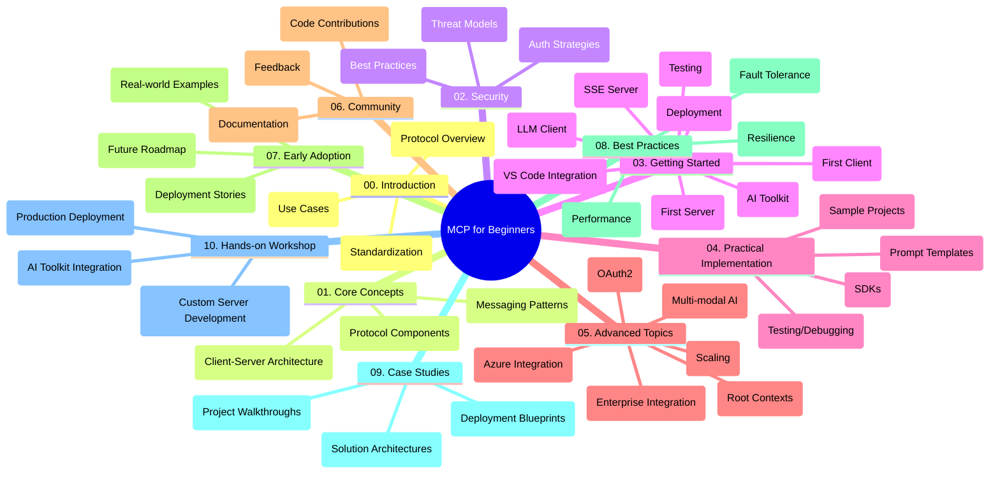

<!--
CO_OP_TRANSLATOR_METADATA:
{
  "original_hash": "a607d4febc94caee9a12b77795f7fc9a",
  "translation_date": "2025-06-11T16:48:43+00:00",
  "source_file": "study_guide.md",
  "language_code": "tl"
}
-->
# Model Context Protocol (MCP) para sa mga Baguhan - Gabay sa Pag-aaral

Ang gabay na ito ay nagbibigay ng pangkalahatang ideya tungkol sa istruktura at nilalaman ng repository para sa "Model Context Protocol (MCP) para sa mga Baguhan" na kurikulum. Gamitin ang gabay na ito para mas madali mong ma-navigate ang repository at magamit nang husto ang mga available na resources.

## Pangkalahatang Tanaw ng Repository

Ang Model Context Protocol (MCP) ay isang standardized na framework para sa pakikipag-ugnayan ng mga AI model at client applications. Ang repository na ito ay naglalaman ng komprehensibong kurikulum na may mga hands-on na halimbawa ng code sa C#, Java, JavaScript, Python, at TypeScript, na dinisenyo para sa mga AI developer, system architect, at software engineer.

## Visual Curriculum Map

## Istruktura ng Repository

Ang repository ay nahahati sa sampung pangunahing seksyon, bawat isa ay tumatalakay sa iba't ibang aspeto ng MCP:

1. **Introduction (00-Introduction/)**
   - Pangkalahatang ideya ng Model Context Protocol
   - Bakit mahalaga ang standardization sa AI pipelines
   - Mga praktikal na gamit at benepisyo

2. **Core Concepts (01-CoreConcepts/)**
   - Client-server architecture
   - Pangunahing bahagi ng protocol
   - Mga messaging pattern sa MCP

3. **Security (02-Security/)**
   - Mga banta sa seguridad sa MCP-based na sistema
   - Pinakamahusay na mga praktis para sa secure na implementasyon
   - Mga estratehiya sa authentication at authorization

4. **Getting Started (03-GettingStarted/)**
   - Pagsasaayos at configuration ng environment
   - Paggawa ng mga basic MCP server at client
   - Integrasyon sa mga kasalukuyang aplikasyon
   - Mga subseksyon para sa unang server, unang client, LLM client, VS Code integration, SSE server, AI Toolkit, testing, at deployment

5. **Practical Implementation (04-PracticalImplementation/)**
   - Paggamit ng SDKs sa iba't ibang programming language
   - Debugging, testing, at validation techniques
   - Paglikha ng reusable prompt templates at workflows
   - Mga sample project na may mga halimbawa ng implementasyon

6. **Advanced Topics (05-AdvancedTopics/)**
   - Multi-modal AI workflows at extensibility
   - Mga secure scaling strategy
   - MCP sa enterprise ecosystem
   - Mga espesyal na paksa tulad ng Azure integration, multi-modality, OAuth2, root contexts, routing, sampling, scaling, security, web search integration, at streaming.

7. **Community Contributions (06-CommunityContributions/)**
   - Paano mag-ambag ng code at dokumentasyon
   - Pakikipagtulungan sa pamamagitan ng GitHub
   - Mga enhancement at feedback mula sa komunidad

8. **Lessons from Early Adoption (07-LessonsfromEarlyAdoption/)**
   - Mga totoong implementasyon at kwento ng tagumpay
   - Paggawa at deployment ng MCP-based na solusyon
   - Mga trend at roadmap para sa hinaharap

9. **Best Practices (08-BestPractices/)**
   - Performance tuning at optimization
   - Pagdisenyo ng fault-tolerant na MCP systems
   - Mga testing at resilience strategy

10. **Case Studies (09-CaseStudy/)**
    - Malalalim na pagsusuri sa arkitektura ng MCP solution
    - Mga blueprint para sa deployment at tips sa integrasyon
    - Annotated diagrams at walkthrough ng mga proyekto

11. **Hands-on Workshop (10-StreamliningAIWorkflowsBuildingAnMCPServerWithAIToolkit/)**
    - Komprehensibong hands-on workshop na pinagsasama ang MCP at Microsoft AI Toolkit para sa VS Code
    - Paggawa ng intelligent applications na nag-uugnay ng AI models sa totoong mundo na mga tools
    - Praktikal na mga module na sumasaklaw sa mga fundamentals, custom server development, at production deployment strategy

## Mga Sample na Proyekto

Kasama sa repository ang iba't ibang sample projects na nagpapakita ng implementasyon ng MCP sa iba't ibang programming language:

### Basic MCP Calculator Samples
- C# MCP Server Example
- Java MCP Calculator
- JavaScript MCP Demo
- Python MCP Server
- TypeScript MCP Example

### Advanced MCP Calculator Projects
- Advanced C# Sample
- Java Container App Example
- JavaScript Advanced Sample
- Python Complex Implementation
- TypeScript Container Sample

## Karagdagang Resources

Kasama sa repository ang mga sumusuportang resources:

- **Images folder**: Naglalaman ng mga diagram at ilustrasyon na ginagamit sa buong kurikulum
- **Translations**: Multi-language support na may automated na pagsasalin ng dokumentasyon
- **Official MCP Resources**:
  - [MCP Documentation](https://modelcontextprotocol.io/)
  - [MCP Specification](https://spec.modelcontextprotocol.io/)
  - [MCP GitHub Repository](https://github.com/modelcontextprotocol)

## Paano Gamitin ang Repository na Ito

1. **Sequential Learning**: Sundan ang mga kabanata nang sunud-sunod (mula 00 hanggang 10) para sa maayos na pag-aaral.
2. **Language-Specific Focus**: Kung interesado ka sa partikular na programming language, tingnan ang mga samples directory para sa mga implementasyon sa paborito mong wika.
3. **Practical Implementation**: Magsimula sa "Getting Started" na seksyon para i-setup ang iyong environment at gumawa ng unang MCP server at client.
4. **Advanced Exploration**: Kapag komportable ka na sa mga basics, pasukin ang advanced topics para palawakin ang iyong kaalaman.
5. **Community Engagement**: Sumali sa [Azure AI Foundry Discord](https://discord.com/invite/ByRwuEEgH4) para makipag-ugnayan sa mga eksperto at kapwa developer.

## Pag-aambag

Malugod na tinatanggap ng repository na ito ang mga kontribusyon mula sa komunidad. Tingnan ang seksyon ng Community Contributions para sa gabay kung paano mag-ambag.

---

*Ang gabay na ito ay ginawa noong Hunyo 11, 2025, at nagbibigay ng pangkalahatang ideya ng repository hanggang sa petsang iyon. Maaring may mga pagbabago o update sa nilalaman ng repository mula noon.*

**Paalala**:  
Ang dokumentong ito ay isinalin gamit ang serbisyong AI na pagsasalin [Co-op Translator](https://github.com/Azure/co-op-translator). Bagamat nagsusumikap kami para sa katumpakan, pakatandaan na ang mga awtomatikong pagsasalin ay maaaring maglaman ng mga pagkakamali o hindi tumpak na impormasyon. Ang orihinal na dokumento sa orihinal nitong wika ang dapat ituring na pinagmumulan ng katotohanan. Para sa mahahalagang impormasyon, inirerekomenda ang propesyonal na pagsasalin ng tao. Hindi kami mananagot sa anumang hindi pagkakaunawaan o maling interpretasyon na nagmula sa paggamit ng pagsasaling ito.