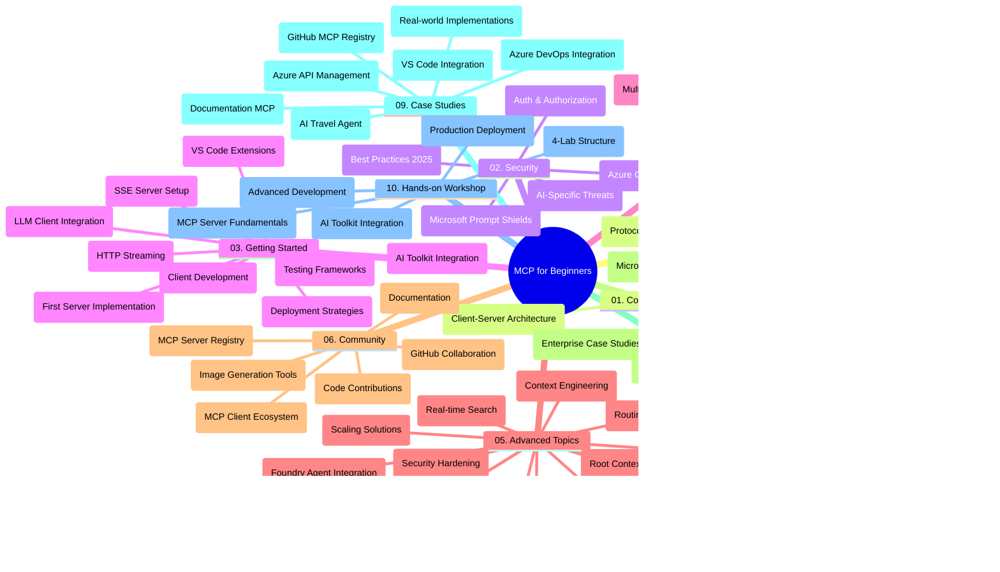

<!--
CO_OP_TRANSLATOR_METADATA:
{
  "original_hash": "719117a0a5f34ade7b5dfb61ee06fb13",
  "translation_date": "2025-09-26T18:51:45+00:00",
  "source_file": "study_guide.md",
  "language_code": "tl"
}
-->
# Model Context Protocol (MCP) para sa mga Baguhan - Gabay sa Pag-aaral

Ang gabay na ito ay nagbibigay ng pangkalahatang ideya tungkol sa istruktura ng repositoryo at nilalaman para sa kurikulum na "Model Context Protocol (MCP) para sa mga Baguhan". Gamitin ang gabay na ito upang mas madaling ma-navigate ang repositoryo at magamit nang husto ang mga magagamit na resources.

## Pangkalahatang Ideya ng Repositoryo

Ang Model Context Protocol (MCP) ay isang pamantayang framework para sa interaksyon sa pagitan ng mga AI model at client applications. Unang nilikha ng Anthropic, ang MCP ay kasalukuyang pinapanatili ng mas malawak na MCP community sa pamamagitan ng opisyal na GitHub organization. Ang repositoryo na ito ay nag-aalok ng komprehensibong kurikulum na may mga hands-on na halimbawa ng code sa C#, Java, JavaScript, Python, at TypeScript, na idinisenyo para sa mga AI developer, system architect, at software engineer.

## Visual Curriculum Map

## Istruktura ng Repositoryo

Ang repositoryo ay nahahati sa sampung pangunahing seksyon, bawat isa ay nakatuon sa iba't ibang aspeto ng MCP:

1. **Panimula (00-Introduction/)**
   - Pangkalahatang ideya ng Model Context Protocol
   - Bakit mahalaga ang standardisasyon sa AI pipelines
   - Mga praktikal na gamit at benepisyo

2. **Mga Pangunahing Konsepto (01-CoreConcepts/)**
   - Client-server architecture
   - Mga pangunahing bahagi ng protocol
   - Mga pattern ng messaging sa MCP

3. **Seguridad (02-Security/)**
   - Mga banta sa seguridad sa mga sistemang nakabase sa MCP
   - Mga pinakamahusay na kasanayan para sa pag-secure ng mga implementasyon
   - Mga estratehiya sa authentication at authorization
   - **Komprehensibong Dokumentasyon sa Seguridad**:
     - MCP Security Best Practices 2025
     - Azure Content Safety Implementation Guide
     - MCP Security Controls and Techniques
     - MCP Best Practices Quick Reference
   - **Mga Pangunahing Paksa sa Seguridad**:
     - Prompt injection at tool poisoning attacks
     - Session hijacking at confused deputy problems
     - Token passthrough vulnerabilities
     - Labis na pahintulot at access control
     - Seguridad ng supply chain para sa mga AI component
     - Microsoft Prompt Shields integration

4. **Pagsisimula (03-GettingStarted/)**
   - Pag-set up ng environment at configuration
   - Paglikha ng mga pangunahing MCP server at client
   - Integrasyon sa mga umiiral na aplikasyon
   - Kasama ang mga seksyon para sa:
     - Unang implementasyon ng server
     - Pag-develop ng client
     - LLM client integration
     - VS Code integration
     - Server-Sent Events (SSE) server
     - HTTP streaming
     - AI Toolkit integration
     - Mga estratehiya sa testing
     - Mga alituntunin sa deployment

5. **Praktikal na Implementasyon (04-PracticalImplementation/)**
   - Paggamit ng mga SDK sa iba't ibang programming language
   - Mga teknik sa debugging, testing, at validation
   - Paglikha ng reusable prompt templates at workflows
   - Mga sample na proyekto na may mga halimbawa ng implementasyon

6. **Mga Advanced na Paksa (05-AdvancedTopics/)**
   - Mga teknik sa context engineering
   - Foundry agent integration
   - Multi-modal AI workflows 
   - Mga demo ng OAuth2 authentication
   - Mga kakayahan sa real-time search
   - Real-time streaming
   - Implementasyon ng root contexts
   - Mga estratehiya sa routing
   - Mga teknik sa sampling
   - Mga pamamaraan sa scaling
   - Mga konsiderasyon sa seguridad
   - Entra ID security integration
   - Web search integration

7. **Mga Ambag ng Komunidad (06-CommunityContributions/)**
   - Paano mag-ambag ng code at dokumentasyon
   - Pakikipagtulungan sa pamamagitan ng GitHub
   - Mga enhancement at feedback na pinangungunahan ng komunidad
   - Paggamit ng iba't ibang MCP client (Claude Desktop, Cline, VSCode)
   - Pagtatrabaho gamit ang mga popular na MCP server kabilang ang image generation

8. **Mga Aral mula sa Maagang Paggamit (07-LessonsfromEarlyAdoption/)**
   - Mga implementasyon sa totoong mundo at mga kwento ng tagumpay
   - Pagbuo at pag-deploy ng mga solusyong nakabase sa MCP
   - Mga trend at hinaharap na roadmap
   - **Microsoft MCP Servers Guide**: Komprehensibong gabay sa 10 production-ready Microsoft MCP servers kabilang ang:
     - Microsoft Learn Docs MCP Server
     - Azure MCP Server (15+ specialized connectors)
     - GitHub MCP Server
     - Azure DevOps MCP Server
     - MarkItDown MCP Server
     - SQL Server MCP Server
     - Playwright MCP Server
     - Dev Box MCP Server
     - Azure AI Foundry MCP Server
     - Microsoft 365 Agents Toolkit MCP Server

9. **Mga Pinakamahusay na Kasanayan (08-BestPractices/)**
   - Pag-tune ng performance at optimization
   - Pagdidisenyo ng mga fault-tolerant na MCP system
   - Mga estratehiya sa testing at resilience

10. **Mga Pag-aaral ng Kaso (09-CaseStudy/)**
    - **Pitong komprehensibong pag-aaral ng kaso** na nagpapakita ng versatility ng MCP sa iba't ibang sitwasyon:
    - **Azure AI Travel Agents**: Multi-agent orchestration gamit ang Azure OpenAI at AI Search
    - **Azure DevOps Integration**: Pag-automate ng mga workflow process gamit ang YouTube data updates
    - **Real-Time Documentation Retrieval**: Python console client na may streaming HTTP
    - **Interactive Study Plan Generator**: Chainlit web app na may conversational AI
    - **In-Editor Documentation**: VS Code integration gamit ang GitHub Copilot workflows
    - **Azure API Management**: Enterprise API integration gamit ang MCP server creation
    - **GitHub MCP Registry**: Pag-develop ng ecosystem at agentic integration platform
    - Mga halimbawa ng implementasyon na sumasaklaw sa enterprise integration, developer productivity, at ecosystem development

11. **Hands-on Workshop (10-StreamliningAIWorkflowsBuildingAnMCPServerWithAIToolkit/)**
    - Komprehensibong hands-on workshop na pinagsasama ang MCP sa AI Toolkit
    - Pagbuo ng mga intelligent na aplikasyon na nag-uugnay sa mga AI model sa mga totoong tool
    - Mga praktikal na module na sumasaklaw sa mga pundasyon, custom server development, at mga estratehiya sa production deployment
    - **Istruktura ng Lab**:
      - Lab 1: Mga Pundasyon ng MCP Server
      - Lab 2: Advanced MCP Server Development
      - Lab 3: AI Toolkit Integration
      - Lab 4: Production Deployment at Scaling
    - Lab-based na paraan ng pag-aaral na may step-by-step na mga instruksyon

## Karagdagang Resources

Ang repositoryo ay naglalaman ng mga sumusuportang resources:

- **Images folder**: Naglalaman ng mga diagram at ilustrasyon na ginagamit sa buong kurikulum
- **Translations**: Suporta sa multi-language na may automated na pagsasalin ng dokumentasyon
- **Opisyal na MCP Resources**:
  - [MCP Documentation](https://modelcontextprotocol.io/)
  - [MCP Specification](https://spec.modelcontextprotocol.io/)
  - [MCP GitHub Repository](https://github.com/modelcontextprotocol)

## Paano Gamitin ang Repositoryo

1. **Sequential Learning**: Sundin ang mga kabanata nang sunod-sunod (00 hanggang 10) para sa isang istrukturadong karanasan sa pag-aaral.
2. **Language-Specific Focus**: Kung interesado ka sa isang partikular na programming language, i-explore ang mga sample directories para sa mga implementasyon sa iyong gustong wika.
3. **Praktikal na Implementasyon**: Simulan sa seksyong "Getting Started" upang i-set up ang iyong environment at lumikha ng iyong unang MCP server at client.
4. **Advanced Exploration**: Kapag komportable ka na sa mga pangunahing kaalaman, mag-dive sa mga advanced na paksa upang palawakin ang iyong kaalaman.
5. **Community Engagement**: Sumali sa MCP community sa pamamagitan ng GitHub discussions at Discord channels upang makipag-ugnayan sa mga eksperto at kapwa developer.

## MCP Clients at Tools

Ang kurikulum ay sumasaklaw sa iba't ibang MCP client at tools:

1. **Opisyal na Clients**:
   - Visual Studio Code 
   - MCP sa Visual Studio Code
   - Claude Desktop
   - Claude sa VSCode 
   - Claude API

2. **Mga Client ng Komunidad**:
   - Cline (terminal-based)
   - Cursor (code editor)
   - ChatMCP
   - Windsurf

3. **Mga Tool sa Pamamahala ng MCP**:
   - MCP CLI
   - MCP Manager
   - MCP Linker
   - MCP Router

## Mga Popular na MCP Server

Ang repositoryo ay nagpapakilala ng iba't ibang MCP server, kabilang ang:

1. **Opisyal na Microsoft MCP Servers**:
   - Microsoft Learn Docs MCP Server
   - Azure MCP Server (15+ specialized connectors)
   - GitHub MCP Server
   - Azure DevOps MCP Server
   - MarkItDown MCP Server
   - SQL Server MCP Server
   - Playwright MCP Server
   - Dev Box MCP Server
   - Azure AI Foundry MCP Server
   - Microsoft 365 Agents Toolkit MCP Server

2. **Opisyal na Reference Servers**:
   - Filesystem
   - Fetch
   - Memory
   - Sequential Thinking

3. **Image Generation**:
   - Azure OpenAI DALL-E 3
   - Stable Diffusion WebUI
   - Replicate

4. **Mga Tool sa Pag-develop**:
   - Git MCP
   - Terminal Control
   - Code Assistant

5. **Mga Specialized Server**:
   - Salesforce
   - Microsoft Teams
   - Jira & Confluence

## Pag-aambag

Ang repositoryo na ito ay tumatanggap ng mga ambag mula sa komunidad. Tingnan ang seksyong Community Contributions para sa gabay kung paano epektibong mag-ambag sa MCP ecosystem.

## Changelog

| Petsa | Mga Pagbabago |
|------|---------------|
| Setyembre 26, 2025 | - Idinagdag ang GitHub MCP Registry case study sa seksyong 09-CaseStudy - In-update ang Case Studies upang ipakita ang pitong komprehensibong pag-aaral ng kaso - Pinahusay ang mga deskripsyon ng pag-aaral ng kaso na may mga detalye ng implementasyon - In-update ang Visual Curriculum Map upang isama ang GitHub MCP Registry - Binago ang istruktura ng gabay sa pag-aaral upang ipakita ang focus sa ecosystem development |
| Hulyo 18, 2025 | - In-update ang istruktura ng repositoryo upang isama ang Microsoft MCP Servers Guide - Idinagdag ang komprehensibong listahan ng 10 production-ready Microsoft MCP servers - Pinahusay ang seksyong Popular MCP Servers gamit ang Opisyal na Microsoft MCP Servers - In-update ang seksyong Case Studies na may mga aktwal na halimbawa ng file - Idinagdag ang mga detalye ng istruktura ng Lab para sa Hands-on Workshop |
| Hulyo 16, 2025 | - In-update ang istruktura ng repositoryo upang ipakita ang kasalukuyang nilalaman - Idinagdag ang seksyong MCP Clients at Tools - Idinagdag ang seksyong Popular MCP Servers - In-update ang Visual Curriculum Map na may lahat ng kasalukuyang paksa - Pinahusay ang seksyong Advanced Topics na may lahat ng specialized na lugar - In-update ang Case Studies upang ipakita ang aktwal na mga halimbawa - Nilinaw ang pinagmulan ng MCP bilang nilikha ng Anthropic |
| Hunyo 11, 2025 | - Unang paglikha ng gabay sa pag-aaral - Idinagdag ang Visual Curriculum Map - In-outline ang istruktura ng repositoryo - Kasama ang mga sample na proyekto at karagdagang resources |

---

*Ang gabay sa pag-aaral na ito ay na-update noong Setyembre 26, 2025, at nagbibigay ng pangkalahatang ideya ng repositoryo sa petsang iyon. Ang nilalaman ng repositoryo ay maaaring ma-update pagkatapos ng petsang ito.*

---

