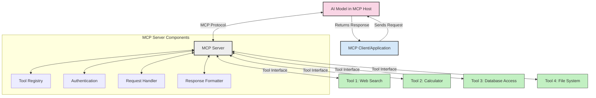
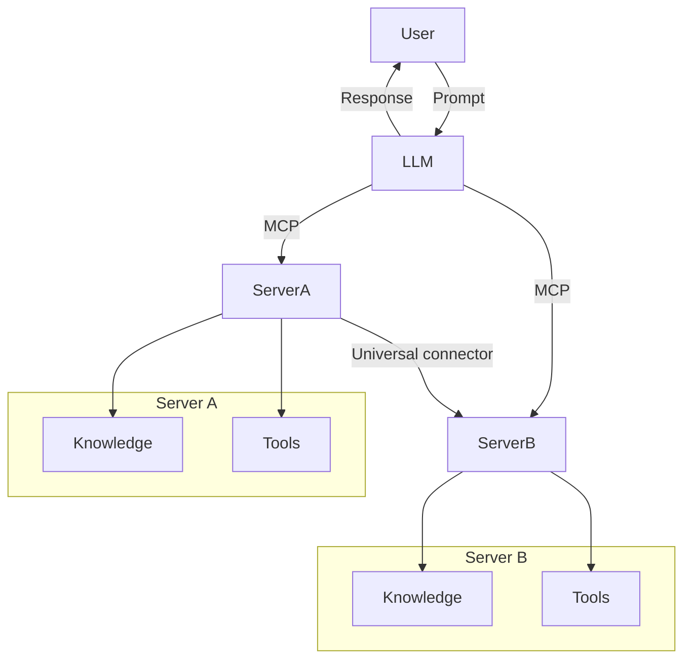

<!--
CO_OP_TRANSLATOR_METADATA:
{
  "original_hash": "1d88dee994dcbb3fa52c271d0c0817b5",
  "translation_date": "2025-05-20T21:26:13+00:00",
  "source_file": "00-Introduction/README.md",
  "language_code": "tr"
}
-->
# Model Context Protocol (MCP) Giriş: Ölçeklenebilir Yapay Zeka Uygulamaları İçin Neden Önemli?

Üretken yapay zeka uygulamaları, kullanıcıların doğal dil komutlarıyla uygulama ile etkileşim kurmasını sağladıkları için büyük bir ilerlemedir. Ancak, bu tür uygulamalara daha fazla zaman ve kaynak yatırıldıkça, işlevsellikleri ve kaynakları kolayca entegre edebildiğinizden, uygulamanızın birden fazla model kullanımını destekleyebildiğinden ve farklı model karmaşıklıklarını yönetebildiğinden emin olmak istersiniz. Kısacası, Gen AI uygulamaları başlamak için kolaydır, ancak büyüyüp karmaşıklaştıkça bir mimari tanımlamaya başlamanız ve uygulamalarınızın tutarlı bir şekilde inşa edilmesini sağlamak için muhtemelen bir standarda güvenmeniz gerekir. İşte burada MCP devreye girer, işleri düzenler ve bir standart sunar.

---

## **🔍 Model Context Protocol (MCP) Nedir?**

**Model Context Protocol (MCP)**, Büyük Dil Modellerinin (LLM'ler) harici araçlar, API'ler ve veri kaynaklarıyla sorunsuzca etkileşim kurmasını sağlayan **açık, standart bir arayüzdür**. AI model fonksiyonelliğini eğitim verilerinin ötesine taşıyan tutarlı bir mimari sunar; böylece daha akıllı, ölçeklenebilir ve daha duyarlı AI sistemleri mümkün olur.

---

## **🎯 Yapay Zekada Standardizasyon Neden Önemlidir?**

Üretken yapay zeka uygulamaları karmaşıklaştıkça, **ölçeklenebilirlik, genişletilebilirlik** ve **bakım kolaylığı** sağlayan standartların benimsenmesi zorunlu hale gelir. MCP bu ihtiyaçları şu şekilde karşılar:

- Model ve araç entegrasyonlarını birleştirir
- Kırılgan, tek seferlik özel çözümleri azaltır
- Birden fazla modelin aynı ekosistemde birlikte var olmasına izin verir

---

## **📚 Öğrenme Hedefleri**

Bu makalenin sonunda şunları yapabileceksiniz:

- **Model Context Protocol (MCP)**’yi ve kullanım alanlarını tanımlamak
- MCP’nin modelden araca iletişimi nasıl standartlaştırdığını anlamak
- MCP mimarisinin temel bileşenlerini belirlemek
- MCP’nin kurumsal ve geliştirme ortamlarındaki gerçek dünya uygulamalarını keşfetmek

---

## **💡 Model Context Protocol (MCP) Neden Bir Oyun Değiştiricidir?**

### **🔗 MCP, Yapay Zeka Etkileşimlerindeki Parçalanmayı Çözer**

MCP öncesinde, modelleri araçlarla entegre etmek için:

- Her araç-model çifti için özel kod yazmak gerekiyordu
- Her satıcı için standart dışı API’ler kullanılıyordu
- Güncellemeler sık sık kopmalara neden oluyordu
- Daha fazla araçla ölçeklenebilirlik zayıftı

### **✅ MCP Standardizasyonunun Faydaları**

| **Fayda**                | **Açıklama**                                                                   |
|--------------------------|--------------------------------------------------------------------------------|
| Birlikte Çalışabilirlik  | LLM’ler farklı satıcıların araçlarıyla sorunsuz çalışır                       |
| Tutarlılık               | Platformlar ve araçlar arasında uniform davranış                              |
| Yeniden Kullanılabilirlik| Bir kez oluşturulan araçlar farklı projelerde ve sistemlerde kullanılabilir   |
| Geliştirme Hızlandırma   | Standart, tak-çalıştır arayüzlerle geliştirme süresini kısaltır               |

---

## **🧱 MCP Mimarisi Yüksek Seviyede**

MCP, **istemci-sunucu modeli** izler; burada:

- **MCP Hosts** AI modellerini çalıştırır
- **MCP Clients** istek başlatır
- **MCP Servers** bağlam, araçlar ve yetenekler sağlar

### **Temel Bileşenler:**

- **Resources (Kaynaklar)** – Modeller için statik veya dinamik veriler  
- **Prompts (Komutlar)** – Yönlendirilmiş üretim için önceden tanımlı iş akışları  
- **Tools (Araçlar)** – Arama, hesaplama gibi çalıştırılabilir fonksiyonlar  
- **Sampling (Örnekleme)** – Yinelemeli etkileşimlerle ajan davranışı

---

## MCP Sunucuları Nasıl Çalışır

MCP sunucuları şu şekilde çalışır:

- **İstek Akışı**:  
    1. MCP Client, MCP Host’ta çalışan AI Modeline bir istek gönderir.  
    2. AI Model, dış araçlar veya verilere ihtiyaç duyduğunu tespit eder.  
    3. Model, standart protokolü kullanarak MCP Server ile iletişim kurar.

- **MCP Sunucu Fonksiyonları**:  
    - Araç Kaydı: Mevcut araçların ve yeteneklerinin kataloğunu tutar.  
    - Kimlik Doğrulama: Araç erişim izinlerini doğrular.  
    - İstek İşleyici: Modelden gelen araç isteklerini işler.  
    - Yanıt Formatlayıcı: Araç çıktısını modelin anlayacağı biçimde yapılandırır.

- **Araç Çalıştırma**:  
    - Sunucu, istekleri uygun harici araçlara yönlendirir  
    - Araçlar uzmanlık gerektiren işlevlerini (arama, hesaplama, veri tabanı sorguları vb.) gerçekleştirir  
    - Sonuçlar tutarlı formatta modele geri döner

- **Yanıt Tamamlama**:  
    - AI modeli araç çıktısını yanıtına entegre eder  
    - Son yanıt istemci uygulamaya gönderilir

## 👨‍💻 MCP Sunucusu Nasıl Kurulur (Örneklerle)

MCP sunucuları, LLM yeteneklerini veri ve işlevsellik sağlayarak genişletmenize olanak tanır.

Denemeye hazır mısınız? İşte farklı dillerde basit bir MCP sunucusu oluşturma örnekleri:

- **Python Örneği**: https://github.com/modelcontextprotocol/python-sdk

- **TypeScript Örneği**: https://github.com/modelcontextprotocol/typescript-sdk

- **Java Örneği**: https://github.com/modelcontextprotocol/java-sdk

- **C#/.NET Örneği**: https://github.com/modelcontextprotocol/csharp-sdk

## 🌍 MCP’nin Gerçek Dünya Kullanım Alanları

MCP, AI yeteneklerini genişleterek çok çeşitli uygulamaları mümkün kılar:

| **Uygulama**                | **Açıklama**                                                                  |
|-----------------------------|-------------------------------------------------------------------------------|
| Kurumsal Veri Entegrasyonu  | LLM’leri veri tabanlarına, CRM’lere veya dahili araçlara bağlama              |
| Ajan Tabanlı AI Sistemleri  | Araç erişimi ve karar alma iş akışlarıyla otonom ajanları etkinleştirme       |
| Çok Modlu Uygulamalar       | Tek bir birleşik AI uygulamasında metin, görsel ve ses araçlarını birleştirme |
| Gerçek Zamanlı Veri Entegrasyonu | Canlı veriyi AI etkileşimlerine dahil ederek daha doğru ve güncel çıktı sağlama |

### 🧠 MCP = AI Etkileşimleri İçin Evrensel Standart

Model Context Protocol (MCP), USB-C’nin cihazlar için fiziksel bağlantıları standartlaştırması gibi, AI etkileşimlerinde evrensel bir standart görevi görür. AI dünyasında MCP, modellerin (istemciler) harici araçlar ve veri sağlayıcılarla (sunucular) sorunsuz entegrasyonunu sağlayan tutarlı bir arayüz sunar. Bu sayede her API veya veri kaynağı için farklı, özel protokollere gerek kalmaz.

MCP uyumlu bir araç (MCP sunucusu olarak adlandırılır) birleşik bir standardı takip eder. Bu sunucular, sundukları araçları veya eylemleri listeleyebilir ve AI ajan tarafından istendiğinde bu eylemleri gerçekleştirebilir. MCP destekleyen AI ajan platformları, sunuculardan mevcut araçları keşfedip bu standart protokol aracılığıyla çağırabilir.

### 💡 Bilgiye Erişimi Kolaylaştırır

Araçlar sunmanın ötesinde, MCP bilgiye erişimi de kolaylaştırır. Uygulamaların büyük dil modellerine (LLM) bağlam sağlamasını, yani çeşitli veri kaynaklarına bağlanmasını mümkün kılar. Örneğin, bir MCP sunucusu bir şirketin belge deposunu temsil edebilir ve ajanların ihtiyaç duyduklarında ilgili bilgileri çekmesini sağlar. Başka bir sunucu e-posta gönderme veya kayıt güncelleme gibi belirli işlemleri yapabilir. Ajan açısından bunlar sadece kullanabileceği araçlardır — bazıları veri (bilgi bağlamı) döndürürken, diğerleri eylem gerçekleştirir. MCP her ikisini de etkin şekilde yönetir.

Bir ajan MCP sunucusuna bağlandığında, sunucunun mevcut yeteneklerini ve erişilebilir verilerini standart bir format aracılığıyla otomatik olarak öğrenir. Bu standardizasyon dinamik araç kullanılabilirliği sağlar. Örneğin, bir ajanın sistemine yeni bir MCP sunucusu eklemek, işlevlerinin hemen kullanılmasını sağlar; ajan talimatlarında ekstra özelleştirme gerektirmez.

Bu sadeleştirilmiş entegrasyon, sunucuların hem araç hem de bilgi sağladığı mermaid diyagramında gösterilen akışla uyumludur ve sistemler arası kesintisiz işbirliğini garanti eder.

### 👉 Örnek: Ölçeklenebilir Ajan Çözümü

## 🔐 MCP’nin Pratik Faydaları

MCP kullanmanın pratik faydaları şunlardır:

- **Güncellik**: Modeller eğitim verilerinin ötesinde güncel bilgilere erişebilir  
- **Yetenek Genişletme**: Modeller, eğitilmedikleri görevler için özel araçlardan faydalanabilir  
- **Halüsinasyonların Azalması**: Dış veri kaynakları gerçeklere dayalı destek sağlar  
- **Gizlilik**: Hassas veriler, istemlerde gömülü olmak yerine güvenli ortamlarda kalabilir

## 📌 Önemli Noktalar

MCP kullanımı için önemli çıkarımlar:

- **MCP**, AI modellerinin araçlar ve verilerle nasıl etkileşime girdiğini standartlaştırır  
- **Genişletilebilirlik, tutarlılık ve birlikte çalışabilirliği** teşvik eder  
- MCP, geliştirme süresini kısaltır, güvenilirliği artırır ve model yeteneklerini genişletir  
- İstemci-sunucu mimarisi, esnek ve genişletilebilir AI uygulamalarını mümkün kılar

## 🧠 Alıştırma

İlginizi çeken bir AI uygulaması düşünün.

- Hangi **harici araçlar veya veriler** yeteneklerini artırabilir?  
- MCP entegrasyonu nasıl **daha basit ve güvenilir** hale getirebilir?

## Ek Kaynaklar

- [MCP GitHub Deposu](https://github.com/modelcontextprotocol)

## Sonraki Adım

Sonraki: [Bölüm 1: Temel Kavramlar](/01-CoreConcepts/README.md)

**Feragatname**:  
Bu belge, AI çeviri servisi [Co-op Translator](https://github.com/Azure/co-op-translator) kullanılarak çevrilmiştir. Doğruluk için çaba göstersek de, otomatik çevirilerin hatalar veya yanlışlıklar içerebileceğini lütfen unutmayınız. Orijinal belge, kendi dilinde yetkili kaynak olarak kabul edilmelidir. Kritik bilgiler için profesyonel insan çevirisi önerilir. Bu çevirinin kullanımı sonucu oluşabilecek yanlış anlamalar veya yanlış yorumlamalar nedeniyle sorumluluk kabul edilmemektedir.