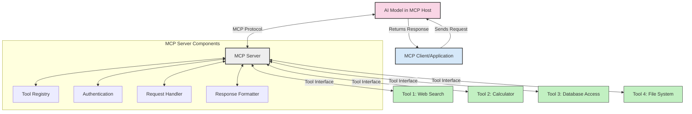
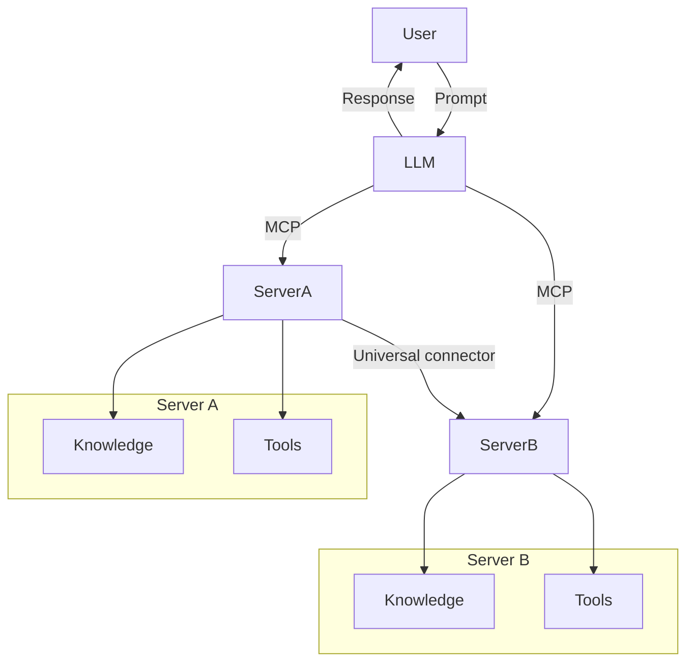

<!--
CO_OP_TRANSLATOR_METADATA:
{
  "original_hash": "02301140adbd807ecf0f17720fa307bc",
  "translation_date": "2025-05-17T06:00:03+00:00",
  "source_file": "00-Introduction/README.md",
  "language_code": "tr"
}
-->
# Model Context Protokolüne (MCP) Giriş: Ölçeklenebilir AI Uygulamaları İçin Neden Önemlidir?

Üretken AI uygulamaları, kullanıcıların doğal dil komutları kullanarak uygulama ile etkileşime girmesine olanak tanıdığından büyük bir ilerleme kaydediyor. Ancak, bu tür uygulamalara daha fazla zaman ve kaynak yatırıldıkça, işlevsellikleri ve kaynakları kolayca entegre edebildiğinizden emin olmak istersiniz. Bu, uygulamanızın birden fazla modelin kullanılmasına ve karmaşıklıklarına hitap edebilmesi için önemlidir. Kısacası, Gen AI uygulamaları oluşturmak başlangıçta kolaydır, ancak büyüdükçe ve daha karmaşık hale geldikçe bir mimari tanımlamaya başlamanız ve muhtemelen uygulamalarınızın tutarlı bir şekilde oluşturulmasını sağlamak için bir standarda dayanmanız gerekecektir. İşte burada MCP devreye girer, işleri düzenler ve bir standart sağlar.

---

## **🔍 Model Context Protokolü (MCP) Nedir?**

**Model Context Protokolü (MCP)**, Büyük Dil Modellerinin (LLM'ler) harici araçlar, API'ler ve veri kaynaklarıyla sorunsuz bir şekilde etkileşim kurmasına olanak tanıyan **açık, standartlaştırılmış bir arayüzdür**. Bu, AI model işlevselliğini eğitim verilerinin ötesinde geliştirmek için tutarlı bir mimari sağlar ve daha akıllı, ölçeklenebilir ve daha duyarlı AI sistemlerini mümkün kılar.

---

## **🎯 AI'da Standartlaşmanın Neden Önemli Olduğu**

Üretken AI uygulamaları daha karmaşık hale geldikçe, **ölçeklenebilirlik, genişletilebilirlik** ve **sürdürülebilirlik** sağlayan standartları benimsemek önemlidir. MCP bu ihtiyaçları karşılar:

- Model-araç entegrasyonlarını birleştirerek
- Kırılgan, tek seferlik özel çözümleri azaltarak
- Bir ekosistem içinde birden fazla modelin bir arada var olmasına izin vererek

---

## **📚 Öğrenme Hedefleri**

Bu makalenin sonunda:

- **Model Context Protokolü (MCP)** ve kullanım alanlarını tanımlayabileceksiniz
- MCP'nin modelden araca iletişimi nasıl standartlaştırdığını anlayabileceksiniz
- MCP mimarisinin temel bileşenlerini tanımlayabileceksiniz
- MCP'nin kurumsal ve geliştirme bağlamlarındaki gerçek dünya uygulamalarını keşfedebileceksiniz

---

## **💡 Model Context Protokolü (MCP) Neden Oyunun Kurallarını Değiştiriyor**

### **🔗 MCP, AI Etkileşimlerindeki Parçalanmayı Çözüyor**

MCP'den önce, modelleri araçlarla entegre etmek için:

- Her araç-model çifti için özel kod
- Her satıcı için standart dışı API'ler
- Güncellemeler nedeniyle sık sık kesintiler
- Daha fazla araçla birlikte kötü ölçeklenebilirlik gerekiyordu

### **✅ MCP Standartlaşmasının Faydaları**

| **Fayda**                 | **Açıklama**                                                                    |
|---------------------------|--------------------------------------------------------------------------------|
| Uyumluluk                 | LLM'ler farklı satıcıların araçlarıyla sorunsuz çalışır                        |
| Tutarlılık                | Platformlar ve araçlar arasında tutarlı davranış                               |
| Yeniden Kullanılabilirlik | Bir kez oluşturulan araçlar projeler ve sistemler arasında kullanılabilir      |
| Hızlandırılmış Geliştirme | Standartlaştırılmış, tak-çalıştır arayüzleri kullanarak geliştirme süresini azaltır |

---

## **🧱 MCP Mimarisi Üzerine Genel Bakış**

MCP, bir **istemci-sunucu modeli** izler, burada:

- **MCP Ev Sahipleri** AI modellerini çalıştırır
- **MCP İstemcileri** istekleri başlatır
- **MCP Sunucuları** bağlam, araçlar ve yetenekler sunar

### **Ana Bileşenler:**

- **Kaynaklar** – Modeller için statik veya dinamik veriler  
- **Komutlar** – Yönlendirilmiş üretim için önceden tanımlanmış iş akışları  
- **Araçlar** – Arama, hesaplamalar gibi çalıştırılabilir işlevler  
- **Örnekleme** – Tekrarlı etkileşimler yoluyla ajan davranışı

---

## MCP Sunucuları Nasıl Çalışır?

MCP sunucuları şu şekilde çalışır:

- **İstek Akışı**: 
    1. MCP İstemcisi, bir MCP Ev Sahipliğinde çalışan AI Modeline bir istek gönderir.
    2. AI Modeli, harici araçlara veya verilere ihtiyaç duyduğunda bunu belirler.
    3. Model, standartlaştırılmış protokolü kullanarak MCP Sunucusuyla iletişim kurar.

- **MCP Sunucu İşlevselliği**:
    - Araç Kaydı: Mevcut araçların ve yeteneklerinin bir kataloğunu tutar.
    - Kimlik Doğrulama: Araç erişimi için izinleri doğrular.
    - İstek İşleyici: Modelden gelen araç isteklerini işler.
    - Yanıt Biçimleyici: Araç çıktısını modelin anlayabileceği bir formatta yapılandırır.

- **Araç Uygulaması**: 
    - Sunucu, istekleri uygun harici araçlara yönlendirir
    - Araçlar, arama, hesaplama, veritabanı sorguları gibi uzmanlaşmış işlevlerini yürütür
    - Sonuçlar modele tutarlı bir formatta geri döner.

- **Yanıt Tamamlanması**: 
    - AI modeli, araç çıktısını yanıtına dahil eder.
    - Son yanıt, istemci uygulamasına geri gönderilir.

## 👨‍💻 MCP Sunucusu Nasıl Kurulur (Örneklerle)

MCP sunucuları, LLM yeteneklerini veri ve işlevsellik sağlayarak genişletmenizi sağlar. 

Denemeye hazır mısınız? İşte farklı dillerde basit bir MCP sunucusu oluşturma örnekleri:

- **Python Örneği**: https://github.com/modelcontextprotocol/python-sdk

- **TypeScript Örneği**: https://github.com/modelcontextprotocol/typescript-sdk

- **Java Örneği**: https://github.com/modelcontextprotocol/java-sdk

- **C#/.NET Örneği**: https://github.com/modelcontextprotocol/csharp-sdk

## 🌍 MCP'nin Gerçek Dünya Kullanım Alanları

MCP, AI yeteneklerini genişleterek geniş bir uygulama yelpazesine olanak tanır:

| **Uygulama**                   | **Açıklama**                                                                    |
|-------------------------------|--------------------------------------------------------------------------------|
| Kurumsal Veri Entegrasyonu    | LLM'leri veritabanlarına, CRM'lere veya iç araçlara bağlayın                    |
| Ajanik AI Sistemleri          | Araç erişimi ve karar verme iş akışları ile otonom ajanlar etkinleştirin        |
| Çok modlu Uygulamalar         | Tek bir birleşik AI uygulaması içinde metin, görüntü ve ses araçlarını birleştirin |
| Gerçek Zamanlı Veri Entegrasyonu | AI etkileşimlerine canlı veri getirerek daha doğru, güncel çıktılar sağlayın     |

### 🧠 MCP = AI Etkileşimleri İçin Evrensel Standart

Model Context Protokolü (MCP), AI etkileşimleri için evrensel bir standart olarak hareket eder, tıpkı USB-C'nin cihazlar için fiziksel bağlantıları standartlaştırdığı gibi. AI dünyasında, MCP, modellerin (istemciler) harici araçlar ve veri sağlayıcılarla sorunsuz bir şekilde entegre olmasına olanak tanıyan tutarlı bir arayüz sağlar. Bu, her API veya veri kaynağı için çeşitli, özel protokollere olan ihtiyacı ortadan kaldırır.

MCP altında, MCP uyumlu bir araç (MCP sunucusu olarak anılır) birleşik bir standardı takip eder. Bu sunucular, sundukları araçları veya eylemleri listeleyebilir ve bir AI ajanı tarafından talep edildiğinde bu eylemleri gerçekleştirebilir. MCP'yi destekleyen AI ajan platformları, sunuculardan mevcut araçları keşfedebilir ve bu standart protokol aracılığıyla onları çağırabilir.

### 💡 Bilgiye erişimi kolaylaştırır

Araç sunmanın ötesinde, MCP bilgiye erişimi de kolaylaştırır. Uygulamaların büyük dil modellerine (LLM'ler) çeşitli veri kaynaklarına bağlayarak bağlam sağlamasına olanak tanır. Örneğin, bir MCP sunucusu bir şirketin belge deposunu temsil edebilir ve ajanların talep üzerine ilgili bilgileri almasına olanak tanır. Başka bir sunucu, e-posta gönderme veya kayıt güncelleme gibi belirli eylemleri ele alabilir. Ajan açısından, bunlar sadece kullanabileceği araçlardır - bazı araçlar veri (bilgi bağlamı) döndürürken, diğerleri eylemler gerçekleştirir. MCP her ikisini de verimli bir şekilde yönetir.

Bir MCP sunucusuna bağlanan bir ajan, sunucunun sunduğu yetenekleri ve erişilebilir verileri standart bir format aracılığıyla otomatik olarak öğrenir. Bu standartlaşma, dinamik araç kullanılabilirliğini mümkün kılar. Örneğin, bir ajan sistemine yeni bir MCP sunucusu eklemek, işlevlerinin hemen kullanılabilir olmasını sağlar, ajanın talimatlarını daha fazla özelleştirmeye gerek kalmadan.

Bu kesintisiz entegrasyon, sunucuların hem araçlar hem de bilgi sağlayarak sistemler arasında sorunsuz işbirliği sağladığı mermaid diyagramında gösterilen akışla uyumludur. 

### 👉 Örnek: Ölçeklenebilir Ajan Çözümü

## 🔐 MCP'nin Pratik Faydaları

MCP kullanmanın bazı pratik faydaları şunlardır:

- **Güncellik**: Modeller, eğitim verilerinin ötesinde güncel bilgilere erişebilir
- **Yetenek Genişletme**: Modeller, eğitilmedikleri görevler için uzmanlaşmış araçlardan yararlanabilir
- **Azaltılmış Halüsinasyonlar**: Harici veri kaynakları gerçeklere dayalı zemin sağlar
- **Gizlilik**: Hassas veriler, komutlarda gömülü olmak yerine güvenli ortamlarda kalabilir

## 📌 Anahtar Çıkarımlar

MCP kullanımı için anahtar çıkarımlar şunlardır:

- **MCP**, AI modellerinin araçlar ve verilerle nasıl etkileşimde bulunduğunu standartlaştırır
- **Genişletilebilirlik, tutarlılık ve birlikte çalışabilirliği** teşvik eder
- MCP, **geliştirme süresini azaltmaya, güvenilirliği artırmaya ve model yeteneklerini genişletmeye** yardımcı olur
- İstemci-sunucu mimarisi, **esnek, genişletilebilir AI uygulamalarını** mümkün kılar

## 🧠 Alıştırma

İnşa etmekle ilgilendiğiniz bir AI uygulamasını düşünün.

- Hangi **harici araçlar veya veriler** yeteneklerini artırabilir?
- MCP, entegrasyonu nasıl **daha basit ve daha güvenilir** hale getirebilir?

## Ek Kaynaklar

- [MCP GitHub Deposu](https://github.com/modelcontextprotocol)

## Sıradaki

Sonraki: [Bölüm 1: Temel Kavramlar](/01-CoreConcepts/README.md)

**Feragatname**: 
Bu belge, AI çeviri hizmeti [Co-op Translator](https://github.com/Azure/co-op-translator) kullanılarak çevrilmiştir. Doğruluk için çaba göstersek de, otomatik çevirilerin hata veya yanlışlık içerebileceğini unutmayın. Orijinal belge, kendi dilinde yetkili kaynak olarak kabul edilmelidir. Kritik bilgiler için profesyonel insan çevirisi önerilir. Bu çevirinin kullanımından doğacak yanlış anlama veya yanlış yorumlamalardan sorumlu değiliz.