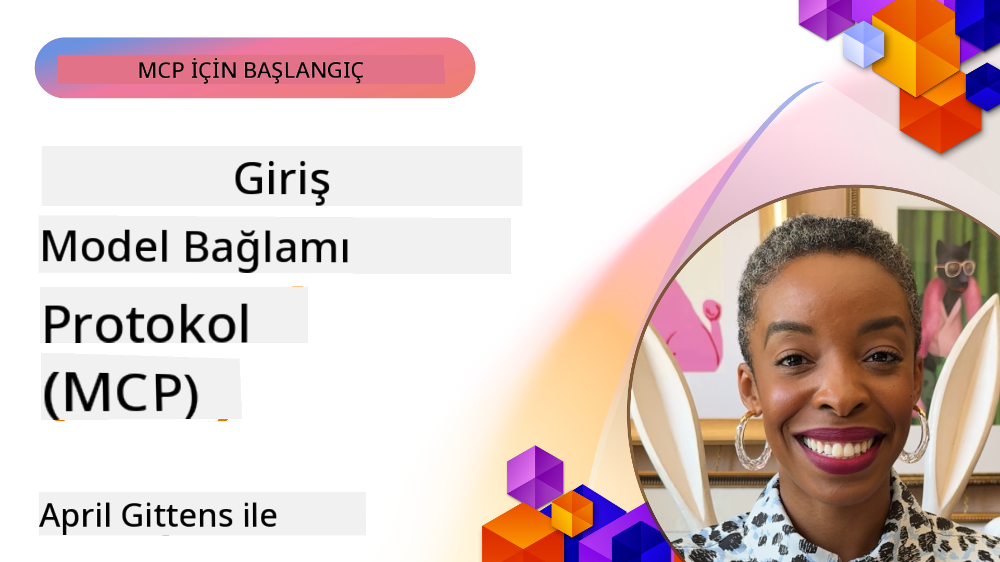
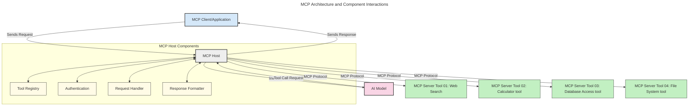
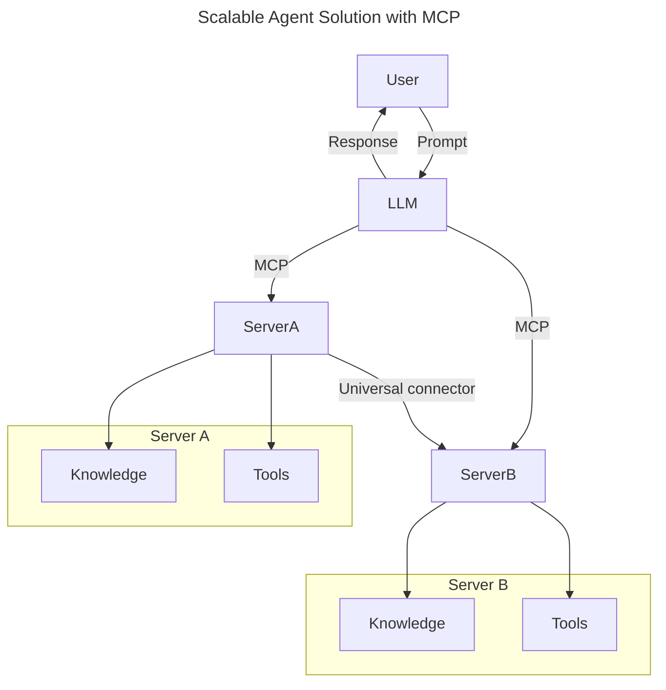
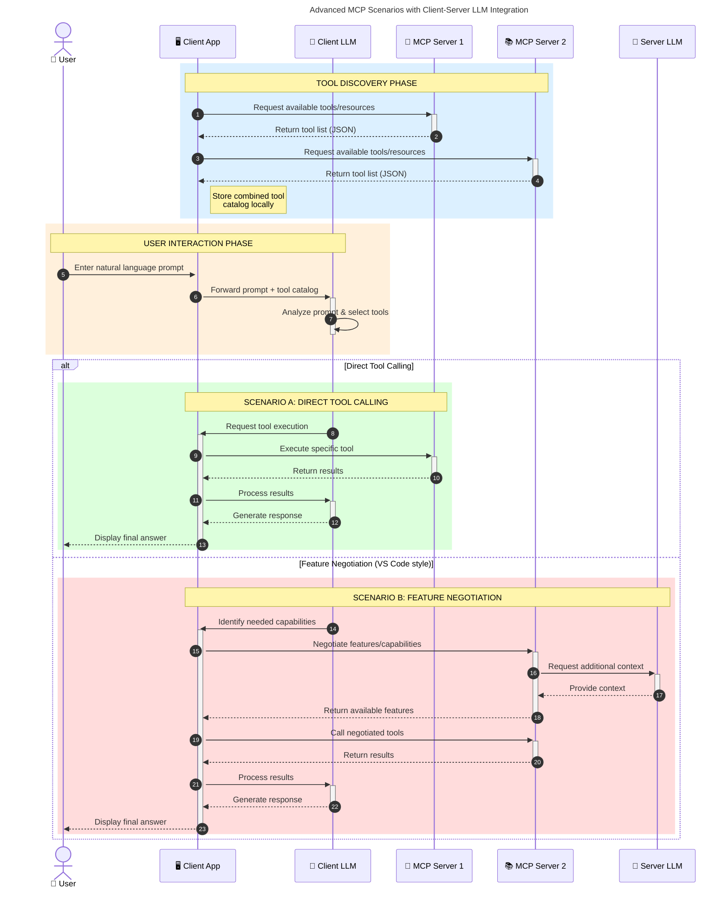

<!--
CO_OP_TRANSLATOR_METADATA:
{
  "original_hash": "0df1ee78a6dd8300f3a040ca5b411c2e",
  "translation_date": "2025-08-18T18:04:47+00:00",
  "source_file": "00-Introduction/README.md",
  "language_code": "tr"
}
-->
# Model Context Protokolü (MCP) Tanıtımı: Ölçeklenebilir Yapay Zeka Uygulamaları İçin Neden Önemlidir?

_(Bu dersin videosunu izlemek için yukarıdaki görsele tıklayın)_

Üretken yapay zeka uygulamaları, kullanıcıların doğal dil girdileriyle uygulamalarla etkileşim kurmasına olanak tanıyarak büyük bir ilerleme kaydetmiştir. Ancak, bu tür uygulamalara daha fazla zaman ve kaynak yatırıldıkça, işlevsellikleri ve kaynakları kolayca entegre edebilmek, uygulamanızın birden fazla modelle çalışabilmesini sağlamak ve çeşitli model karmaşıklıklarını yönetmek önem kazanır. Kısacası, üretken yapay zeka uygulamaları geliştirmek başlangıçta kolaydır, ancak büyüdükçe ve karmaşıklaştıkça bir mimari tanımlamaya başlamanız ve uygulamalarınızın tutarlı bir şekilde inşa edilmesini sağlamak için bir standarda güvenmeniz gerekebilir. İşte bu noktada MCP devreye girer, işleri düzenler ve bir standart sunar.

---

## **🔍 Model Context Protokolü (MCP) Nedir?**

**Model Context Protokolü (MCP)**, Büyük Dil Modellerinin (LLM'ler) harici araçlar, API'ler ve veri kaynaklarıyla sorunsuz bir şekilde etkileşim kurmasını sağlayan **açık, standartlaştırılmış bir arayüzdür**. Bu protokol, yapay zeka modellerinin işlevselliğini eğitim verilerinin ötesine taşıyan tutarlı bir mimari sunarak daha akıllı, ölçeklenebilir ve duyarlı yapay zeka sistemleri oluşturmayı mümkün kılar.

---

## **🎯 Yapay Zekada Standardizasyon Neden Önemlidir?**

Üretken yapay zeka uygulamaları karmaşıklaştıkça, **ölçeklenebilirlik, genişletilebilirlik, sürdürülebilirlik** ve **satıcı bağımlılığından kaçınma** sağlayan standartları benimsemek kritik hale gelir. MCP, bu ihtiyaçları şu şekilde karşılar:

- Model ve araç entegrasyonlarını birleştirir
- Kırılgan, tek seferlik özel çözümleri azaltır
- Farklı satıcılardan birden fazla modelin aynı ekosistemde bir arada bulunmasına olanak tanır

**Not:** MCP kendisini açık bir standart olarak tanımlasa da, IEEE, IETF, W3C, ISO veya diğer herhangi bir standart kuruluşu aracılığıyla standartlaştırılma planı bulunmamaktadır.

---

## **📚 Öğrenme Hedefleri**

Bu makalenin sonunda şunları yapabileceksiniz:

- **Model Context Protokolü (MCP)**'nü ve kullanım alanlarını tanımlamak
- MCP'nin modelden araca iletişimi nasıl standartlaştırdığını anlamak
- MCP mimarisinin temel bileşenlerini belirlemek
- MCP'nin kurumsal ve geliştirme bağlamlarındaki gerçek dünya uygulamalarını keşfetmek

---

## **💡 Model Context Protokolü (MCP) Neden Bir Dönüm Noktasıdır?**

### **🔗 MCP, Yapay Zeka Etkileşimlerindeki Parçalanmayı Çözüyor**

MCP'den önce, modelleri araçlarla entegre etmek için şunlar gerekiyordu:

- Her araç-model çifti için özel kod
- Her satıcı için standart olmayan API'ler
- Güncellemeler nedeniyle sık sık kesintiler
- Daha fazla araçla ölçeklenememe

### **✅ MCP Standardizasyonunun Faydaları**

| **Fayda**               | **Açıklama**                                                                     |
|--------------------------|---------------------------------------------------------------------------------|
| Birlikte Çalışabilirlik  | LLM'ler, farklı satıcılardan araçlarla sorunsuz çalışır                         |
| Tutarlılık              | Platformlar ve araçlar arasında tutarlı davranış                                |
| Yeniden Kullanılabilirlik| Bir kez oluşturulan araçlar, projeler ve sistemler arasında kullanılabilir      |
| Hızlandırılmış Geliştirme| Standart, tak-çalıştır arayüzleri kullanarak geliştirme süresini azaltır        |

---

## **🧱 MCP'nin Yüksek Düzeyde Mimari Genel Görünümü**

MCP, bir **istemci-sunucu modeli** izler; burada:

- **MCP Hostları** yapay zeka modellerini çalıştırır
- **MCP İstemcileri** istekleri başlatır
- **MCP Sunucuları** bağlam, araçlar ve yetenekler sunar

### **Temel Bileşenler:**

- **Kaynaklar** – Modeller için statik veya dinamik veriler  
- **İfadeler** – Yönlendirilmiş üretim için önceden tanımlanmış iş akışları  
- **Araçlar** – Arama, hesaplama gibi çalıştırılabilir işlevler  
- **Örnekleme** – Yinelemeli etkileşimler yoluyla ajan davranışı  

---

## MCP Sunucuları Nasıl Çalışır?

MCP sunucuları şu şekilde çalışır:

- **İstek Akışı**:
    1. Bir istek, bir son kullanıcı veya onların adına hareket eden bir yazılım tarafından başlatılır.
    2. **MCP İstemcisi**, isteği yapay zeka modeli çalışma zamanını yöneten bir **MCP Hostuna** gönderir.
    3. **Yapay Zeka Modeli**, kullanıcı girdisini alır ve bir veya daha fazla araç çağrısı yoluyla harici araçlara veya verilere erişim talep edebilir.
    4. **MCP Hostu**, modeli doğrudan değil, standartlaştırılmış protokolü kullanarak uygun **MCP Sunucularıyla** iletişim kurar.
- **MCP Host İşlevselliği**:
    - **Araç Kaydı**: Mevcut araçların ve yeteneklerinin bir kataloğunu tutar.
    - **Kimlik Doğrulama**: Araç erişimi için izinleri doğrular.
    - **İstek İşleyici**: Modelden gelen araç isteklerini işler.
    - **Yanıt Biçimlendirici**: Araç çıktısını modelin anlayabileceği bir formata dönüştürür.
- **MCP Sunucu Uygulaması**:
    - **MCP Hostu**, araç çağrılarını bir veya daha fazla **MCP Sunucusuna** yönlendirir; her biri özel işlevler sunar (ör. arama, hesaplama, veri tabanı sorguları).
    - **MCP Sunucuları**, ilgili işlemleri gerçekleştirir ve sonuçları **MCP Hostuna** tutarlı bir formatta geri gönderir.
    - **MCP Hostu**, bu sonuçları biçimlendirir ve **Yapay Zeka Modeline** iletir.
- **Yanıt Tamamlama**:
    - **Yapay Zeka Modeli**, araç çıktısını nihai bir yanıta dahil eder.
    - **MCP Hostu**, bu yanıtı **MCP İstemcisine** gönderir ve bu da son kullanıcıya veya çağıran yazılıma iletir.

## 👨‍💻 MCP Sunucusu Nasıl Oluşturulur (Örneklerle)

MCP sunucuları, LLM yeteneklerini veri ve işlevsellik sağlayarak genişletmenize olanak tanır.

Denemeye hazır mısınız? İşte farklı diller/yığınlar için basit MCP sunucuları oluşturma örnekleriyle birlikte dil ve/veya yığın özelinde SDK'lar:

- **Python SDK**: https://github.com/modelcontextprotocol/python-sdk

- **TypeScript SDK**: https://github.com/modelcontextprotocol/typescript-sdk

- **Java SDK**: https://github.com/modelcontextprotocol/java-sdk

- **C#/.NET SDK**: https://github.com/modelcontextprotocol/csharp-sdk

---

## 🌍 MCP'nin Gerçek Dünya Kullanım Alanları

MCP, yapay zeka yeteneklerini genişleterek çok çeşitli uygulamalara olanak tanır:

| **Uygulama**               | **Açıklama**                                                                   |
|----------------------------|-------------------------------------------------------------------------------|
| Kurumsal Veri Entegrasyonu | LLM'leri veri tabanlarına, CRM'lere veya dahili araçlara bağlama              |
| Ajanik Yapay Zeka Sistemleri| Araç erişimi ve karar verme iş akışlarıyla otonom ajanlar oluşturma          |
| Çok Modlu Uygulamalar      | Tek bir birleşik yapay zeka uygulaması içinde metin, görüntü ve ses araçlarını birleştirme |
| Gerçek Zamanlı Veri Entegrasyonu | Daha doğru ve güncel çıktılar için yapay zeka etkileşimlerine canlı veri getirme |

### 🧠 MCP = Yapay Zeka Etkileşimleri İçin Evrensel Standart

Model Context Protokolü (MCP), USB-C'nin cihazlar için fiziksel bağlantıları standartlaştırdığı gibi, yapay zeka etkileşimleri için evrensel bir standart görevi görür. Yapay zeka dünyasında MCP, modellerin (istemciler) harici araçlar ve veri sağlayıcılarla (sunucular) sorunsuz bir şekilde entegre olmasını sağlayan tutarlı bir arayüz sunar. Bu, her API veya veri kaynağı için çeşitli, özel protokollere duyulan ihtiyacı ortadan kaldırır.

MCP altında, MCP uyumlu bir araç (MCP sunucusu olarak adlandırılır) birleşik bir standardı takip eder. Bu sunucular, sundukları araçları veya eylemleri listeleyebilir ve bir yapay zeka ajanı tarafından talep edildiğinde bu eylemleri gerçekleştirebilir. MCP'yi destekleyen yapay zeka ajan platformları, sunuculardan mevcut araçları keşfedebilir ve bu standart protokol aracılığıyla bunları çağırabilir.

### 💡 Bilgiye Erişimi Kolaylaştırır

Araçlar sunmanın ötesinde, MCP bilgiye erişimi de kolaylaştırır. Uygulamaların büyük dil modellerine (LLM'ler) çeşitli veri kaynaklarını bağlayarak bağlam sağlamasına olanak tanır. Örneğin, bir MCP sunucusu bir şirketin belge deposunu temsil edebilir ve ajanların talep üzerine ilgili bilgileri almasına olanak tanır. Başka bir sunucu, e-posta gönderme veya kayıt güncelleme gibi belirli işlemleri gerçekleştirebilir. Ajan açısından bakıldığında, bunlar yalnızca kullanabileceği araçlardır—bazı araçlar veri (bilgi bağlamı) döndürürken, diğerleri eylemleri gerçekleştirir. MCP her ikisini de verimli bir şekilde yönetir.

Bir MCP sunucusuna bağlanan bir ajan, sunucunun sunduğu yetenekleri ve erişilebilir verileri standart bir format aracılığıyla otomatik olarak öğrenir. Bu standardizasyon, dinamik araç kullanılabilirliğini mümkün kılar. Örneğin, bir ajanın sistemine yeni bir MCP sunucusu eklemek, işlevlerinin hemen kullanılabilir olmasını sağlar ve ajanın talimatlarının daha fazla özelleştirilmesini gerektirmez.

Bu akıcı entegrasyon, sunucuların hem araçlar hem de bilgi sağlayarak sistemler arasında sorunsuz iş birliği sağladığı aşağıdaki diyagramda gösterilen akışla uyumludur.

### 👉 Örnek: Ölçeklenebilir Ajan Çözümü

### 🔄 İstemci Taraflı LLM Entegrasyonu ile Gelişmiş MCP Senaryoları

Temel MCP mimarisinin ötesinde, hem istemci hem de sunucunun LLM'ler içerdiği daha sofistike etkileşimlere olanak tanıyan gelişmiş senaryolar vardır. Aşağıdaki diyagramda, **İstemci Uygulaması**, bir LLM tarafından kullanılabilir bir dizi MCP aracına sahip bir IDE olabilir:

---

## 🔐 MCP'nin Pratik Faydaları

MCP kullanmanın pratik faydaları şunlardır:

- **Güncellik**: Modeller, eğitim verilerinin ötesinde güncel bilgilere erişebilir
- **Yetenek Genişletme**: Modeller, eğitilmedikleri görevler için özel araçlardan yararlanabilir
- **Halüsinasyonların Azaltılması**: Harici veri kaynakları, gerçeklere dayalı bir temel sağlar
- **Gizlilik**: Hassas veriler, istemlerde gömülü olmak yerine güvenli ortamlarda kalabilir

---

## 📌 Önemli Çıkarımlar

MCP kullanımıyla ilgili önemli çıkarımlar şunlardır:

- **MCP**, yapay zeka modellerinin araçlar ve verilerle nasıl etkileşim kurduğunu standartlaştırır
- **Genişletilebilirlik, tutarlılık ve birlikte çalışabilirliği** teşvik eder
- MCP, **geliştirme süresini azaltmaya, güvenilirliği artırmaya ve model yeteneklerini genişletmeye** yardımcı olur
- İstemci-sunucu mimarisi, **esnek ve genişletilebilir yapay zeka uygulamalarını** mümkün kılar

---

## 🧠 Egzersiz

Oluşturmak istediğiniz bir yapay zeka uygulamasını düşünün.

- Hangi **harici araçlar veya veriler** uygulamanızın yeteneklerini artırabilir?
- MCP, entegrasyonu nasıl **daha basit ve güvenilir** hale getirebilir?

---

## Ek Kaynaklar

- [MCP GitHub Deposu](https://github.com/modelcontextprotocol)

---

## Sırada Ne Var?

Sıradaki: [Bölüm 1: Temel Kavramlar](../01-CoreConcepts/README.md)

**Feragatname**:  
Bu belge, [Co-op Translator](https://github.com/Azure/co-op-translator) adlı yapay zeka çeviri hizmeti kullanılarak çevrilmiştir. Doğruluk için çaba göstersek de, otomatik çevirilerin hata veya yanlışlıklar içerebileceğini lütfen unutmayın. Orijinal belgenin kendi dilindeki hali, yetkili kaynak olarak kabul edilmelidir. Kritik bilgiler için profesyonel insan çevirisi önerilir. Bu çevirinin kullanımından kaynaklanan yanlış anlamalar veya yanlış yorumlamalardan sorumlu değiliz.