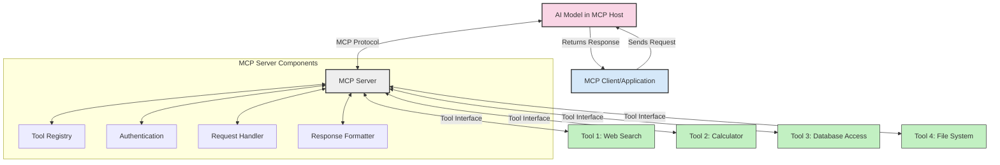
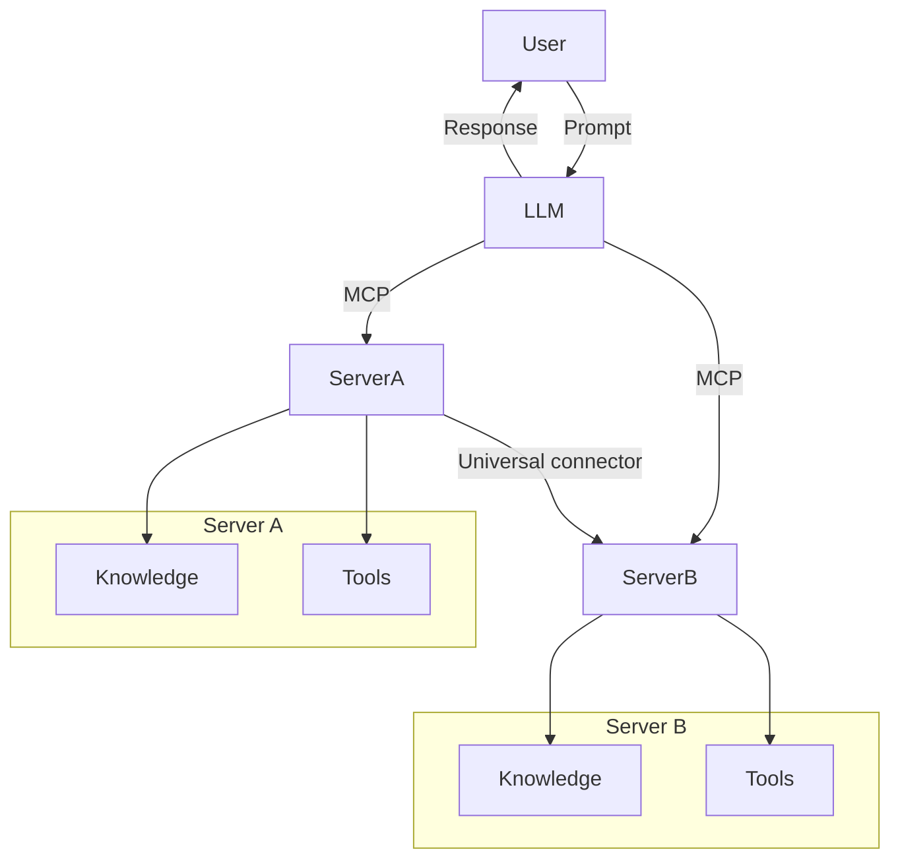

<!--
CO_OP_TRANSLATOR_METADATA:
{
  "original_hash": "cf84f987e1b771d2201408e110dfd2db",
  "translation_date": "2025-05-20T17:00:38+00:00",
  "source_file": "00-Introduction/README.md",
  "language_code": "tr"
}
-->
# Model Context Protocol (MCP) Giriş: Ölçeklenebilir AI Uygulamaları İçin Neden Önemlidir?

Üretken AI uygulamaları, kullanıcıların genellikle doğal dil komutlarıyla uygulama ile etkileşim kurmasını sağladığı için büyük bir ilerlemedir. Ancak, bu tür uygulamalara daha fazla zaman ve kaynak yatırıldıkça, işlevsellikleri ve kaynakları kolayca entegre edebileceğiniz, uygulamanızın birden fazla modelin kullanımına ve detaylarına uyum sağlayabileceği bir yapıyı kurmak istersiniz. Kısacası, Gen AI uygulamaları başlangıçta yapmak kolaydır ama büyüyüp karmaşıklaştıkça bir mimari tanımlamaya başlamanız gerekir ve muhtemelen uygulamalarınızın tutarlı şekilde geliştirilmesini sağlamak için bir standarda dayanmanız gerekir. İşte MCP, işleri organize etmek ve bir standart sağlamak için devreye girer.

---

## **🔍 Model Context Protocol (MCP) Nedir?**

**Model Context Protocol (MCP)**, Büyük Dil Modellerinin (LLM’ler) harici araçlar, API’ler ve veri kaynakları ile sorunsuz etkileşim kurmasını sağlayan **açık, standartlaştırılmış bir arayüzdür**. Eğitim verilerinin ötesinde AI model fonksiyonelliğini artırmak için tutarlı bir mimari sunar ve daha akıllı, ölçeklenebilir ve yanıt verebilir AI sistemleri oluşturmayı mümkün kılar.

---

## **🎯 AI’da Standardizasyon Neden Önemlidir?**

Üretken AI uygulamaları karmaşıklaştıkça, **ölçeklenebilirlik, genişletilebilirlik** ve **bakım kolaylığı** sağlayan standartların benimsenmesi önem kazanır. MCP bu ihtiyaçları şu yollarla karşılar:

- Model ve araç entegrasyonlarını birleştirir
- Kırılgan, tek seferlik özel çözümleri azaltır
- Bir ekosistemde birden fazla modelin birlikte var olmasına izin verir

---

## **📚 Öğrenme Hedefleri**

Bu makalenin sonunda şunları yapabileceksiniz:

- **Model Context Protocol (MCP)**’yi ve kullanım alanlarını tanımlamak
- MCP’nin modelden araca iletişimi nasıl standartlaştırdığını anlamak
- MCP mimarisinin temel bileşenlerini tanımlamak
- MCP’nin kurumsal ve geliştirme ortamlarındaki gerçek dünya uygulamalarını keşfetmek

---

## **💡 Model Context Protocol (MCP) Neden Oyunun Kurallarını Değiştiriyor?**

### **🔗 MCP, AI Etkileşimlerindeki Parçalanmayı Çözüyor**

MCP öncesinde, modelleri araçlarla entegre etmek için:

- Her araç-model çifti için özel kod yazmak gerekiyordu
- Her satıcı için standart dışı API’ler kullanılıyordu
- Güncellemeler nedeniyle sık sık kesintiler yaşanıyordu
- Araç sayısı arttıkça ölçeklenebilirlik kötüleşiyordu

### **✅ MCP Standardizasyonunun Faydaları**

| **Fayda**                | **Açıklama**                                                                   |
|--------------------------|--------------------------------------------------------------------------------|
| Birlikte Çalışabilirlik  | LLM’ler farklı satıcıların araçlarıyla sorunsuz çalışır                       |
| Tutarlılık               | Platformlar ve araçlar arasında uniform davranış sağlar                        |
| Yeniden Kullanılabilirlik| Bir kez oluşturulan araçlar projeler ve sistemler arasında kullanılabilir     |
| Geliştirme Hızlandırma   | Standart, tak-çalıştır arayüzler sayesinde geliştirme süresini kısaltır       |

---

## **🧱 MCP Mimarisine Genel Bakış**

MCP, **istemci-sunucu modeli**ni takip eder:

- **MCP Host’lar** AI modellerini çalıştırır
- **MCP Client’lar** istek başlatır
- **MCP Server’lar** bağlam, araçlar ve yetenekleri sağlar

### **Ana Bileşenler:**

- **Kaynaklar** – Modeller için statik veya dinamik veriler  
- **Komutlar (Prompts)** – Yönlendirilmiş üretim için önceden tanımlı iş akışları  
- **Araçlar** – Arama, hesaplama gibi yürütülebilir fonksiyonlar  
- **Örnekleme (Sampling)** – Yinelemeli etkileşimlerle ajan davranışı

---

## MCP Sunucuları Nasıl Çalışır?

MCP sunucuları şu şekilde çalışır:

- **İstek Akışı**:  
    1. MCP Client, MCP Host’ta çalışan AI Modeline bir istek gönderir.  
    2. AI Modeli, harici araçlara veya verilere ihtiyaç duyduğunu belirler.  
    3. Model, standart protokolü kullanarak MCP Server ile iletişim kurar.

- **MCP Server İşlevleri**:  
    - Araç Kaydı: Mevcut araçların ve yeteneklerinin kataloğunu tutar.  
    - Doğrulama: Araç erişimi için izinleri kontrol eder.  
    - İstek İşleyici: Modelden gelen araç isteklerini işler.  
    - Yanıt Formatlayıcı: Araç çıktısını modelin anlayacağı formata dönüştürür.

- **Araç Çalıştırma**:  
    - Sunucu istekleri ilgili harici araçlara yönlendirir  
    - Araçlar özel işlevlerini (arama, hesaplama, veri tabanı sorguları vb.) yürütür  
    - Sonuçlar modele tutarlı bir formatta iletilir

- **Yanıt Tamamlama**:  
    - AI modeli araç çıktısını yanıtına dahil eder  
    - Nihai yanıt istemci uygulamaya gönderilir

## 👨‍💻 MCP Sunucusu Nasıl Kurulur? (Örneklerle)

MCP sunucuları, LLM yeteneklerini veri ve işlevsellik sağlayarak genişletmenizi sağlar.

Denemeye hazır mısınız? İşte farklı dillerde basit bir MCP sunucusu oluşturma örnekleri:

- **Python Örneği**: https://github.com/modelcontextprotocol/python-sdk

- **TypeScript Örneği**: https://github.com/modelcontextprotocol/typescript-sdk

- **Java Örneği**: https://github.com/modelcontextprotocol/java-sdk

- **C#/.NET Örneği**: https://github.com/modelcontextprotocol/csharp-sdk

## 🌍 MCP’nin Gerçek Dünya Kullanım Alanları

MCP, AI yeteneklerini genişleterek çok çeşitli uygulamalara olanak tanır:

| **Uygulama**                | **Açıklama**                                                                   |
|-----------------------------|--------------------------------------------------------------------------------|
| Kurumsal Veri Entegrasyonu  | LLM’leri veri tabanları, CRM’ler veya dahili araçlara bağlar                  |
| Ajanik AI Sistemleri        | Araç erişimi ve karar alma iş akışlarına sahip otonom ajanlar sağlar          |
| Çok Modlu Uygulamalar       | Tek bir birleşik AI uygulamasında metin, görüntü ve ses araçlarını birleştirir|
| Gerçek Zamanlı Veri Entegrasyonu | AI etkileşimlerine canlı veri getirir, daha doğru ve güncel çıktı sağlar     |

### 🧠 MCP = AI Etkileşimleri İçin Evrensel Standart

Model Context Protocol (MCP), cihazlar için USB-C’nin fiziksel bağlantıları standartlaştırması gibi AI etkileşimleri için evrensel bir standart görevi görür. AI dünyasında MCP, modellerin (istemciler) harici araçlar ve veri sağlayıcıları (sunucular) ile sorunsuz entegrasyonunu sağlayan tutarlı bir arayüz sunar. Böylece her API veya veri kaynağı için farklı, özel protokollere gerek kalmaz.

MCP uyumlu bir araç (MCP sunucusu olarak adlandırılır) birleşik bir standardı takip eder. Bu sunucular sundukları araçları veya eylemleri listeleyebilir ve bir AI ajan tarafından istendiğinde bu eylemleri gerçekleştirebilir. MCP destekli AI ajan platformları, sunuculardan mevcut araçları keşfedebilir ve bu standart protokol aracılığıyla çağırabilir.

### 💡 Bilgiye Erişimi Kolaylaştırır

Araçlar sunmanın ötesinde, MCP bilgiye erişimi de kolaylaştırır. Uygulamaların büyük dil modellerine (LLM) bağlam sağlamasına, çeşitli veri kaynaklarına bağlanmasına olanak tanır. Örneğin, bir MCP sunucusu şirketin belge deposunu temsil edebilir ve ajanların ihtiyaç duydukları bilgiyi talep üzerine almasını sağlar. Başka bir sunucu, e-posta gönderme veya kayıt güncelleme gibi belirli eylemleri yönetebilir. Ajan açısından bunlar sadece kullanabileceği araçlardır — bazı araçlar veri (bilgi bağlamı) döndürürken, diğerleri eylem gerçekleştirir. MCP her iki durumu da etkin şekilde yönetir.

Bir ajan MCP sunucusuna bağlandığında, standart bir format aracılığıyla sunucunun mevcut yeteneklerini ve erişilebilir verilerini otomatik olarak öğrenir. Bu standartlaşma dinamik araç kullanılabilirliği sağlar. Örneğin, ajanın sistemine yeni bir MCP sunucusu eklemek, ajan talimatlarını yeniden özelleştirmeye gerek kalmadan işlevlerin hemen kullanılmasını sağlar.

Bu sadeleştirilmiş entegrasyon, sunucuların hem araçlar hem de bilgi sağladığı mermaid diyagramında gösterilen akışla uyumludur ve sistemler arası kesintisiz işbirliğini garanti eder.

### 👉 Örnek: Ölçeklenebilir Ajan Çözümü

## 🔐 MCP’nin Pratik Faydaları

MCP kullanmanın pratik faydaları şunlardır:

- **Güncellik**: Modeller, eğitim verilerinin ötesinde güncel bilgilere erişebilir  
- **Yetenek Genişletme**: Modeller, eğitilmedikleri görevler için özel araçları kullanabilir  
- **Azaltılmış Halüsinasyonlar**: Harici veri kaynakları gerçek temelli bilgi sağlar  
- **Gizlilik**: Hassas veriler, istemlerde gömülü olmak yerine güvenli ortamlarda kalabilir

## 📌 Önemli Noktalar

MCP kullanımı için önemli çıkarımlar:

- **MCP**, AI modellerinin araçlar ve verilerle nasıl etkileşime girdiğini standartlaştırır  
- Genişletilebilirlik, tutarlılık ve birlikte çalışabilirliği teşvik eder  
- MCP, geliştirme süresini kısaltır, güvenilirliği artırır ve model yeteneklerini genişletir  
- İstemci-sunucu mimarisi, esnek ve genişletilebilir AI uygulamalarına olanak tanır

## 🧠 Alıştırma

İlgilendiğiniz bir AI uygulamasını düşünün.

- Hangi **harici araçlar veya veriler** yeteneklerini artırabilir?  
- MCP, entegrasyonu nasıl **daha basit ve güvenilir** hale getirebilir?

## Ek Kaynaklar

- [MCP GitHub Deposu](https://github.com/modelcontextprotocol)

## Sonraki Adım

Sonraki: [Bölüm 1: Temel Kavramlar](/01-CoreConcepts/README.md)

**Feragatname**:  
Bu belge, AI çeviri hizmeti [Co-op Translator](https://github.com/Azure/co-op-translator) kullanılarak çevrilmiştir. Doğruluk için çaba göstersek de, otomatik çevirilerin hatalar veya yanlışlıklar içerebileceğini lütfen unutmayınız. Orijinal belge, kendi dilinde yetkili kaynak olarak kabul edilmelidir. Kritik bilgiler için profesyonel insan çevirisi önerilir. Bu çevirinin kullanımı sonucu oluşabilecek yanlış anlamalar veya yorumlamalardan sorumlu değiliz.