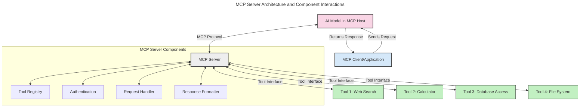
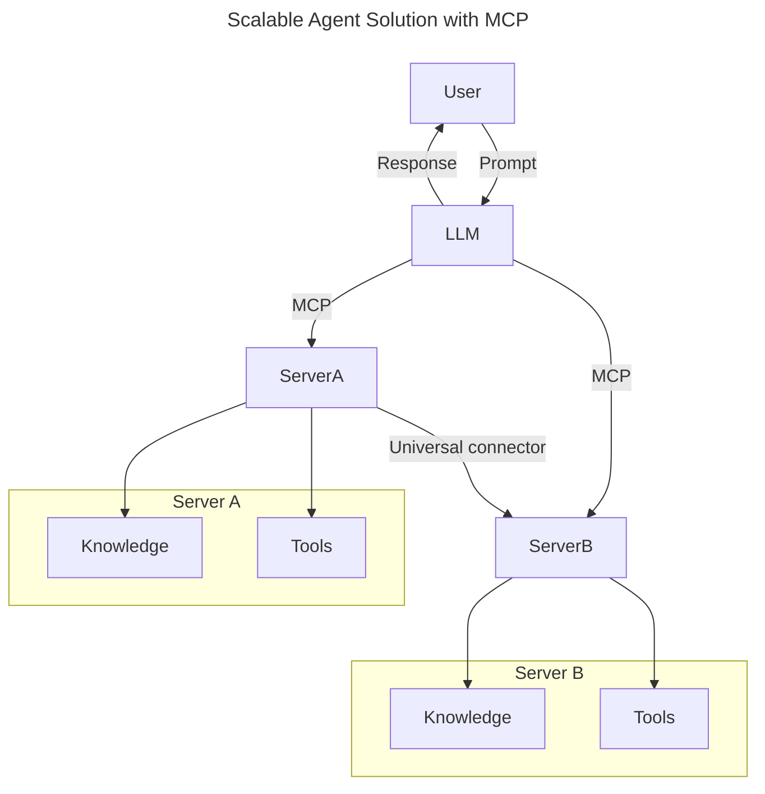
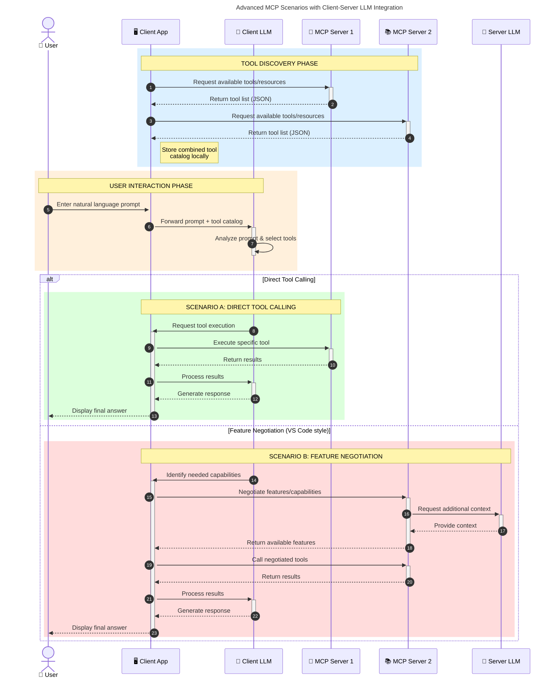

<!--
CO_OP_TRANSLATOR_METADATA:
{
  "original_hash": "105c2ddbb77bc38f7e9df009e1b06e45",
  "translation_date": "2025-07-13T15:32:31+00:00",
  "source_file": "00-Introduction/README.md",
  "language_code": "tr"
}
-->
# Model Context Protocol (MCP) Tanıtımı: Ölçeklenebilir Yapay Zeka Uygulamaları İçin Neden Önemlidir?

Üretken yapay zeka uygulamaları, kullanıcıların doğal dil komutlarıyla uygulamayla etkileşim kurmasını sağladığı için büyük bir ilerlemedir. Ancak, bu tür uygulamalara daha fazla zaman ve kaynak yatırıldıkça, işlevsellikleri ve kaynakları kolayca entegre edebildiğinizden, uygulamanızın birden fazla model kullanımını destekleyebildiğinden ve çeşitli model karmaşıklıklarını yönetebildiğinden emin olmak istersiniz. Kısacası, üretken yapay zeka uygulamaları başlamak için kolaydır, ancak büyüyüp karmaşıklaştıkça bir mimari tanımlamaya başlamanız gerekir ve uygulamalarınızın tutarlı bir şekilde inşa edilmesini sağlamak için muhtemelen bir standarda ihtiyaç duyarsınız. İşte MCP, işleri düzenlemek ve bir standart sağlamak için devreye girer.

---

## **🔍 Model Context Protocol (MCP) Nedir?**

**Model Context Protocol (MCP)**, Büyük Dil Modellerinin (LLM'ler) dış araçlar, API'ler ve veri kaynaklarıyla sorunsuz etkileşim kurmasını sağlayan **açık, standartlaştırılmış bir arayüzdür**. AI model işlevselliğini eğitim verilerinin ötesine taşıyan tutarlı bir mimari sunar ve daha akıllı, ölçeklenebilir ve daha duyarlı yapay zeka sistemleri oluşturmayı mümkün kılar.

---

## **🎯 Yapay Zekada Standardizasyon Neden Önemlidir?**

Üretken yapay zeka uygulamaları karmaşıklaştıkça, **ölçeklenebilirlik, genişletilebilirlik** ve **bakım kolaylığı** sağlayan standartları benimsemek kritik hale gelir. MCP bu ihtiyaçları şu şekilde karşılar:

- Model ve araç entegrasyonlarını birleştirir
- Kırılgan, tek seferlik özel çözümleri azaltır
- Bir ekosistem içinde birden fazla modelin birlikte var olmasına izin verir

---

## **📚 Öğrenme Hedefleri**

Bu makalenin sonunda şunları yapabileceksiniz:

- **Model Context Protocol (MCP)**’yi ve kullanım alanlarını tanımlamak
- MCP’nin modelden araca iletişimi nasıl standartlaştırdığını anlamak
- MCP mimarisinin temel bileşenlerini belirlemek
- MCP’nin kurumsal ve geliştirme bağlamlarındaki gerçek dünya uygulamalarını keşfetmek

---

## **💡 Model Context Protocol (MCP) Neden Bir Oyun Değiştiricidir?**

### **🔗 MCP, Yapay Zeka Etkileşimlerindeki Parçalanmayı Çözer**

MCP’den önce, modelleri araçlarla entegre etmek için:

- Her araç-model çifti için özel kod yazmak gerekiyordu
- Her satıcı için standart dışı API’ler kullanılıyordu
- Güncellemeler nedeniyle sık sık kopmalar yaşanıyordu
- Daha fazla araçla ölçeklenebilirlik zayıftı

### **✅ MCP Standardizasyonunun Faydaları**

| **Fayda**                | **Açıklama**                                                                 |
|--------------------------|-------------------------------------------------------------------------------|
| Birlikte Çalışabilirlik  | LLM’ler farklı satıcıların araçlarıyla sorunsuz çalışır                      |
| Tutarlılık               | Platformlar ve araçlar arasında uniform davranış                              |
| Yeniden Kullanılabilirlik| Bir kez oluşturulan araçlar projeler ve sistemler arasında kullanılabilir    |
| Hızlandırılmış Geliştirme| Standart, tak-çalıştır arayüzler sayesinde geliştirme süresini kısaltır      |

---

## **🧱 MCP Mimarisine Yüksek Seviyeden Bakış**

MCP, **istemci-sunucu modeli** izler; burada:

- **MCP Host’lar** AI modellerini çalıştırır
- **MCP Client’lar** istek başlatır
- **MCP Server’lar** bağlam, araçlar ve yetenekleri sağlar

### **Temel Bileşenler:**

- **Kaynaklar** – Modeller için statik veya dinamik veriler  
- **Komutlar (Prompts)** – Yönlendirilmiş üretim için önceden tanımlanmış iş akışları  
- **Araçlar** – Arama, hesaplama gibi çalıştırılabilir fonksiyonlar  
- **Örnekleme (Sampling)** – Yinelemeli etkileşimlerle ajan davranışı

---

## MCP Sunucuları Nasıl Çalışır?

MCP sunucuları şu şekilde işler:

- **İstek Akışı**:  
    1. MCP Client, MCP Host’ta çalışan AI Modeline bir istek gönderir.  
    2. AI Model, dış araçlara veya verilere ihtiyaç duyduğunu belirler.  
    3. Model, standart protokolü kullanarak MCP Server ile iletişim kurar.

- **MCP Server İşlevleri**:  
    - Araç Kaydı: Mevcut araçlar ve yeteneklerinin kataloğunu tutar.  
    - Kimlik Doğrulama: Araç erişim izinlerini doğrular.  
    - İstek İşleyici: Modelden gelen araç isteklerini işler.  
    - Yanıt Formatlayıcı: Araç çıktısını modelin anlayacağı biçime dönüştürür.

- **Araç Çalıştırma**:  
    - Sunucu istekleri ilgili dış araçlara yönlendirir  
    - Araçlar özel fonksiyonlarını (arama, hesaplama, veri tabanı sorguları vb.) gerçekleştirir  
    - Sonuçlar tutarlı bir formatta modele geri iletilir

- **Yanıt Tamamlama**:  
    - AI model, araç çıktısını yanıtına entegre eder  
    - Nihai yanıt istemci uygulamaya gönderilir

## 👨‍💻 MCP Sunucusu Nasıl Kurulur? (Örneklerle)

MCP sunucuları, LLM yeteneklerini veri ve işlevsellik sağlayarak genişletmenize olanak tanır.

Denemeye hazır mısınız? İşte farklı dillerde basit bir MCP sunucusu oluşturma örnekleri:

- **Python Örneği**: https://github.com/modelcontextprotocol/python-sdk

- **TypeScript Örneği**: https://github.com/modelcontextprotocol/typescript-sdk

- **Java Örneği**: https://github.com/modelcontextprotocol/java-sdk

- **C#/.NET Örneği**: https://github.com/modelcontextprotocol/csharp-sdk

## 🌍 MCP’nin Gerçek Dünya Kullanım Alanları

MCP, yapay zeka yeteneklerini genişleterek çok çeşitli uygulamalara olanak tanır:

| **Uygulama**                | **Açıklama**                                                                 |
|----------------------------|-------------------------------------------------------------------------------|
| Kurumsal Veri Entegrasyonu | LLM’leri veri tabanları, CRM’ler veya dahili araçlara bağlama                 |
| Ajanik Yapay Zeka Sistemleri| Araç erişimi ve karar alma iş akışlarıyla otonom ajanlar oluşturma           |
| Çok Modlu Uygulamalar      | Metin, görüntü ve ses araçlarını tek bir birleşik yapay zeka uygulamasında birleştirme |
| Gerçek Zamanlı Veri Entegrasyonu | Canlı veriyi yapay zeka etkileşimlerine dahil ederek daha doğru ve güncel çıktılar sağlama |

### 🧠 MCP = Yapay Zeka Etkileşimleri İçin Evrensel Standart

Model Context Protocol (MCP), cihazlar için USB-C’nin fiziksel bağlantıları standartlaştırması gibi, yapay zeka etkileşimleri için evrensel bir standart görevi görür. Yapay zeka dünyasında MCP, modellerin (istemciler) dış araçlar ve veri sağlayıcıları (sunucular) ile sorunsuz entegrasyonunu sağlayan tutarlı bir arayüz sunar. Bu, her API veya veri kaynağı için farklı, özel protokollere olan ihtiyacı ortadan kaldırır.

MCP uyumlu bir araç (MCP sunucusu olarak adlandırılır) birleşik bir standardı takip eder. Bu sunucular, sundukları araçları veya eylemleri listeleyebilir ve bir yapay zeka ajanı tarafından talep edildiğinde bu eylemleri gerçekleştirebilir. MCP’yi destekleyen yapay zeka ajan platformları, sunuculardan mevcut araçları keşfedebilir ve bu standart protokol aracılığıyla çağırabilir.

### 💡 Bilgiye Erişimi Kolaylaştırır

Araçlar sunmanın ötesinde, MCP bilgiye erişimi de kolaylaştırır. Uygulamaların büyük dil modellerine (LLM) bağlam sağlamasını, onları çeşitli veri kaynaklarına bağlayarak mümkün kılar. Örneğin, bir MCP sunucusu bir şirketin belge deposunu temsil edebilir ve ajanların ihtiyaç duydukları bilgileri talep üzerine almasını sağlar. Başka bir sunucu ise e-posta gönderme veya kayıt güncelleme gibi belirli işlemleri yönetebilir. Ajan açısından bunlar sadece kullanabileceği araçlardır—bazı araçlar veri (bilgi bağlamı) dönerken, diğerleri eylem gerçekleştirir. MCP her ikisini de etkin şekilde yönetir.

Bir ajan MCP sunucusuna bağlandığında, sunucunun mevcut yeteneklerini ve erişilebilir verileri standart bir formatla otomatik olarak öğrenir. Bu standartlaşma, dinamik araç kullanılabilirliği sağlar. Örneğin, bir ajanın sistemine yeni bir MCP sunucusu eklemek, fonksiyonlarının hemen kullanılabilir olmasını sağlar; ajanın talimatlarında ek özelleştirme gerekmez.

Bu sadeleştirilmiş entegrasyon, sunucuların hem araçları hem de bilgiyi sağladığı mermaid diyagramında gösterilen akışla uyumludur ve sistemler arasında sorunsuz iş birliği sağlar.

### 👉 Örnek: Ölçeklenebilir Ajan Çözümü

### 🔄 İstemci Tarafı LLM Entegrasyonuyla Gelişmiş MCP Senaryoları

Temel MCP mimarisinin ötesinde, hem istemci hem de sunucuda LLM’lerin bulunduğu, daha karmaşık etkileşimlerin mümkün olduğu gelişmiş senaryolar vardır:

## 🔐 MCP’nin Pratik Faydaları

MCP kullanmanın pratik faydaları şunlardır:

- **Güncellik**: Modeller, eğitim verilerinin ötesinde güncel bilgilere erişebilir  
- **Yetenek Genişletme**: Modeller, eğitilmedikleri görevler için özel araçlardan faydalanabilir  
- **Halüsinasyonların Azalması**: Dış veri kaynakları gerçekçi temeller sağlar  
- **Gizlilik**: Hassas veriler, istemlere gömülmek yerine güvenli ortamlarda kalabilir

## 📌 Önemli Noktalar

MCP kullanımı için önemli noktalar:

- **MCP**, yapay zeka modellerinin araçlar ve verilerle nasıl etkileşime girdiğini standartlaştırır  
- **Genişletilebilirlik, tutarlılık ve birlikte çalışabilirlik** sağlar  
- MCP, **geliştirme süresini azaltır, güvenilirliği artırır ve model yeteneklerini genişletir**  
- İstemci-sunucu mimarisi, **esnek ve genişletilebilir yapay zeka uygulamalarına olanak tanır**

## 🧠 Alıştırma

İlginizi çeken bir yapay zeka uygulaması düşünün.

- Hangi **dış araçlar veya veriler** yeteneklerini artırabilir?  
- MCP entegrasyonu nasıl **daha basit ve güvenilir** hale getirebilir?

## Ek Kaynaklar

- [MCP GitHub Deposu](https://github.com/modelcontextprotocol)

## Sonraki Adım

Sonraki: [Bölüm 1: Temel Kavramlar](../01-CoreConcepts/README.md)

**Feragatname**:  
Bu belge, AI çeviri servisi [Co-op Translator](https://github.com/Azure/co-op-translator) kullanılarak çevrilmiştir. Doğruluk için çaba göstersek de, otomatik çevirilerin hatalar veya yanlışlıklar içerebileceğini lütfen unutmayın. Orijinal belge, kendi dilinde yetkili kaynak olarak kabul edilmelidir. Kritik bilgiler için profesyonel insan çevirisi önerilir. Bu çevirinin kullanımı sonucu ortaya çıkabilecek yanlış anlamalar veya yorum hatalarından sorumlu değiliz.