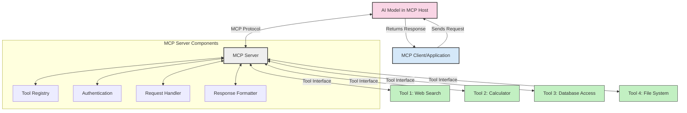
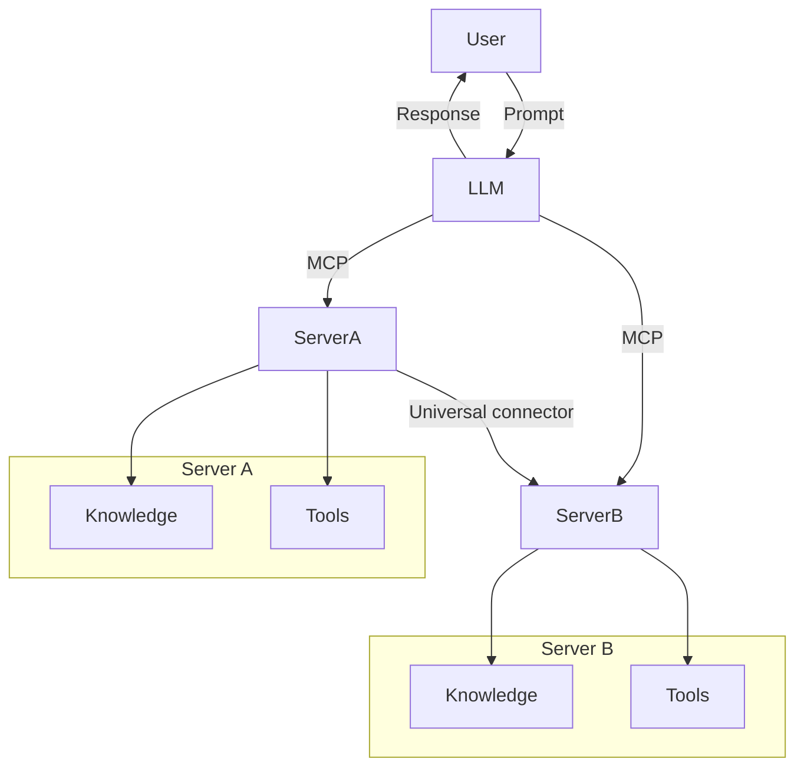
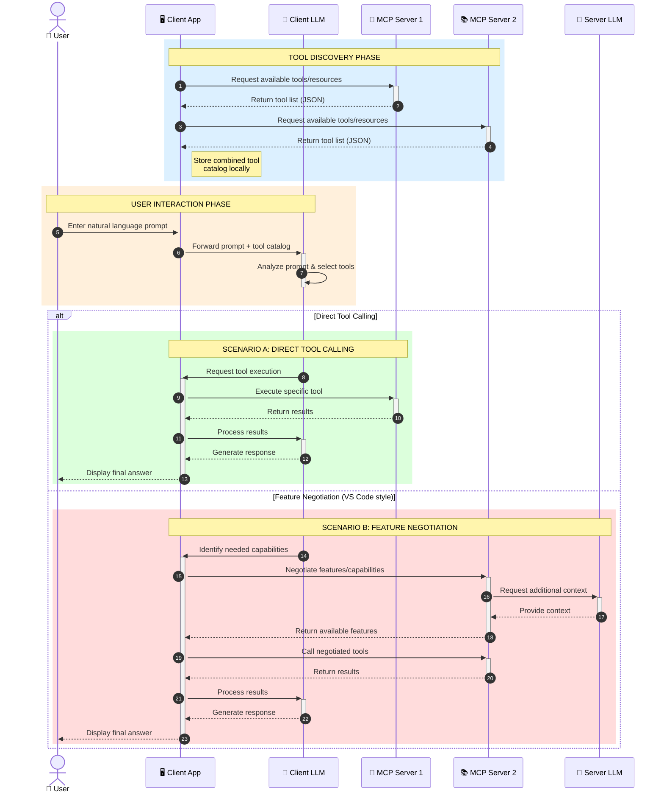

<!--
CO_OP_TRANSLATOR_METADATA:
{
  "original_hash": "25a94c681cf43612ff394d8cf78a74de",
  "translation_date": "2025-05-27T16:03:57+00:00",
  "source_file": "00-Introduction/README.md",
  "language_code": "tr"
}
-->
# Model Context Protocol (MCP) Tanıtımı: Ölçeklenebilir Yapay Zeka Uygulamaları İçin Neden Önemli?

Üretken yapay zeka uygulamaları, kullanıcıların doğal dil komutlarıyla uygulamayla etkileşim kurmasını sağladığı için büyük bir ilerlemedir. Ancak, bu tür uygulamalara daha fazla zaman ve kaynak yatırıldıkça, işlevsellikleri ve kaynakları kolayca entegre edebilmek, uygulamanızın birden fazla modeli destekleyebilmesi ve farklı model karmaşıklıklarını yönetebilmesi önem kazanır. Kısacası, üretken yapay zeka uygulamaları başlangıçta kolay olsa da, büyüyüp karmaşıklaştıkça bir mimari tanımlamaya başlamanız gerekir ve uygulamalarınızın tutarlı bir şekilde inşa edilmesini sağlamak için muhtemelen bir standarda güvenmeniz gerekir. İşte MCP, işleri düzenlemek ve bir standart sunmak için devreye girer.

---

## **🔍 Model Context Protocol (MCP) Nedir?**

**Model Context Protocol (MCP)**, Büyük Dil Modellerinin (LLM'ler) harici araçlar, API’ler ve veri kaynaklarıyla sorunsuz bir şekilde etkileşim kurmasını sağlayan **açık ve standartlaştırılmış bir arayüzdür**. Eğitim verilerinin ötesinde yapay zeka model fonksiyonelliğini artırmak için tutarlı bir mimari sunar; böylece daha akıllı, ölçeklenebilir ve yanıt verebilir yapay zeka sistemleri mümkün olur.

---

## **🎯 Yapay Zekada Standardizasyon Neden Önemlidir**

Üretken yapay zeka uygulamaları karmaşıklaştıkça, **ölçeklenebilirlik, genişletilebilirlik** ve **bakım kolaylığı** sağlayan standartların benimsenmesi kritik hale gelir. MCP, bu ihtiyaçları şu yollarla karşılar:

- Model ve araç entegrasyonlarını birleştirir
- Kırılgan, tek seferlik özel çözümleri azaltır
- Birden fazla modelin aynı ekosistemde birlikte var olmasına izin verir

---

## **📚 Öğrenme Hedefleri**

Bu makalenin sonunda şunları yapabileceksiniz:

- **Model Context Protocol (MCP)**’yi ve kullanım alanlarını tanımlamak
- MCP’nin model-araç iletişimini nasıl standartlaştırdığını anlamak
- MCP mimarisinin temel bileşenlerini belirlemek
- MCP’nin kurumsal ve geliştirme bağlamlarındaki gerçek dünya uygulamalarını keşfetmek

---

## **💡 Model Context Protocol (MCP) Neden Bir Oyun Değiştirici?**

### **🔗 MCP, Yapay Zeka Etkileşimlerindeki Parçalanmayı Çözüyor**

MCP’den önce, modelleri araçlarla entegre etmek için:

- Her araç-model çifti için özel kod yazılması gerekiyordu
- Her satıcı için standart dışı API’ler kullanılıyordu
- Güncellemeler sık sık kesintilere yol açıyordu
- Daha fazla araç eklendikçe ölçeklenebilirlik kötüleşiyordu

### **✅ MCP Standardizasyonunun Faydaları**

| **Fayda**                | **Açıklama**                                                                   |
|--------------------------|--------------------------------------------------------------------------------|
| Birlikte Çalışabilirlik  | LLM’ler farklı satıcıların araçlarıyla sorunsuz çalışır                        |
| Tutarlılık               | Platformlar ve araçlar arasında uniform davranış                               |
| Yeniden Kullanılabilirlik| Bir kez oluşturulan araçlar projeler ve sistemler arasında kullanılabilir      |
| Hızlandırılmış Geliştirme| Standart, tak-çalıştır arayüzler sayesinde geliştirme süresini kısaltır        |

---

## **🧱 Yüksek Seviyede MCP Mimarisi Genel Bakış**

MCP, **istemci-sunucu modeli** ile çalışır; burada:

- **MCP Host’ları** yapay zeka modellerini çalıştırır
- **MCP Client’ları** istek başlatır
- **MCP Server’ları** bağlam, araçlar ve yetenekleri sağlar

### **Ana Bileşenler:**

- **Kaynaklar** – Modeller için statik veya dinamik veriler  
- **Komutlar (Prompts)** – Yönlendirilmiş üretim için önceden tanımlı iş akışları  
- **Araçlar** – Arama, hesaplama gibi yürütülebilir fonksiyonlar  
- **Örnekleme (Sampling)** – Yinelemeli etkileşimlerle ajan davranışı

---

## MCP Sunucuları Nasıl Çalışır

MCP sunucuları şu şekilde çalışır:

- **İstek Akışı**:  
    1. MCP Client, MCP Host’ta çalışan Yapay Zeka Modeline bir istek gönderir.  
    2. Yapay Zeka Modeli, harici araçlara veya verilere ihtiyaç duyduğunu tespit eder.  
    3. Model, standartlaştırılmış protokolü kullanarak MCP Server ile iletişim kurar.

- **MCP Sunucu Fonksiyonları**:  
    - Araç Kataloğu: Mevcut araçları ve yeteneklerini listeler.  
    - Kimlik Doğrulama: Araç erişim izinlerini doğrular.  
    - İstek İşleyici: Modelden gelen araç isteklerini işler.  
    - Yanıt Biçimlendirici: Araç çıktısını modelin anlayacağı formata dönüştürür.

- **Araç Çalıştırma**:  
    - Sunucu istekleri uygun harici araçlara yönlendirir  
    - Araçlar uzmanlaşmış fonksiyonlarını (arama, hesaplama, veri tabanı sorguları vb.) gerçekleştirir  
    - Sonuçlar tutarlı bir formatta modele iletilir.

- **Yanıt Tamamlama**:  
    - Yapay zeka modeli, araç çıktısını yanıtına dahil eder.  
    - Nihai yanıt istemci uygulamasına gönderilir.

## 👨‍💻 MCP Sunucusu Nasıl Oluşturulur (Örneklerle)

MCP sunucuları, LLM yeteneklerini veri ve fonksiyonlarla genişletmenize olanak tanır.

Denemeye hazır mısınız? İşte farklı dillerde basit bir MCP sunucusu oluşturma örnekleri:

- **Python Örneği**: https://github.com/modelcontextprotocol/python-sdk

- **TypeScript Örneği**: https://github.com/modelcontextprotocol/typescript-sdk

- **Java Örneği**: https://github.com/modelcontextprotocol/java-sdk

- **C#/.NET Örneği**: https://github.com/modelcontextprotocol/csharp-sdk

## 🌍 MCP’nin Gerçek Dünya Kullanım Alanları

MCP, yapay zeka yeteneklerini genişleterek çok çeşitli uygulamalara imkan tanır:

| **Uygulama**                 | **Açıklama**                                                                 |
|-----------------------------|-------------------------------------------------------------------------------|
| Kurumsal Veri Entegrasyonu   | LLM’leri veri tabanları, CRM’ler veya dahili araçlara bağlama                 |
| Ajanik Yapay Zeka Sistemleri| Araç erişimi ve karar alma iş akışlarına sahip otonom ajanlar oluşturma       |
| Çok Modlu Uygulamalar        | Metin, görüntü ve ses araçlarını tek bir birleşik yapay zeka uygulamasında birleştirme |
| Gerçek Zamanlı Veri Entegrasyonu| Yapay zeka etkileşimlerine canlı veri getirerek daha doğru, güncel çıktılar sağlama |

### 🧠 MCP = Yapay Zeka Etkileşimleri İçin Evrensel Standart

Model Context Protocol (MCP), USB-C’nin cihazlar için fiziksel bağlantıları standartlaştırması gibi yapay zeka etkileşimleri için evrensel bir standart görevi görür. Yapay zeka dünyasında MCP, modellerin (istemciler) harici araçlar ve veri sağlayıcıları (sunucular) ile sorunsuz entegrasyon sağlamasına olanak tanıyan tutarlı bir arayüz sunar. Bu, her API veya veri kaynağı için farklı, özel protokollere ihtiyaç duyulmasını ortadan kaldırır.

MCP altında, MCP uyumlu bir araç (MCP sunucusu olarak adlandırılır) birleşik bir standart izler. Bu sunucular sundukları araçları veya eylemleri listeleyebilir ve bir yapay zeka ajanı tarafından istendiğinde bu eylemleri gerçekleştirebilir. MCP’yi destekleyen yapay zeka ajan platformları, sunuculardaki mevcut araçları keşfedebilir ve bu standart protokol aracılığıyla çağırabilir.

### 💡 Bilgiye Erişimi Kolaylaştırır

Araçlar sunmanın ötesinde, MCP bilgiye erişimi de kolaylaştırır. Uygulamaların büyük dil modellerine (LLM’lere) bağlam sağlamasını, yani çeşitli veri kaynaklarına bağlanmasını mümkün kılar. Örneğin, bir MCP sunucusu bir şirketin belge deposunu temsil edebilir ve ajanların ihtiyaç duyduklarında ilgili bilgileri almasını sağlar. Başka bir sunucu ise e-posta gönderme veya kayıt güncelleme gibi spesifik işlemleri yönetebilir. Ajan açısından bunlar sadece kullanabileceği araçlardır—bazı araçlar veri (bilgi bağlamı) döndürürken, diğerleri işlem yapar. MCP her ikisini de verimli şekilde yönetir.

Bir ajan MCP sunucusuna bağlandığında, sunucunun mevcut yeteneklerini ve erişilebilir verileri standart bir formatla otomatik olarak öğrenir. Bu standardizasyon, araçların dinamik olarak kullanılabilir olmasını sağlar. Örneğin, ajanın sistemine yeni bir MCP sunucusu eklemek, fonksiyonlarının hemen kullanılabilir olmasını sağlar ve ajanın talimatlarında ek özelleştirme gerektirmez.

Bu kolaylaştırılmış entegrasyon, sunucuların hem araçları hem de bilgiyi sağladığı ve sistemler arasında sorunsuz iş birliği sağladığı mermaid diyagramındaki akışla uyumludur.

### 👉 Örnek: Ölçeklenebilir Ajan Çözümü

### 🔄 İstemci Tarafı LLM Entegrasyonuyla Gelişmiş MCP Senaryoları

Temel MCP mimarisinin ötesinde, hem istemci hem sunucu tarafında LLM’lerin bulunduğu ve daha karmaşık etkileşimlerin mümkün olduğu gelişmiş senaryolar vardır:

## 🔐 MCP’nin Pratik Faydaları

MCP kullanmanın pratik faydaları şunlardır:

- **Güncellik**: Modeller, eğitim verilerinin ötesinde güncel bilgilere erişebilir  
- **Yetenek Genişletme**: Modeller, eğitilmedikleri görevler için uzman araçlardan faydalanabilir  
- **Halüsinasyonların Azalması**: Harici veri kaynakları gerçeklere dayalı bilgi sağlar  
- **Gizlilik**: Hassas veriler, istemlerde gömülü olmak yerine güvenli ortamlarda kalabilir

## 📌 Önemli Noktalar

MCP kullanımıyla ilgili önemli noktalar:

- **MCP**, yapay zeka modellerinin araçlar ve verilerle nasıl etkileşime girdiğini standartlaştırır  
- **Genişletilebilirlik, tutarlılık ve birlikte çalışabilirliği** teşvik eder  
- MCP, **geliştirme süresini azaltır, güvenilirliği artırır ve model yeteneklerini genişletir**  
- İstemci-sunucu mimarisi, **esnek ve genişletilebilir yapay zeka uygulamalarına olanak tanır**

## 🧠 Alıştırma

İlgilendiğiniz bir yapay zeka uygulaması hakkında düşünün.

- Hangi **harici araçlar veya veriler** yeteneklerini artırabilir?  
- MCP entegrasyonunu nasıl **daha basit ve güvenilir** hale getirebilir?

## Ek Kaynaklar

- [MCP GitHub Deposu](https://github.com/modelcontextprotocol)

## Sonraki Adım

Sonraki: [Bölüm 1: Temel Kavramlar](/01-CoreConcepts/README.md)

**Feragatname**:  
Bu belge, AI çeviri hizmeti [Co-op Translator](https://github.com/Azure/co-op-translator) kullanılarak çevrilmiştir. Doğruluk için çaba gösterilse de, otomatik çevirilerin hata veya yanlışlık içerebileceğini lütfen unutmayınız. Orijinal belge, kendi dilinde yetkili kaynak olarak kabul edilmelidir. Kritik bilgiler için profesyonel insan çevirisi önerilir. Bu çevirinin kullanımı sonucu oluşabilecek herhangi bir yanlış anlama veya yorum hatasından sorumlu değiliz.