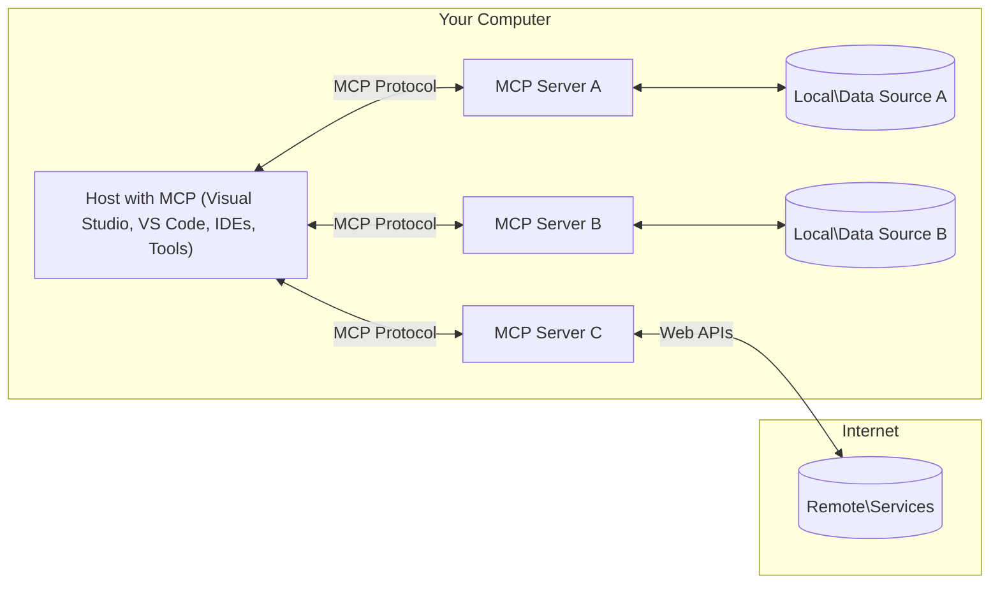

<!--
CO_OP_TRANSLATOR_METADATA:
{
  "original_hash": "88b863a69b4f18b15e82da358ffd3489",
  "translation_date": "2025-08-21T13:06:49+00:00",
  "source_file": "01-CoreConcepts/README.md",
  "language_code": "tr"
}
-->
# MCP Temel Kavramlar: Yapay Zeka Entegrasyonu için Model Context Protocol'ü Anlamak

[](https://youtu.be/earDzWGtE84)

_(Bu dersin videosunu izlemek için yukarıdaki görsele tıklayın)_

[Model Context Protocol (MCP)](https://github.com/modelcontextprotocol), Büyük Dil Modelleri (LLM'ler) ile harici araçlar, uygulamalar ve veri kaynakları arasındaki iletişimi optimize eden güçlü ve standartlaştırılmış bir çerçevedir. 
Bu rehber, MCP'nin temel kavramlarını size adım adım anlatacaktır. İstemci-sunucu mimarisi, temel bileşenler, iletişim mekanikleri ve uygulama için en iyi yöntemler hakkında bilgi edineceksiniz.

- **Açık Kullanıcı Onayı**: Tüm veri erişimi ve işlemler, gerçekleştirilmeden önce açık bir kullanıcı onayı gerektirir. Kullanıcılar, hangi verilere erişileceğini ve hangi işlemlerin yapılacağını net bir şekilde anlamalı ve izinler üzerinde ayrıntılı bir kontrol sahibi olmalıdır.

- **Veri Gizliliği Koruması**: Kullanıcı verileri yalnızca açık onay ile paylaşılır ve tüm etkileşim süreci boyunca güçlü erişim kontrolleriyle korunmalıdır. Uygulamalar, yetkisiz veri iletimini önlemeli ve sıkı gizlilik sınırlarını korumalıdır.

- **Araç Çalıştırma Güvenliği**: Her araç çağrısı, aracın işlevselliği, parametreleri ve potansiyel etkisi hakkında net bir anlayışla açık kullanıcı onayı gerektirir. İstenmeyen, güvensiz veya kötü niyetli araç çalıştırmalarını önlemek için sağlam güvenlik sınırları oluşturulmalıdır.

- **Taşıma Katmanı Güvenliği**: Tüm iletişim kanalları uygun şifreleme ve kimlik doğrulama mekanizmalarını kullanmalıdır. Uzaktan bağlantılar, güvenli taşıma protokolleri ve doğru kimlik bilgisi yönetimi uygulamalıdır.

#### Uygulama Yönergeleri:

- **İzin Yönetimi**: Kullanıcıların hangi sunuculara, araçlara ve kaynaklara erişebileceğini kontrol etmelerini sağlayan ayrıntılı izin sistemleri uygulayın.
- **Kimlik Doğrulama ve Yetkilendirme**: Güvenli kimlik doğrulama yöntemleri (OAuth, API anahtarları) kullanın ve doğru token yönetimi ve süresi dolma mekanizmalarını uygulayın.
- **Girdi Doğrulama**: Tüm parametreleri ve veri girdilerini tanımlanmış şemalara göre doğrulayarak enjeksiyon saldırılarını önleyin.
- **Denetim Kaydı**: Güvenlik izleme ve uyumluluk için tüm işlemlerin kapsamlı kayıtlarını tutun.

## Genel Bakış

Bu ders, Model Context Protocol (MCP) ekosistemini oluşturan temel mimari ve bileşenleri incelemektedir. MCP etkileşimlerini mümkün kılan istemci-sunucu mimarisi, anahtar bileşenler ve iletişim mekanizmaları hakkında bilgi edineceksiniz.

## Temel Öğrenme Hedefleri

Bu dersin sonunda:

- MCP istemci-sunucu mimarisini anlayacaksınız.
- Host'ların, İstemcilerin ve Sunucuların rollerini ve sorumluluklarını tanımlayabileceksiniz.
- MCP'yi esnek bir entegrasyon katmanı yapan temel özellikleri analiz edebileceksiniz.
- MCP ekosisteminde bilginin nasıl aktığını öğreneceksiniz.
- .NET, Java, Python ve JavaScript'te kod örnekleriyle pratik bilgiler edineceksiniz.

## MCP Mimarisi: Daha Derinlemesine Bir Bakış

MCP ekosistemi, istemci-sunucu modeline dayanır. Bu modüler yapı, yapay zeka uygulamalarının araçlar, veritabanları, API'ler ve bağlamsal kaynaklarla verimli bir şekilde etkileşim kurmasını sağlar. Bu mimariyi temel bileşenlerine ayıralım.

MCP, temelinde bir istemci-sunucu mimarisini takip eder ve bir ana uygulama birden fazla sunucuya bağlanabilir:



- **MCP Host'lar**: VSCode, Claude Desktop, IDE'ler veya MCP aracılığıyla verilere erişmek isteyen yapay zeka araçları gibi programlar
- **MCP İstemciler**: Sunucularla birebir bağlantıları sürdüren protokol istemcileri
- **MCP Sunucular**: Standartlaştırılmış Model Context Protocol aracılığıyla belirli yetenekleri ortaya çıkaran hafif programlar
- **Yerel Veri Kaynakları**: MCP sunucularının güvenli bir şekilde erişebileceği bilgisayarınızdaki dosyalar, veritabanları ve hizmetler
- **Uzak Hizmetler**: MCP sunucularının API'ler aracılığıyla bağlanabileceği internet üzerinden erişilebilir harici sistemler

MCP Protokolü, tarih tabanlı sürümleme (YYYY-MM-DD formatı) kullanan gelişen bir standarttır. Mevcut protokol sürümü **2025-06-18**'dir. [Protokol spesifikasyonundaki](https://modelcontextprotocol.io/specification/2025-06-18/) en son güncellemeleri görebilirsiniz.

### 1. Host'lar

Model Context Protocol'de (MCP), **Host'lar**, kullanıcıların protokolle etkileşim kurduğu birincil arayüz olarak hizmet veren yapay zeka uygulamalarıdır. Host'lar, her sunucu bağlantısı için özel MCP istemcileri oluşturarak birden fazla MCP sunucusuna bağlantıları koordine eder ve yönetir. Host örnekleri şunları içerir:

- **Yapay Zeka Uygulamaları**: Claude Desktop, Visual Studio Code, Claude Code
- **Geliştirme Ortamları**: MCP entegrasyonuna sahip IDE'ler ve kod editörleri  
- **Özel Uygulamalar**: Amaca yönelik yapay zeka ajanları ve araçları

**Host'lar**, yapay zeka modeli etkileşimlerini koordine eden uygulamalardır. Şunları yaparlar:

- **Yapay Zeka Modellerini Yönetin**: Yanıtlar oluşturmak ve yapay zeka iş akışlarını koordine etmek için LLM'leri çalıştırır veya onlarla etkileşim kurar.
- **İstemci Bağlantılarını Yönetir**: Her MCP sunucu bağlantısı için bir MCP istemcisi oluşturur ve sürdürür.
- **Kullanıcı Arayüzünü Kontrol Eder**: Konuşma akışını, kullanıcı etkileşimlerini ve yanıt sunumunu yönetir.
- **Güvenliği Sağlar**: İzinleri, güvenlik kısıtlamalarını ve kimlik doğrulamayı kontrol eder.
- **Kullanıcı Onayını Yönetir**: Veri paylaşımı ve araç çalıştırma için kullanıcı onayını yönetir.

### 2. İstemciler

**İstemciler**, Host'lar ve MCP sunucuları arasında birebir bağlantıları sürdüren temel bileşenlerdir. Her MCP istemcisi, belirli bir MCP sunucusuna bağlanmak için Host tarafından oluşturulur ve düzenli ve güvenli iletişim kanalları sağlar. Birden fazla istemci, Host'ların aynı anda birden fazla sunucuya bağlanmasını mümkün kılar.

**İstemciler**, host uygulaması içindeki bağlayıcı bileşenlerdir. Şunları yaparlar:

- **Protokol İletişimi**: Sunuculara JSON-RPC 2.0 istekleri gönderir ve istemleri iletir.
- **Yetenek Müzakeresi**: Başlatma sırasında sunucularla desteklenen özellikleri ve protokol sürümlerini müzakere eder.
- **Araç Çalıştırma**: Modellerden gelen araç çalıştırma isteklerini yönetir ve yanıtları işler.
- **Gerçek Zamanlı Güncellemeler**: Sunuculardan gelen bildirimleri ve gerçek zamanlı güncellemeleri işler.
- **Yanıt İşleme**: Sunucu yanıtlarını kullanıcıya gösterim için işler ve biçimlendirir.

### 3. Sunucular

**Sunucular**, MCP istemcilerine bağlam, araçlar ve yetenekler sağlayan programlardır. Yerel olarak (Host ile aynı makinede) veya uzaktan (harici platformlarda) çalışabilirler ve istemci isteklerini işlemekten ve yapılandırılmış yanıtlar sağlamaktan sorumludurlar. Sunucular, standartlaştırılmış Model Context Protocol aracılığıyla belirli işlevsellikleri ortaya çıkarır.

**Sunucular**, bağlam ve yetenek sağlayan hizmetlerdir. Şunları yaparlar:

- **Özellik Kaydı**: Kullanılabilir ilkel kaynakları (kaynaklar, istemler, araçlar) istemcilere kaydeder ve sunar.
- **İstek İşleme**: İstemcilerden gelen araç çağrılarını, kaynak isteklerini ve istem isteklerini alır ve yürütür.
- **Bağlam Sağlama**: Model yanıtlarını geliştirmek için bağlamsal bilgi ve veri sağlar.
- **Durum Yönetimi**: Oturum durumunu korur ve gerektiğinde durumsal etkileşimleri yönetir.
- **Gerçek Zamanlı Bildirimler**: Bağlı istemcilere yetenek değişiklikleri ve güncellemeler hakkında bildirimler gönderir.

Sunucular, model yeteneklerini özel işlevselliklerle genişletmek için herkes tarafından geliştirilebilir ve hem yerel hem de uzak dağıtım senaryolarını destekler.

### 4. Sunucu İlkel Kaynakları

Model Context Protocol'deki (MCP) sunucular, istemciler, host'lar ve dil modelleri arasındaki zengin etkileşimler için temel yapı taşlarını tanımlayan üç ana **ilkel kaynak** sağlar. Bu ilkel kaynaklar, protokol aracılığıyla mevcut bağlamsal bilgi ve eylem türlerini belirtir.

MCP sunucuları, aşağıdaki üç ana ilkel kaynağın herhangi bir kombinasyonunu ortaya çıkarabilir:

#### Kaynaklar

**Kaynaklar**, yapay zeka uygulamalarına bağlamsal bilgi sağlayan veri kaynaklarıdır. Modelin anlayışını ve karar verme yeteneğini geliştirebilecek statik veya dinamik içeriği temsil eder:

- **Bağlamsal Veri**: Yapay zeka modeli tüketimi için yapılandırılmış bilgi ve bağlam
- **Bilgi Tabanları**: Belge depoları, makaleler, kılavuzlar ve araştırma makaleleri
- **Yerel Veri Kaynakları**: Dosyalar, veritabanları ve yerel sistem bilgileri  
- **Harici Veri**: API yanıtları, web hizmetleri ve uzak sistem verileri
- **Dinamik İçerik**: Harici koşullara göre güncellenen gerçek zamanlı veriler

Kaynaklar, URI'ler ile tanımlanır ve `resources/list` yöntemiyle keşfedilir, `resources/read` yöntemiyle alınır:

```text
file://documents/project-spec.md
database://production/users/schema
api://weather/current
```

#### İstemler

**İstemler**, dil modelleriyle etkileşimleri yapılandırmaya yardımcı olan yeniden kullanılabilir şablonlardır. Standartlaştırılmış etkileşim kalıpları ve şablonlu iş akışları sağlarlar:

- **Şablon Tabanlı Etkileşimler**: Önceden yapılandırılmış mesajlar ve konuşma başlatıcılar
- **İş Akışı Şablonları**: Yaygın görevler ve etkileşimler için standartlaştırılmış diziler
- **Few-shot Örnekler**: Model talimatı için örnek tabanlı şablonlar
- **Sistem İstemleri**: Model davranışını ve bağlamını tanımlayan temel istemler
- **Dinamik Şablonlar**: Belirli bağlamlara uyum sağlayan parametreli istemler

İstemler, değişken ikamesini destekler ve `prompts/list` yöntemiyle keşfedilir, `prompts/get` yöntemiyle alınır:

```markdown
Generate a {{task_type}} for {{product}} targeting {{audience}} with the following requirements: {{requirements}}
```

#### Araçlar

**Araçlar**, yapay zeka modellerinin belirli eylemleri gerçekleştirmek için çağırabileceği çalıştırılabilir işlevlerdir. MCP ekosisteminin "fiilleri"ni temsil eder ve modellerin harici sistemlerle etkileşim kurmasını sağlar:

- **Çalıştırılabilir İşlevler**: Belirli parametrelerle modellerin çağırabileceği ayrı işlemler
- **Harici Sistem Entegrasyonu**: API çağrıları, veritabanı sorguları, dosya işlemleri, hesaplamalar
- **Benzersiz Kimlik**: Her aracın kendine özgü bir adı, açıklaması ve parametre şeması vardır
- **Yapılandırılmış G/Ç**: Araçlar doğrulanmış parametreleri kabul eder ve yapılandırılmış, türlendirilmiş yanıtlar döndürür
- **Eylem Yetenekleri**: Modellerin gerçek dünya eylemleri gerçekleştirmesini ve canlı veriler almasını sağlar

Araçlar, parametre doğrulama için JSON Şeması ile tanımlanır, `tools/list` yöntemiyle keşfedilir ve `tools/call` yöntemiyle çalıştırılır:

```typescript
server.tool(
  "search_products", 
  {
    query: z.string().describe("Search query for products"),
    category: z.string().optional().describe("Product category filter"),
    max_results: z.number().default(10).describe("Maximum results to return")
  }, 
  async (params) => {
    // Execute search and return structured results
    return await productService.search(params);
  }
);
```

## İstemci İlkel Kaynakları

Model Context Protocol'de (MCP), **istemciler**, sunucuların host uygulamasından ek yetenekler talep etmesine olanak tanıyan ilkel kaynaklar ortaya çıkarabilir. Bu istemci tarafı ilkel kaynaklar, sunucuların yapay zeka modeli yeteneklerine ve kullanıcı etkileşimlerine erişmesini sağlayarak daha zengin ve daha etkileşimli sunucu uygulamalarına olanak tanır.

### Örnekleme

**Örnekleme**, sunucuların istemcinin yapay zeka uygulamasından dil modeli tamamlama istekleri talep etmesine olanak tanır. Bu ilkel kaynak, sunucuların kendi model bağımlılıklarını gömmeksizin LLM yeteneklerine erişmesini sağlar:

- **Modelden Bağımsız Erişim**: Sunucular, LLM SDK'larını içermeden veya model erişimini yönetmeden tamamlama isteğinde bulunabilir.
- **Sunucu Başlatmalı Yapay Zeka**: Sunucuların istemcinin yapay zeka modeli kullanarak içerik oluşturmasını sağlar.
- **Yinelenen LLM Etkileşimleri**: Sunucuların işleme için yapay zeka yardımına ihtiyaç duyduğu karmaşık senaryoları destekler.
- **Dinamik İçerik Üretimi**: Sunucuların host'un modeli kullanarak bağlamsal yanıtlar oluşturmasına olanak tanır.

Örnekleme, sunucuların istemcilere tamamlama istekleri gönderdiği `sampling/complete` yöntemiyle başlatılır.

### Bilgi Toplama  

**Bilgi Toplama**, sunucuların istemci arayüzü aracılığıyla kullanıcılardan ek bilgi veya onay talep etmesine olanak tanır:

- **Kullanıcı Girdi İstekleri**: Sunucular, araç çalıştırma için gerektiğinde ek bilgi talep edebilir.
- **Onay Diyalogları**: Hassas veya etkili işlemler için kullanıcı onayı talep eder.
- **Etkileşimli İş Akışları**: Sunucuların adım adım kullanıcı etkileşimleri oluşturmasına olanak tanır.
- **Dinamik Parametre Toplama**: Araç çalıştırma sırasında eksik veya isteğe bağlı parametreleri toplar.

Bilgi toplama istekleri, istemcinin arayüzü aracılığıyla kullanıcı girdisi toplamak için `elicitation/request` yöntemi kullanılarak yapılır.

### Günlük Kaydı

**Günlük Kaydı**, sunucuların istemcilere yapılandırılmış günlük mesajları göndererek hata ayıklama, izleme ve operasyonel görünürlük sağlamasına olanak tanır:

- **Hata Ayıklama Desteği**: Sunucuların hata ayıklama için ayrıntılı yürütme günlükleri sağlamasına olanak tanır.
- **Operasyonel İzleme**: İstemcilere durum güncellemeleri ve performans metrikleri gönderir.
- **Hata Raporlama**: Ayrıntılı hata bağlamı ve tanılama bilgileri sağlar.
- **Denetim İzleri**: Sunucu işlemlerinin ve kararlarının kapsamlı günlüklerini oluşturur.

Günlük mesajları, sunucu işlemlerine şeffaflık sağlamak ve hata ayıklamayı kolaylaştırmak için istemcilere gönderilir.

## MCP'de Bilgi Akışı

Model Context Protocol (MCP), host'lar, istemciler, sunucular ve modeller arasında yapılandırılmış bir bilgi akışı tanımlar. Bu akışı anlamak, kullanıcı isteklerinin nasıl işlendiğini ve harici araçlar ile verilerin model yanıtlarına nasıl entegre edildiğini netleştirir.

- **Host Bağlantıyı Başlatır**  
  Host uygulaması (örneğin bir IDE veya sohbet arayüzü), genellikle STDIO, WebSocket veya başka bir desteklenen taşıma yöntemiyle bir MCP sunucusuna bağlantı kurar.

- **Yetenek Müzakeresi**  
  İstemci (host içinde gömülü) ve sunucu, desteklenen özellikler, araçlar, kaynaklar ve protokol sürümleri hakkında bilgi alışverişinde bulunur. Bu, her iki tarafın da oturum için hangi yeteneklerin mevcut olduğunu anlamasını sağlar.

- **Kullanıcı İsteği**  
  Kullanıcı, host ile etkileşim kurar (örneğin, bir istem veya komut girer). Host, bu girdiyi toplar ve işleme için istemciye iletir.

- **Kaynak veya Araç Kullanımı**  
  - İstemci, modelin anlayışını zenginleştirmek için sunucudan ek bağlam veya kaynaklar (örneğin dosyalar, veritabanı girdileri veya bilgi tabanı makaleleri) talep edebilir.
  - Model, bir aracın gerekli olduğunu belirlerse
- **JSON-RPC 2.0 Protokolü**: Tüm iletişim, yöntem çağrıları, yanıtlar ve bildirimler için standartlaştırılmış JSON-RPC 2.0 mesaj formatını kullanır  
- **Yaşam Döngüsü Yönetimi**: İstemciler ve sunucular arasında bağlantı başlatma, yetenek müzakeresi ve oturum sonlandırmayı yönetir  
- **Sunucu Primitifleri**: Sunucuların araçlar, kaynaklar ve istemler aracılığıyla temel işlevsellik sağlamasına olanak tanır  
- **İstemci Primitifleri**: Sunucuların LLM'lerden örnekleme talep etmesine, kullanıcı girdisi almasına ve günlük mesajları göndermesine olanak tanır  
- **Gerçek Zamanlı Bildirimler**: Dinamik güncellemeler için anlık bildirimleri destekler, anket yapmaya gerek kalmadan  

#### Temel Özellikler:

- **Protokol Sürüm Müzakeresi**: Uyumluluğu sağlamak için tarih tabanlı sürümleme (YYYY-MM-DD) kullanır  
- **Yetenek Keşfi**: İstemciler ve sunucular, başlatma sırasında desteklenen özellik bilgilerini paylaşır  
- **Durumlu Oturumlar**: Bağlantı durumunu birden fazla etkileşim boyunca koruyarak bağlam sürekliliği sağlar  

### Taşıma Katmanı

**Taşıma Katmanı**, MCP katılımcıları arasında iletişim kanallarını, mesaj çerçevelemeyi ve kimlik doğrulamayı yönetir:

#### Desteklenen Taşıma Mekanizmaları:

1. **STDIO Taşıma**:
   - Doğrudan işlem iletişimi için standart giriş/çıkış akışlarını kullanır  
   - Ağ yükü olmadan aynı makinedeki yerel işlemler için idealdir  
   - Yerel MCP sunucu uygulamaları için yaygın olarak kullanılır  

2. **Akışlı HTTP Taşıma**:
   - İstemci-sunucu mesajları için HTTP POST kullanır  
   - Sunucu-istemci akışı için isteğe bağlı Sunucu Gönderimli Olaylar (SSE)  
   - Ağlar arasında uzak sunucu iletişimini sağlar  
   - Standart HTTP kimlik doğrulamasını destekler (taşıyıcı jetonlar, API anahtarları, özel başlıklar)  
   - MCP, güvenli jeton tabanlı kimlik doğrulama için OAuth'u önerir  

#### Taşıma Soyutlaması:

Taşıma katmanı, veri katmanından iletişim ayrıntılarını soyutlar ve tüm taşıma mekanizmalarında aynı JSON-RPC 2.0 mesaj formatını sağlar. Bu soyutlama, uygulamaların yerel ve uzak sunucular arasında sorunsuz bir şekilde geçiş yapmasına olanak tanır.

### Güvenlik Hususları

MCP uygulamaları, tüm protokol işlemleri boyunca güvenli, güvenilir ve emniyetli etkileşimler sağlamak için birkaç kritik güvenlik ilkesine uymalıdır:

- **Kullanıcı Onayı ve Kontrolü**: Herhangi bir veri erişimi veya işlem gerçekleştirilmeden önce kullanıcılar açık onay vermelidir. Paylaşılan veriler ve yetkilendirilen işlemler üzerinde net bir kontrole sahip olmalı, etkinlikleri gözden geçirmek ve onaylamak için sezgisel kullanıcı arayüzleriyle desteklenmelidir.  

- **Veri Gizliliği**: Kullanıcı verileri yalnızca açık onayla ifşa edilmeli ve uygun erişim kontrolleriyle korunmalıdır. MCP uygulamaları, yetkisiz veri iletimine karşı koruma sağlamalı ve tüm etkileşimler boyunca gizliliği sürdürmelidir.  

- **Araç Güvenliği**: Herhangi bir aracı çalıştırmadan önce açık kullanıcı onayı gereklidir. Kullanıcılar, her aracın işlevselliğini net bir şekilde anlamalı ve istenmeyen veya güvensiz araç çalıştırmalarını önlemek için sağlam güvenlik sınırları uygulanmalıdır.  

Bu güvenlik ilkelerine uyarak MCP, kullanıcı güvenini, gizliliğini ve güvenliğini tüm protokol etkileşimlerinde korurken güçlü yapay zeka entegrasyonlarını mümkün kılar.

## Kod Örnekleri: Temel Bileşenler

Aşağıda, temel MCP sunucu bileşenlerini ve araçlarını nasıl uygulayacağınızı gösteren birkaç popüler programlama dilinde kod örnekleri bulunmaktadır.

### .NET Örneği: Araçlarla Basit Bir MCP Sunucusu Oluşturma

Aşağıda, özel araçlarla basit bir MCP sunucusunun nasıl uygulanacağını gösteren pratik bir .NET kod örneği bulunmaktadır. Bu örnek, araçları tanımlama ve kaydetme, istekleri işleme ve Model Context Protocol kullanarak sunucuyu bağlama işlemlerini göstermektedir.

```csharp
using System;
using System.Threading.Tasks;
using ModelContextProtocol.Server;
using ModelContextProtocol.Server.Transport;
using ModelContextProtocol.Server.Tools;

public class WeatherServer
{
    public static async Task Main(string[] args)
    {
        // Create an MCP server
        var server = new McpServer(
            name: "Weather MCP Server",
            version: "1.0.0"
        );
        
        // Register our custom weather tool
        server.AddTool<string, WeatherData>("weatherTool", 
            description: "Gets current weather for a location",
            execute: async (location) => {
                // Call weather API (simplified)
                var weatherData = await GetWeatherDataAsync(location);
                return weatherData;
            });
        
        // Connect the server using stdio transport
        var transport = new StdioServerTransport();
        await server.ConnectAsync(transport);
        
        Console.WriteLine("Weather MCP Server started");
        
        // Keep the server running until process is terminated
        await Task.Delay(-1);
    }
    
    private static async Task<WeatherData> GetWeatherDataAsync(string location)
    {
        // This would normally call a weather API
        // Simplified for demonstration
        await Task.Delay(100); // Simulate API call
        return new WeatherData { 
            Temperature = 72.5,
            Conditions = "Sunny",
            Location = location
        };
    }
}

public class WeatherData
{
    public double Temperature { get; set; }
    public string Conditions { get; set; }
    public string Location { get; set; }
}
```

### Java Örneği: MCP Sunucu Bileşenleri

Bu örnek, yukarıdaki .NET örneğinde olduğu gibi aynı MCP sunucusunu ve araç kaydını Java'da uygulamayı göstermektedir.

```java
import io.modelcontextprotocol.server.McpServer;
import io.modelcontextprotocol.server.McpToolDefinition;
import io.modelcontextprotocol.server.transport.StdioServerTransport;
import io.modelcontextprotocol.server.tool.ToolExecutionContext;
import io.modelcontextprotocol.server.tool.ToolResponse;

public class WeatherMcpServer {
    public static void main(String[] args) throws Exception {
        // Create an MCP server
        McpServer server = McpServer.builder()
            .name("Weather MCP Server")
            .version("1.0.0")
            .build();
            
        // Register a weather tool
        server.registerTool(McpToolDefinition.builder("weatherTool")
            .description("Gets current weather for a location")
            .parameter("location", String.class)
            .execute((ToolExecutionContext ctx) -> {
                String location = ctx.getParameter("location", String.class);
                
                // Get weather data (simplified)
                WeatherData data = getWeatherData(location);
                
                // Return formatted response
                return ToolResponse.content(
                    String.format("Temperature: %.1f°F, Conditions: %s, Location: %s", 
                    data.getTemperature(), 
                    data.getConditions(), 
                    data.getLocation())
                );
            })
            .build());
        
        // Connect the server using stdio transport
        try (StdioServerTransport transport = new StdioServerTransport()) {
            server.connect(transport);
            System.out.println("Weather MCP Server started");
            // Keep server running until process is terminated
            Thread.currentThread().join();
        }
    }
    
    private static WeatherData getWeatherData(String location) {
        // Implementation would call a weather API
        // Simplified for example purposes
        return new WeatherData(72.5, "Sunny", location);
    }
}

class WeatherData {
    private double temperature;
    private String conditions;
    private String location;
    
    public WeatherData(double temperature, String conditions, String location) {
        this.temperature = temperature;
        this.conditions = conditions;
        this.location = location;
    }
    
    public double getTemperature() {
        return temperature;
    }
    
    public String getConditions() {
        return conditions;
    }
    
    public String getLocation() {
        return location;
    }
}
```

### Python Örneği: MCP Sunucusu Oluşturma

Bu örnekte, Python'da bir MCP sunucusunun nasıl oluşturulacağını gösteriyoruz. Ayrıca araç oluşturmanın iki farklı yolunu da gösteriyoruz.

```python
#!/usr/bin/env python3
import asyncio
from mcp.server.fastmcp import FastMCP
from mcp.server.transports.stdio import serve_stdio

# Create a FastMCP server
mcp = FastMCP(
    name="Weather MCP Server",
    version="1.0.0"
)

@mcp.tool()
def get_weather(location: str) -> dict:
    """Gets current weather for a location."""
    # This would normally call a weather API
    # Simplified for demonstration
    return {
        "temperature": 72.5,
        "conditions": "Sunny",
        "location": location
    }

# Alternative approach using a class
class WeatherTools:
    @mcp.tool()
    def forecast(self, location: str, days: int = 1) -> dict:
        """Gets weather forecast for a location for the specified number of days."""
        # This would normally call a weather API forecast endpoint
        # Simplified for demonstration
        return {
            "location": location,
            "forecast": [
                {"day": i+1, "temperature": 70 + i, "conditions": "Partly Cloudy"}
                for i in range(days)
            ]
        }

# Instantiate the class to register its tools
weather_tools = WeatherTools()

# Start the server using stdio transport
if __name__ == "__main__":
    asyncio.run(serve_stdio(mcp))
```

### JavaScript Örneği: MCP Sunucusu Oluşturma

Bu örnek, JavaScript'te bir MCP sunucusunun nasıl oluşturulacağını ve hava durumu ile ilgili iki aracı nasıl kaydedeceğinizi göstermektedir.

```javascript
// Using the official Model Context Protocol SDK
import { McpServer } from "@modelcontextprotocol/sdk/server/mcp.js";
import { StdioServerTransport } from "@modelcontextprotocol/sdk/server/stdio.js";
import { z } from "zod"; // For parameter validation

// Create an MCP server
const server = new McpServer({
  name: "Weather MCP Server",
  version: "1.0.0"
});

// Define a weather tool
server.tool(
  "weatherTool",
  {
    location: z.string().describe("The location to get weather for")
  },
  async ({ location }) => {
    // This would normally call a weather API
    // Simplified for demonstration
    const weatherData = await getWeatherData(location);
    
    return {
      content: [
        { 
          type: "text", 
          text: `Temperature: ${weatherData.temperature}°F, Conditions: ${weatherData.conditions}, Location: ${weatherData.location}` 
        }
      ]
    };
  }
);

// Define a forecast tool
server.tool(
  "forecastTool",
  {
    location: z.string(),
    days: z.number().default(3).describe("Number of days for forecast")
  },
  async ({ location, days }) => {
    // This would normally call a weather API
    // Simplified for demonstration
    const forecast = await getForecastData(location, days);
    
    return {
      content: [
        { 
          type: "text", 
          text: `${days}-day forecast for ${location}: ${JSON.stringify(forecast)}` 
        }
      ]
    };
  }
);

// Helper functions
async function getWeatherData(location) {
  // Simulate API call
  return {
    temperature: 72.5,
    conditions: "Sunny",
    location: location
  };
}

async function getForecastData(location, days) {
  // Simulate API call
  return Array.from({ length: days }, (_, i) => ({
    day: i + 1,
    temperature: 70 + Math.floor(Math.random() * 10),
    conditions: i % 2 === 0 ? "Sunny" : "Partly Cloudy"
  }));
}

// Connect the server using stdio transport
const transport = new StdioServerTransport();
server.connect(transport).catch(console.error);

console.log("Weather MCP Server started");
```

Bu JavaScript örneği, bir sunucuya bağlanan, bir istem gönderip yanıtı işleyen ve yapılan araç çağrılarını içeren bir MCP istemcisinin nasıl oluşturulacağını göstermektedir.

## Güvenlik ve Yetkilendirme

MCP, protokol boyunca güvenlik ve yetkilendirme yönetimi için birkaç yerleşik kavram ve mekanizma içerir:

1. **Araç İzin Kontrolü**:  
   İstemciler, bir modelin bir oturum sırasında hangi araçları kullanmasına izin verildiğini belirtebilir. Bu, yalnızca açıkça yetkilendirilmiş araçların erişilebilir olmasını sağlar ve istenmeyen veya güvensiz işlemlerin riskini azaltır. İzinler, kullanıcı tercihleri, organizasyon politikaları veya etkileşim bağlamına göre dinamik olarak yapılandırılabilir.  

2. **Kimlik Doğrulama**:  
   Sunucular, araçlara, kaynaklara veya hassas işlemlere erişim sağlamadan önce kimlik doğrulama talep edebilir. Bu, API anahtarları, OAuth jetonları veya diğer kimlik doğrulama şemalarını içerebilir. Uygun kimlik doğrulama, yalnızca güvenilir istemcilerin ve kullanıcıların sunucu tarafı yeteneklerini çağırmasını sağlar.  

3. **Doğrulama**:  
   Tüm araç çağrıları için parametre doğrulaması uygulanır. Her araç, parametreleri için beklenen türleri, formatları ve kısıtlamaları tanımlar ve sunucu gelen istekleri buna göre doğrular. Bu, hatalı veya kötü niyetli girdilerin araç uygulamalarına ulaşmasını önler ve işlemlerin bütünlüğünü korur.  

4. **Hız Sınırlandırma**:  
   Sunucu kaynaklarının kötüye kullanılmasını önlemek ve adil kullanımını sağlamak için MCP sunucuları, araç çağrıları ve kaynak erişimi için hız sınırlandırma uygulayabilir. Hız sınırları kullanıcı başına, oturum başına veya genel olarak uygulanabilir ve hizmet reddi saldırılarına veya aşırı kaynak tüketimine karşı koruma sağlar.  

Bu mekanizmaları birleştirerek MCP, dil modellerini harici araçlar ve veri kaynaklarıyla entegre etmek için güvenli bir temel sağlar ve kullanıcılar ile geliştiricilere erişim ve kullanım üzerinde ayrıntılı kontrol sunar.

## Protokol Mesajları ve İletişim Akışı

MCP iletişimi, ana bilgisayarlar, istemciler ve sunucular arasında net ve güvenilir etkileşimleri kolaylaştırmak için yapılandırılmış **JSON-RPC 2.0** mesajlarını kullanır. Protokol, farklı işlem türleri için belirli mesaj kalıplarını tanımlar:

### Temel Mesaj Türleri:

#### **Başlatma Mesajları**
- **`initialize` İsteği**: Bağlantıyı kurar ve protokol sürümünü ve yetenekleri müzakere eder  
- **`initialize` Yanıtı**: Desteklenen özellikleri ve sunucu bilgilerini doğrular  
- **`notifications/initialized`**: Başlatmanın tamamlandığını ve oturumun hazır olduğunu bildirir  

#### **Keşif Mesajları**
- **`tools/list` İsteği**: Sunucudan mevcut araçları keşfeder  
- **`resources/list` İsteği**: Mevcut kaynakları (veri kaynakları) listeler  
- **`prompts/list` İsteği**: Mevcut istem şablonlarını alır  

#### **Yürütme Mesajları**  
- **`tools/call` İsteği**: Sağlanan parametrelerle belirli bir aracı çalıştırır  
- **`resources/read` İsteği**: Belirli bir kaynaktan içerik alır  
- **`prompts/get` İsteği**: İsteğe bağlı parametrelerle bir istem şablonu alır  

#### **İstemci Tarafı Mesajları**
- **`sampling/complete` İsteği**: Sunucu, istemciden LLM tamamlama talep eder  
- **`elicitation/request`**: Sunucu, istemci arayüzü aracılığıyla kullanıcı girdisi talep eder  
- **Günlük Mesajları**: Sunucu, istemciye yapılandırılmış günlük mesajları gönderir  

#### **Bildirim Mesajları**
- **`notifications/tools/list_changed`**: Sunucu, istemciyi araç değişiklikleri hakkında bilgilendirir  
- **`notifications/resources/list_changed`**: Sunucu, istemciyi kaynak değişiklikleri hakkında bilgilendirir  
- **`notifications/prompts/list_changed`**: Sunucu, istemciyi istem değişiklikleri hakkında bilgilendirir  

### Mesaj Yapısı:

Tüm MCP mesajları, JSON-RPC 2.0 formatını takip eder:  
- **İstek Mesajları**: `id`, `method` ve isteğe bağlı `params` içerir  
- **Yanıt Mesajları**: `id` ve `result` veya `error` içerir  
- **Bildirim Mesajları**: `method` ve isteğe bağlı `params` içerir (yanıt beklenmez, `id` yoktur)  

Bu yapılandırılmış iletişim, gerçek zamanlı güncellemeler, araç zincirleme ve sağlam hata işleme gibi gelişmiş senaryoları destekleyen güvenilir, izlenebilir ve genişletilebilir etkileşimler sağlar.

## Önemli Noktalar

- **Mimari**: MCP, ana bilgisayarların sunuculara birden fazla istemci bağlantısını yönettiği istemci-sunucu mimarisini kullanır  
- **Katılımcılar**: Ekosistem, ana bilgisayarlar (AI uygulamaları), istemciler (protokol bağlayıcıları) ve sunucular (yetenek sağlayıcılar) içerir  
- **Taşıma Mekanizmaları**: İletişim, STDIO (yerel) ve isteğe bağlı SSE ile Akışlı HTTP (uzak) destekler  
- **Temel Primitifler**: Sunucular, araçlar (çalıştırılabilir işlevler), kaynaklar (veri kaynakları) ve istemler (şablonlar) sağlar  
- **İstemci Primitifleri**: Sunucular, istemcilerden örnekleme (LLM tamamlama), kullanıcı girdisi (elicitasyon) ve günlükleme talep edebilir  
- **Protokol Temeli**: JSON-RPC 2.0 üzerine kuruludur ve tarih tabanlı sürümleme kullanır (mevcut: 2025-06-18)  
- **Gerçek Zamanlı Yetenekler**: Dinamik güncellemeler ve gerçek zamanlı senkronizasyon için bildirimleri destekler  
- **Güvenlik Önceliği**: Açık kullanıcı onayı, veri gizliliği koruması ve güvenli taşıma temel gereksinimlerdir  

## Egzersiz

Alanınızda faydalı olabilecek basit bir MCP aracı tasarlayın. Belirleyin:  
1. Aracın adı ne olacak  
2. Hangi parametreleri kabul edecek  
3. Hangi çıktıyı döndürecek  
4. Bir modelin bu aracı kullanıcı sorunlarını çözmek için nasıl kullanabileceği  

---

## Sıradaki

Sonraki: [Bölüm 2: Güvenlik](../02-Security/README.md)

**Feragatname**:  
Bu belge, [Co-op Translator](https://github.com/Azure/co-op-translator) adlı yapay zeka çeviri hizmeti kullanılarak çevrilmiştir. Doğruluk için çaba göstersek de, otomatik çevirilerin hata veya yanlışlıklar içerebileceğini lütfen unutmayın. Orijinal belgenin kendi dilindeki hali, yetkili kaynak olarak kabul edilmelidir. Kritik bilgiler için profesyonel insan çevirisi önerilir. Bu çevirinin kullanımından kaynaklanan herhangi bir yanlış anlama veya yanlış yorumlama durumunda sorumluluk kabul edilmez.