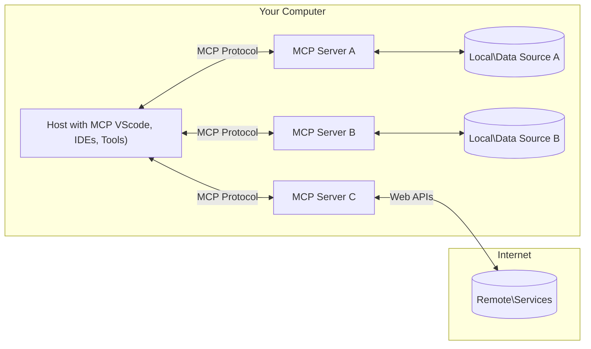

<!--
CO_OP_TRANSLATOR_METADATA:
{
  "original_hash": "355b12a5970c5c9e6db0bee970c751ba",
  "translation_date": "2025-07-04T17:15:21+00:00",
  "source_file": "01-CoreConcepts/README.md",
  "language_code": "tr"
}
-->
# 📖 MCP Temel Kavramları: Yapay Zeka Entegrasyonu için Model Context Protocol’ü Ustalaşmak

[Model Context Protocol (MCP)](https://github.com/modelcontextprotocol), Büyük Dil Modelleri (LLM’ler) ile dış araçlar, uygulamalar ve veri kaynakları arasındaki iletişimi optimize eden güçlü ve standartlaştırılmış bir çerçevedir. Bu SEO uyumlu rehber, MCP’nin temel kavramlarını adım adım açıklayarak, istemci-sunucu mimarisini, temel bileşenlerini, iletişim mekanizmalarını ve uygulama en iyi uygulamalarını anlamanızı sağlayacak.

## Genel Bakış

Bu ders, Model Context Protocol (MCP) ekosistemini oluşturan temel mimari ve bileşenleri inceler. MCP etkileşimlerini güçlendiren istemci-sunucu mimarisi, ana bileşenler ve iletişim mekanizmaları hakkında bilgi edineceksiniz.

## 👩‍🎓 Temel Öğrenme Hedefleri

Bu dersin sonunda:

- MCP istemci-sunucu mimarisini anlayacaksınız.
- Host’ların, Client’ların ve Server’ların rollerini ve sorumluluklarını tanımlayabileceksiniz.
- MCP’yi esnek bir entegrasyon katmanı yapan temel özellikleri analiz edeceksiniz.
- MCP ekosisteminde bilgi akışını öğreneceksiniz.
- .NET, Java, Python ve JavaScript ile kod örnekleri üzerinden pratik bilgiler edineceksiniz.

## 🔎 MCP Mimarisi: Daha Derin Bir Bakış

MCP ekosistemi, istemci-sunucu modeli üzerine kuruludur. Bu modüler yapı, yapay zeka uygulamalarının araçlar, veritabanları, API’ler ve bağlamsal kaynaklarla verimli şekilde etkileşim kurmasını sağlar. Bu mimariyi temel bileşenlerine ayıralım.

MCP temelde, bir host uygulamanın birden fazla sunucuya bağlanabildiği istemci-sunucu mimarisini takip eder:



- **MCP Host’ları**: VSCode, Claude Desktop, IDE’ler veya MCP üzerinden verilere erişmek isteyen yapay zeka araçları gibi programlar
- **MCP Client’ları**: Sunucularla birebir bağlantı kuran protokol istemcileri
- **MCP Server’ları**: Standart Model Context Protocol aracılığıyla belirli yetenekler sunan hafif programlar
- **Yerel Veri Kaynakları**: MCP sunucularının güvenli şekilde erişebildiği bilgisayarınızdaki dosyalar, veritabanları ve servisler
- **Uzak Servisler**: MCP sunucularının API’ler aracılığıyla bağlanabildiği internet üzerindeki dış sistemler

MCP Protokolü gelişmekte olan bir standarttır; en güncel değişiklikleri [protokol spesifikasyonunda](https://modelcontextprotocol.io/specification/2025-06-18/) görebilirsiniz.

### 1. Host’lar

Model Context Protocol (MCP) içinde Host’lar, kullanıcıların protokolle etkileşime geçtiği birincil arayüz olarak kritik bir rol oynar. Host’lar, MCP sunucularıyla bağlantı başlatan ve veri, araçlar ile istemleri erişmek için kullanılan uygulamalar veya ortamlar olarak tanımlanır. Örnekler arasında Visual Studio Code gibi entegre geliştirme ortamları (IDE’ler), Claude Desktop gibi yapay zeka araçları veya belirli görevler için özel olarak geliştirilmiş ajanlar bulunur.

**Host’lar**, bağlantı başlatan LLM uygulamalarıdır. Şunları yaparlar:

- Yanıt üretmek için yapay zeka modellerini çalıştırır veya onlarla etkileşime girer.
- MCP sunucularıyla bağlantı kurar.
- Konuşma akışını ve kullanıcı arayüzünü yönetir.
- İzin ve güvenlik kısıtlamalarını kontrol eder.
- Veri paylaşımı ve araç çalıştırma için kullanıcı onayını yönetir.

### 2. Client’lar

Client’lar, Host’lar ile MCP sunucuları arasındaki etkileşimi kolaylaştıran temel bileşenlerdir. Client’lar, Host’ların MCP sunucularının sunduğu işlevselliklere erişmesini ve kullanmasını sağlayan aracı görevi görür. MCP mimarisinde sorunsuz iletişim ve verimli veri alışverişi için kritik bir rol oynarlar.

**Client’lar**, host uygulama içindeki bağlantı noktalarıdır. Şunları yaparlar:

- Sunuculara istemler gönderir, istemlerde istemler/talimatlar bulunur.
- Sunucularla yetenek müzakeresi yapar.
- Modellerden gelen araç çalıştırma taleplerini yönetir.
- Yanıtları işler ve kullanıcıya gösterir.

### 3. Server’lar

Server’lar, MCP client’larından gelen istekleri işlemek ve uygun yanıtları sağlamakla sorumludur. Veri alma, araç çalıştırma ve istem oluşturma gibi çeşitli işlemleri yönetirler. Server’lar, client ve Host arasındaki iletişimin verimli ve güvenilir olmasını sağlar, etkileşim sürecinin bütünlüğünü korur.

**Server’lar**, bağlam ve yetenek sağlayan servislerdir. Şunları yaparlar:

- Mevcut özellikleri (kaynaklar, istemler, araçlar) kaydeder.
- Client’tan gelen araç çağrılarını alır ve çalıştırır.
- Model yanıtlarını geliştirmek için bağlamsal bilgi sağlar.
- Çıktıları client’a geri gönderir.
- Gerekirse etkileşimler arasında durumu korur.

Server’lar, model yeteneklerini özel işlevsellikle genişletmek için herkes tarafından geliştirilebilir.

### 4. Server Özellikleri

Model Context Protocol (MCP) içindeki server’lar, client’lar, host’lar ve dil modelleri arasında zengin etkileşimler sağlayan temel yapı taşlarını sunar. Bu özellikler, MCP’nin yeteneklerini yapılandırılmış bağlam, araçlar ve istemler sunarak artırmak için tasarlanmıştır.

MCP server’ları aşağıdaki özelliklerden herhangi birini sunabilir:

#### 📑 Kaynaklar

Model Context Protocol (MCP) içindeki kaynaklar, kullanıcılar veya yapay zeka modelleri tarafından kullanılabilen çeşitli bağlam ve veri türlerini kapsar. Bunlar şunları içerir:

- **Bağlamsal Veri**: Kullanıcıların veya yapay zeka modellerinin karar verme ve görev yürütme için kullanabileceği bilgi ve bağlam.
- **Bilgi Tabanları ve Doküman Depoları**: Makaleler, kılavuzlar ve araştırma makaleleri gibi yapılandırılmış ve yapılandırılmamış veri koleksiyonları, değerli içgörüler ve bilgiler sağlar.
- **Yerel Dosyalar ve Veritabanları**: Cihazlarda veya veritabanlarında yerel olarak depolanan ve işleme ile analiz için erişilebilen veriler.
- **API’ler ve Web Servisleri**: Çeşitli çevrimiçi kaynaklar ve araçlarla entegrasyon sağlayan ek veri ve işlevsellik sunan dış arayüzler ve servisler.

Bir kaynak örneği, aşağıdaki gibi erişilebilen bir veritabanı şeması veya dosya olabilir:

```text
file://log.txt
database://schema
```

### 🤖 İstemler

Model Context Protocol (MCP) içindeki istemler, kullanıcı iş akışlarını kolaylaştırmak ve iletişimi geliştirmek için tasarlanmış çeşitli ön tanımlı şablonlar ve etkileşim kalıplarını içerir. Bunlar şunları kapsar:

- **Şablonlu Mesajlar ve İş Akışları**: Kullanıcıları belirli görevler ve etkileşimler boyunca yönlendiren önceden yapılandırılmış mesajlar ve süreçler.
- **Ön Tanımlı Etkileşim Kalıpları**: Tutarlı ve verimli iletişimi kolaylaştıran standartlaştırılmış eylem ve yanıt dizileri.
- **Özelleştirilmiş Konuşma Şablonları**: Belirli konuşma türlerine yönelik uyarlanabilir şablonlar, ilgili ve bağlama uygun etkileşimler sağlar.

Bir istem şablonu şu şekilde görünebilir:

```markdown
Generate a product slogan based on the following {{product}} with the following {{keywords}}
```

#### ⛏️ Araçlar

Model Context Protocol (MCP) içindeki araçlar, yapay zeka modelinin belirli görevleri yerine getirmek için çalıştırabileceği fonksiyonlardır. Bu araçlar, yapay zeka modelinin yeteneklerini yapılandırılmış ve güvenilir işlemler sunarak artırmak için tasarlanmıştır. Temel özellikler şunlardır:

- **Yapay zeka modelinin çalıştırabileceği fonksiyonlar**: Araçlar, yapay zeka modelinin çağırabileceği yürütülebilir fonksiyonlardır.
- **Benzersiz İsim ve Açıklama**: Her aracın amacı ve işlevselliğini açıklayan ayrı bir adı ve detaylı açıklaması vardır.
- **Parametreler ve Çıktılar**: Araçlar belirli parametreleri kabul eder ve yapılandırılmış çıktılar döner, böylece tutarlı ve öngörülebilir sonuçlar sağlar.
- **Ayrık Fonksiyonlar**: Araçlar web aramaları, hesaplamalar ve veritabanı sorguları gibi ayrı işlevler gerçekleştirir.

Bir araç örneği şu şekilde olabilir:

```typescript
server.tool(
  "GetProducts",
  {
    pageSize: z.string().optional(),
    pageCount: z.string().optional()
  }, () => {
    // return results from API
  }
)
```

## Client Özellikleri

Model Context Protocol (MCP) içinde client’lar, protokolün genel işlevselliğini ve etkileşimini artıran sunuculara çeşitli önemli özellikler sunar. Öne çıkan özelliklerden biri Sampling’dir.

### 👉 Sampling

- **Sunucu Başlatmalı Ajan Davranışları**: Client’lar, sunucuların belirli eylemleri veya davranışları otonom olarak başlatmasını sağlar, sistemin dinamik yeteneklerini artırır.
- **Özyinelemeli LLM Etkileşimleri**: Bu özellik, büyük dil modelleri (LLM’ler) ile daha karmaşık ve yinelemeli görev işleme için özyinelemeli etkileşimlere olanak tanır.
- **Ek Model Tamamlamaları Talebi**: Sunucular, yanıtların kapsamlı ve bağlama uygun olmasını sağlamak için modelden ek tamamlamalar talep edebilir.

## MCP’de Bilgi Akışı

Model Context Protocol (MCP), host’lar, client’lar, server’lar ve modeller arasında yapılandırılmış bir bilgi akışı tanımlar. Bu akışı anlamak, kullanıcı isteklerinin nasıl işlendiğini ve dış araçlar ile verilerin model yanıtlarına nasıl entegre edildiğini netleştirir.

- **Host Bağlantı Başlatır**  
  Host uygulaması (örneğin bir IDE veya sohbet arayüzü), genellikle STDIO, WebSocket veya desteklenen başka bir taşıma protokolü üzerinden MCP sunucusuna bağlantı kurar.

- **Yetenek Müzakeresi**  
  Host içine gömülü client ile sunucu, destekledikleri özellikler, araçlar, kaynaklar ve protokol sürümleri hakkında bilgi alışverişi yapar. Bu, her iki tarafın oturum için hangi yeteneklerin mevcut olduğunu anlamasını sağlar.

- **Kullanıcı İsteği**  
  Kullanıcı host ile etkileşime girer (örneğin bir istem veya komut girer). Host bu girdiyi toplar ve işlenmek üzere client’a iletir.

- **Kaynak veya Araç Kullanımı**  
  - Client, modelin anlayışını zenginleştirmek için sunucudan ek bağlam veya kaynaklar (dosyalar, veritabanı girdileri veya bilgi tabanı makaleleri gibi) talep edebilir.
  - Model bir aracın gerekli olduğunu belirlerse (örneğin veri almak, hesaplama yapmak veya API çağrısı yapmak için), client, araç adı ve parametreleri belirterek sunucuya araç çağrısı isteği gönderir.

- **Sunucu Çalıştırması**  
  Sunucu, kaynak veya araç isteğini alır, gerekli işlemleri yapar (fonksiyon çalıştırma, veritabanı sorgulama veya dosya alma gibi) ve sonuçları yapılandırılmış biçimde client’a geri gönderir.

- **Yanıt Oluşturma**  
  Client, sunucudan gelen yanıtları (kaynak verisi, araç çıktıları vb.) devam eden model etkileşimine entegre eder. Model, bu bilgileri kullanarak kapsamlı ve bağlama uygun bir yanıt üretir.

- **Sonuç Sunumu**  
  Host, client’tan gelen nihai çıktıyı alır ve kullanıcıya sunar; genellikle model tarafından oluşturulan metin ile araç çalıştırma veya kaynak sorgulama sonuçlarını birlikte gösterir.

Bu akış, MCP’nin modelleri dış araçlar ve veri kaynaklarıyla sorunsuz şekilde bağlayarak gelişmiş, etkileşimli ve bağlam farkındalığı yüksek yapay zeka uygulamalarını desteklemesini sağlar.

## Protokol Detayları

MCP (Model Context Protocol), host’lar, client’lar ve server’lar arasında iletişim için standartlaştırılmış, dil bağımsız bir mesaj formatı sağlayan [JSON-RPC 2.0](https://www.jsonrpc.org/) üzerine inşa edilmiştir. Bu temel, farklı platformlar ve programlama dilleri arasında güvenilir, yapılandırılmış ve genişletilebilir etkileşimlere olanak tanır.

### Temel Protokol Özellikleri

MCP, araç çağrısı, kaynak erişimi ve istem yönetimi için ek kurallarla JSON-RPC 2.0’ı genişletir. Birden fazla taşıma katmanını (STDIO, WebSocket, SSE) destekler ve bileşenler arasında güvenli, genişletilebilir ve dil bağımsız iletişimi mümkün kılar.

#### 🧢 Temel Protokol

- **JSON-RPC Mesaj Formatı**: Tüm istekler ve yanıtlar JSON-RPC 2.0 spesifikasyonunu kullanır; yöntem çağrıları, parametreler, sonuçlar ve hata yönetimi için tutarlı yapı sağlar.
- **Durumlu Bağlantılar**: MCP oturumları, birden fazla istek boyunca durumu korur; devam eden konuşmaları, bağlam birikimini ve kaynak yönetimini destekler.
- **Yetenek Müzakeresi**: Bağlantı kurulurken client ve server, desteklenen özellikler, protokol sürümleri, mevcut araçlar ve kaynaklar hakkında bilgi alışverişi yapar. Bu, her iki tarafın yetenekleri anlamasını ve uyum sağlamasını sağlar.

#### ➕ Ek Yardımcılar

Aşağıda, MCP’nin geliştirici deneyimini artırmak ve gelişmiş senaryoları mümkün kılmak için sunduğu bazı ek yardımcılar ve protokol uzantıları yer almaktadır:

- **Yapılandırma Seçenekleri**: MCP, her etkileşim için araç izinleri, kaynak erişimi ve model ayarları gibi oturum parametrelerinin dinamik yapılandırılmasına izin verir.
- **İlerleme Takibi**: Uzun süren işlemler ilerleme güncellemeleri raporlayabilir, böylece karmaşık görevlerde kullanıcı arayüzleri daha duyarlı olur ve kullanıcı deneyimi iyileşir.
- **İstek İptali**: Client’lar, artık gerekli olmayan veya çok uzun süren işlemleri durdurmak için devam eden istekleri iptal edebilir.
- **Hata Raporlama**: Standartlaştırılmış hata mesajları ve kodları, sorunların teşhis edilmesine, hataların zarifçe yönetilmesine ve kullanıcılara ile geliştiricilere uygulanabilir geri bildirim sağlanmasına yardımcı olur.
- **Kayıt Tutma**: Hem client hem de server, protokol etkileşimlerinin denetimi, hata ayıklama ve izlenmesi için yapılandırılmış günlükler oluşturabilir.

Bu protokol özellikleri sayesinde MCP, dil modelleri ile dış araçlar veya veri kaynakları arasında sağlam, güvenli ve esnek iletişim sağlar.

### 🔐 Güvenlik Hususları

MCP uygulamaları, güvenli ve güvenilir etkileşimler sağlamak için birkaç temel güvenlik ilkesine uymalıdır:

- **Kullanıcı Onayı ve Kontrolü**: Herhangi bir veri erişimi veya işlem yapılmadan önce kullanıcıdan açık onay alınmalıdır. Kullanıcılar, hangi verilerin paylaşıldığı ve hangi işlemlerin yetkilendirildiği üzerinde net kontrole sahip olmalı; bu faaliyetleri gözden geçirmek ve onaylamak için sezgisel kullanıcı arayüzleri sunulmalıdır.

- **Veri Gizliliği**: Kullanıcı verileri yalnızca açık onayla paylaşılmalı ve uygun erişim kontrolleriyle korunmalıdır. MCP uygulamaları, yetkisiz veri iletimine karşı koruma sağlamalı ve tüm etkileşimlerde gizliliğin korunmasını garanti etmelidir.

- **Araç Güvenliği**: Herhangi bir araç çağrılmadan önce açık kullanıcı onayı gereklidir. Kullanıcılar, her aracın işlevselliğini net şekilde anlamalı ve istenmeyen veya güvensiz araç çalıştırmalarını önlemek için sağlam güvenlik sınırları uygulanmalıdır.

Bu ilkeler takip edilerek, MCP tüm protokol etkileşimlerinde kullanıcı güveni, gizliliği ve güvenliği sağlanır.

## Kod Örnekleri: Temel Bileşenler

Aşağıda, popüler programlama dillerinde MCP sunucu bileşenleri ve araçlarının nasıl uygulanacağını gösteren kod örnekleri yer almaktadır.

### .NET Örneği: Araçlarla Basit Bir MCP Sunucusu Oluşturma

İşte özel araçlarla basit bir MCP sunucusunun nasıl uygulanacağını gösteren pratik bir .NET kod örneği. Bu örnek, araçların tanımlanması ve kaydedilmesi, isteklerin işlenmesi ve Model Context Protocol kullanılarak sunucu bağlantısının kurulmasını gösterir.

```csharp
using System;
using System.Threading.Tasks;
using ModelContextProtocol.Server;
using ModelContextProtocol.Server.Transport;
using ModelContextProtocol.Server.Tools;

public class WeatherServer
{
    public static async Task Main(string[] args)
    {
        // Create an MCP server
        var server = new McpServer(
            name: "Weather MCP Server",
            version: "1.0.0"
        );
        
        // Register our custom weather tool
        server.AddTool<string, WeatherData>("weatherTool", 
            description: "Gets current weather for a location",
            execute: async (location) => {
                // Call weather API (simplified)
                var weatherData = await GetWeatherDataAsync(location);
                return weatherData;
            });
        
        // Connect the server using stdio transport
        var transport = new StdioServerTransport();
        await server.ConnectAsync(transport);
        
        Console.WriteLine("Weather MCP Server started");
        
        // Keep the server running until process is terminated
        await Task.Delay(-1);
    }
    
    private static async Task<WeatherData> GetWeatherDataAsync(string location)
    {
        // This would normally call a weather API
        // Simplified for demonstration
        await Task.Delay(100); // Simulate API call
        return new WeatherData { 
            Temperature = 72.5,
            Conditions = "Sunny",
            Location = location
        };
    }
}

public class WeatherData
{
    public double Temperature { get; set; }
    public string Conditions { get; set; }
    public string Location { get; set; }
}
```

### Java Örneği: MCP Sunucu Bileşenleri

Bu örnek, yukarıdaki .NET örneğiyle aynı MCP sunucu ve araç kaydını Java’da uygular.

```java
import io.modelcontextprotocol.server.McpServer;
import io.modelcontextprotocol.server.McpToolDefinition;
import io.modelcontextprotocol.server.transport.StdioServerTransport;
import io.modelcontextprotocol.server.tool.ToolExecutionContext;
import io.modelcontextprotocol.server.tool.ToolResponse;

public class WeatherMcpServer {
    public static void main(String[] args) throws Exception {
        // Create an MCP server
        McpServer server = McpServer.builder()
            .name("Weather MCP Server")
            .version("1.0.0")
            .build();
            
        // Register a weather tool
        server.registerTool(McpToolDefinition.builder("weatherTool")
            .description("Gets current weather for a location")
            .parameter("location", String.class)
            .execute((ToolExecutionContext ctx) -> {
                String location = ctx.getParameter("location", String.class);
                
                // Get weather data (simplified)
                WeatherData data = getWeatherData(location);
                
                // Return formatted response
                return ToolResponse.content(
                    String.format("Temperature: %.1f°F, Conditions: %s, Location: %s", 
                    data.getTemperature(), 
                    data.getConditions(), 
                    data.getLocation())
                );
            })
            .build());
        
        // Connect the server using stdio transport
        try (StdioServerTransport transport = new StdioServerTransport()) {
            server.connect(transport);
            System.out.println("Weather MCP Server started");
            // Keep server running until process is terminated
            Thread.currentThread().join();
        }
    }
    
    private static WeatherData getWeatherData(String location) {
        // Implementation would call a weather API
        // Simplified for example purposes
        return new WeatherData(72.5, "Sunny", location);
    }
}

class WeatherData {
    private double temperature;
    private String conditions;
    private String location;
    
    public WeatherData(double temperature, String conditions, String location) {
        this.temperature = temperature;
        this.conditions = conditions;
        this.location = location;
    }
    
    public double getTemperature() {
        return temperature;
    }
    
    public String getConditions() {
        return conditions;
    }
    
    public String getLocation() {
        return location;
    }
}
```

### Python Örneği: MCP Sunucusu Oluşturma

Bu örnekte, Python’da bir MCP sunucusunun nasıl oluşturulacağı gösterilir. Ayrıca
MCP, protokol boyunca güvenlik ve yetkilendirmeyi yönetmek için birkaç yerleşik kavram ve mekanizma içerir:

1. **Araç İzin Kontrolü**:  
  İstemciler, bir modelin bir oturum sırasında hangi araçları kullanabileceğini belirtebilir. Bu, yalnızca açıkça yetkilendirilmiş araçlara erişim sağlanmasını garanti eder ve istenmeyen veya güvensiz işlemlerin riskini azaltır. İzinler, kullanıcı tercihleri, organizasyon politikaları veya etkileşim bağlamına göre dinamik olarak yapılandırılabilir.

2. **Kimlik Doğrulama**:  
  Sunucular, araçlara, kaynaklara veya hassas işlemlere erişim sağlamadan önce kimlik doğrulama talep edebilir. Bu, API anahtarları, OAuth tokenları veya diğer kimlik doğrulama yöntemlerini içerebilir. Doğru kimlik doğrulama, yalnızca güvenilir istemcilerin ve kullanıcıların sunucu tarafı yetenekleri çağırmasını sağlar.

3. **Doğrulama**:  
  Tüm araç çağrıları için parametre doğrulaması zorunludur. Her araç, parametreleri için beklenen türleri, formatları ve kısıtlamaları tanımlar ve sunucu gelen istekleri buna göre doğrular. Bu, hatalı veya kötü niyetli girdilerin araç uygulamalarına ulaşmasını engeller ve işlemlerin bütünlüğünü korur.

4. **Hız Sınırlandırma**:  
  Kötüye kullanımı önlemek ve sunucu kaynaklarının adil kullanımını sağlamak için MCP sunucuları, araç çağrıları ve kaynak erişimi için hız sınırlandırma uygulayabilir. Hız sınırları kullanıcı başına, oturum başına veya genel olarak uygulanabilir ve hizmet engelleme saldırılarına veya aşırı kaynak tüketimine karşı koruma sağlar.

Bu mekanizmaların birleşimiyle MCP, dil modellerini dış araçlar ve veri kaynaklarıyla entegre etmek için güvenli bir temel sunar ve kullanıcılara ile geliştiricilere erişim ve kullanım üzerinde ince ayar kontrolü sağlar.

## Protokol Mesajları

MCP iletişimi, istemciler, sunucular ve modeller arasında net ve güvenilir etkileşimleri kolaylaştırmak için yapılandırılmış JSON mesajları kullanır. Ana mesaj türleri şunlardır:

- **İstemci İsteği**  
  İstemciden sunucuya gönderilir, genellikle şunları içerir:  
  - Kullanıcının istemi veya komutu  
  - Bağlam için konuşma geçmişi  
  - Araç yapılandırması ve izinler  
  - Ek meta veriler veya oturum bilgileri  

- **Model Yanıtı**  
  Model tarafından (istemci aracılığıyla) döndürülür, içerdiği:  
  - İstem ve bağlama dayalı oluşturulan metin veya tamamlamalar  
  - Modelin bir araç çağrılması gerektiğine karar vermesi durumunda isteğe bağlı araç çağrı talimatları  
  - Gerekirse kaynaklara veya ek bağlama referanslar  

- **Araç İsteği**  
  Bir aracın çalıştırılması gerektiğinde istemciden sunucuya gönderilir. Bu mesaj şunları içerir:  
  - Çağrılacak aracın adı  
  - Araç tarafından gereken parametreler (araç şemasına göre doğrulanmış)  
  - İsteği izlemek için bağlamsal bilgiler veya tanımlayıcılar  

- **Araç Yanıtı**  
  Bir araç çalıştırıldıktan sonra sunucu tarafından döndürülür. Bu mesaj şunları sağlar:  
  - Araç çalıştırma sonuçları (yapılandırılmış veri veya içerik)  
  - Araç çağrısı başarısız olduysa hata veya durum bilgileri  
  - İsteğe bağlı olarak, çalıştırmayla ilgili ek meta veriler veya günlükler  

Bu yapılandırılmış mesajlar, MCP iş akışındaki her adımın açık, izlenebilir ve genişletilebilir olmasını sağlar; çok turlu konuşmalar, araç zincirleme ve sağlam hata yönetimi gibi gelişmiş senaryoları destekler.

## Önemli Noktalar

- MCP, modelleri dış yeteneklerle bağlamak için istemci-sunucu mimarisi kullanır  
- Ekosistem; istemciler, hostlar, sunucular, araçlar ve veri kaynaklarından oluşur  
- İletişim STDIO, SSE veya WebSockets üzerinden gerçekleşebilir  
- Araçlar, modellere sunulan temel işlev birimleridir  
- Yapılandırılmış iletişim protokolleri tutarlı etkileşimleri garanti eder  

## Alıştırma

Alanınızda faydalı olacak basit bir MCP aracı tasarlayın. Şunları tanımlayın:  
1. Araç ne adla anılacak  
2. Hangi parametreleri kabul edecek  
3. Hangi çıktıyı döndürecek  
4. Bir model bu aracı kullanıcı sorunlarını çözmek için nasıl kullanabilir  

---

## Sonraki Adım

Sonraki: [Chapter 2: Security](../02-Security/README.md)

**Feragatname**:  
Bu belge, AI çeviri servisi [Co-op Translator](https://github.com/Azure/co-op-translator) kullanılarak çevrilmiştir. Doğruluk için çaba göstersek de, otomatik çevirilerin hatalar veya yanlışlıklar içerebileceğini lütfen unutmayınız. Orijinal belge, kendi dilinde yetkili kaynak olarak kabul edilmelidir. Kritik bilgiler için profesyonel insan çevirisi önerilir. Bu çevirinin kullanımı sonucu oluşabilecek yanlış anlamalar veya yorum hatalarından sorumlu değiliz.