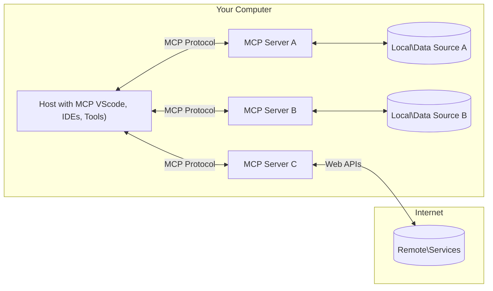

<!--
CO_OP_TRANSLATOR_METADATA:
{
  "original_hash": "b3b4a6ad10c3c0edbf7fa7cfa0ec496b",
  "translation_date": "2025-07-02T07:13:34+00:00",
  "source_file": "01-CoreConcepts/README.md",
  "language_code": "tr"
}
-->
# 📖 MCP Temel Kavramları: Yapay Zeka Entegrasyonu için Model Context Protocol’ü Ustaca Kullanmak

[Model Context Protocol (MCP)](https://github.com/modelcontextprotocol), Büyük Dil Modelleri (LLM'ler) ile dış araçlar, uygulamalar ve veri kaynakları arasındaki iletişimi optimize eden güçlü ve standartlaştırılmış bir çerçevedir. Bu SEO uyumlu rehber, MCP’nin temel kavramlarını adım adım anlatarak, istemci-sunucu mimarisini, önemli bileşenlerini, iletişim mekanizmalarını ve uygulama en iyi uygulamalarını anlamanızı sağlayacak.

## Genel Bakış

Bu ders, Model Context Protocol (MCP) ekosistemini oluşturan temel mimari ve bileşenleri incelemektedir. MCP etkileşimlerini güçlendiren istemci-sunucu mimarisi, temel bileşenler ve iletişim mekanizmaları hakkında bilgi edineceksiniz.

## 👩‍🎓 Temel Öğrenme Hedefleri

Bu dersin sonunda:

- MCP istemci-sunucu mimarisini anlayacaksınız.
- Hostların, istemcilerin ve sunucuların rollerini ve sorumluluklarını tanımlayacaksınız.
- MCP’yi esnek bir entegrasyon katmanı yapan temel özellikleri analiz edeceksiniz.
- MCP ekosisteminde bilgi akışının nasıl gerçekleştiğini öğreneceksiniz.
- .NET, Java, Python ve JavaScript ile kod örnekleri üzerinden pratik bilgiler edineceksiniz.

## 🔎 MCP Mimarisi: Daha Derin Bir Bakış

MCP ekosistemi, istemci-sunucu modeli üzerine kuruludur. Bu modüler yapı, yapay zeka uygulamalarının araçlar, veritabanları, API’ler ve bağlamsal kaynaklarla verimli şekilde etkileşim kurmasını sağlar. Gelin bu mimariyi temel bileşenlerine ayıralım.

MCP temelde, bir host uygulamanın birden fazla sunucuya bağlanabildiği istemci-sunucu mimarisini takip eder:



- **MCP Hostları**: VSCode, Claude Desktop, IDE’ler veya MCP üzerinden verilere erişmek isteyen yapay zeka araçları gibi programlar
- **MCP İstemcileri**: Sunucularla birebir bağlantı kuran protokol istemcileri
- **MCP Sunucuları**: Standart Model Context Protocol aracılığıyla belirli yetenekleri sunan hafif programlar
- **Yerel Veri Kaynakları**: MCP sunucularının güvenli şekilde erişebildiği bilgisayarınızdaki dosyalar, veritabanları ve servisler
- **Uzak Servisler**: MCP sunucularının API’ler aracılığıyla internette bağlanabildiği dış sistemler

MCP Protokolü gelişmekte olan bir standarttır; en son güncellemeleri [protokol spesifikasyonunda](https://modelcontextprotocol.io/specification/2025-06-18/) görebilirsiniz.

### 1. Hostlar

Model Context Protocol’de (MCP) Hostlar, kullanıcıların protokolle etkileşime geçtiği birincil arayüz olarak kritik bir rol oynar. Hostlar, MCP sunucularına bağlanarak veri, araç ve promptlara erişim başlatan uygulamalar veya ortamlar olarak görev yapar. Host örnekleri arasında Visual Studio Code gibi entegre geliştirme ortamları (IDE), Claude Desktop gibi yapay zeka araçları veya belirli görevler için özel olarak tasarlanmış ajanlar bulunur.

**Hostlar**, bağlantıyı başlatan LLM uygulamalarıdır. Şunları yaparlar:

- Yanıt üretmek için yapay zeka modellerini çalıştırır veya onlarla etkileşime girer.
- MCP sunucularına bağlantı başlatır.
- Konuşma akışını ve kullanıcı arayüzünü yönetir.
- İzin ve güvenlik kısıtlamalarını kontrol eder.
- Veri paylaşımı ve araç çalıştırma için kullanıcı onayını yönetir.

### 2. İstemciler

İstemciler, Hostlar ile MCP sunucuları arasındaki etkileşimi kolaylaştıran temel bileşenlerdir. İstemciler, Hostların MCP sunucularının sunduğu işlevleri erişip kullanmasını sağlayan aracılar olarak görev yapar. MCP mimarisinde sorunsuz iletişim ve verimli veri alışverişi sağlamakta kritik bir rol oynarlar.

**İstemciler**, host uygulama içindeki bağlayıcılardır. Şunları yaparlar:

- Sunuculara promptlar/talimatlarla istek gönderir.
- Sunucularla yetenek pazarlığı yapar.
- Modellerden gelen araç çalıştırma isteklerini yönetir.
- Yanıtları işler ve kullanıcıya gösterir.

### 3. Sunucular

Sunucular, MCP istemcilerinden gelen istekleri karşılar ve uygun yanıtları sağlar. Veri alma, araç çalıştırma ve prompt oluşturma gibi çeşitli işlemleri yönetirler. Sunucular, istemciler ile Hostlar arasındaki iletişimin verimli ve güvenilir olmasını sağlayarak etkileşim sürecinin bütünlüğünü korur.

**Sunucular**, bağlam ve yetenek sağlayan servislerdir. Şunları yaparlar:

- Mevcut özellikleri (kaynaklar, promptlar, araçlar) kaydeder.
- İstemciden gelen araç çağrılarını alır ve çalıştırır.
- Model yanıtlarını geliştirmek için bağlamsal bilgi sunar.
- Çıktıları istemciye geri iletir.
- Gerekirse etkileşimler arasında durumu korur.

Sunucular, model yeteneklerini özel işlevsellikle genişletmek için herkes tarafından geliştirilebilir.

### 4. Sunucu Özellikleri

Model Context Protocol’de (MCP) sunucular, istemciler, hostlar ve dil modelleri arasında zengin etkileşimleri mümkün kılan temel yapı taşlarını sağlar. Bu özellikler, yapılandırılmış bağlam, araçlar ve promptlar sunarak MCP’nin yeteneklerini artırmak için tasarlanmıştır.

MCP sunucuları aşağıdaki özelliklerden herhangi birini sunabilir:

#### 📑 Kaynaklar

Model Context Protocol’de (MCP) kaynaklar, kullanıcıların veya yapay zeka modellerinin kullanabileceği çeşitli bağlam ve veri türlerini kapsar. Bunlar şunları içerir:

- **Bağlamsal Veri**: Karar verme ve görev yürütme için kullanıcıların veya modellerin faydalanabileceği bilgi ve bağlam.
- **Bilgi Tabanları ve Doküman Depoları**: Makaleler, kılavuzlar ve araştırma makaleleri gibi yapılandırılmış ve yapılandırılmamış veri koleksiyonları, değerli içgörüler ve bilgiler sağlar.
- **Yerel Dosyalar ve Veritabanları**: Cihazlarda veya veritabanlarında yerel olarak depolanan ve işleme ile analiz için erişilebilen veriler.
- **API’ler ve Web Servisleri**: Çeşitli çevrimiçi kaynaklar ve araçlarla entegrasyonu mümkün kılan ek veri ve işlevsellik sunan dış arayüzler ve servisler.

Bir kaynak örneği, şöyle erişilebilen bir veritabanı şeması veya dosya olabilir:

```text
file://log.txt
database://schema
```

### 🤖 Promptlar

Model Context Protocol’de (MCP) promptlar, kullanıcı iş akışlarını kolaylaştırmak ve iletişimi geliştirmek için tasarlanmış çeşitli ön tanımlı şablonlar ve etkileşim kalıplarını içerir. Bunlar şunları kapsar:

- **Şablonlanmış Mesajlar ve İş Akışları**: Kullanıcıları belirli görevler ve etkileşimler boyunca yönlendiren önceden yapılandırılmış mesajlar ve süreçler.
- **Ön Tanımlı Etkileşim Kalıpları**: Tutarlı ve verimli iletişimi kolaylaştıran standartlaştırılmış eylem ve yanıt dizileri.
- **Özel Konuşma Şablonları**: Belirli konuşma türlerine uygun, bağlamsal ve alakalı etkileşimleri garanti eden özelleştirilebilir şablonlar.

Bir prompt şablonu şöyle görünebilir:

```markdown
Generate a product slogan based on the following {{product}} with the following {{keywords}}
```

#### ⛏️ Araçlar

Model Context Protocol’de (MCP) araçlar, yapay zeka modelinin belirli görevleri yerine getirmek için çalıştırabileceği işlevlerdir. Bu araçlar, yapay zeka modelinin yeteneklerini yapılandırılmış ve güvenilir işlemler sunarak artırmak üzere tasarlanmıştır. Temel özellikler şunlardır:

- **Yapay Zeka modelinin çalıştırabileceği fonksiyonlar**: Araçlar, yapay zeka modelinin çağırarak çeşitli görevleri yerine getirebileceği yürütülebilir fonksiyonlardır.
- **Benzersiz İsim ve Açıklama**: Her aracın amacı ve işlevselliği ayrıntılı şekilde açıklayan kendine özgü bir adı ve tanımı vardır.
- **Parametreler ve Çıktılar**: Araçlar belirli parametreleri kabul eder ve yapılandırılmış çıktılar döner, böylece tutarlı ve öngörülebilir sonuçlar sağlar.
- **Ayrık Fonksiyonlar**: Araçlar, web aramaları, hesaplamalar ve veritabanı sorguları gibi ayrı işlevleri gerçekleştirir.

Bir araç örneği şöyle olabilir:

```typescript
server.tool(
  "GetProducts",
  {
    pageSize: z.string().optional(),
    pageCount: z.string().optional()
  }, () => {
    // return results from API
  }
)
```

## İstemci Özellikleri

Model Context Protocol’de (MCP) istemciler, protokol içindeki genel işlevselliği ve etkileşimi artıran sunuculara çeşitli önemli özellikler sunar. Öne çıkan özelliklerden biri Sampling’dir.

### 👉 Sampling

- **Sunucu Tarafından Başlatılan Ajan Davranışları**: İstemciler, sunucuların belirli eylemleri veya davranışları özerk şekilde başlatmasını sağlar, sistemin dinamik yeteneklerini artırır.
- **Özyinelemeli LLM Etkileşimleri**: Bu özellik, büyük dil modelleri (LLM) ile daha karmaşık ve yinelemeli görev işleme olanağı sunar.
- **Ek Model Tamamlamaları Talebi**: Sunucular, yanıtların kapsamlı ve bağlamsal olarak uygun olmasını sağlamak için modelden ek tamamlamalar talep edebilir.

## MCP’de Bilgi Akışı

Model Context Protocol (MCP), hostlar, istemciler, sunucular ve modeller arasında yapılandırılmış bir bilgi akışı tanımlar. Bu akış, kullanıcı isteklerinin nasıl işlendiğini ve dış araçlar ile verilerin model yanıtlarına nasıl entegre edildiğini açıklığa kavuşturur.

- **Host Bağlantı Başlatır**  
  Host uygulama (örneğin bir IDE veya sohbet arayüzü), genellikle STDIO, WebSocket veya desteklenen başka bir taşıma üzerinden MCP sunucusuna bağlantı kurar.

- **Yetenek Pazarlığı**  
  Host içindeki istemci ile sunucu, destekledikleri özellikler, araçlar, kaynaklar ve protokol sürümleri hakkında bilgi alışverişi yapar. Bu, her iki tarafın oturum için kullanılabilir yetenekleri anlamasını sağlar.

- **Kullanıcı Talebi**  
  Kullanıcı host ile etkileşime geçer (örneğin bir prompt veya komut girer). Host bu girdiyi toplar ve işlem için istemciye iletir.

- **Kaynak veya Araç Kullanımı**  
  - İstemci, modelin anlayışını zenginleştirmek için sunucudan ek bağlam veya kaynaklar (dosyalar, veritabanı kayıtları veya bilgi tabanı makaleleri gibi) talep edebilir.  
  - Model bir aracın gerekli olduğuna karar verirse (örneğin veri almak, hesaplama yapmak veya API çağrısı yapmak için), istemci, araç adı ve parametrelerini belirterek sunucuya araç çağrısı isteği gönderir.

- **Sunucu Çalıştırma**  
  Sunucu kaynak veya araç isteğini alır, gerekli işlemleri (fonksiyon çalıştırma, veritabanı sorgulama veya dosya getirme gibi) yapar ve sonuçları yapılandırılmış biçimde istemciye geri gönderir.

- **Yanıt Oluşturma**  
  İstemci, sunucudan gelen yanıtları (kaynak verisi, araç çıktıları vb.) mevcut model etkileşimine entegre eder. Model bu bilgiyi kullanarak kapsamlı ve bağlamsal olarak uygun bir yanıt üretir.

- **Sonucun Sunumu**  
  Host, istemciden gelen nihai çıktıyı alır ve kullanıcıya sunar; genellikle model tarafından oluşturulan metin ile araç çalıştırma veya kaynak sorgulama sonuçlarını birlikte gösterir.

Bu akış, MCP’nin modelleri dış araçlar ve veri kaynaklarıyla kesintisiz bağlayarak gelişmiş, etkileşimli ve bağlam farkındalığı yüksek yapay zeka uygulamalarını desteklemesini sağlar.

## Protokol Detayları

MCP (Model Context Protocol), hostlar, istemciler ve sunucular arasında iletişim için standart, dil bağımsız bir mesaj formatı sağlayan [JSON-RPC 2.0](https://www.jsonrpc.org/) üzerine inşa edilmiştir. Bu temel, çeşitli platformlar ve programlama dilleri arasında güvenilir, yapılandırılmış ve genişletilebilir etkileşimlere olanak tanır.

### Temel Protokol Özellikleri

MCP, araç çağrısı, kaynak erişimi ve prompt yönetimi için ek kurallarla JSON-RPC 2.0’ı genişletir. Birden çok taşıma katmanını (STDIO, WebSocket, SSE) destekler ve bileşenler arasında güvenli, genişletilebilir ve dil bağımsız iletişim sağlar.

#### 🧢 Temel Protokol

- **JSON-RPC Mesaj Formatı**: Tüm istekler ve yanıtlar JSON-RPC 2.0 spesifikasyonuna uygun olup, yöntem çağrıları, parametreler, sonuçlar ve hata yönetimi için tutarlı yapı sağlar.
- **Durumlu Bağlantılar**: MCP oturumları, çoklu istekler arasında durumu korur; devam eden konuşmaları, bağlam birikimini ve kaynak yönetimini destekler.
- **Yetenek Pazarlığı**: Bağlantı kurulurken, istemci ve sunucu destekledikleri özellikler, protokol sürümleri, mevcut araçlar ve kaynaklar hakkında bilgi alışverişi yapar. Bu, her iki tarafın yeteneklerini anlamasını ve uyum sağlamasını sağlar.

#### ➕ Ek Yardımcılar

MCP, geliştirici deneyimini artırmak ve gelişmiş senaryoları mümkün kılmak için aşağıdaki ek yardımcılar ve protokol genişletmeleri sunar:

- **Yapılandırma Seçenekleri**: MCP, oturum parametrelerinin (araç izinleri, kaynak erişimi, model ayarları gibi) dinamik yapılandırılmasına olanak tanır; her etkileşime göre özelleştirilebilir.
- **İlerleme Takibi**: Uzun süren işlemler ilerleme güncellemeleri raporlayabilir; bu, kullanıcı arayüzlerinin duyarlı olmasını ve karmaşık görevlerde daha iyi kullanıcı deneyimi sağlar.
- **İstek İptali**: İstemciler, devam eden istekleri iptal edebilir; böylece kullanıcılar artık gerekli olmayan veya çok uzun süren işlemleri durdurabilir.
- **Hata Bildirimi**: Standartlaştırılmış hata mesajları ve kodları sorunların teşhisini, hataların zarif şekilde ele alınmasını ve kullanıcılar ile geliştiricilere uygulanabilir geri bildirim sunulmasını sağlar.
- **Kayıt Tutma**: İstemciler ve sunucular, protokol etkileşimlerini denetim, hata ayıklama ve izleme için yapılandırılmış günlükler oluşturabilir.

Bu protokol özellikleri sayesinde MCP, dil modelleri ile dış araçlar veya veri kaynakları arasında sağlam, güvenli ve esnek iletişim sağlar.

### 🔐 Güvenlik Hususları

MCP uygulamaları, güvenli ve güvenilir etkileşimleri sağlamak için aşağıdaki temel güvenlik prensiplerine uymalıdır:

- **Kullanıcı Onayı ve Kontrolü**: Verilere erişilmeden veya işlemler yapılmadan önce kullanıcıların açık onayı alınmalıdır. Kullanıcılar, hangi verilerin paylaşıldığını ve hangi işlemlerin yetkilendirildiğini net şekilde kontrol edebilmelidir; bu, faaliyetlerin gözden geçirilmesi ve onaylanması için sezgisel kullanıcı arayüzleriyle desteklenmelidir.

- **Veri Gizliliği**: Kullanıcı verileri yalnızca açık onayla paylaşılmalı ve uygun erişim kontrolleriyle korunmalıdır. MCP uygulamaları, yetkisiz veri iletimine karşı koruma sağlamalı ve gizliliğin tüm etkileşimler boyunca korunmasını temin etmelidir.

- **Araç Güvenliği**: Herhangi bir araç çağrılmadan önce açık kullanıcı onayı gereklidir. Kullanıcılar, her aracın işlevselliğini net şekilde anlamalı ve istenmeyen veya güvensiz araç çalıştırmalarını önlemek için güçlü güvenlik sınırları uygulanmalıdır.

Bu prensiplere uyularak MCP, kullanıcı güveni, gizliliği ve güvenliğinin protokol etkileşimleri boyunca korunmasını garanti eder.

## Kod Örnekleri: Temel Bileşenler

Aşağıda, çeşitli popüler programlama dillerinde MCP sunucu bileşenlerini ve araçlarını nasıl uygulayacağınıza dair kod örnekleri bulunmaktadır.

### .NET Örneği: Araçlarla Basit Bir MCP Sunucusu Oluşturma

İşte, özel araçlar tanımlama ve kaydetme, istekleri işleme ve Model Context Protocol kullanarak sunucuya bağlanmayı gösteren pratik bir .NET kod örneği.

```csharp
using System;
using System.Threading.Tasks;
using ModelContextProtocol.Server;
using ModelContextProtocol.Server.Transport;
using ModelContextProtocol.Server.Tools;

public class WeatherServer
{
    public static async Task Main(string[] args)
    {
        // Create an MCP server
        var server = new McpServer(
            name: "Weather MCP Server",
            version: "1.0.0"
        );
        
        // Register our custom weather tool
        server.AddTool<string, WeatherData>("weatherTool", 
            description: "Gets current weather for a location",
            execute: async (location) => {
                // Call weather API (simplified)
                var weatherData = await GetWeatherDataAsync(location);
                return weatherData;
            });
        
        // Connect the server using stdio transport
        var transport = new StdioServerTransport();
        await server.ConnectAsync(transport);
        
        Console.WriteLine("Weather MCP Server started");
        
        // Keep the server running until process is terminated
        await Task.Delay(-1);
    }
    
    private static async Task<WeatherData> GetWeatherDataAsync(string location)
    {
        // This would normally call a weather API
        // Simplified for demonstration
        await Task.Delay(100); // Simulate API call
        return new WeatherData { 
            Temperature = 72.5,
            Conditions = "Sunny",
            Location = location
        };
    }
}

public class WeatherData
{
    public double Temperature { get; set; }
    public string Conditions { get; set; }
    public string Location { get; set; }
}
```

### Java Örneği: MCP Sunucu Bileşenleri

Bu örnek, yukarıdaki .NET örneğiyle aynı MCP sunucu ve araç kayıt işlemini Java’da göstermektedir.

```java
import io.modelcontextprotocol.server.McpServer;
import io.modelcontextprotocol.server.McpToolDefinition;
import io.modelcontextprotocol.server.transport.StdioServerTransport;
import io.modelcontextprotocol.server.tool.ToolExecutionContext;
import io.modelcontextprotocol.server.tool.ToolResponse;

public class WeatherMcpServer {
    public static void main(String[] args) throws Exception {
        // Create an MCP server
        McpServer server = McpServer.builder()
            .name("Weather MCP Server")
            .version("1.0.0")
            .build();
            
        // Register a weather tool
        server.registerTool(McpToolDefinition.builder("weatherTool")
            .description("Gets current weather for a location")
            .parameter("location", String.class)
            .execute((ToolExecutionContext ctx) -> {
                String location = ctx.getParameter("location", String.class);
                
                // Get weather data (simplified)
                WeatherData data = getWeatherData(location);
                
                // Return formatted response
                return ToolResponse.content(
                    String.format("Temperature: %.1f°F, Conditions: %s, Location: %s", 
                    data.getTemperature(), 
                    data.getConditions(), 
                    data.getLocation())
                );
            })
            .build());
        
        // Connect the server using stdio transport
        try (StdioServerTransport transport = new StdioServerTransport()) {
            server.connect(transport);
            System.out.println("Weather MCP Server started");
            // Keep server running until process is terminated
            Thread.currentThread().join();
        }
    }
    
    private static WeatherData getWeatherData(String location) {
        // Implementation would call a weather API
        // Simplified for example purposes
        return new WeatherData(72.5, "Sunny", location);
    }
}

class WeatherData {
    private double temperature;
    private String conditions;
    private String location;
    
    public WeatherData(double temperature, String conditions, String location) {
        this.temperature = temperature;
        this.conditions = conditions;
        this.location = location;
    }
    
    public double getTemperature() {
        return temperature;
    }
    
    public String getConditions() {
        return conditions;
    }
    
    public String getLocation() {
        return location;
    }
}
```

### Python Örneği: MCP Sunucusu Oluşturma

Bu örnekte, Python’da MCP sunucusunun nasıl kurulacağı gösterilir. Ayrıca araç oluşturmanın iki farklı yolu sunulur.

```python
#!/usr/bin/env python3
import asyncio
from mcp.server.fastmcp import FastMCP
from mcp.server.transports.stdio import serve_stdio

# Create a FastMCP server
mcp = FastMCP(
    name="Weather MCP Server",
    version="1.0.0"
)

@mcp.tool()
def get_weather(location: str) -> dict:
    """Gets current weather for a location."""
    # This would normally call a weather API
    # Simplified for demonstration
    return {
        "temperature": 72.5,
        "conditions": "Sunny",
        "location": location
    }

# Alternative approach using a class
class WeatherTools:
    @mcp.tool()
    def forecast(self, location: str, days: int = 1) -> dict:
        """Gets weather forecast for a location for the specified number of days."""
        # This would normally call a weather API forecast endpoint
        # Simplified for demonstration
        return {
            "location": location,
            "forecast": [
                {"day": i+1, "temperature": 70 + i, "conditions": "Partly Cloudy"}
                for i in range(days)
            ]
        }

# Instantiate the class to register its tools
weather_tools = WeatherTools()

# Start the server using stdio transport
if __name__ == "__main__":
    asyncio.run(serve_stdio(mcp))
```


**Feragatname**:  
Bu belge, AI çeviri servisi [Co-op Translator](https://github.com/Azure/co-op-translator) kullanılarak çevrilmiştir. Doğruluk için çaba göstersek de, otomatik çevirilerin hatalar veya yanlışlıklar içerebileceğini lütfen unutmayınız. Orijinal belge, kendi dilinde yetkili kaynak olarak kabul edilmelidir. Kritik bilgiler için profesyonel insan çevirisi önerilir. Bu çevirinin kullanımı sonucu ortaya çıkabilecek herhangi bir yanlış anlama veya yorum hatasından sorumlu değiliz.