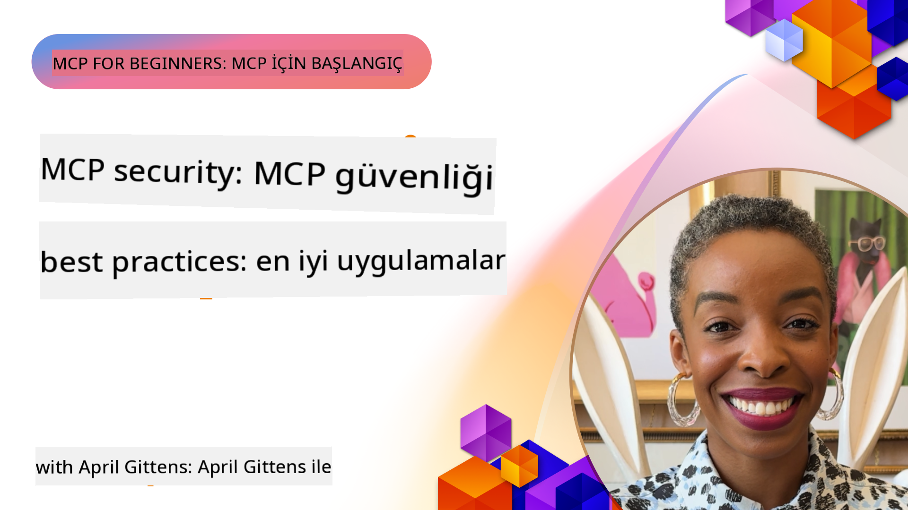

<!--
CO_OP_TRANSLATOR_METADATA:
{
  "original_hash": "1c767a35642f753127dc08545c25a290",
  "translation_date": "2025-08-18T17:54:37+00:00",
  "source_file": "02-Security/README.md",
  "language_code": "tr"
}
-->
# MCP Güvenliği: Yapay Zeka Sistemleri için Kapsamlı Koruma

_(Bu dersin videosunu izlemek için yukarıdaki görsele tıklayın)_

Güvenlik, yapay zeka sistem tasarımının temel bir unsurudur ve bu nedenle ikinci bölümümüzde öncelik veriyoruz. Bu, Microsoft'un [Güvenli Gelecek Girişimi](https://www.microsoft.com/security/blog/2025/04/17/microsofts-secure-by-design-journey-one-year-of-success/) kapsamında yer alan **Tasarımda Güvenlik** ilkesiyle uyumludur.

Model Context Protocol (MCP), yapay zeka destekli uygulamalara güçlü yeni yetenekler kazandırırken, geleneksel yazılım risklerinin ötesine geçen benzersiz güvenlik zorluklarını da beraberinde getirir. MCP sistemleri, yerleşik güvenlik endişeleriyle (güvenli kodlama, en az ayrıcalık, tedarik zinciri güvenliği) birlikte, istem talimatı enjeksiyonu, araç zehirlenmesi, oturum ele geçirme, karışık vekil saldırıları, token geçiş açıkları ve dinamik yetenek değişikliği gibi yeni yapay zeka odaklı tehditlerle karşı karşıyadır.

Bu ders, MCP uygulamalarındaki en kritik güvenlik risklerini ele alır—kimlik doğrulama, yetkilendirme, aşırı izinler, dolaylı istem talimatı enjeksiyonu, oturum güvenliği, karışık vekil sorunları, token yönetimi ve tedarik zinciri açıklarını kapsar. Bu riskleri azaltmak için uygulanabilir kontroller ve en iyi uygulamaları öğrenirken, MCP dağıtımınızı güçlendirmek için Microsoft çözümleri olan Prompt Shields, Azure Content Safety ve GitHub Advanced Security'den nasıl yararlanacağınızı keşfedeceksiniz.

## Öğrenme Hedefleri

Bu dersin sonunda şunları yapabileceksiniz:

- **MCP'ye Özgü Tehditleri Tanımlayın**: İstem talimatı enjeksiyonu, araç zehirlenmesi, aşırı izinler, oturum ele geçirme, karışık vekil sorunları, token geçiş açıkları ve tedarik zinciri riskleri gibi MCP sistemlerindeki benzersiz güvenlik risklerini tanıyın
- **Güvenlik Kontrollerini Uygulayın**: Güçlü kimlik doğrulama, en az ayrıcalıklı erişim, güvenli token yönetimi, oturum güvenlik kontrolleri ve tedarik zinciri doğrulaması gibi etkili azaltma yöntemlerini uygulayın
- **Microsoft Güvenlik Çözümlerinden Yararlanın**: MCP iş yükü koruması için Microsoft Prompt Shields, Azure Content Safety ve GitHub Advanced Security'yi anlayın ve dağıtın
- **Araç Güvenliğini Doğrulayın**: Araç meta verilerinin doğrulanmasının, dinamik değişikliklerin izlenmesinin ve dolaylı istem talimatı enjeksiyonu saldırılarına karşı savunmanın önemini kavrayın
- **En İyi Uygulamaları Entegre Edin**: Kapsamlı koruma için yerleşik güvenlik temellerini (güvenli kodlama, sunucu sertleştirme, sıfır güven) MCP'ye özgü kontrollerle birleştirin

# MCP Güvenlik Mimarisi ve Kontrolleri

Modern MCP uygulamaları, hem geleneksel yazılım güvenliğini hem de yapay zeka odaklı tehditleri ele alan katmanlı güvenlik yaklaşımları gerektirir. Hızla gelişen MCP spesifikasyonu, kurumsal güvenlik mimarileri ve yerleşik en iyi uygulamalarla daha iyi entegrasyon sağlayarak güvenlik kontrollerini olgunlaştırmaya devam etmektedir.

[Microsoft Dijital Savunma Raporu](https://aka.ms/mddr) araştırmaları, **bildirilen ihlallerin %98'inin sağlam güvenlik hijyeni ile önlenebileceğini** göstermektedir. En etkili koruma stratejisi, temel güvenlik uygulamalarını MCP'ye özgü kontrollerle birleştirir—kanıtlanmış temel güvenlik önlemleri, genel güvenlik riskini azaltmada en etkili olanlardır.

## Mevcut Güvenlik Manzarası

> **Not:** Bu bilgiler, **18 Ağustos 2025** itibarıyla MCP güvenlik standartlarını yansıtmaktadır. MCP protokolü hızla gelişmeye devam etmekte olup, gelecekteki uygulamalar yeni kimlik doğrulama modelleri ve gelişmiş kontroller sunabilir. Her zaman güncel [MCP Spesifikasyonu](https://spec.modelcontextprotocol.io/), [MCP GitHub deposu](https://github.com/modelcontextprotocol) ve [güvenlik en iyi uygulamaları dokümantasyonu](https://modelcontextprotocol.io/specification/2025-06-18/basic/security_best_practices) için en son kılavuzlara başvurun.

### MCP Kimlik Doğrulamanın Evrimi

MCP spesifikasyonu, kimlik doğrulama ve yetkilendirme yaklaşımında önemli ölçüde gelişmiştir:

- **Orijinal Yaklaşım**: İlk spesifikasyonlar, geliştiricilerin özel kimlik doğrulama sunucuları uygulamasını gerektiriyordu; MCP sunucuları, kullanıcı kimlik doğrulamasını doğrudan yöneten OAuth 2.0 Yetkilendirme Sunucuları olarak hareket ediyordu
- **Mevcut Standart (2025-06-18)**: Güncellenmiş spesifikasyon, MCP sunucularının kimlik doğrulamayı Microsoft Entra ID gibi harici kimlik sağlayıcılarına devretmesine olanak tanır, bu da güvenlik duruşunu iyileştirir ve uygulama karmaşıklığını azaltır
- **Taşıma Katmanı Güvenliği**: Hem yerel (STDIO) hem de uzak (Streamable HTTP) bağlantılar için uygun kimlik doğrulama modelleriyle güvenli taşıma mekanizmalarına yönelik geliştirilmiş destek

## Kimlik Doğrulama ve Yetkilendirme Güvenliği

### Mevcut Güvenlik Zorlukları

Modern MCP uygulamaları, kimlik doğrulama ve yetkilendirme ile ilgili çeşitli zorluklarla karşı karşıyadır:

### Riskler ve Tehdit Vektörleri

- **Yanlış Yapılandırılmış Yetkilendirme Mantığı**: MCP sunucularındaki hatalı yetkilendirme uygulamaları, hassas verileri açığa çıkarabilir ve erişim kontrollerini yanlış uygulayabilir
- **OAuth Token Kompromizi**: Yerel MCP sunucusu token hırsızlığı, saldırganların sunucuları taklit etmesine ve alt hizmetlere erişmesine olanak tanır
- **Token Geçiş Açıkları**: Yanlış token işleme, güvenlik kontrol atlamaları ve hesap verebilirlik boşlukları yaratır
- **Aşırı İzinler**: Aşırı yetkilendirilmiş MCP sunucuları, en az ayrıcalık ilkelerini ihlal eder ve saldırı yüzeylerini genişletir

#### Token Geçişi: Kritik Bir Anti-Model

**Token geçişi,** ciddi güvenlik etkileri nedeniyle mevcut MCP yetkilendirme spesifikasyonunda açıkça yasaklanmıştır:

##### Güvenlik Kontrolü Atlatma
- MCP sunucuları ve alt API'ler, uygun token doğrulamasına dayanan kritik güvenlik kontrollerini (oran sınırlama, istek doğrulama, trafik izleme) uygular
- Doğrudan istemci-API token kullanımı, bu temel korumaları atlayarak güvenlik mimarisini zayıflatır

##### Hesap Verebilirlik ve Denetim Zorlukları  
- MCP sunucuları, yukarı akışta verilen tokenları kullanan istemcileri ayırt edemez, bu da denetim izlerini bozar
- Alt kaynak sunucu günlükleri, gerçek MCP sunucusu aracıları yerine yanıltıcı istek kaynaklarını gösterir
- Olay incelemesi ve uyumluluk denetimi önemli ölçüde zorlaşır

##### Veri Sızdırma Riskleri
- Doğrulanmamış token iddiaları, çalınan tokenlara sahip kötü niyetli aktörlerin MCP sunucularını veri sızdırma için vekil olarak kullanmasına olanak tanır
- Güven sınırı ihlalleri, amaçlanan güvenlik kontrollerini atlayan yetkisiz erişim modellerine izin verir

##### Çoklu Hizmet Saldırı Vektörleri
- Birden fazla hizmet tarafından kabul edilen tehlikeye açık tokenlar, bağlı sistemler arasında yanal hareketi mümkün kılar
- Token kaynakları doğrulanamadığında hizmetler arasındaki güven varsayımları ihlal edilebilir

### Güvenlik Kontrolleri ve Azaltmalar

**Kritik Güvenlik Gereksinimleri:**

> **ZORUNLU**: MCP sunucuları, **kesinlikle** MCP sunucusu için açıkça verilmemiş tokenları kabul etmemelidir

#### Kimlik Doğrulama ve Yetkilendirme Kontrolleri

- **Titiz Yetkilendirme İncelemesi**: MCP sunucusu yetkilendirme mantığının kapsamlı denetimlerini gerçekleştirin, yalnızca amaçlanan kullanıcıların ve istemcilerin hassas kaynaklara erişmesini sağlayın
  - **Uygulama Kılavuzu**: [MCP Sunucuları için Azure API Yönetimi Kimlik Doğrulama Geçidi Olarak](https://techcommunity.microsoft.com/blog/integrationsonazureblog/azure-api-management-your-auth-gateway-for-mcp-servers/4402690)
  - **Kimlik Entegrasyonu**: [MCP Sunucusu Kimlik Doğrulaması için Microsoft Entra ID Kullanımı](https://den.dev/blog/mcp-server-auth-entra-id-session/)

- **Güvenli Token Yönetimi**: [Microsoft'un token doğrulama ve yaşam döngüsü en iyi uygulamaları](https://learn.microsoft.com/en-us/entra/identity-platform/access-tokens) uygulayın
  - Token hedef iddialarının MCP sunucusu kimliğiyle eşleştiğini doğrulayın
  - Uygun token döndürme ve sona erme politikalarını uygulayın
  - Token yeniden oynatma saldırılarını ve yetkisiz kullanımı önleyin

- **Korunan Token Depolama**: Hem dinlenme hem de aktarım sırasında şifreleme ile güvenli token depolama
  - **En İyi Uygulamalar**: [Güvenli Token Depolama ve Şifreleme Kılavuzları](https://youtu.be/uRdX37EcCwg?si=6fSChs1G4glwXRy2)

#### Erişim Kontrolü Uygulaması

- **En Az Ayrıcalık İlkesi**: MCP sunucularına yalnızca amaçlanan işlevsellik için gereken minimum izinleri verin
  - Düzenli izin incelemeleri ve ayrıcalık artışını önlemek için güncellemeler
  - **Microsoft Dokümantasyonu**: [Güvenli En Az Ayrıcalıklı Erişim](https://learn.microsoft.com/entra/identity-platform/secure-least-privileged-access)

- **Rol Tabanlı Erişim Kontrolü (RBAC)**: İnce ayarlı rol atamaları uygulayın
  - Rolleri belirli kaynaklara ve eylemlere sıkı bir şekilde sınırlayın
  - Saldırı yüzeylerini genişleten geniş veya gereksiz izinlerden kaçının

- **Sürekli İzin İzleme**: Sürekli erişim denetimi ve izleme uygulayın
  - Anomaliler için izin kullanım modellerini izleyin
  - Aşırı veya kullanılmayan ayrıcalıkları hızla düzeltin
- **Güvenli Oturum Oluşturma**: Oturum kimliklerini güvenli rastgele sayı üreteçleriyle kriptografik olarak güvenli ve deterministik olmayan şekilde oluşturun  
- **Kullanıcıya Özgü Bağlama**: Oturum kimliklerini, kullanıcıya özgü bilgilerle bağlayarak, örneğin `<user_id>:<session_id>` formatını kullanarak, kullanıcılar arası oturum kötüye kullanımını önleyin  
- **Oturum Yaşam Döngüsü Yönetimi**: Güvenlik açıklarını sınırlamak için uygun süre sonu, döndürme ve geçersiz kılma mekanizmalarını uygulayın  
- **Taşıma Güvenliği**: Oturum kimliklerinin ele geçirilmesini önlemek için tüm iletişimlerde HTTPS kullanımı zorunludur  

### Kafa Karıştıran Vekil Problemi  

**Kafa karıştıran vekil problemi**, MCP sunucularının istemciler ve üçüncü taraf hizmetler arasında kimlik doğrulama vekilleri olarak hareket ettiği durumlarda ortaya çıkar ve statik istemci kimliklerinin kötüye kullanılması yoluyla yetkilendirme atlatma fırsatları yaratır.  

#### **Saldırı Mekanizmaları ve Riskler**  

- **Çerez Tabanlı Rıza Atlatma**: Önceki kullanıcı kimlik doğrulaması, saldırganların kötü niyetli yetkilendirme istekleriyle hazırlanmış yönlendirme URI'ları kullanarak rıza çerezlerini kötüye kullanmasına olanak tanır  
- **Yetkilendirme Kodu Hırsızlığı**: Mevcut rıza çerezleri, yetkilendirme sunucularının rıza ekranlarını atlamasına ve kodları saldırgan tarafından kontrol edilen uç noktalara yönlendirmesine neden olabilir  
- **Yetkisiz API Erişimi**: Çalınan yetkilendirme kodları, açık onay olmadan jeton değişimi ve kullanıcı taklidi yapılmasını sağlar  

#### **Azaltma Stratejileri**  

**Zorunlu Kontroller:**  
- **Açık Rıza Gereklilikleri**: Statik istemci kimlikleri kullanan MCP vekil sunucuları, her dinamik olarak kaydedilen istemci için kullanıcı rızasını **ALMALIDIR**  
- **OAuth 2.1 Güvenlik Uygulaması**: Tüm yetkilendirme istekleri için PKCE (Kod Değişimi için Kanıt Anahtarı) dahil olmak üzere mevcut OAuth güvenlik en iyi uygulamalarını izleyin  
- **Sıkı İstemci Doğrulama**: Yönlendirme URI'larının ve istemci tanımlayıcılarının kötüye kullanılmasını önlemek için titiz doğrulama uygulayın  

### Jeton Aktarma Güvenlik Açıkları  

**Jeton aktarma**, MCP sunucularının istemci jetonlarını uygun doğrulama olmadan kabul ettiği ve bunları aşağı akış API'lerine ilettiği, MCP yetkilendirme spesifikasyonlarını ihlal eden açık bir anti-patterndir.  

#### **Güvenlik Etkileri**  

- **Kontrol Atlatma**: İstemciden API'ye doğrudan jeton kullanımı, kritik hız sınırlama, doğrulama ve izleme kontrollerini atlar  
- **Denetim İzinin Bozulması**: Yukarı akışta verilen jetonlar, istemci tanımlamasını imkansız hale getirerek olay inceleme yeteneklerini bozar  
- **Vekil Tabanlı Veri Sızdırma**: Doğrulanmamış jetonlar, kötü niyetli aktörlerin sunucuları yetkisiz veri erişimi için vekil olarak kullanmasına olanak tanır  
- **Güven Sınırı İhlalleri**: Jeton kaynakları doğrulanamadığında, aşağı akış hizmetlerinin güven varsayımları ihlal edilebilir  
- **Çok Hizmetli Saldırı Genişlemesi**: Birden fazla hizmette kabul edilen tehlikeye açık jetonlar, yanal hareketi mümkün kılar  

#### **Gerekli Güvenlik Kontrolleri**  

**Tartışmasız Gereklilikler:**  
- **Jeton Doğrulama**: MCP sunucuları, MCP sunucusu için açıkça verilmemiş jetonları **KABUL ETMEMELİDİR**  
- **Hedef Doğrulama**: Jeton hedef iddialarının MCP sunucusunun kimliğiyle eşleştiğini her zaman doğrulayın  
- **Uygun Jeton Yaşam Döngüsü**: Güvenli döndürme uygulamalarıyla kısa ömürlü erişim jetonları uygulayın  

## AI Sistemleri için Tedarik Zinciri Güvenliği  

Tedarik zinciri güvenliği, geleneksel yazılım bağımlılıklarının ötesine geçerek tüm AI ekosistemini kapsayacak şekilde evrilmiştir. Modern MCP uygulamaları, sistem bütünlüğünü tehlikeye atabilecek potansiyel güvenlik açıklarını tanımlamak için tüm AI ile ilgili bileşenleri titizlikle doğrulamalı ve izlemelidir.  

### Genişletilmiş AI Tedarik Zinciri Bileşenleri  

**Geleneksel Yazılım Bağımlılıkları:**  
- Açık kaynak kütüphaneleri ve çerçeveler  
- Konteyner görüntüleri ve temel sistemler  
- Geliştirme araçları ve derleme hatları  
- Altyapı bileşenleri ve hizmetleri  

**AI'ye Özgü Tedarik Zinciri Öğeleri:**  
- **Temel Modeller**: Sağlayıcılardan alınan önceden eğitilmiş modellerin köken doğrulaması gerektirir  
- **Gömme Hizmetleri**: Harici vektörleştirme ve anlamsal arama hizmetleri  
- **Bağlam Sağlayıcılar**: Veri kaynakları, bilgi tabanları ve belge havuzları  
- **Üçüncü Taraf API'leri**: Harici AI hizmetleri, ML hatları ve veri işleme uç noktaları  
- **Model Eserleri**: Ağırlıklar, yapılandırmalar ve ince ayar yapılmış model varyantları  
- **Eğitim Veri Kaynakları**: Model eğitimi ve ince ayar için kullanılan veri kümeleri  

### Kapsamlı Tedarik Zinciri Güvenlik Stratejisi  

#### **Bileşen Doğrulama ve Güven**  
- **Köken Doğrulaması**: Tüm AI bileşenlerinin entegrasyon öncesinde kökenini, lisansını ve bütünlüğünü doğrulayın  
- **Güvenlik Değerlendirmesi**: Modeller, veri kaynakları ve AI hizmetleri için güvenlik taramaları ve incelemeleri gerçekleştirin  
- **İtibar Analizi**: AI hizmet sağlayıcılarının güvenlik geçmişini ve uygulamalarını değerlendirin  
- **Uyumluluk Doğrulaması**: Tüm bileşenlerin kurumsal güvenlik ve düzenleyici gerekliliklere uygunluğunu sağlayın  

#### **Güvenli Dağıtım Hatları**  
- **Otomatik CI/CD Güvenliği**: Otomatik dağıtım hatları boyunca güvenlik taramalarını entegre edin  
- **Eser Bütünlüğü**: Dağıtılan tüm eserler (kod, modeller, yapılandırmalar) için kriptografik doğrulama uygulayın  
- **Aşamalı Dağıtım**: Her aşamada güvenlik doğrulaması ile aşamalı dağıtım stratejileri kullanın  
- **Güvenilir Eser Depoları**: Yalnızca doğrulanmış, güvenli eser kayıtlarından ve depolarından dağıtım yapın  

#### **Sürekli İzleme ve Yanıt**  
- **Bağımlılık Taraması**: Tüm yazılım ve AI bileşen bağımlılıkları için sürekli güvenlik açığı izleme  
- **Model İzleme**: Model davranışı, performans kayması ve güvenlik anormalliklerinin sürekli değerlendirilmesi  
- **Hizmet Sağlığı İzleme**: Harici AI hizmetlerini kullanılabilirlik, güvenlik olayları ve politika değişiklikleri açısından izleyin  
- **Tehdit İstihbaratı Entegrasyonu**: AI ve ML güvenlik risklerine özel tehdit akışlarını dahil edin  

#### **Erişim Kontrolü ve En Az Ayrıcalık**  
- **Bileşen Düzeyinde İzinler**: Modeller, veriler ve hizmetlere erişimi iş gerekliliği temelinde sınırlayın  
- **Hizmet Hesabı Yönetimi**: Minimum gerekli izinlere sahip özel hizmet hesapları uygulayın  
- **Ağ Segmentasyonu**: AI bileşenlerini izole edin ve hizmetler arasındaki ağ erişimini sınırlayın  
- **API Geçidi Kontrolleri**: Harici AI hizmetlerine erişimi kontrol etmek ve izlemek için merkezi API geçitleri kullanın  

#### **Olay Yanıtı ve Kurtarma**  
- **Hızlı Yanıt Prosedürleri**: Tehlikeye açık AI bileşenlerini yamalamak veya değiştirmek için oluşturulmuş süreçler  
- **Kimlik Bilgisi Döndürme**: Kimlik bilgileri, API anahtarları ve hizmet kimlik bilgileri için otomatik döndürme sistemleri  
- **Geri Alma Yetenekleri**: AI bileşenlerinin önceki bilinen iyi sürümlerine hızla geri dönme yeteneği  
- **Tedarik Zinciri İhlali Kurtarma**: Yukarı akış AI hizmeti ihlallerine yanıt verme için özel prosedürler  

### Microsoft Güvenlik Araçları ve Entegrasyonu  

**GitHub Advanced Security**, aşağıdakiler dahil olmak üzere kapsamlı tedarik zinciri koruması sağlar:  
- **Gizli Tarama**: Depolardaki kimlik bilgileri, API anahtarları ve jetonların otomatik algılanması  
- **Bağımlılık Taraması**: Açık kaynak bağımlılıkları ve kütüphaneleri için güvenlik açığı değerlendirmesi  
- **CodeQL Analizi**: Güvenlik açıkları ve kodlama sorunları için statik kod analizi  
- **Tedarik Zinciri İçgörüleri**: Bağımlılık sağlığı ve güvenlik durumu hakkında görünürlük  

**Azure DevOps ve Azure Repos Entegrasyonu:**  
- Microsoft geliştirme platformları genelinde sorunsuz güvenlik tarama entegrasyonu  
- AI iş yükleri için Azure Pipelines'da otomatik güvenlik kontrolleri  
- Güvenli AI bileşen dağıtımı için politika uygulaması  

**Microsoft Dahili Uygulamaları:**  
Microsoft, tüm ürünlerinde kapsamlı tedarik zinciri güvenlik uygulamaları uygular. Microsoft'ta Yazılım Tedarik Zincirini Güvenli Hale Getirme Yolculuğu hakkında daha fazla bilgi edinin: [The Journey to Secure the Software Supply Chain at Microsoft](https://devblogs.microsoft.com/engineering-at-microsoft/the-journey-to-secure-the-software-supply-chain-at-microsoft/).  

### **Microsoft Güvenlik Çözümleri**
- [Microsoft Prompt Shields Dokümantasyonu](https://learn.microsoft.com/azure/ai-services/content-safety/concepts/jailbreak-detection)
- [Azure İçerik Güvenliği Hizmeti](https://learn.microsoft.com/azure/ai-services/content-safety/)
- [Microsoft Entra ID Güvenliği](https://learn.microsoft.com/entra/identity-platform/secure-least-privileged-access)
- [Azure Token Yönetimi En İyi Uygulamaları](https://learn.microsoft.com/entra/identity-platform/access-tokens)
- [GitHub Gelişmiş Güvenlik](https://github.com/security/advanced-security)

### **Uygulama Kılavuzları ve Eğitimler**
- [Azure API Management ile MCP Kimlik Doğrulama Geçidi](https://techcommunity.microsoft.com/blog/integrationsonazureblog/azure-api-management-your-auth-gateway-for-mcp-servers/4402690)
- [MCP Sunucuları ile Microsoft Entra ID Kimlik Doğrulaması](https://den.dev/blog/mcp-server-auth-entra-id-session/)
- [Güvenli Token Depolama ve Şifreleme (Video)](https://youtu.be/uRdX37EcCwg?si=6fSChs1G4glwXRy2)

### **DevOps ve Tedarik Zinciri Güvenliği**
- [Azure DevOps Güvenliği](https://azure.microsoft.com/products/devops)
- [Azure Repos Güvenliği](https://azure.microsoft.com/products/devops/repos/)
- [Microsoft Tedarik Zinciri Güvenliği Yolculuğu](https://devblogs.microsoft.com/engineering-at-microsoft/the-journey-to-secure-the-software-supply-chain-at-microsoft/)

## **Ek Güvenlik Dokümantasyonu**

Kapsamlı güvenlik rehberliği için bu bölümdeki özel dokümanlara başvurabilirsiniz:

- **[MCP Güvenlik En İyi Uygulamaları 2025](./mcp-security-best-practices-2025.md)** - MCP uygulamaları için eksiksiz güvenlik en iyi uygulamaları
- **[Azure İçerik Güvenliği Uygulaması](./azure-content-safety-implementation.md)** - Azure İçerik Güvenliği entegrasyonu için pratik uygulama örnekleri  
- **[MCP Güvenlik Kontrolleri 2025](./mcp-security-controls-2025.md)** - MCP dağıtımları için en son güvenlik kontrolleri ve teknikleri
- **[MCP En İyi Uygulamalar Hızlı Referans](./mcp-best-practices.md)** - Temel MCP güvenlik uygulamaları için hızlı referans kılavuzu

---

## Sırada Ne Var

Sıradaki: [Bölüm 3: Başlarken](../03-GettingStarted/README.md)

**Feragatname**:  
Bu belge, [Co-op Translator](https://github.com/Azure/co-op-translator) adlı yapay zeka çeviri hizmeti kullanılarak çevrilmiştir. Doğruluk için çaba göstersek de, otomatik çevirilerin hata veya yanlışlıklar içerebileceğini lütfen unutmayın. Orijinal belgenin kendi dilindeki hali yetkili kaynak olarak kabul edilmelidir. Kritik bilgiler için profesyonel insan çevirisi önerilir. Bu çevirinin kullanımından kaynaklanan yanlış anlamalar veya yanlış yorumlamalar için sorumluluk kabul etmiyoruz.