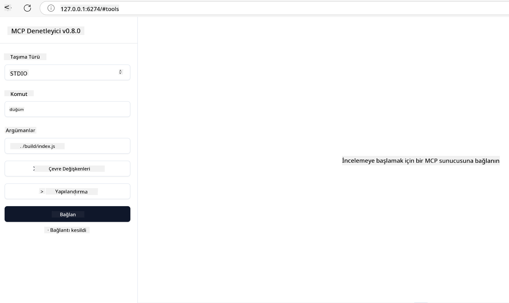

<!--
CO_OP_TRANSLATOR_METADATA:
{
  "original_hash": "5331ffd328a54b90f76706c52b673e27",
  "translation_date": "2025-05-17T08:35:11+00:00",
  "source_file": "03-GettingStarted/01-first-server/README.md",
  "language_code": "tr"
}
-->
# MCP ile Başlarken

Model Context Protocol (MCP) ile ilk adımlarınıza hoş geldiniz! MCP'ye yeniyseniz veya anlayışınızı derinleştirmek istiyorsanız, bu kılavuz sizi temel kurulum ve geliştirme sürecinde yönlendirecektir. MCP'nin AI modelleri ile uygulamalar arasında nasıl kesintisiz entegrasyon sağladığını keşfedecek ve MCP destekli çözümler oluşturup test etmek için ortamınızı hızlı bir şekilde nasıl hazırlayacağınızı öğreneceksiniz.

> Özetle; AI uygulamaları oluşturuyorsanız, LLM'nize (büyük dil modeli) araçlar ve diğer kaynaklar ekleyebileceğinizi bilirsiniz, böylece LLM daha bilgili hale gelir. Ancak, bu araçları ve kaynakları bir sunucuya yerleştirirseniz, uygulama ve sunucu yetenekleri, LLM olan veya olmayan herhangi bir istemci tarafından kullanılabilir.

## Genel Bakış

Bu ders, MCP ortamlarını kurma ve ilk MCP uygulamalarınızı oluşturma konusunda pratik rehberlik sunar. Gerekli araçları ve çerçeveleri nasıl kuracağınızı, temel MCP sunucularını nasıl oluşturacağınızı, ana uygulamaları nasıl yaratacağınızı ve uygulamalarınızı nasıl test edeceğinizi öğreneceksiniz.

Model Context Protocol (MCP), uygulamaların LLM'lere nasıl bağlam sağladığını standartlaştıran açık bir protokoldür. MCP'yi AI uygulamaları için bir USB-C portu gibi düşünün - AI modellerini farklı veri kaynaklarına ve araçlara bağlamak için standart bir yol sağlar.

## Öğrenme Hedefleri

Bu dersin sonunda:

- C#, Java, Python, TypeScript ve JavaScript'te MCP için geliştirme ortamları kurabileceksiniz
- Özelleştirilmiş özelliklerle (kaynaklar, istemler ve araçlar) temel MCP sunucuları oluşturup dağıtabileceksiniz
- MCP sunucularına bağlanan ana uygulamalar oluşturabileceksiniz
- MCP uygulamalarını test edip hata ayıklayabileceksiniz

## MCP Ortamınızı Kurma

MCP ile çalışmaya başlamadan önce, geliştirme ortamınızı hazırlamak ve temel iş akışını anlamak önemlidir. Bu bölüm, MCP ile sorunsuz bir başlangıç yapmanızı sağlamak için başlangıç adımlarında size rehberlik edecektir.

### Gereksinimler

MCP geliştirmeye başlamadan önce, aşağıdakilere sahip olduğunuzdan emin olun:

- **Geliştirme Ortamı**: Seçtiğiniz dil için (C#, Java, Python, TypeScript veya JavaScript)
- **IDE/Editor**: Visual Studio, Visual Studio Code, IntelliJ, Eclipse, PyCharm veya herhangi bir modern kod editörü
- **Paket Yöneticileri**: NuGet, Maven/Gradle, pip veya npm/yarn
- **API Anahtarları**: Ana uygulamalarınızda kullanmayı planladığınız AI hizmetleri için

## Temel MCP Sunucu Yapısı

Bir MCP sunucusu genellikle şunları içerir:

- **Sunucu Yapılandırması**: Port ayarı, kimlik doğrulama ve diğer ayarlar
- **Kaynaklar**: LLM'lere sunulan veri ve bağlam
- **Araçlar**: Modellerin çağırabileceği işlevsellik
- **İstemler**: Metin oluşturma veya yapılandırma şablonları

İşte TypeScript'te basitleştirilmiş bir örnek:

```typescript
import { Server, Tool, Resource } from "@modelcontextprotocol/typescript-server-sdk";

// Create a new MCP server
const server = new Server({
  port: 3000,
  name: "Example MCP Server",
  version: "1.0.0"
});

// Register a tool
server.registerTool({
  name: "calculator",
  description: "Performs basic calculations",
  parameters: {
    expression: {
      type: "string",
      description: "The math expression to evaluate"
    }
  },
  handler: async (params) => {
    const result = eval(params.expression);
    return { result };
  }
});

// Start the server
server.start();
```

Önceki kodda şunları yaptık:

- MCP TypeScript SDK'dan gerekli sınıfları ithal ettik.
- Yeni bir MCP sunucu örneği oluşturup yapılandırdık.
- Bir işlevi olan özel bir araç (`calculator`) kaydettik.
- Gelen MCP isteklerini dinlemek için sunucuyu başlattık.

## Test ve Hata Ayıklama

MCP sunucunuzu test etmeye başlamadan önce, mevcut araçları ve hata ayıklama için en iyi uygulamaları anlamak önemlidir. Etkili test, sunucunuzun beklendiği gibi davranmasını sağlar ve sorunları hızlı bir şekilde tanımlayıp çözmenize yardımcı olur. Aşağıdaki bölüm, MCP uygulamanızı doğrulamak için önerilen yaklaşımları özetler.

MCP, sunucularınızı test etmenize ve hata ayıklamanıza yardımcı olacak araçlar sağlar:

- **İnceleme aracı**, bu grafik arayüz sunucunuza bağlanmanızı ve araçlarınızı, istemlerinizi ve kaynaklarınızı test etmenizi sağlar.
- **curl**, sunucunuza curl gibi bir komut satırı aracı veya HTTP komutları oluşturup çalıştırabilen diğer istemcilerle de bağlanabilirsiniz.

### MCP İnceleme Aracını Kullanma

[MCP İnceleme Aracı](https://github.com/modelcontextprotocol/inspector), size yardımcı olan görsel bir test aracıdır:

1. **Sunucu Yeteneklerini Keşfedin**: Mevcut kaynakları, araçları ve istemleri otomatik olarak tespit edin
2. **Araç Çalıştırma Testi**: Farklı parametreleri deneyin ve gerçek zamanlı yanıtları görün
3. **Sunucu Meta Verilerini Görüntüleyin**: Sunucu bilgilerini, şemaları ve yapılandırmaları inceleyin

```bash
# ex TypeScript, installing and running MCP Inspector
npx @modelcontextprotocol/inspector node build/index.js
```

Yukarıdaki komutları çalıştırdığınızda, MCP İnceleme Aracı tarayıcınızda yerel bir web arayüzü başlatacaktır. Kayıtlı MCP sunucularınızı, mevcut araçlarını, kaynaklarını ve istemlerini gösteren bir kontrol paneli görmeyi bekleyebilirsiniz. Arayüz, araç çalıştırmayı etkileşimli olarak test etmenize, sunucu meta verilerini incelemenize ve gerçek zamanlı yanıtları görüntülemenize olanak tanır, böylece MCP sunucu uygulamalarınızı doğrulamak ve hata ayıklamak daha kolay hale gelir.

İşte nasıl görünebileceğine dair bir ekran görüntüsü:


## Yaygın Kurulum Sorunları ve Çözümleri

| Sorun | Olası Çözüm |
|-------|-------------------|
| Bağlantı reddedildi | Sunucunun çalışıp çalışmadığını ve portun doğru olup olmadığını kontrol edin |
| Araç çalıştırma hataları | Parametre doğrulamasını ve hata işleme süreçlerini gözden geçirin |
| Kimlik doğrulama hataları | API anahtarlarını ve izinleri doğrulayın |
| Şema doğrulama hataları | Parametrelerin tanımlanan şemaya uygun olduğundan emin olun |
| Sunucu başlatılmıyor | Port çatışmalarını veya eksik bağımlılıkları kontrol edin |
| CORS hataları | Çapraz kaynak istekleri için uygun CORS başlıklarını yapılandırın |
| Kimlik doğrulama sorunları | Token geçerliliğini ve izinleri doğrulayın |

## Yerel Geliştirme

Yerel geliştirme ve test için MCP sunucularını doğrudan bilgisayarınızda çalıştırabilirsiniz:

1. **Sunucu sürecini başlatın**: MCP sunucu uygulamanızı çalıştırın
2. **Ağ yapılandırmasını yapın**: Sunucunun beklenen portta erişilebilir olduğundan emin olun
3. **İstemcileri bağlayın**: `http://localhost:3000` gibi yerel bağlantı URL'lerini kullanın

```bash
# Example: Running a TypeScript MCP server locally
npm run start
# Server running at http://localhost:3000
```

## İlk MCP Sunucunuzu Oluşturma

Önceki derste [Temel Kavramları](/01-CoreConcepts/README.md) ele aldık, şimdi bu bilgiyi uygulama zamanı.

### Bir sunucu ne yapabilir

Kod yazmaya başlamadan önce, bir sunucunun neler yapabileceğini hatırlayalım:

Bir MCP sunucusu örneğin:

- Yerel dosyalara ve veri tabanlarına erişebilir
- Uzaktaki API'lere bağlanabilir
- Hesaplamalar yapabilir
- Diğer araçlar ve hizmetlerle entegre olabilir
- Etkileşim için bir kullanıcı arayüzü sağlayabilir

Harika, şimdi onun için neler yapabileceğimizi biliyoruz, kodlamaya başlayalım.

## Alıştırma: Bir sunucu oluşturma

Bir sunucu oluşturmak için şu adımları takip etmelisiniz:

- MCP SDK'yı yükleyin.
- Bir proje oluşturun ve proje yapısını ayarlayın.
- Sunucu kodunu yazın.
- Sunucuyu test edin.

### -1- SDK'yı Yükleyin

Bu, seçtiğiniz çalışma zamanına bağlı olarak biraz farklılık gösterir, bu yüzden aşağıdaki çalışma zamanlarından birini seçin:

Generative AI metin, görüntü ve hatta kod üretebilir.
Ekim 2023'e kadar olan veriler üzerinde eğitildiniz.

### -2- Proje Oluşturma

SDK'nızı yüklediğinizde, bir proje oluşturalım:

### -3- Proje Dosyaları Oluşturma

### -4- Sunucu Kodunu Oluşturma

### -5- Bir Araç ve Kaynak Ekleme

Aşağıdaki kodu ekleyerek bir araç ve kaynak ekleyin:

### -6 Son Kod

Sunucunun başlayabilmesi için gereken son kodu ekleyelim:

### -7- Sunucuyu Test Etme

Sunucuyu aşağıdaki komutla başlatın:

### -8- İnceleme Aracı ile Çalıştırma

İnceleme aracı, sunucunuzu başlatabilen ve onunla etkileşimde bulunmanızı sağlayan harika bir araçtır, böylece çalıştığını test edebilirsiniz. Başlatalım:

> [!NOTE]
> "komut" alanında çalışma zamanınıza özgü bir sunucu çalıştırma komutu bulunduğundan farklı görünebilir.

Aşağıdaki kullanıcı arayüzünü görmelisiniz:



1. Bağlan düğmesine tıklayarak sunucuya bağlanın 
   Sunucuya bağlandığınızda, şimdi aşağıdakileri görmelisiniz:

  

1. "Araçlar" ve "listTools"u seçin, "Ekle" görünmelidir, "Ekle"yi seçin ve parametre değerlerini doldurun.

  "add" aracının sonucunu yani aşağıdaki yanıtı görmelisiniz:

  

Tebrikler, ilk sunucunuzu oluşturup çalıştırmayı başardınız!

### Resmi SDK'lar

MCP, birden fazla dil için resmi SDK'lar sağlar:
- [C# SDK](https://github.com/modelcontextprotocol/csharp-sdk) - Microsoft ile işbirliği içinde sürdürülen
- [Java SDK](https://github.com/modelcontextprotocol/java-sdk) - Spring AI ile işbirliği içinde sürdürülen
- [TypeScript SDK](https://github.com/modelcontextprotocol/typescript-sdk) - Resmi TypeScript uygulaması
- [Python SDK](https://github.com/modelcontextprotocol/python-sdk) - Resmi Python uygulaması
- [Kotlin SDK](https://github.com/modelcontextprotocol/kotlin-sdk) - Resmi Kotlin uygulaması
- [Swift SDK](https://github.com/modelcontextprotocol/swift-sdk) - Loopwork AI ile işbirliği içinde sürdürülen
- [Rust SDK](https://github.com/modelcontextprotocol/rust-sdk) - Resmi Rust uygulaması

## Anahtar Çıkarımlar

- MCP geliştirme ortamını kurmak, dil spesifik SDK'larla oldukça kolaydır
- MCP sunucuları oluşturmak, araçları açık şemalarla kaydetmeyi içerir
- Güvenilir MCP uygulamaları için test ve hata ayıklama çok önemlidir

## Örnekler 

- [Java Hesap Makinesi](../samples/java/calculator/README.md)
- [.Net Hesap Makinesi](../../../../03-GettingStarted/samples/csharp)
- [JavaScript Hesap Makinesi](../samples/javascript/README.md)
- [TypeScript Hesap Makinesi](../samples/typescript/README.md)
- [Python Hesap Makinesi](../../../../03-GettingStarted/samples/python)

## Ödev

Seçtiğiniz bir araçla basit bir MCP sunucusu oluşturun:
1. Aracı tercih ettiğiniz dilde (.NET, Java, Python veya JavaScript) uygulayın.
2. Giriş parametrelerini ve dönüş değerlerini tanımlayın.
3. Sunucunun beklendiği gibi çalıştığından emin olmak için inceleme aracını çalıştırın.
4. Çeşitli girdilerle uygulamayı test edin.

## Çözüm

[Çözüm](./solution/README.md)

## Ek Kaynaklar

- [MCP GitHub Deposu](https://github.com/microsoft/mcp-for-beginners)

## Sıradaki Adım

Sonraki: [MCP İstemcileri ile Başlarken](/03-GettingStarted/02-client/README.md)

**Feragatname**:  
Bu belge, AI çeviri hizmeti [Co-op Translator](https://github.com/Azure/co-op-translator) kullanılarak çevrilmiştir. Doğruluğu sağlamak için çaba gösteriyoruz, ancak otomatik çevirilerin hata veya yanlışlıklar içerebileceğini unutmayın. Orijinal belgenin kendi dilindeki hali yetkili kaynak olarak kabul edilmelidir. Kritik bilgiler için profesyonel insan çevirisi önerilir. Bu çevirinin kullanımından kaynaklanan yanlış anlamalar veya yanlış yorumlamalardan sorumlu değiliz.