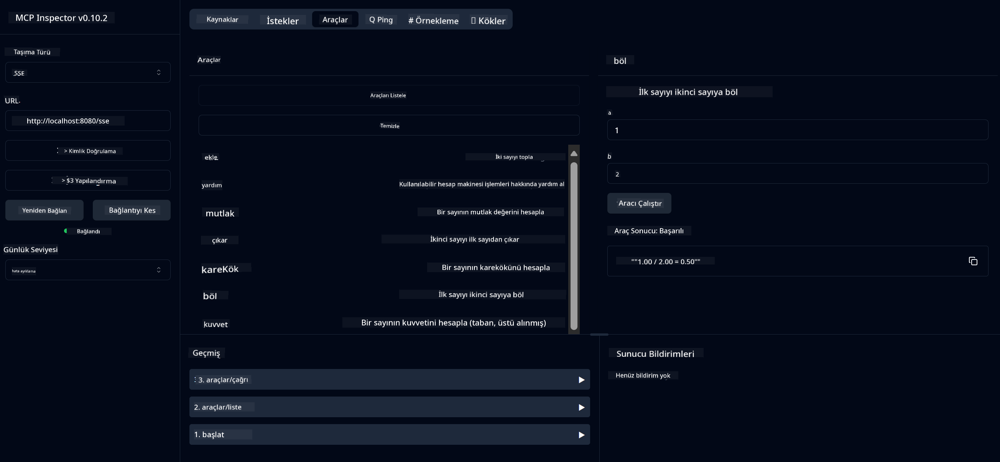

<!--
CO_OP_TRANSLATOR_METADATA:
{
  "original_hash": "ed9cab32cc67c12d8969b407aa47100a",
  "translation_date": "2025-06-11T09:32:30+00:00",
  "source_file": "03-GettingStarted/01-first-server/solution/java/README.md",
  "language_code": "tr"
}
-->
# Temel Hesap Makinesi MCP Servisi

Bu servis, Spring Boot ile WebFlux taşıma kullanarak Model Context Protocol (MCP) üzerinden temel hesap makinesi işlemleri sağlar. MCP uygulamalarını öğrenen yeni başlayanlar için basit bir örnek olarak tasarlanmıştır.

Daha fazla bilgi için, [MCP Server Boot Starter](https://docs.spring.io/spring-ai/reference/api/mcp/mcp-server-boot-starter-docs.html) referans dokümantasyonuna bakabilirsiniz.


## Servisin Kullanımı

Servis, MCP protokolü aracılığıyla aşağıdaki API uç noktalarını sunar:

- `add(a, b)`: İki sayıyı toplar
- `subtract(a, b)`: İkinci sayıdan birincisini çıkarır
- `multiply(a, b)`: İki sayıyı çarpar
- `divide(a, b)`: Birinci sayıyı ikinci sayıya böler (sıfır kontrolü ile)
- `power(base, exponent)`: Bir sayının kuvvetini hesaplar
- `squareRoot(number)`: Kare kökünü hesaplar (negatif sayı kontrolü ile)
- `modulus(a, b)`: Bölme işleminde kalanı hesaplar
- `absolute(number)`: Mutlak değeri hesaplar

## Bağımlılıklar

Proje aşağıdaki temel bağımlılıkları gerektirir:

```xml
<dependency>
    <groupId>org.springframework.ai</groupId>
    <artifactId>spring-ai-starter-mcp-server-webflux</artifactId>
</dependency>
```

## Projenin Derlenmesi

Projeyi Maven ile derleyin:
```bash
./mvnw clean install -DskipTests
```

## Sunucunun Çalıştırılması

### Java Kullanarak

```bash
java -jar target/calculator-server-0.0.1-SNAPSHOT.jar
```

### MCP Inspector Kullanarak

MCP Inspector, MCP servisleriyle etkileşim için kullanışlı bir araçtır. Bu hesap makinesi servisi ile kullanmak için:

1. **Yeni bir terminal penceresinde MCP Inspector'ı yükleyin ve çalıştırın**:
   ```bash
   npx @modelcontextprotocol/inspector
   ```

2. **Uygulamanın gösterdiği URL'ye tıklayarak web arayüzüne erişin** (genellikle http://localhost:6274)

3. **Bağlantıyı yapılandırın**:
   - Taşıma türünü "SSE" olarak ayarlayın
   - URL'yi çalışan sunucunuzun SSE uç noktası olarak ayarlayın: `http://localhost:8080/sse`
   - "Connect"e tıklayın

4. **Araçları kullanın**:
   - Mevcut hesap makinesi işlemlerini görmek için "List Tools" a tıklayın
   - Bir aracı seçin ve işlemi gerçekleştirmek için "Run Tool" a tıklayın



**Feragatname**:  
Bu belge, AI çeviri servisi [Co-op Translator](https://github.com/Azure/co-op-translator) kullanılarak çevrilmiştir. Doğruluk için çaba göstersek de, otomatik çevirilerin hata veya yanlışlık içerebileceğini lütfen unutmayınız. Orijinal belge, kendi dilinde yetkili kaynak olarak kabul edilmelidir. Kritik bilgiler için profesyonel insan çevirisi önerilir. Bu çevirinin kullanımı sonucu oluşabilecek herhangi bir yanlış anlama veya yanlış yorumlamadan sorumlu değiliz.