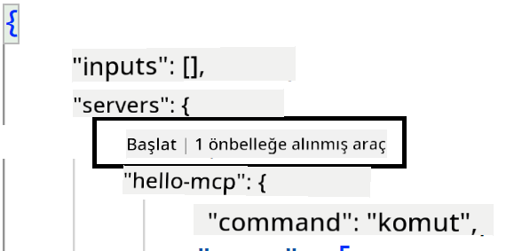
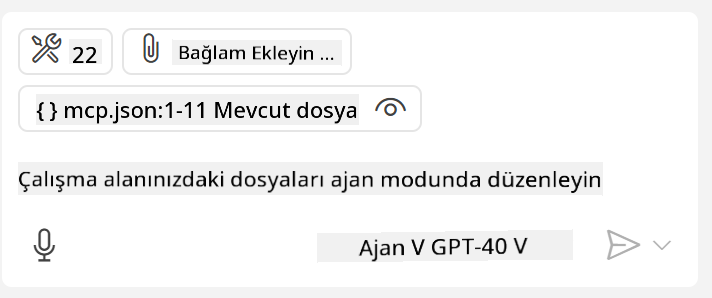
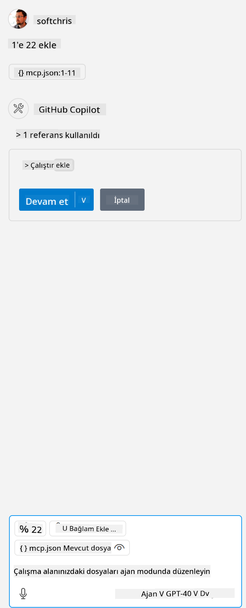

<!--
CO_OP_TRANSLATOR_METADATA:
{
  "original_hash": "c37fabfbc0dcbc9a4afb6d17e7d3be9f",
  "translation_date": "2025-05-17T11:07:45+00:00",
  "source_file": "03-GettingStarted/04-vscode/README.md",
  "language_code": "tr"
}
-->
Hadi, sonraki bölümlerde görsel arayüzü nasıl kullanacağımız hakkında daha fazla konuşalım.


## Yaklaşım

İşte bu konuda yüksek seviyede nasıl yaklaşmamız gerektiği:

- MCP Sunucumuzu bulmak için bir dosya yapılandırın.
- Sunucuyu başlatın/Bağlanın ve yeteneklerini listelemesini sağlayın.
- Bu yetenekleri GitHub Copilot'un sohbet arayüzü aracılığıyla kullanın.

Harika, şimdi akışı anladığımıza göre, Visual Studio Code aracılığıyla bir MCP Sunucusu kullanmayı bir egzersizle deneyelim.

## Egzersiz: Bir sunucu tüketmek

Bu egzersizde, GitHub Copilot'un sohbet arayüzünden kullanılabilmesi için Visual Studio Code'u MCP sunucunuzu bulacak şekilde yapılandıracağız.

### -0- Ön adım, MCP Sunucusu keşfini etkinleştirin

MCP Sunucularının keşfini etkinleştirmeniz gerekebilir.

1. `File -> Preferences -> Settings` in Visual Studio Code.

1. Search for "MCP" and enable `chat.mcp.discovery.enabled` ayarlarını settings.json dosyasında açın.

### -1- Yapılandırma dosyası oluşturun

Proje kök dizininde bir yapılandırma dosyası oluşturarak başlayın, MCP.json adında bir dosyaya ihtiyacınız olacak ve .vscode adlı bir klasöre yerleştirin. Şöyle görünmelidir:

```text
.vscode
|-- mcp.json
```

Sonraki adımda, nasıl bir sunucu girişi ekleyebileceğimizi görelim.

### -2- Bir sunucu yapılandırın

*mcp.json* dosyasına aşağıdaki içeriği ekleyin:

```json
{
    "inputs": [],
    "servers": {
       "hello-mcp": {
           "command": "cmd",
           "args": [
               "/c", "node", "<absolute path>\\build\\index.js"
           ]
       }
    }
}
```

Yukarıdaki örnek, Node.js ile yazılmış bir sunucuyu başlatmanın basit bir örneğidir, diğer çalışma zamanları için sunucuyu başlatmak için uygun komutu `command` and `args` kullanarak belirtin.

### -3- Sunucuyu başlatın

Şimdi bir giriş eklediğinize göre, sunucuyu başlatalım:

1. *mcp.json* dosyasındaki girişinizi bulun ve "oynat" simgesini bulduğunuzdan emin olun:

  

1. "Oynat" simgesine tıklayın, GitHub Copilot sohbetinde kullanılabilir araçların sayısının arttığını görmelisiniz. Bu araçlar simgesine tıklarsanız, kayıtlı araçların bir listesini göreceksiniz. GitHub Copilot'un bunları bağlam olarak kullanmasını isteyip istemediğinize göre her aracı işaretleyebilir/kaldırabilirsiniz:

  

1. Bir aracı çalıştırmak için, araçlarınızdan birinin açıklamasına uyacağını bildiğiniz bir istem yazın, örneğin "22'yi 1'e ekle" gibi bir istem:

  

  23 yanıtını görmelisiniz.

## Görev

*mcp.json* dosyanıza bir sunucu girişi eklemeyi deneyin ve sunucuyu başlatıp/durdurabildiğinizden emin olun. Ayrıca, GitHub Copilot'un sohbet arayüzü aracılığıyla sunucunuzdaki araçlarla iletişim kurabildiğinizden emin olun.

## Çözüm

[Çözüm](./solution/README.md)

## Temel Çıkarımlar

Bu bölümden çıkarılması gerekenler şunlardır:

- Visual Studio Code, birçok MCP Sunucusu ve araçlarını tüketmenizi sağlayan harika bir istemcidir.
- GitHub Copilot'un sohbet arayüzü, sunucularla nasıl etkileşimde bulunduğunuzdur.
- Kullanıcıdan API anahtarları gibi girdiler isteyebilir ve bunları *mcp.json* dosyasındaki sunucu girişini yapılandırırken MCP Sunucusuna iletebilirsiniz.

## Örnekler

- [Java Hesap Makinesi](../samples/java/calculator/README.md)
- [.Net Hesap Makinesi](../../../../03-GettingStarted/samples/csharp)
- [JavaScript Hesap Makinesi](../samples/javascript/README.md)
- [TypeScript Hesap Makinesi](../samples/typescript/README.md)
- [Python Hesap Makinesi](../../../../03-GettingStarted/samples/python)

## Ek Kaynaklar

- [Visual Studio belgeleri](https://code.visualstudio.com/docs/copilot/chat/mcp-servers)

## Sıradaki Ne

- Sonraki: [Bir SSE Sunucusu Oluşturma](/03-GettingStarted/05-sse-server/README.md)

**Feragatname**: 
Bu belge, AI çeviri hizmeti [Co-op Translator](https://github.com/Azure/co-op-translator) kullanılarak çevrilmiştir. Doğruluğu sağlamak için çaba göstersek de, otomatik çevirilerin hata veya yanlışlık içerebileceğini unutmayın. Orijinal belge, kendi dilinde yetkili kaynak olarak kabul edilmelidir. Kritik bilgiler için profesyonel insan çevirisi önerilir. Bu çevirinin kullanımından kaynaklanan yanlış anlaşılma veya yanlış yorumlamalardan sorumlu değiliz.