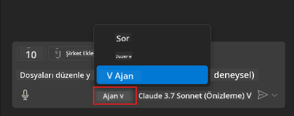
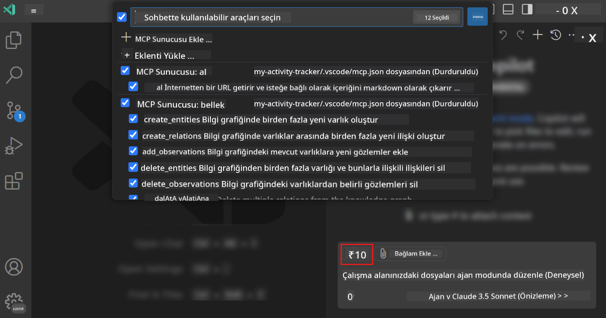
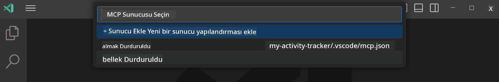
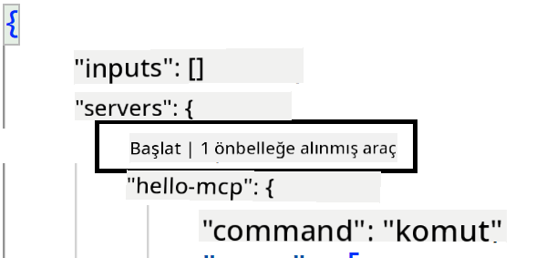

<!--
CO_OP_TRANSLATOR_METADATA:
{
  "original_hash": "d940b5e0af75e3a3a4d1c3179120d1d9",
  "translation_date": "2025-08-26T17:44:12+00:00",
  "source_file": "03-GettingStarted/04-vscode/README.md",
  "language_code": "tr"
}
-->
# GitHub Copilot Agent Modunda Bir Sunucu Kullanma

Visual Studio Code ve GitHub Copilot, bir MCP Sunucusunu istemci olarak kullanabilir. Peki, neden bunu yapmak isteyelim diye sorabilirsiniz? Çünkü bu, MCP Sunucusunun sahip olduğu tüm özelliklerin artık IDE'nizden kullanılabileceği anlamına gelir. Örneğin, GitHub'ın MCP sunucusunu eklediğinizi düşünün; bu, terminalde belirli komutları yazmak yerine GitHub'ı istemler aracılığıyla kontrol etmenizi sağlar. Ya da genel olarak geliştirici deneyiminizi iyileştirebilecek her şeyin doğal dil ile kontrol edildiğini hayal edin. Şimdi bunun ne kadar faydalı olduğunu görebiliyorsunuz, değil mi?

## Genel Bakış

Bu ders, Visual Studio Code ve GitHub Copilot'un Agent modunu MCP Sunucusu için bir istemci olarak nasıl kullanacağınızı kapsar.

## Öğrenme Hedefleri

Bu dersin sonunda şunları yapabileceksiniz:

- Visual Studio Code aracılığıyla bir MCP Sunucusunu kullanmak.
- GitHub Copilot üzerinden araçlar gibi yetenekleri çalıştırmak.
- MCP Sunucunuzu bulmak ve yönetmek için Visual Studio Code'u yapılandırmak.

## Kullanım

MCP sunucunuzu iki farklı şekilde kontrol edebilirsiniz:

- Kullanıcı arayüzü: Bu bölümün ilerleyen kısımlarında bunun nasıl yapıldığını göreceksiniz.
- Terminal: `code` çalıştırılabilir dosyasını kullanarak terminalden kontrol etmek mümkündür:

  Kullanıcı profilinize bir MCP sunucusu eklemek için --add-mcp komut satırı seçeneğini kullanın ve JSON sunucu yapılandırmasını {\"name\":\"server-name\",\"command\":...} biçiminde sağlayın.

  ```
  code --add-mcp "{\"name\":\"my-server\",\"command\": \"uvx\",\"args\": [\"mcp-server-fetch\"]}"
  ```

### Ekran Görüntüleri

  
  
  

Bir sonraki bölümlerde görsel arayüzü nasıl kullandığımızdan daha fazla bahsedelim.

## Yaklaşım

Bu işlemi yüksek seviyede şu şekilde ele almalıyız:

- MCP Sunucumuzu bulmak için bir dosya yapılandırın.
- Sunucuyu başlatın/bağlanın ve yeteneklerini listelemesini sağlayın.
- GitHub Copilot Sohbet arayüzü aracılığıyla bu yetenekleri kullanın.

Harika, şimdi akışı anladığımıza göre, bir egzersizle Visual Studio Code üzerinden bir MCP Sunucusu kullanmayı deneyelim.

## Egzersiz: Bir sunucu kullanma

Bu egzersizde, GitHub Copilot Sohbet arayüzü üzerinden kullanılabilmesi için Visual Studio Code'u MCP sunucunuzu bulacak şekilde yapılandıracağız.

### -0- Ön adım, MCP Sunucu keşfini etkinleştirin

MCP Sunucularının keşfini etkinleştirmeniz gerekebilir.

1. Visual Studio Code'da `File -> Preferences -> Settings` menüsüne gidin.

1. "MCP" araması yapın ve settings.json dosyasında `chat.mcp.discovery.enabled` seçeneğini etkinleştirin.

### -1- Yapılandırma dosyası oluşturun

Proje kök dizininizde bir yapılandırma dosyası oluşturarak başlayın. *MCP.json* adında bir dosyaya ve bunu .vscode adlı bir klasöre yerleştirmeniz gerekecek. Şöyle görünmelidir:

```text
.vscode
|-- mcp.json
```

Şimdi bir sunucu girişi nasıl eklenir, ona bakalım.

### -2- Bir sunucu yapılandırın

*mcp.json* dosyasına şu içeriği ekleyin:

```json
{
    "inputs": [],
    "servers": {
       "hello-mcp": {
           "command": "node",
           "args": [
               "build/index.js"
           ]
       }
    }
}
```

Yukarıdaki örnek, Node.js ile yazılmış bir sunucuyu başlatmanın basit bir örneğidir. Diğer çalışma zamanları için, sunucuyu başlatmak için uygun komutu `command` ve `args` kullanarak belirtin.

### -3- Sunucuyu başlatın

Bir giriş eklediğinize göre, şimdi sunucuyu başlatalım:

1. *mcp.json* dosyanızdaki girişinizi bulun ve "oynat" simgesini bulduğunuzdan emin olun:

    

1. "Oynat" simgesine tıklayın, GitHub Copilot Sohbet'teki araçlar simgesinin mevcut araç sayısını artırdığını görmelisiniz. Bu araçlar simgesine tıklarsanız, kayıtlı araçların bir listesini göreceksiniz. GitHub Copilot'un bunları bağlam olarak kullanmasını isteyip istemediğinize bağlı olarak her bir aracı işaretleyebilir/işaretini kaldırabilirsiniz:

  

1. Bir aracı çalıştırmak için, araçlarınızdan birinin açıklamasına uyacağını bildiğiniz bir istem yazın, örneğin "22 ile 1'i topla" gibi bir istem:

  

  23 yanıtını görmelisiniz.

## Ödev

*mcp.json* dosyanıza bir sunucu girişi eklemeyi deneyin ve sunucuyu başlatıp/durdurabildiğinizden emin olun. Ayrıca, GitHub Copilot Sohbet arayüzü aracılığıyla sunucunuzdaki araçlarla iletişim kurabildiğinizden emin olun.

## Çözüm

[Çözüm](./solution/README.md)

## Temel Çıkarımlar

Bu bölümden çıkarılacaklar şunlardır:

- Visual Studio Code, birden fazla MCP Sunucusunu ve araçlarını kullanmanıza olanak tanıyan harika bir istemcidir.
- GitHub Copilot Sohbet arayüzü, sunucularla nasıl etkileşim kurduğunuzdur.
- *mcp.json* dosyasındaki sunucu girişini yapılandırırken MCP Sunucusuna iletilebilecek API anahtarları gibi girdiler için kullanıcıdan istemde bulunabilirsiniz.

## Örnekler

- [Java Hesap Makinesi](../samples/java/calculator/README.md)  
- [.Net Hesap Makinesi](../../../../03-GettingStarted/samples/csharp)  
- [JavaScript Hesap Makinesi](../samples/javascript/README.md)  
- [TypeScript Hesap Makinesi](../samples/typescript/README.md)  
- [Python Hesap Makinesi](../../../../03-GettingStarted/samples/python)  

## Ek Kaynaklar

- [Visual Studio belgeleri](https://code.visualstudio.com/docs/copilot/chat/mcp-servers)

## Sıradaki

- Sıradaki: [Bir stdio Sunucusu Oluşturma](../05-stdio-server/README.md)

---

**Feragatname**:  
Bu belge, AI çeviri hizmeti [Co-op Translator](https://github.com/Azure/co-op-translator) kullanılarak çevrilmiştir. Doğruluk için çaba göstersek de, otomatik çevirilerin hata veya yanlışlıklar içerebileceğini lütfen unutmayın. Belgenin orijinal dili, yetkili kaynak olarak kabul edilmelidir. Kritik bilgiler için profesyonel insan çevirisi önerilir. Bu çevirinin kullanımından kaynaklanan yanlış anlamalar veya yanlış yorumlamalar için sorumluluk kabul etmiyoruz.