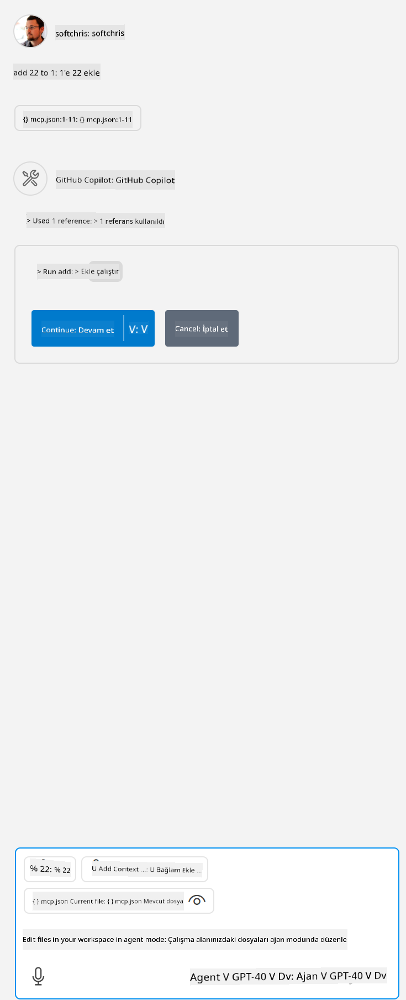

<!--
CO_OP_TRANSLATOR_METADATA:
{
  "original_hash": "5ef8f5821c1a04f7b1fc4f15098ecab8",
  "translation_date": "2025-07-13T19:42:33+00:00",
  "source_file": "03-GettingStarted/04-vscode/solution/README.md",
  "language_code": "tr"
}
-->
Bu, şu komutu çalıştırmaya karşılık gelir: `node build/index.js`.

- Bu server girişini, server dosyanızın bulunduğu yere veya seçtiğiniz çalışma zamanı ve server konumuna bağlı olarak serverınızı başlatmak için gereken tam komutu gösterecek şekilde değiştirin.

## Serverdaki özellikleri kullanma

- *mcp.json* dosyasını *./vscode* klasörüne ekledikten sonra `play` simgesine tıklayın,

    Araç simgesinin değişerek kullanılabilir araç sayısını artırdığını gözlemleyin. Araç simgesi, GitHub Copilot'ta sohbet alanının hemen üstünde bulunur.

## Bir aracı çalıştırma

- Sohbet penceresine, aracınızın açıklamasına uygun bir komut yazın. Örneğin, `add` aracını tetiklemek için "add 3 to 20" gibi bir şey yazın.

    Sohbet metin kutusunun üstünde, aracı çalıştırmak için seçmeniz gerektiğini belirten bir araç sunulduğunu görmelisiniz, şu görseldeki gibi:

    

    Aracı seçmek, eğer önceki örnekteki gibi bir komut yazdıysanız, "23" gibi sayısal bir sonuç üretmelidir.

**Feragatname**:  
Bu belge, AI çeviri servisi [Co-op Translator](https://github.com/Azure/co-op-translator) kullanılarak çevrilmiştir. Doğruluk için çaba gösterilse de, otomatik çevirilerin hatalar veya yanlışlıklar içerebileceğini lütfen unutmayınız. Orijinal belge, kendi dilinde yetkili kaynak olarak kabul edilmelidir. Kritik bilgiler için profesyonel insan çevirisi önerilir. Bu çevirinin kullanımı sonucu oluşabilecek yanlış anlamalar veya yorum hatalarından sorumlu değiliz.