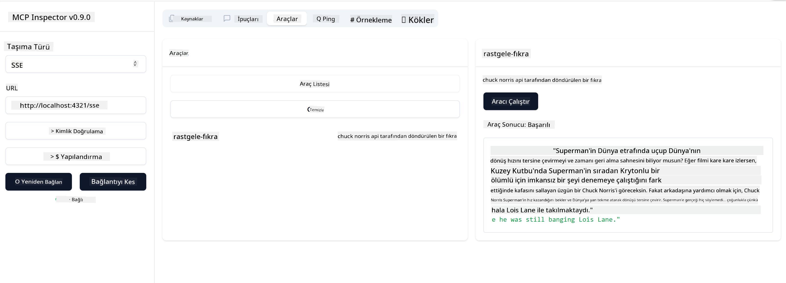

<!--
CO_OP_TRANSLATOR_METADATA:
{
  "original_hash": "0a8086dc4bf89448f83e7936db972c42",
  "translation_date": "2025-05-17T11:34:36+00:00",
  "source_file": "03-GettingStarted/05-sse-server/README.md",
  "language_code": "tr"
}
-->
Artık SSE hakkında biraz daha bilgi sahibi olduğumuza göre, bir SSE sunucusu oluşturalım.

## Alıştırma: SSE Sunucusu Oluşturma

Sunucumuzu oluşturmak için iki şeyi akılda tutmamız gerekiyor:

- Bağlantı ve mesajlar için uç noktalar açığa çıkaran bir web sunucusu kullanmalıyız.
- Sunucumuzu, stdio kullanırken araçlar, kaynaklar ve istemlerle yaptığımız gibi normal bir şekilde oluşturmalıyız.

### -1- Sunucu örneği oluşturma

Sunucumuzu oluşturmak için stdio ile aynı türleri kullanıyoruz. Ancak, taşıma için SSE'yi seçmemiz gerekiyor.

Gerekli yolları ekleyelim.

### -2- Yolları ekleme

Bağlantı ve gelen mesajları yöneten yolları ekleyelim.

Sunucuya yetenekler ekleyelim.

### -3- Sunucu yeteneklerini ekleme

Artık SSE'ye özgü her şeyi tanımladığımıza göre, araçlar, istemler ve kaynaklar gibi sunucu yeteneklerini ekleyelim.

Kodunuzun tamamı şöyle görünmelidir:

Harika, SSE kullanan bir sunucumuz var, şimdi onu bir deneyelim.

## Alıştırma: Inspector ile SSE Sunucusunu Hata Ayıklama

Inspector, önceki bir derste gördüğümüz harika bir araçtır [İlk sunucunuzu oluşturma](/03-GettingStarted/01-first-server/README.md). Bakalım burada bile Inspector'ü kullanabilir miyiz:

### -1- Inspector'ü çalıştırma

Inspector'ü çalıştırmak için önce bir SSE sunucusunun çalışıyor olması gerekiyor, o yüzden bunu yapalım:

1. Sunucuyu çalıştırın

1. Inspector'ü çalıştırın

    > ![NOTE]
    > Bunu sunucunun çalıştığı terminal penceresinden ayrı bir pencerede çalıştırın. Ayrıca, aşağıdaki komutu sunucunuzun çalıştığı URL'ye uyacak şekilde ayarlamanız gerektiğini unutmayın.

    ```sh
    npx @modelcontextprotocol/inspector --cli http://localhost:8000/sse --method tools/list
    ```

    Inspector'ü çalıştırmak tüm çalışma zamanlarında aynı görünür. Sunucumuzu başlatmak için bir yol ve komut yerine, sunucunun çalıştığı URL'yi geçiyoruz ve ayrıca `/sse` yolunu belirtiyoruz.

### -2- Aracı deneme

Sunucuya bağlanmak için açılır listeden SSE'yi seçin ve sunucunuzun çalıştığı URL alanını doldurun, örneğin http:localhost:4321/sse. Şimdi "Bağlan" düğmesine tıklayın. Önceki gibi, araçları listelemeyi seçin, bir araç seçin ve giriş değerleri sağlayın. Aşağıdaki gibi bir sonuç görmelisiniz:



Harika, Inspector ile çalışabiliyorsunuz, şimdi Visual Studio Code ile nasıl çalışabileceğimizi görelim.

## Görev

Sunucunuzu daha fazla yetenekle oluşturmaya çalışın. Örneğin bir API çağıran bir araç eklemek için [bu sayfaya](https://api.chucknorris.io/) bakın, sunucunun nasıl görünmesi gerektiğine siz karar verin. Eğlenin :)

## Çözüm

[Çözüm](./solution/README.md) İşte çalışan kodla olası bir çözüm.

## Temel Çıkarımlar

Bu bölümden çıkarılacaklar şunlardır:

- SSE, stdio'ya ek olarak desteklenen ikinci taşıma türüdür.
- SSE'yi desteklemek için, bir web çerçevesi kullanarak gelen bağlantıları ve mesajları yönetmeniz gerekir.
- SSE sunucusunu tüketmek için hem Inspector hem de Visual Studio Code'u kullanabilirsiniz, tıpkı stdio sunucuları gibi. stdio ve SSE arasında biraz farklılık gösterdiğine dikkat edin. SSE için sunucuyu ayrı olarak başlatmanız ve ardından Inspector aracınızı çalıştırmanız gerekir. Inspector aracı için, URL belirtmeniz gerektiği konusunda bazı farklılıklar vardır.

## Örnekler

- [Java Hesap Makinesi](../samples/java/calculator/README.md)
- [.Net Hesap Makinesi](../../../../03-GettingStarted/samples/csharp)
- [JavaScript Hesap Makinesi](../samples/javascript/README.md)
- [TypeScript Hesap Makinesi](../samples/typescript/README.md)
- [Python Hesap Makinesi](../../../../03-GettingStarted/samples/python)

## Ek Kaynaklar

- [SSE](https://developer.mozilla.org/en-US/docs/Web/API/Server-sent_events)

## Sıradaki

- Sonraki: [VSCode için AI Toolkit ile Başlarken](/03-GettingStarted/06-aitk/README.md)

**Feragatname**:  
Bu belge, [Co-op Translator](https://github.com/Azure/co-op-translator) adlı AI çeviri hizmeti kullanılarak çevrilmiştir. Doğruluk için çaba göstersek de, otomatik çevirilerin hata veya yanlışlıklar içerebileceğini lütfen unutmayın. Orijinal belgenin kendi dilindeki hali yetkili kaynak olarak kabul edilmelidir. Kritik bilgiler için profesyonel insan çevirisi önerilir. Bu çevirinin kullanımından doğabilecek yanlış anlamalar veya yanlış yorumlamalardan sorumlu değiliz.