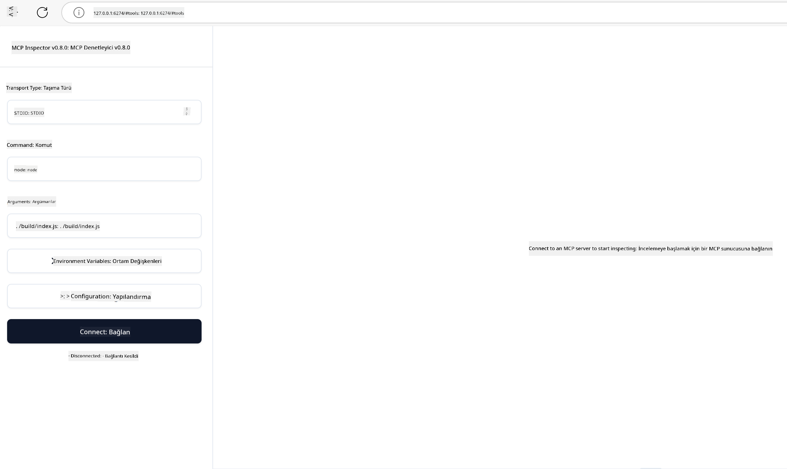

<!--
CO_OP_TRANSLATOR_METADATA:
{
  "original_hash": "4e34e34e84f013e73c7eaa6d09884756",
  "translation_date": "2025-07-13T22:00:24+00:00",
  "source_file": "03-GettingStarted/08-testing/README.md",
  "language_code": "tr"
}
-->
## Test Etme ve Hata Ayıklama

MCP sunucunuzu test etmeye başlamadan önce, kullanılabilir araçları ve hata ayıklama için en iyi uygulamaları anlamak önemlidir. Etkili test, sunucunuzun beklendiği gibi çalışmasını sağlar ve sorunları hızlıca tespit edip çözmenize yardımcı olur. Aşağıdaki bölüm, MCP uygulamanızı doğrulamak için önerilen yaklaşımları özetlemektedir.

## Genel Bakış

Bu ders, doğru test yaklaşımının nasıl seçileceğini ve en etkili test aracını nasıl kullanacağınızı ele alır.

## Öğrenme Hedefleri

Bu dersin sonunda şunları yapabileceksiniz:

- Test için çeşitli yaklaşımları tanımlamak.
- Kodunuzu etkili bir şekilde test etmek için farklı araçları kullanmak.

## MCP Sunucularını Test Etme

MCP, sunucularınızı test etmenize ve hata ayıklamanıza yardımcı olacak araçlar sunar:

- **MCP Inspector**: Hem komut satırı aracı olarak hem de görsel araç olarak çalıştırılabilen bir komut satırı aracı.
- **Manuel test**: curl gibi bir araç kullanarak web istekleri yapabilirsiniz, ancak HTTP çalıştırabilen herhangi bir araç işinizi görür.
- **Birim testi**: Tercih ettiğiniz test çerçevesini kullanarak hem sunucu hem de istemci özelliklerini test etmek mümkündür.

### MCP Inspector Kullanımı

Bu aracın kullanımını önceki derslerde anlattık ancak burada biraz genel hatlarıyla bahsedelim. Node.js ile geliştirilmiş bir araçtır ve `npx` yürütülebilir dosyasını çağırarak kullanabilirsiniz; bu, aracı geçici olarak indirip kurar ve isteğiniz tamamlandıktan sonra kendini temizler.

[MCP Inspector](https://github.com/modelcontextprotocol/inspector) size şunları sağlar:

- **Sunucu Yetkinliklerini Keşfetme**: Mevcut kaynakları, araçları ve istemleri otomatik olarak algılar
- **Araç Çalıştırmayı Test Etme**: Farklı parametreleri deneyip yanıtları gerçek zamanlı görebilirsiniz
- **Sunucu Meta Verilerini Görüntüleme**: Sunucu bilgilerini, şemaları ve yapılandırmaları inceleyebilirsiniz

Aracın tipik bir çalıştırması şu şekildedir:

```bash
npx @modelcontextprotocol/inspector node build/index.js
```

Yukarıdaki komut, bir MCP ve görsel arayüzünü başlatır ve tarayıcınızda yerel bir web arayüzü açar. Kayıtlı MCP sunucularınızı, mevcut araçlarını, kaynaklarını ve istemlerini gösteren bir kontrol paneli görmeyi bekleyebilirsiniz. Arayüz, araç çalıştırmayı etkileşimli olarak test etmenize, sunucu meta verilerini incelemenize ve gerçek zamanlı yanıtları görmenize olanak tanır; böylece MCP sunucu uygulamalarınızı doğrulamak ve hata ayıklamak kolaylaşır.

Şöyle görünebilir: 

Bu aracı CLI modunda da çalıştırabilirsiniz; bu durumda `--cli` parametresini eklersiniz. İşte sunucudaki tüm araçları listeleyen "CLI" modunda çalıştırma örneği:

```sh
npx @modelcontextprotocol/inspector --cli node build/index.js --method tools/list
```

### Manuel Test

Sunucu yetkinliklerini test etmek için inspector aracını çalıştırmanın yanı sıra, HTTP kullanabilen bir istemciyi, örneğin curl'u çalıştırmak da benzer bir yaklaşımdır.

curl ile MCP sunucularını doğrudan HTTP istekleriyle test edebilirsiniz:

```bash
# Example: Test server metadata
curl http://localhost:3000/v1/metadata

# Example: Execute a tool
curl -X POST http://localhost:3000/v1/tools/execute \
  -H "Content-Type: application/json" \
  -d '{"name": "calculator", "parameters": {"expression": "2+2"}}'
```

Yukarıdaki curl kullanımından da görebileceğiniz gibi, bir aracı çağırmak için araç adı ve parametrelerinden oluşan bir yükle POST isteği yapıyorsunuz. Size en uygun olan yaklaşımı kullanın. CLI araçları genellikle daha hızlıdır ve betiklenebilir olmaları CI/CD ortamlarında faydalı olabilir.

### Birim Testi

Araçlarınız ve kaynaklarınız için birim testleri oluşturun, böylece beklendiği gibi çalıştıklarından emin olabilirsiniz. İşte bazı örnek test kodları.

```python
import pytest

from mcp.server.fastmcp import FastMCP
from mcp.shared.memory import (
    create_connected_server_and_client_session as create_session,
)

# Mark the whole module for async tests
pytestmark = pytest.mark.anyio


async def test_list_tools_cursor_parameter():
    """Test that the cursor parameter is accepted for list_tools.

    Note: FastMCP doesn't currently implement pagination, so this test
    only verifies that the cursor parameter is accepted by the client.
    """

 server = FastMCP("test")

    # Create a couple of test tools
    @server.tool(name="test_tool_1")
    async def test_tool_1() -> str:
        """First test tool"""
        return "Result 1"

    @server.tool(name="test_tool_2")
    async def test_tool_2() -> str:
        """Second test tool"""
        return "Result 2"

    async with create_session(server._mcp_server) as client_session:
        # Test without cursor parameter (omitted)
        result1 = await client_session.list_tools()
        assert len(result1.tools) == 2

        # Test with cursor=None
        result2 = await client_session.list_tools(cursor=None)
        assert len(result2.tools) == 2

        # Test with cursor as string
        result3 = await client_session.list_tools(cursor="some_cursor_value")
        assert len(result3.tools) == 2

        # Test with empty string cursor
        result4 = await client_session.list_tools(cursor="")
        assert len(result4.tools) == 2
    
```

Yukarıdaki kod şunları yapar:

- Fonksiyon olarak testler oluşturmanıza ve assert ifadeleri kullanmanıza olanak tanıyan pytest çerçevesini kullanır.
- İki farklı araca sahip bir MCP Sunucusu oluşturur.
- Belirli koşulların sağlandığını kontrol etmek için `assert` ifadesi kullanır.

[Tam dosyaya buradan bakabilirsiniz](https://github.com/modelcontextprotocol/python-sdk/blob/main/tests/client/test_list_methods_cursor.py)

Yukarıdaki dosyaya dayanarak, kendi sunucunuzu test ederek yetkinliklerin doğru oluşturulduğundan emin olabilirsiniz.

Tüm büyük SDK'larda benzer test bölümleri bulunur, böylece seçtiğiniz çalışma ortamına uyarlayabilirsiniz.

## Örnekler

- [Java Calculator](../samples/java/calculator/README.md)
- [.Net Calculator](../../../../03-GettingStarted/samples/csharp)
- [JavaScript Calculator](../samples/javascript/README.md)
- [TypeScript Calculator](../samples/typescript/README.md)
- [Python Calculator](../../../../03-GettingStarted/samples/python)

## Ek Kaynaklar

- [Python SDK](https://github.com/modelcontextprotocol/python-sdk)

## Sonraki Adım

- Sonraki: [Deployment](../09-deployment/README.md)

**Feragatname**:  
Bu belge, AI çeviri servisi [Co-op Translator](https://github.com/Azure/co-op-translator) kullanılarak çevrilmiştir. Doğruluk için çaba göstersek de, otomatik çevirilerin hatalar veya yanlışlıklar içerebileceğini lütfen unutmayınız. Orijinal belge, kendi dilinde yetkili kaynak olarak kabul edilmelidir. Kritik bilgiler için profesyonel insan çevirisi önerilir. Bu çevirinin kullanımı sonucu oluşabilecek yanlış anlamalar veya yorum hatalarından sorumlu değiliz.