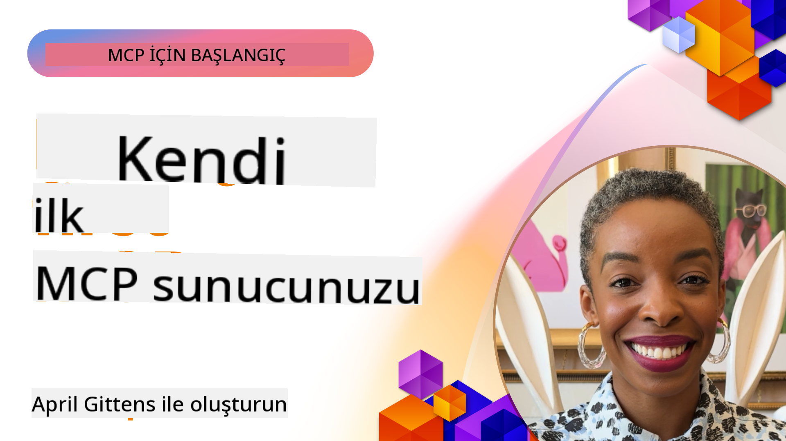

<!--
CO_OP_TRANSLATOR_METADATA:
{
  "original_hash": "858362ce0118de3fec0f9114bf396101",
  "translation_date": "2025-08-18T17:57:58+00:00",
  "source_file": "03-GettingStarted/README.md",
  "language_code": "tr"
}
-->
## Başlarken  

_(Bu dersin videosunu izlemek için yukarıdaki görsele tıklayın)_

Bu bölüm birkaç dersten oluşmaktadır:

- **1 İlk sunucunuz**, bu ilk derste, ilk sunucunuzu nasıl oluşturacağınızı ve bunu test etmek ve hata ayıklamak için değerli bir araç olan denetçi aracıyla nasıl inceleyeceğinizi öğreneceksiniz, [derse gitmek için](01-first-server/README.md)

- **2 İstemci**, bu derste, sunucunuza bağlanabilecek bir istemci yazmayı öğreneceksiniz, [derse gitmek için](02-client/README.md)

- **3 LLM ile İstemci**, bir istemci yazmanın daha iyi bir yolu, bir LLM ekleyerek sunucunuzla ne yapması gerektiğini "müzakere etmesini" sağlamaktır, [derse gitmek için](03-llm-client/README.md)

- **4 Visual Studio Code'da GitHub Copilot Agent modunda bir sunucuyu tüketmek**. Burada MCP Sunucumuzu Visual Studio Code içinde çalıştırmayı inceleyeceğiz, [derse gitmek için](04-vscode/README.md)

- **5 SSE (Sunucu Gönderimli Olaylar) üzerinden tüketim**. SSE, sunucuların HTTP üzerinden gerçek zamanlı güncellemeleri istemcilere iletmesine olanak tanıyan bir sunucudan istemciye akış standardıdır, [derse gitmek için](05-sse-server/README.md)

- **6 MCP ile HTTP Akışı (Akışlı HTTP)**. Modern HTTP akışı, ilerleme bildirimleri ve Akışlı HTTP kullanarak ölçeklenebilir, gerçek zamanlı MCP sunucuları ve istemcileri nasıl uygulayacağınızı öğrenin, [derse gitmek için](06-http-streaming/README.md)

- **7 VSCode için AI Toolkit'i kullanma** MCP İstemcilerinizi ve Sunucularınızı tüketmek ve test etmek için [derse gitmek için](07-aitk/README.md)

- **8 Test Etme**. Burada özellikle sunucumuzu ve istemcimizi farklı şekillerde nasıl test edebileceğimize odaklanacağız, [derse gitmek için](08-testing/README.md)

- **9 Dağıtım**. Bu bölümde MCP çözümlerinizi dağıtmanın farklı yollarını inceleyeceğiz, [derse gitmek için](09-deployment/README.md)

Model Context Protocol (MCP), uygulamaların LLM'lere bağlam sağlamasını standartlaştıran açık bir protokoldür. MCP'yi AI uygulamaları için bir USB-C portu gibi düşünün - AI modellerini farklı veri kaynaklarına ve araçlara bağlamak için standart bir yol sağlar.

## Öğrenme Hedefleri

Bu dersin sonunda şunları yapabileceksiniz:

- MCP için C#, Java, Python, TypeScript ve JavaScript'te geliştirme ortamları kurmak
- Özelleştirilmiş özelliklere (kaynaklar, istemler ve araçlar) sahip temel MCP sunucuları oluşturmak ve dağıtmak
- MCP sunucularına bağlanan ana uygulamalar oluşturmak
- MCP uygulamalarını test etmek ve hata ayıklamak
- Yaygın kurulum zorluklarını ve çözümlerini anlamak
- MCP uygulamalarınızı popüler LLM hizmetlerine bağlamak

## MCP Ortamınızı Kurma

MCP ile çalışmaya başlamadan önce, geliştirme ortamınızı hazırlamak ve temel iş akışını anlamak önemlidir. Bu bölüm, MCP ile sorunsuz bir başlangıç için gerekli kurulum adımlarında size rehberlik edecektir.

### Ön Koşullar

MCP geliştirmeye başlamadan önce, aşağıdakilere sahip olduğunuzdan emin olun:

- **Geliştirme Ortamı**: Seçtiğiniz dil için (C#, Java, Python, TypeScript veya JavaScript)
- **IDE/Düzenleyici**: Visual Studio, Visual Studio Code, IntelliJ, Eclipse, PyCharm veya herhangi bir modern kod düzenleyici
- **Paket Yöneticileri**: NuGet, Maven/Gradle, pip veya npm/yarn
- **API Anahtarları**: Ana uygulamalarınızda kullanmayı planladığınız AI hizmetleri için

### Resmi SDK'lar

İlerleyen bölümlerde Python, TypeScript, Java ve .NET kullanılarak oluşturulmuş çözümler göreceksiniz. İşte resmi olarak desteklenen tüm SDK'lar.

MCP, birden fazla dil için resmi SDK'lar sağlar:
- [C# SDK](https://github.com/modelcontextprotocol/csharp-sdk) - Microsoft ile iş birliği içinde sürdürülmektedir
- [Java SDK](https://github.com/modelcontextprotocol/java-sdk) - Spring AI ile iş birliği içinde sürdürülmektedir
- [TypeScript SDK](https://github.com/modelcontextprotocol/typescript-sdk) - Resmi TypeScript uygulaması
- [Python SDK](https://github.com/modelcontextprotocol/python-sdk) - Resmi Python uygulaması
- [Kotlin SDK](https://github.com/modelcontextprotocol/kotlin-sdk) - Resmi Kotlin uygulaması
- [Swift SDK](https://github.com/modelcontextprotocol/swift-sdk) - Loopwork AI ile iş birliği içinde sürdürülmektedir
- [Rust SDK](https://github.com/modelcontextprotocol/rust-sdk) - Resmi Rust uygulaması

## Önemli Noktalar

- MCP geliştirme ortamını kurmak, dil spesifik SDK'larla oldukça basittir
- MCP sunucuları oluşturmak, açık şemalarla araçlar oluşturmayı ve kaydetmeyi içerir
- MCP istemcileri, genişletilmiş yeteneklerden yararlanmak için sunuculara ve modellere bağlanır
- Güvenilir MCP uygulamaları için test ve hata ayıklama çok önemlidir
- Dağıtım seçenekleri, yerel geliştirmeden bulut tabanlı çözümlere kadar çeşitlilik gösterir

## Uygulama

Bu bölümdeki tüm derslerde göreceğiniz alıştırmaları tamamlayan bir dizi örneğimiz var. Ayrıca her bölüm kendi alıştırmalarını ve ödevlerini içerir.

- [Java Hesap Makinesi](./samples/java/calculator/README.md)
- [.Net Hesap Makinesi](../../../03-GettingStarted/samples/csharp)
- [JavaScript Hesap Makinesi](./samples/javascript/README.md)
- [TypeScript Hesap Makinesi](./samples/typescript/README.md)
- [Python Hesap Makinesi](../../../03-GettingStarted/samples/python)

## Ek Kaynaklar

- [Model Context Protocol kullanarak Azure'da Agent'lar oluşturun](https://learn.microsoft.com/azure/developer/ai/intro-agents-mcp)
- [Azure Container Apps ile Uzaktan MCP (Node.js/TypeScript/JavaScript)](https://learn.microsoft.com/samples/azure-samples/mcp-container-ts/mcp-container-ts/)
- [.NET OpenAI MCP Agent](https://learn.microsoft.com/samples/azure-samples/openai-mcp-agent-dotnet/openai-mcp-agent-dotnet/)

## Sıradaki Adım

Sonraki: [İlk MCP Sunucunuzu Oluşturma](01-first-server/README.md)

**Feragatname**:  
Bu belge, AI çeviri hizmeti [Co-op Translator](https://github.com/Azure/co-op-translator) kullanılarak çevrilmiştir. Doğruluk için çaba göstersek de, otomatik çevirilerin hata veya yanlışlıklar içerebileceğini lütfen unutmayın. Belgenin orijinal dili, yetkili kaynak olarak kabul edilmelidir. Kritik bilgiler için profesyonel insan çevirisi önerilir. Bu çevirinin kullanımından kaynaklanan herhangi bir yanlış anlama veya yanlış yorumlama durumunda sorumluluk kabul etmiyoruz.