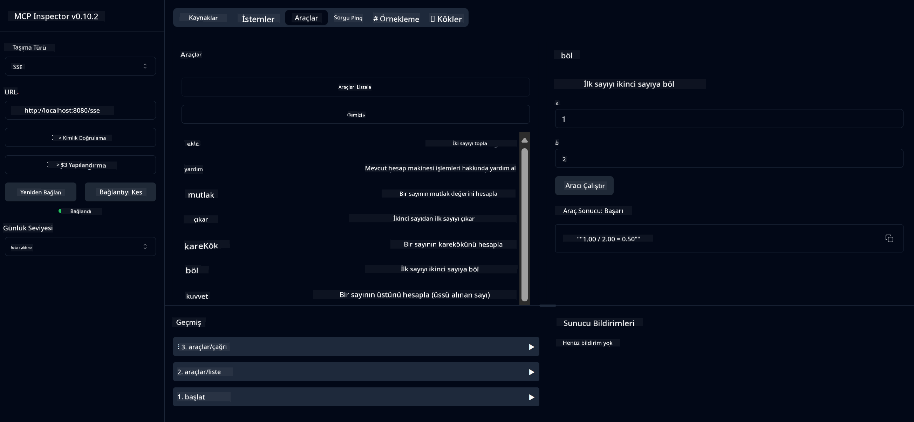

<!--
CO_OP_TRANSLATOR_METADATA:
{
  "original_hash": "13231e9951b68efd9df8c56bd5cdb27e",
  "translation_date": "2025-07-13T22:26:37+00:00",
  "source_file": "03-GettingStarted/samples/java/calculator/README.md",
  "language_code": "tr"
}
-->
# Temel Hesap Makinesi MCP Servisi

Bu servis, Model Context Protocol (MCP) üzerinden Spring Boot ve WebFlux taşıma katmanını kullanarak temel hesap makinesi işlemleri sağlar. MCP uygulamalarını öğrenen yeni başlayanlar için basit bir örnek olarak tasarlanmıştır.

Daha fazla bilgi için [MCP Server Boot Starter](https://docs.spring.io/spring-ai/reference/api/mcp/mcp-server-boot-starter-docs.html) referans dokümantasyonuna bakabilirsiniz.

## Genel Bakış

Servis şunları gösterir:
- SSE (Server-Sent Events) desteği
- Spring AI'nin `@Tool` anotasyonu ile otomatik araç kaydı
- Temel hesap makinesi fonksiyonları:
  - Toplama, çıkarma, çarpma, bölme
  - Üs alma ve karekök
  - Modül (kalan) ve mutlak değer
  - İşlem açıklamaları için yardım fonksiyonu

## Özellikler

Bu hesap makinesi servisi aşağıdaki yetenekleri sunar:

1. **Temel Aritmetik İşlemler**:
   - İki sayının toplanması
   - Bir sayının diğerinden çıkarılması
   - İki sayının çarpılması
   - Bir sayının diğerine bölünmesi (sıfıra bölme kontrolü ile)

2. **Gelişmiş İşlemler**:
   - Üs alma (tabanı kuvvetle yükseltme)
   - Karekök hesaplama (negatif sayı kontrolü ile)
   - Modül (kalan) hesaplama
   - Mutlak değer hesaplama

3. **Yardım Sistemi**:
   - Mevcut tüm işlemleri açıklayan yerleşik yardım fonksiyonu

## Servisin Kullanımı

Servis, MCP protokolü üzerinden aşağıdaki API uç noktalarını sunar:

- `add(a, b)`: İki sayıyı toplar
- `subtract(a, b)`: İkinci sayıyı birinciden çıkarır
- `multiply(a, b)`: İki sayıyı çarpar
- `divide(a, b)`: Birinci sayıyı ikinciye böler (sıfır kontrolü ile)
- `power(base, exponent)`: Bir sayının üssünü hesaplar
- `squareRoot(number)`: Karekök hesaplar (negatif sayı kontrolü ile)
- `modulus(a, b)`: Bölme işleminde kalanı hesaplar
- `absolute(number)`: Mutlak değeri hesaplar
- `help()`: Mevcut işlemler hakkında bilgi verir

## Test İstemcisi

`com.microsoft.mcp.sample.client` paketinde basit bir test istemcisi bulunmaktadır. `SampleCalculatorClient` sınıfı, hesap makinesi servisinin mevcut işlemlerini gösterir.

## LangChain4j İstemcisinin Kullanımı

Projede, hesap makinesi servisini LangChain4j ve GitHub modelleri ile entegre etmeyi gösteren `com.microsoft.mcp.sample.client.LangChain4jClient` adlı bir LangChain4j örnek istemcisi bulunmaktadır:

### Ön Koşullar

1. **GitHub Token Ayarı**:
   
   GitHub'ın AI modellerini (örneğin phi-4) kullanmak için bir GitHub kişisel erişim token'ına ihtiyacınız var:

   a. GitHub hesap ayarlarınıza gidin: https://github.com/settings/tokens
   
   b. "Generate new token" → "Generate new token (classic)" seçeneğine tıklayın
   
   c. Token'ınıza açıklayıcı bir isim verin
   
   d. Aşağıdaki izinleri seçin:
      - `repo` (Özel depolar üzerinde tam kontrol)
      - `read:org` (Organizasyon ve ekip üyeliklerini okuma, organizasyon projelerini okuma)
      - `gist` (Gist oluşturma)
      - `user:email` (Kullanıcı e-posta adreslerine erişim (sadece okuma))
   
   e. "Generate token" butonuna tıklayın ve yeni token'ınızı kopyalayın
   
   f. Ortam değişkeni olarak ayarlayın:
      
      Windows için:
      ```
      set GITHUB_TOKEN=your-github-token
      ```
      
      macOS/Linux için:
      ```bash
      export GITHUB_TOKEN=your-github-token
      ```

   g. Kalıcı kullanım için sistem ayarlarından ortam değişkenlerine ekleyin

2. LangChain4j GitHub bağımlılığını projenize ekleyin (pom.xml içinde zaten mevcut):
   ```xml
   <dependency>
       <groupId>dev.langchain4j</groupId>
       <artifactId>langchain4j-github</artifactId>
       <version>${langchain4j.version}</version>
   </dependency>
   ```

3. Hesap makinesi sunucusunun `localhost:8080` adresinde çalıştığından emin olun

### LangChain4j İstemcisinin Çalıştırılması

Bu örnek şunları gösterir:
- Hesap makinesi MCP sunucusuna SSE taşıma katmanı ile bağlanma
- LangChain4j kullanarak hesap makinesi işlemlerini kullanan bir sohbet botu oluşturma
- GitHub AI modelleri ile entegrasyon (şu anda phi-4 modeli kullanılıyor)

İstemci, işlevselliği göstermek için aşağıdaki örnek sorguları gönderir:
1. İki sayının toplamını hesaplama
2. Bir sayının karekökünü bulma
3. Mevcut hesap makinesi işlemleri hakkında yardım bilgisi alma

Örneği çalıştırın ve konsol çıktısını kontrol ederek AI modelinin hesap makinesi araçlarını nasıl kullandığını görün.

### GitHub Model Yapılandırması

LangChain4j istemcisi, GitHub'ın phi-4 modeli ile aşağıdaki ayarlarla yapılandırılmıştır:

```java
ChatLanguageModel model = GitHubChatModel.builder()
    .apiKey(System.getenv("GITHUB_TOKEN"))
    .timeout(Duration.ofSeconds(60))
    .modelName("phi-4")
    .logRequests(true)
    .logResponses(true)
    .build();
```

Farklı GitHub modellerini kullanmak için `modelName` parametresini desteklenen başka bir modele (örneğin "claude-3-haiku-20240307", "llama-3-70b-8192" vb.) değiştirmeniz yeterlidir.

## Bağımlılıklar

Proje aşağıdaki temel bağımlılıkları gerektirir:

```xml
<!-- For MCP Server -->
<dependency>
    <groupId>org.springframework.ai</groupId>
    <artifactId>spring-ai-starter-mcp-server-webflux</artifactId>
</dependency>

<!-- For LangChain4j integration -->
<dependency>
    <groupId>dev.langchain4j</groupId>
    <artifactId>langchain4j-mcp</artifactId>
    <version>${langchain4j.version}</version>
</dependency>

<!-- For GitHub models support -->
<dependency>
    <groupId>dev.langchain4j</groupId>
    <artifactId>langchain4j-github</artifactId>
    <version>${langchain4j.version}</version>
</dependency>
```

## Projenin Derlenmesi

Projeyi Maven ile derleyin:
```bash
./mvnw clean install -DskipTests
```

## Sunucunun Çalıştırılması

### Java Kullanarak

```bash
java -jar target/calculator-server-0.0.1-SNAPSHOT.jar
```

### MCP Inspector Kullanarak

MCP Inspector, MCP servisleri ile etkileşim için faydalı bir araçtır. Bu hesap makinesi servisi ile kullanmak için:

1. **MCP Inspector'ı kurun ve yeni bir terminal penceresinde çalıştırın**:
   ```bash
   npx @modelcontextprotocol/inspector
   ```

2. **Uygulamanın gösterdiği URL'ye tıklayarak web arayüzüne erişin** (genellikle http://localhost:6274)

3. **Bağlantıyı yapılandırın**:
   - Taşıma türünü "SSE" olarak ayarlayın
   - URL'yi çalışan sunucunuzun SSE uç noktası olarak ayarlayın: `http://localhost:8080/sse`
   - "Connect" butonuna tıklayın

4. **Araçları kullanın**:
   - "List Tools" butonuna tıklayarak mevcut hesap makinesi işlemlerini görün
   - Bir aracı seçip "Run Tool" ile işlemi çalıştırın



### Docker Kullanarak

Projede konteyner tabanlı dağıtım için bir Dockerfile bulunmaktadır:

1. **Docker imajını oluşturun**:
   ```bash
   docker build -t calculator-mcp-service .
   ```

2. **Docker konteynerini çalıştırın**:
   ```bash
   docker run -p 8080:8080 calculator-mcp-service
   ```

Bu işlemler:
- Maven 3.9.9 ve Eclipse Temurin 24 JDK ile çok aşamalı bir Docker imajı oluşturur
- Optimize edilmiş bir konteyner imajı yaratır
- Servisi 8080 portunda açar
- Konteyner içinde MCP hesap makinesi servisini başlatır

Konteyner çalışmaya başladıktan sonra servise `http://localhost:8080` adresinden erişebilirsiniz.

## Sorun Giderme

### GitHub Token ile İlgili Yaygın Sorunlar

1. **Token İzin Sorunları**: 403 Forbidden hatası alırsanız, token'ın ön koşullarda belirtilen izinlere sahip olduğundan emin olun.

2. **Token Bulunamadı**: "No API key found" hatası alırsanız, GITHUB_TOKEN ortam değişkeninin doğru şekilde ayarlandığını kontrol edin.

3. **Oran Sınırı (Rate Limiting)**: GitHub API'si oran sınırlarına sahiptir. 429 hata kodu alırsanız, birkaç dakika bekleyip tekrar deneyin.

4. **Token Süresi Dolması**: GitHub token'ları zamanla geçerliliğini yitirebilir. Kimlik doğrulama hataları alırsanız yeni bir token oluşturup ortam değişkeninizi güncelleyin.

Daha fazla yardım için [LangChain4j dokümantasyonuna](https://github.com/langchain4j/langchain4j) veya [GitHub API dokümantasyonuna](https://docs.github.com/en/rest) bakabilirsiniz.

**Feragatname**:  
Bu belge, AI çeviri servisi [Co-op Translator](https://github.com/Azure/co-op-translator) kullanılarak çevrilmiştir. Doğruluk için çaba göstersek de, otomatik çevirilerin hatalar veya yanlışlıklar içerebileceğini lütfen unutmayınız. Orijinal belge, kendi dilinde yetkili kaynak olarak kabul edilmelidir. Kritik bilgiler için profesyonel insan çevirisi önerilir. Bu çevirinin kullanımı sonucu oluşabilecek yanlış anlamalar veya yorum hatalarından sorumlu değiliz.