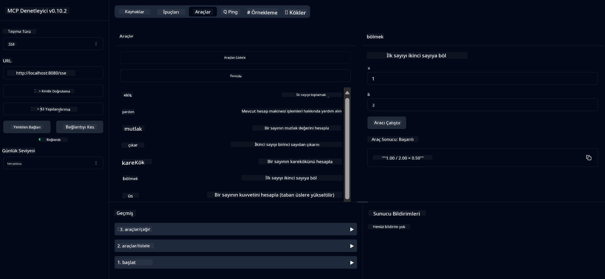

<!--
CO_OP_TRANSLATOR_METADATA:
{
  "original_hash": "13231e9951b68efd9df8c56bd5cdb27e",
  "translation_date": "2025-05-17T13:10:50+00:00",
  "source_file": "03-GettingStarted/samples/java/calculator/README.md",
  "language_code": "tr"
}
-->
# Temel Hesap Makinesi MCP Servisi

Bu servis, Spring Boot ile WebFlux taşımacılığı kullanarak Model Context Protocol (MCP) üzerinden temel hesap makinesi işlemleri sağlar. MCP uygulamaları hakkında öğrenmeye başlayanlar için basit bir örnek olarak tasarlanmıştır.

Daha fazla bilgi için [MCP Server Boot Starter](https://docs.spring.io/spring-ai/reference/api/mcp/mcp-server-boot-starter-docs.html) referans dokümantasyonuna bakın.

## Genel Bakış

Servis şu özellikleri sergiler:
- SSE (Sunucu Gönderimli Olaylar) desteği
- Spring AI'nın `@Tool` anotasyonu kullanılarak otomatik araç kaydı
- Temel hesap makinesi fonksiyonları:
  - Toplama, çıkarma, çarpma, bölme
  - Üs hesaplama ve karekök
  - Modül (kalan) ve mutlak değer
  - İşlem açıklamaları için yardım fonksiyonu

## Özellikler

Bu hesap makinesi servisi aşağıdaki yetenekleri sunar:

1. **Temel Aritmetik İşlemler**:
   - İki sayının toplamı
   - Bir sayının diğerinden çıkarılması
   - İki sayının çarpımı
   - Bir sayının diğerine bölünmesi (sıfıra bölme kontrolü ile)

2. **Gelişmiş İşlemler**:
   - Üs hesaplama (bir tabanı bir üssü kaldırma)
   - Karekök hesaplama (negatif sayı kontrolü ile)
   - Modül (kalan) hesaplama
   - Mutlak değer hesaplama

3. **Yardım Sistemi**:
   - Mevcut tüm işlemleri açıklayan yerleşik yardım fonksiyonu

## Servisi Kullanma

Servis, MCP protokolü aracılığıyla aşağıdaki API uç noktalarını sunar:

- `add(a, b)`: İki sayıyı toplar
- `subtract(a, b)`: İkinci sayıyı birinciden çıkarır
- `multiply(a, b)`: İki sayıyı çarpar
- `divide(a, b)`: İlk sayıyı ikinciye böler (sıfır kontrolü ile)
- `power(base, exponent)`: Bir sayının üssünü hesaplar
- `squareRoot(number)`: Karekök hesaplar (negatif sayı kontrolü ile)
- `modulus(a, b)`: Bölünme sonucu kalan hesaplar
- `absolute(number)`: Mutlak değeri hesaplar
- `help()`: Mevcut işlemler hakkında bilgi alır

## Test İstemcisi

Basit bir test istemcisi `com.microsoft.mcp.sample.client` paketinde yer almaktadır. `SampleCalculatorClient` sınıfı, hesap makinesi servisinin mevcut işlemlerini göstermektedir.

## LangChain4j İstemcisini Kullanma

Proje, LangChain4j ve GitHub modelleri ile hesap makinesi servisini entegre etmeyi gösteren `com.microsoft.mcp.sample.client.LangChain4jClient` içinde bir LangChain4j örnek istemcisi içerir:

### Ön Koşullar

1. **GitHub Token Kurulumu**:
   
   GitHub'ın AI modellerini (phi-4 gibi) kullanmak için bir GitHub kişisel erişim tokenine ihtiyacınız var:

   a. GitHub hesap ayarlarınıza gidin: https://github.com/settings/tokens
   
   b. "Yeni token oluştur" → "Yeni token oluştur (klasik)" tıklayın
   
   c. Tokeninize açıklayıcı bir ad verin
   
   d. Aşağıdaki kapsamları seçin:
      - `repo` (Özel depoların tam kontrolü)
      - `read:org` (Org ve ekip üyeliğini okuma, org projelerini okuma)
      - `gist` (Gist oluşturma)
      - `user:email` (Kullanıcı e-posta adreslerine erişim (yalnızca okuma))
   
   e. "Token oluştur" tıklayın ve yeni tokeninizi kopyalayın
   
   f. Çevresel değişken olarak ayarlayın:
      
      Windows'ta:
      ```
      set GITHUB_TOKEN=your-github-token
      ```
      
      macOS/Linux'ta:
      ```bash
      export GITHUB_TOKEN=your-github-token
      ```

   g. Kalıcı kurulum için, sistem ayarları aracılığıyla çevresel değişkenlerinize ekleyin

2. Projenize LangChain4j GitHub bağımlılığını ekleyin (pom.xml'e zaten dahil edilmiştir):
   ```xml
   <dependency>
       <groupId>dev.langchain4j</groupId>
       <artifactId>langchain4j-github</artifactId>
       <version>${langchain4j.version}</version>
   </dependency>
   ```

3. Hesap makinesi sunucusunun `localhost:8080` üzerinde çalıştığından emin olun

### LangChain4j İstemcisini Çalıştırma

Bu örnek şunları gösterir:
- SSE taşımacılığı aracılığıyla hesap makinesi MCP sunucusuna bağlanma
- Hesap makinesi işlemlerinden yararlanan bir sohbet botu oluşturmak için LangChain4j kullanma
- GitHub AI modelleri ile entegrasyon (şu anda phi-4 modeli kullanılıyor)

İstemci, işlevselliği göstermek için aşağıdaki örnek sorguları gönderir:
1. İki sayının toplamını hesaplama
2. Bir sayının karekökünü bulma
3. Mevcut hesap makinesi işlemleri hakkında yardım bilgisi alma

Örneği çalıştırın ve AI modelinin sorgulara yanıt vermek için hesap makinesi araçlarını nasıl kullandığını görmek için konsol çıktısını kontrol edin.

### GitHub Modeli Yapılandırması

LangChain4j istemcisi, GitHub'ın phi-4 modeli ile aşağıdaki ayarlarla yapılandırılmıştır:

```java
ChatLanguageModel model = GitHubChatModel.builder()
    .apiKey(System.getenv("GITHUB_TOKEN"))
    .timeout(Duration.ofSeconds(60))
    .modelName("phi-4")
    .logRequests(true)
    .logResponses(true)
    .build();
```

Farklı GitHub modelleri kullanmak için, `modelName` parametresini desteklenen başka bir modele (örneğin, "claude-3-haiku-20240307", "llama-3-70b-8192", vb.) değiştirin.

## Bağımlılıklar

Proje, aşağıdaki anahtar bağımlılıkları gerektirir:

```xml
<!-- For MCP Server -->
<dependency>
    <groupId>org.springframework.ai</groupId>
    <artifactId>spring-ai-starter-mcp-server-webflux</artifactId>
</dependency>

<!-- For LangChain4j integration -->
<dependency>
    <groupId>dev.langchain4j</groupId>
    <artifactId>langchain4j-mcp</artifactId>
    <version>${langchain4j.version}</version>
</dependency>

<!-- For GitHub models support -->
<dependency>
    <groupId>dev.langchain4j</groupId>
    <artifactId>langchain4j-github</artifactId>
    <version>${langchain4j.version}</version>
</dependency>
```

## Projeyi Derleme

Projeyi Maven kullanarak derleyin:
```bash
./mvnw clean install -DskipTests
```

## Sunucuyu Çalıştırma

### Java Kullanarak

```bash
java -jar target/calculator-server-0.0.1-SNAPSHOT.jar
```

### MCP Inspector Kullanarak

MCP Inspector, MCP servisleri ile etkileşim için faydalı bir araçtır. Bu hesap makinesi servisi ile kullanmak için:

1. **MCP Inspector'ı kurun ve çalıştırın** yeni bir terminal penceresinde:
   ```bash
   npx @modelcontextprotocol/inspector
   ```

2. **Web UI'ye erişin** uygulama tarafından gösterilen URL'ye tıklayarak (genellikle http://localhost:6274)

3. **Bağlantıyı yapılandırın**:
   - Taşıma türünü "SSE" olarak ayarlayın
   - URL'yi çalışan sunucunuzun SSE uç noktasına ayarlayın: `http://localhost:8080/sse`
   - "Bağlan" tıklayın

4. **Araçları kullanın**:
   - Mevcut hesap makinesi işlemlerini görmek için "Araçları Listele" tıklayın
   - Bir aracı seçin ve bir işlemi yürütmek için "Aracı Çalıştır" tıklayın



### Docker Kullanarak

Proje, konteynerleştirilmiş dağıtım için bir Dockerfile içerir:

1. **Docker imajını oluşturun**:
   ```bash
   docker build -t calculator-mcp-service .
   ```

2. **Docker konteynerini çalıştırın**:
   ```bash
   docker run -p 8080:8080 calculator-mcp-service
   ```

Bu işlemler:
- Maven 3.9.9 ve Eclipse Temurin 24 JDK ile çok aşamalı bir Docker imajı oluşturur
- Optimize edilmiş bir konteyner imajı oluşturur
- Servisi 8080 portunda açar
- Konteyner içinde MCP hesap makinesi servisini başlatır

Konteyner çalıştıktan sonra servise `http://localhost:8080` adresinden erişebilirsiniz.

## Sorun Giderme

### GitHub Token ile İlgili Yaygın Sorunlar

1. **Token İzin Sorunları**: 403 Yasak hatası alırsanız, tokeninizin ön koşullarda belirtildiği gibi doğru izinlere sahip olduğundan emin olun.

2. **Token Bulunamadı**: "API anahtarı bulunamadı" hatası alırsanız, GITHUB_TOKEN çevresel değişkeninin düzgün ayarlandığından emin olun.

3. **Hız Sınırlaması**: GitHub API'sinin hız sınırlamaları vardır. Bir hız sınırlama hatası (durum kodu 429) alırsanız, birkaç dakika bekleyin ve tekrar deneyin.

4. **Token Süresi Dolması**: GitHub tokenleri süresi dolabilir. Bir süre sonra kimlik doğrulama hataları alırsanız, yeni bir token oluşturun ve çevresel değişkeninizi güncelleyin.

Daha fazla yardıma ihtiyacınız varsa, [LangChain4j dokümantasyonunu](https://github.com/langchain4j/langchain4j) veya [GitHub API dokümantasyonunu](https://docs.github.com/en/rest) kontrol edin.

**Feragatname**:
Bu belge, AI çeviri hizmeti [Co-op Translator](https://github.com/Azure/co-op-translator) kullanılarak çevrilmiştir. Doğruluk için çaba göstersek de, otomatik çevirilerin hata veya yanlışlıklar içerebileceğini unutmayın. Orijinal belge, kendi dilinde yetkili kaynak olarak kabul edilmelidir. Kritik bilgiler için profesyonel insan çevirisi önerilir. Bu çevirinin kullanımından doğabilecek yanlış anlamalar veya yanlış yorumlamalardan sorumlu değiliz.