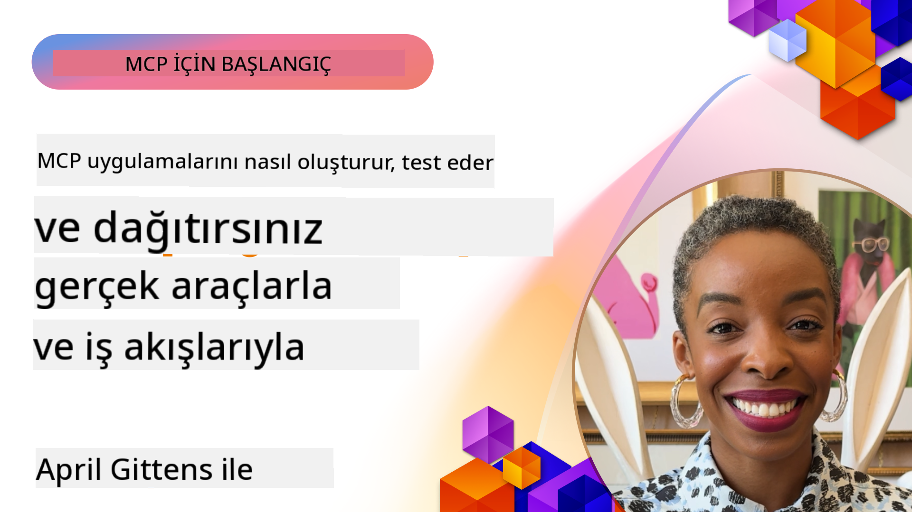

<!--
CO_OP_TRANSLATOR_METADATA:
{
  "original_hash": "83efa75a69bc831277263a6f1ae53669",
  "translation_date": "2025-08-18T17:47:23+00:00",
  "source_file": "04-PracticalImplementation/README.md",
  "language_code": "tr"
}
-->
# Pratik Uygulama

[](https://youtu.be/vCN9-mKBDfQ)

_(Bu dersin videosunu izlemek için yukarıdaki görsele tıklayın)_

Pratik uygulama, Model Context Protocol (MCP) gücünün somut hale geldiği yerdir. MCP'nin teorisini ve mimarisini anlamak önemli olsa da, gerçek değer, bu kavramları gerçek dünya problemlerini çözen çözümler oluşturmak, test etmek ve dağıtmak için uyguladığınızda ortaya çıkar. Bu bölüm, kavramsal bilgi ile uygulamalı geliştirme arasındaki boşluğu doldurarak MCP tabanlı uygulamaları hayata geçirme sürecinde size rehberlik eder.

İster akıllı asistanlar geliştiriyor, ister yapay zekayı iş akışlarına entegre ediyor, ister veri işleme için özel araçlar oluşturuyor olun, MCP esnek bir temel sağlar. Dil bağımsız tasarımı ve popüler programlama dilleri için resmi SDK'ları, geniş bir geliştirici kitlesine erişilebilirlik sunar. Bu SDK'ları kullanarak, çözümlerinizi farklı platformlar ve ortamlar arasında hızla prototipleyebilir, yineleyebilir ve ölçeklendirebilirsiniz.

Aşağıdaki bölümlerde, MCP'nin C#, Java ile Spring, TypeScript, JavaScript ve Python'da nasıl uygulanacağını gösteren pratik örnekler, örnek kodlar ve dağıtım stratejileri bulacaksınız. Ayrıca MCP sunucularını nasıl hata ayıklayacağınızı ve test edeceğinizi, API'leri nasıl yöneteceğinizi ve çözümleri Azure kullanarak buluta nasıl dağıtacağınızı öğreneceksiniz. Bu uygulamalı kaynaklar, öğreniminizi hızlandırmak ve sağlam, üretime hazır MCP uygulamaları oluşturma konusunda kendinize güvenmenizi sağlamak için tasarlanmıştır.

## Genel Bakış

Bu ders, MCP'nin birden fazla programlama dili üzerindeki pratik uygulama yönlerine odaklanmaktadır. MCP SDK'larını C#, Java ile Spring, TypeScript, JavaScript ve Python'da kullanarak sağlam uygulamalar oluşturmayı, MCP sunucularını hata ayıklamayı ve test etmeyi, yeniden kullanılabilir kaynaklar, istemler ve araçlar oluşturmayı keşfedeceğiz.

## Öğrenme Hedefleri

Bu dersin sonunda şunları yapabileceksiniz:

- Çeşitli programlama dillerinde resmi SDK'ları kullanarak MCP çözümleri uygulamak
- MCP sunucularını sistematik olarak hata ayıklamak ve test etmek
- Sunucu özelliklerini (Kaynaklar, İstemler ve Araçlar) oluşturmak ve kullanmak
- Karmaşık görevler için etkili MCP iş akışları tasarlamak
- Performans ve güvenilirlik için MCP uygulamalarını optimize etmek

## Resmi SDK Kaynakları

Model Context Protocol, birden fazla dil için resmi SDK'lar sunar:

- [C# SDK](https://github.com/modelcontextprotocol/csharp-sdk)
- [Java ile Spring SDK](https://github.com/modelcontextprotocol/java-sdk) **Not:** [Project Reactor](https://projectreactor.io) bağımlılığı gerektirir. ([tartışma konusu 246](https://github.com/orgs/modelcontextprotocol/discussions/246)'ya bakın.)
- [TypeScript SDK](https://github.com/modelcontextprotocol/typescript-sdk)
- [Python SDK](https://github.com/modelcontextprotocol/python-sdk)
- [Kotlin SDK](https://github.com/modelcontextprotocol/kotlin-sdk)

## MCP SDK'ları ile Çalışmak

Bu bölüm, MCP'nin birden fazla programlama dili üzerinde nasıl uygulanacağını gösteren pratik örnekler sunar. `samples` dizininde dil bazında düzenlenmiş örnek kodlar bulabilirsiniz.

### Mevcut Örnekler

Depo, aşağıdaki dillerde [örnek uygulamalar](../../../04-PracticalImplementation/samples) içerir:

- [C#](./samples/csharp/README.md)
- [Java ile Spring](./samples/java/containerapp/README.md)
- [TypeScript](./samples/typescript/README.md)
- [JavaScript](./samples/javascript/README.md)
- [Python](./samples/python/README.md)

Her örnek, o dil ve ekosistem için temel MCP kavramlarını ve uygulama desenlerini gösterir.

## Temel Sunucu Özellikleri

MCP sunucuları, aşağıdaki özelliklerin herhangi bir kombinasyonunu uygulayabilir:

### Kaynaklar

Kaynaklar, kullanıcı veya yapay zeka modeli için bağlam ve veri sağlar:

- Belge depoları
- Bilgi tabanları
- Yapılandırılmış veri kaynakları
- Dosya sistemleri

### İstemler

İstemler, kullanıcılar için şablonlanmış mesajlar ve iş akışlarıdır:

- Önceden tanımlanmış konuşma şablonları
- Yönlendirilmiş etkileşim desenleri
- Uzmanlaşmış diyalog yapıları

### Araçlar

Araçlar, yapay zeka modelinin gerçekleştireceği işlevlerdir:

- Veri işleme yardımcıları
- Harici API entegrasyonları
- Hesaplama yetenekleri
- Arama işlevselliği

## Örnek Uygulamalar: C# Uygulaması

Resmi C# SDK deposu, MCP'nin farklı yönlerini gösteren birkaç örnek uygulama içerir:

- **Temel MCP İstemcisi**: MCP istemcisi oluşturmayı ve araçları çağırmayı gösteren basit bir örnek
- **Temel MCP Sunucusu**: Temel araç kaydı ile minimal sunucu uygulaması
- **Gelişmiş MCP Sunucusu**: Araç kaydı, kimlik doğrulama ve hata işleme ile tam özellikli sunucu
- **ASP.NET Entegrasyonu**: ASP.NET Core ile entegrasyonu gösteren örnekler
- **Araç Uygulama Desenleri**: Farklı karmaşıklık seviyelerinde araç uygulama desenleri

C# MCP SDK önizleme aşamasındadır ve API'ler değişebilir. SDK geliştikçe bu blogu sürekli olarak güncelleyeceğiz.

### Temel Özellikler

- [C# MCP Nuget ModelContextProtocol](https://www.nuget.org/packages/ModelContextProtocol)
- [İlk MCP Sunucunuzu oluşturma](https://devblogs.microsoft.com/dotnet/build-a-model-context-protocol-mcp-server-in-csharp/).

Tam C# uygulama örnekleri için [resmi C# SDK örnekleri deposunu](https://github.com/modelcontextprotocol/csharp-sdk) ziyaret edin.

## Örnek Uygulama: Java ile Spring Uygulaması

Java ile Spring SDK, kurumsal düzeyde özelliklerle sağlam MCP uygulama seçenekleri sunar.

### Temel Özellikler

- Spring Framework entegrasyonu
- Güçlü tip güvenliği
- Reaktif programlama desteği
- Kapsamlı hata işleme

Tam bir Java ile Spring uygulama örneği için `samples` dizinindeki [Java ile Spring örneğine](samples/java/containerapp/README.md) bakın.

## Örnek Uygulama: JavaScript Uygulaması

JavaScript SDK, MCP uygulaması için hafif ve esnek bir yaklaşım sunar.

### Temel Özellikler

- Node.js ve tarayıcı desteği
- Promise tabanlı API
- Express ve diğer frameworklerle kolay entegrasyon
- Akış için WebSocket desteği

Tam bir JavaScript uygulama örneği için `samples` dizinindeki [JavaScript örneğine](samples/javascript/README.md) bakın.

## Örnek Uygulama: Python Uygulaması

Python SDK, MCP uygulaması için Python'a özgü bir yaklaşım sunar ve mükemmel ML framework entegrasyonları sağlar.

### Temel Özellikler

- asyncio ile async/await desteği
- FastAPI entegrasyonu
- Basit araç kaydı
- Popüler ML kütüphaneleriyle yerel entegrasyon

Tam bir Python uygulama örneği için `samples` dizinindeki [Python örneğine](samples/python/README.md) bakın.

## API Yönetimi

Azure API Management, MCP Sunucularını nasıl güvence altına alabileceğimiz konusunda harika bir çözümdür. Fikir, MCP Sunucunuzun önüne bir Azure API Management örneği koymak ve aşağıdaki gibi özellikleri yönetmesini sağlamaktır:

- hız sınırlaması
- token yönetimi
- izleme
- yük dengeleme
- güvenlik

### Azure Örneği

Tam olarak bunu yapan bir Azure örneği, yani [bir MCP Sunucusu oluşturma ve Azure API Management ile güvence altına alma](https://github.com/Azure-Samples/remote-mcp-apim-functions-python).

Aşağıdaki görselde yetkilendirme akışının nasıl gerçekleştiğini görebilirsiniz:


Yukarıdaki görselde şu işlemler gerçekleşir:

- Kimlik doğrulama/Yetkilendirme Microsoft Entra kullanılarak gerçekleşir.
- Azure API Management bir geçit görevi görür ve trafiği yönlendirmek ve yönetmek için politikalar kullanır.
- Azure Monitor tüm istekleri daha fazla analiz için kaydeder.

#### Yetkilendirme Akışı

Yetkilendirme akışını daha ayrıntılı olarak inceleyelim:


#### MCP Yetkilendirme Spesifikasyonu

[MCP Yetkilendirme spesifikasyonu](https://modelcontextprotocol.io/specification/2025-03-26/basic/authorization#2-10-third-party-authorization-flow) hakkında daha fazla bilgi edinin.

## Azure'a Uzaktan MCP Sunucusu Dağıtma

Daha önce bahsettiğimiz örneği dağıtmayı deneyelim:

1. Depoyu klonlayın

    ```bash
    git clone https://github.com/Azure-Samples/remote-mcp-apim-functions-python.git
    cd remote-mcp-apim-functions-python
    ```

1. `Microsoft.App` kaynak sağlayıcısını kaydedin.

   - Azure CLI kullanıyorsanız, `az provider register --namespace Microsoft.App --wait` komutunu çalıştırın.
   - Azure PowerShell kullanıyorsanız, `Register-AzResourceProvider -ProviderNamespace Microsoft.App` komutunu çalıştırın. Daha sonra kaydın tamamlanıp tamamlanmadığını kontrol etmek için bir süre sonra `(Get-AzResourceProvider -ProviderNamespace Microsoft.App).RegistrationState` komutunu çalıştırın.

1. API yönetim hizmetini, işlev uygulamasını (kodla birlikte) ve diğer gerekli Azure kaynaklarını sağlamak için bu [azd](https://aka.ms/azd) komutunu çalıştırın:

    ```shell
    azd up
    ```

    Bu komutlar tüm bulut kaynaklarını Azure'da dağıtmalıdır.

### MCP Inspector ile Sunucunuzu Test Etme

1. **Yeni bir terminal penceresinde**, MCP Inspector'ı yükleyin ve çalıştırın

    ```shell
    npx @modelcontextprotocol/inspector
    ```

    Aşağıdakine benzer bir arayüz görmelisiniz:

    

1. Uygulama tarafından görüntülenen URL'den MCP Inspector web uygulamasını yüklemek için CTRL tıklayın (ör. [http://127.0.0.1:6274/#resources](http://127.0.0.1:6274/#resources))
1. Taşıma türünü `SSE` olarak ayarlayın
1. `azd up` sonrası görüntülenen API Management SSE uç noktanıza URL'yi ayarlayın ve **Bağlan**:

    ```shell
    https://<apim-servicename-from-azd-output>.azure-api.net/mcp/sse
    ```

1. **Araçları Listele**. Bir araca tıklayın ve **Aracı Çalıştır**.

Tüm adımlar çalıştıysa, artık MCP sunucusuna bağlı olmalısınız ve bir aracı çağırmayı başardınız.

## Azure için MCP Sunucuları

[Remote-mcp-functions](https://github.com/Azure-Samples/remote-mcp-functions-dotnet): Bu depo seti, Python, C# .NET veya Node/TypeScript kullanarak Azure Functions ile özel uzaktan MCP (Model Context Protocol) sunucuları oluşturmak ve dağıtmak için hızlı başlangıç şablonlarıdır.

Örnekler, geliştiricilere aşağıdakileri sağlayan eksiksiz bir çözüm sunar:

- Yerel olarak oluşturma ve çalıştırma: Yerel bir makinede bir MCP sunucusu geliştirin ve hata ayıklayın
- Azure'a dağıtma: Basit bir azd up komutuyla buluta kolayca dağıtın
- İstemcilerden bağlanma: VS Code'un Copilot ajan modu ve MCP Inspector aracı dahil olmak üzere çeşitli istemcilerden MCP sunucusuna bağlanın

### Temel Özellikler

- Tasarım gereği güvenlik: MCP sunucusu anahtarlar ve HTTPS kullanılarak güvence altına alınır
- Kimlik doğrulama seçenekleri: Dahili kimlik doğrulama ve/veya API Management kullanarak OAuth desteği
- Ağ izolasyonu: Azure Sanal Ağlar (VNET) kullanarak ağ izolasyonu sağlar
- Sunucusuz mimari: Ölçeklenebilir, olay odaklı yürütme için Azure Functions kullanır
- Yerel geliştirme: Kapsamlı yerel geliştirme ve hata ayıklama desteği
- Basit dağıtım: Azure'a kolaylaştırılmış dağıtım süreci

Depo, üretime hazır bir MCP sunucu uygulamasıyla hızlı bir şekilde başlamak için gerekli tüm yapılandırma dosyalarını, kaynak kodunu ve altyapı tanımlarını içerir.

- [Azure Remote MCP Functions Python](https://github.com/Azure-Samples/remote-mcp-functions-python) - Python ile Azure Functions kullanarak MCP'nin örnek uygulaması

- [Azure Remote MCP Functions .NET](https://github.com/Azure-Samples/remote-mcp-functions-dotnet) - C# .NET ile Azure Functions kullanarak MCP'nin örnek uygulaması

- [Azure Remote MCP Functions Node/Typescript](https://github.com/Azure-Samples/remote-mcp-functions-typescript) - Node/TypeScript ile Azure Functions kullanarak MCP'nin örnek uygulaması.

## Temel Çıkarımlar

- MCP SDK'ları, sağlam MCP çözümleri uygulamak için dil spesifik araçlar sağlar
- Hata ayıklama ve test süreci, güvenilir MCP uygulamaları için kritiktir
- Yeniden kullanılabilir istem şablonları, tutarlı yapay zeka etkileşimlerini mümkün kılar
- İyi tasarlanmış iş akışları, birden fazla aracı kullanarak karmaşık görevleri düzenleyebilir
- MCP çözümleri uygulamak, güvenlik, performans ve hata işleme konularını dikkate almayı gerektirir

## Egzersiz

Kendi alanınızda gerçek bir problemi ele alan pratik bir MCP iş akışı tasarlayın:

1. Bu problemi çözmek için faydalı olabilecek 3-4 araç belirleyin
2. Bu araçların nasıl etkileşimde bulunduğunu gösteren bir iş akışı diyagramı oluşturun
3. Tercih ettiğiniz dili kullanarak araçlardan birinin temel bir versiyonunu uygulayın
4. Modelin aracınızı etkili bir şekilde kullanmasına yardımcı olacak bir istem şablonu oluşturun

## Ek Kaynaklar

---

Sonraki: [İleri Düzey Konular](../05-AdvancedTopics/README.md)

**Feragatname**:  
Bu belge, [Co-op Translator](https://github.com/Azure/co-op-translator) adlı yapay zeka çeviri hizmeti kullanılarak çevrilmiştir. Doğruluk için çaba göstersek de, otomatik çevirilerin hata veya yanlışlıklar içerebileceğini lütfen unutmayın. Orijinal belgenin kendi dilindeki hali, yetkili kaynak olarak kabul edilmelidir. Kritik bilgiler için profesyonel bir insan çevirisi önerilir. Bu çevirinin kullanımından kaynaklanan herhangi bir yanlış anlama veya yanlış yorumlama durumunda sorumluluk kabul edilmez.