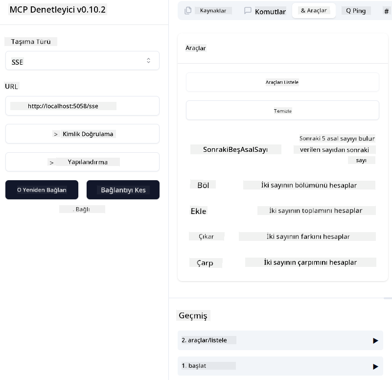
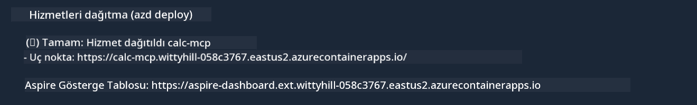

<!--
CO_OP_TRANSLATOR_METADATA:
{
  "original_hash": "5020a3e1a1c7f30c00f9e37f1fa208e3",
  "translation_date": "2025-05-17T14:08:28+00:00",
  "source_file": "04-PracticalImplementation/samples/csharp/README.md",
  "language_code": "tr"
}
-->
# Örnek

Önceki örnek, yerel bir .NET projesinin `sdio` türüyle nasıl kullanılacağını ve sunucunun bir konteyner içinde yerel olarak nasıl çalıştırılacağını gösteriyor. Bu, birçok durumda iyi bir çözümdür. Ancak, sunucunun uzaktan, örneğin bulut ortamında çalışması faydalı olabilir. İşte burada `http` türü devreye girer.

`04-PracticalImplementation` klasöründeki çözümü incelediğinizde, önceki örnekten çok daha karmaşık görünebilir. Ama aslında öyle değil. Proje `src/mcpserver/mcpserver.csproj`'e dikkatlice bakarsanız, önceki örnekle çoğunlukla aynı kod olduğunu göreceksiniz. Tek fark, HTTP isteklerini yönetmek için farklı bir kütüphane `ModelContextProtocol.AspNetCore` kullanmamızdır. Ve `IsPrime` yöntemini özel yapmak için değiştirdik, sadece kodunuzda özel yöntemler olabileceğini göstermek için. Kodun geri kalanı öncekiyle aynıdır.

Diğer projeler [.NET Aspire](https://learn.microsoft.com/dotnet/aspire/get-started/aspire-overview) kaynaklıdır. Çözümde .NET Aspire olması, geliştiricinin geliştirme ve test sürecindeki deneyimini artıracak ve gözlemlenebilirliği artıracaktır. Sunucuyu çalıştırmak için gerekli değildir, ancak çözümünüzde bulunması iyi bir uygulamadır.

## Sunucuyu yerel olarak başlatın

1. VS Code'dan (C# DevKit uzantısıyla), `04-PracticalImplementation\samples\csharp\src\Calculator-chap4.sln` çözümünü açın.
2. Sunucuyu başlatmak için `F5` tuşuna basın. .NET Aspire panosu ile bir web tarayıcısı açılmalıdır.

veya

1. Bir terminalden `04-PracticalImplementation\samples\csharp\src` klasörüne gidin
2. Sunucuyu başlatmak için aşağıdaki komutu çalıştırın:
   ```bash
    dotnet run --project .\AppHost
   ```

3. Panodan `http` URL'sini not edin. ModelContext Protocol Inspector ile `http://localhost:5058/`.

## Test `SSE` gibi bir şey olmalıdır.

Node.js 22.7.5 ve üzeri sürümleriniz varsa, sunucunuzu test etmek için ModelContext Protocol Inspector'ı kullanabilirsiniz.

Sunucuyu başlatın ve bir terminalde aşağıdaki komutu çalıştırın:

```bash
npx @modelcontextprotocol/inspector@latest
```



- `SSE` as the Transport type. SSE stand for Server-Sent Events. 
- In the Url field, enter the URL of the server noted earlier,and append `/sse`'yi seçin. `http` olmalıdır (önceden oluşturulan `https`) something like `http://localhost:5058/sse`.
- select the Connect button.

A nice thing about the Inspector is that it provide a nice visibility on what is happening.

- Try listing the availables tools
- Try some of them, it should works just like before.


## Test `SSE` with Github Copilot Chat in VS Code

To use the `SSE` transport with Github Copilot Chat, change the configuration of the `mcp-calc` sunucusu böyle görünmelidir:

```json
"mcp-calc": {
    "type": "sse",
    "url": "http://localhost:5058/sse"
}
```

Bazı testler yapın:
- 6780'den sonraki 3 asal sayıyı isteyin. Copilot'un yeni `NextFivePrimeNumbers` araçlarını nasıl kullanacağını ve sadece ilk 3 asal sayıyı döndüreceğini not edin.
- 111'den sonraki 7 asal sayıyı isteyin, ne olacağını görün.

# Sunucuyu Azure'a dağıtın

Sunucuyu Azure'a dağıtalım, böylece daha fazla kişi kullanabilir.

Bir terminalden `04-PracticalImplementation\samples\csharp\src` klasörüne gidin ve aşağıdaki komutu çalıştırın:

```bash
azd init
```

Bu, Azure kaynaklarının yapılandırmasını ve Kod olarak Altyapı (IaC) dosyalarını yerel olarak kaydetmek için birkaç dosya oluşturacaktır.

Sonra, sunucuyu Azure'a dağıtmak için aşağıdaki komutu çalıştırın:

```bash
azd up
```

Dağıtım tamamlandığında, şöyle bir mesaj görmelisiniz:



Aspire panosuna gidin ve MCP Inspector ve Github Copilot Chat'te kullanmak için `HTTP` URL'sini not edin.

## Sırada ne var?

Farklı taşıma türlerini, test araçlarını denedik ve MCP sunucumuzu Azure'a dağıttık. Peki ya sunucumuzun özel kaynaklara erişmesi gerekirse? Örneğin, bir veritabanı veya özel bir API? Sonraki bölümde sunucumuzun güvenliğini nasıl artırabileceğimizi göreceğiz.

**Feragatname**: 
Bu belge, AI çeviri hizmeti [Co-op Translator](https://github.com/Azure/co-op-translator) kullanılarak çevrilmiştir. Doğruluğu sağlamak için çaba sarf etsek de, otomatik çevirilerin hata veya yanlışlıklar içerebileceğini lütfen unutmayın. Belgenin orijinal dili, yetkili kaynak olarak kabul edilmelidir. Kritik bilgiler için profesyonel insan çevirisi önerilir. Bu çevirinin kullanımından doğabilecek yanlış anlamalar veya yanlış yorumlamalardan sorumlu değiliz.