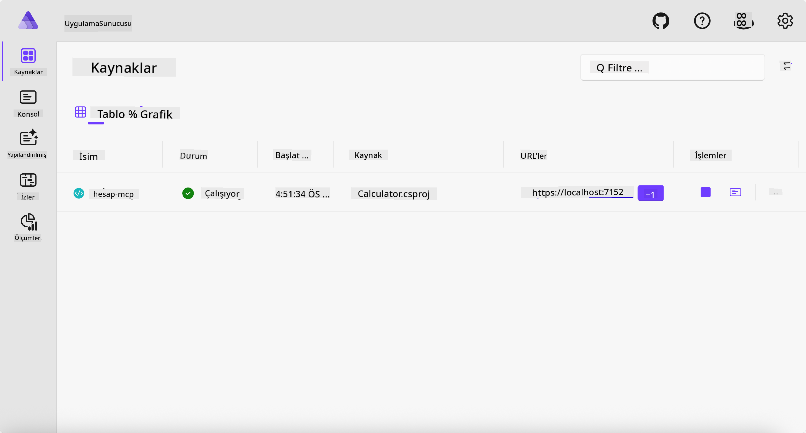
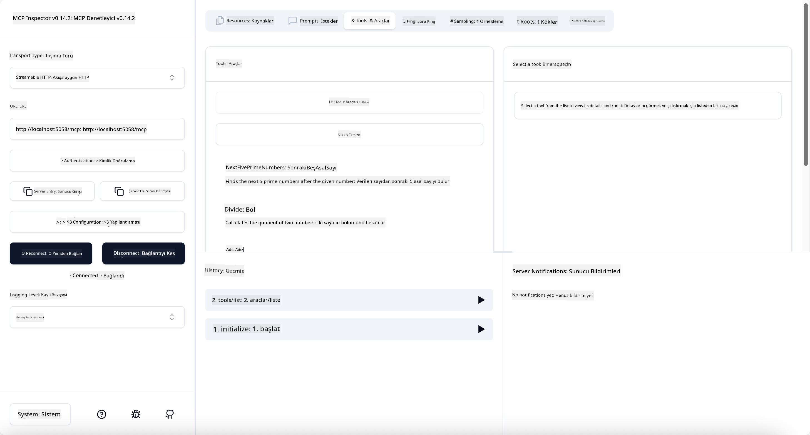
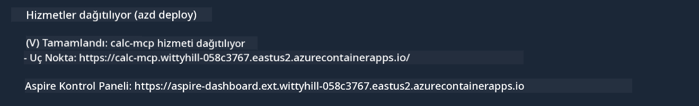

<!--
CO_OP_TRANSLATOR_METADATA:
{
  "original_hash": "0bc7bd48f55f1565f1d95ccb2c16f728",
  "translation_date": "2025-07-13T23:06:48+00:00",
  "source_file": "04-PracticalImplementation/samples/csharp/README.md",
  "language_code": "tr"
}
-->
# Örnek

Önceki örnek, `stdio` türü ile yerel bir .NET projesinin nasıl kullanılacağını ve sunucunun yerel bir konteynerde nasıl çalıştırılacağını gösteriyor. Bu birçok durumda iyi bir çözümdür. Ancak, sunucunun uzaktan, örneğin bir bulut ortamında çalışması da faydalı olabilir. İşte burada `http` türü devreye girer.

`04-PracticalImplementation` klasöründeki çözüme baktığınızda, önceki örnekten çok daha karmaşık görünebilir. Ama aslında öyle değil. `src/Calculator` projesine yakından bakarsanız, önceki örnekle büyük ölçüde aynı kod olduğunu göreceksiniz. Tek fark, HTTP isteklerini yönetmek için farklı bir kütüphane olan `ModelContextProtocol.AspNetCore` kullanmamız. Ayrıca, `IsPrime` metodunu özel yapmak için değiştirdik; böylece kodunuzda özel metotlar da olabileceğini göstermiş olduk. Geri kalan kod ise öncekiyle aynı.

Diğer projeler [.NET Aspire](https://learn.microsoft.com/dotnet/aspire/get-started/aspire-overview) kaynaklıdır. Çözüme .NET Aspire eklemek, geliştiricinin geliştirme ve test sürecini iyileştirir ve gözlemlenebilirlik konusunda yardımcı olur. Sunucuyu çalıştırmak için zorunlu değildir, ancak çözümünüzde bulunması iyi bir uygulamadır.

## Sunucuyu yerel olarak başlatma

1. VS Code’dan (C# DevKit eklentisi ile) `04-PracticalImplementation/samples/csharp` dizinine gidin.
1. Sunucuyu başlatmak için aşağıdaki komutu çalıştırın:

   ```bash
    dotnet watch run --project ./src/AppHost
   ```

1. Bir web tarayıcısı .NET Aspire panosunu açtığında, `http` URL’sini not edin. Şöyle bir şey olmalı: `http://localhost:5058/`.

   

## MCP Inspector ile Streamable HTTP’yi test etme

Node.js 22.7.5 veya üzeri yüklüyse, MCP Inspector’ı kullanarak sunucunuzu test edebilirsiniz.

Sunucuyu başlatın ve bir terminalde aşağıdaki komutu çalıştırın:

```bash
npx @modelcontextprotocol/inspector http://localhost:5058
```



- Taşıma türü olarak `Streamable HTTP` seçin.
- Url alanına daha önce not ettiğiniz sunucu URL’sini girin ve sonuna `/mcp` ekleyin. `http` (https değil) olmalı, örneğin `http://localhost:5058/mcp`.
- Bağlan düğmesine tıklayın.

Inspector’ın güzel yanı, neler olup bittiğini iyi bir şekilde görmenizi sağlamasıdır.

- Mevcut araçları listelemeyi deneyin
- Bazı araçları deneyin, önceki gibi çalışması gerekir.

## VS Code’da GitHub Copilot Chat ile MCP Sunucusunu test etme

Streamable HTTP taşımasını GitHub Copilot Chat ile kullanmak için, daha önce oluşturduğunuz `calc-mcp` sunucusunun yapılandırmasını şu şekilde değiştirin:

```jsonc
// .vscode/mcp.json
{
  "servers": {
    "calc-mcp": {
      "type": "http",
      "url": "http://localhost:5058/mcp"
    }
  }
}
```

Bazı testler yapın:

- "6780’den sonraki 3 asal sayı" isteyin. Copilot’un yeni araçlar `NextFivePrimeNumbers`’ı kullanıp sadece ilk 3 asal sayıyı döndürdüğünü gözlemleyin.
- "111’den sonraki 7 asal sayı" isteyin, ne olduğunu görün.
- "John’un 24 lolipopu var ve bunları 3 çocuğuna eşit dağıtmak istiyor. Her çocuk kaç lolipop alır?" diye sorun, ne olduğunu görün.

## Sunucuyu Azure’a dağıtma

Sunucuyu Azure’a dağıtalım, böylece daha fazla kişi kullanabilir.

Bir terminalden `04-PracticalImplementation/samples/csharp` klasörüne gidin ve aşağıdaki komutu çalıştırın:

```bash
azd up
```

Dağıtım tamamlandığında şöyle bir mesaj görmelisiniz:



URL’yi alın ve MCP Inspector ile GitHub Copilot Chat’te kullanın.

```jsonc
// .vscode/mcp.json
{
  "servers": {
    "calc-mcp": {
      "type": "http",
      "url": "https://calc-mcp.gentleriver-3977fbcf.australiaeast.azurecontainerapps.io/mcp"
    }
  }
}
```

## Sonraki adım ne?

Farklı taşıma türlerini ve test araçlarını denedik. MCP sunucunuzu Azure’a dağıttık. Peki ya sunucumuzun özel kaynaklara erişmesi gerekirse? Örneğin bir veritabanı veya özel bir API? Bir sonraki bölümde, sunucumuzun güvenliğini nasıl artırabileceğimizi göreceğiz.

**Feragatname**:  
Bu belge, AI çeviri servisi [Co-op Translator](https://github.com/Azure/co-op-translator) kullanılarak çevrilmiştir. Doğruluk için çaba göstersek de, otomatik çevirilerin hatalar veya yanlışlıklar içerebileceğini lütfen unutmayınız. Orijinal belge, kendi dilinde yetkili kaynak olarak kabul edilmelidir. Kritik bilgiler için profesyonel insan çevirisi önerilir. Bu çevirinin kullanımı sonucu oluşabilecek yanlış anlamalar veya yorum hatalarından sorumlu değiliz.