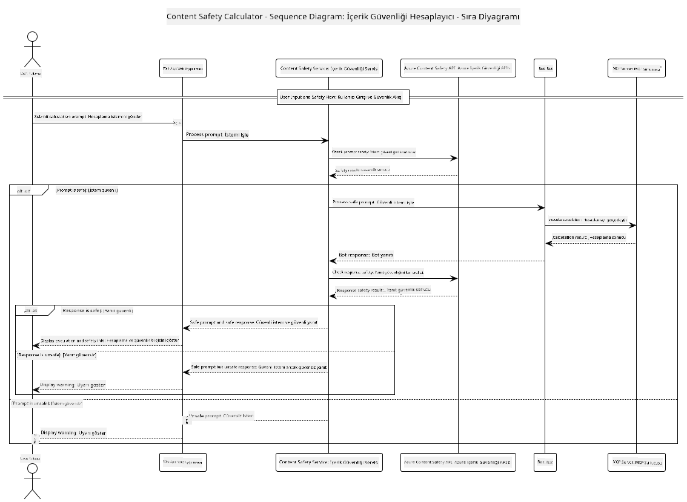

<!--
CO_OP_TRANSLATOR_METADATA:
{
  "original_hash": "e5ea5e7582f70008ea9bec3b3820f20a",
  "translation_date": "2025-07-13T23:16:08+00:00",
  "source_file": "04-PracticalImplementation/samples/java/containerapp/README.md",
  "language_code": "tr"
}
-->
## Sistem Mimarisi

Bu proje, kullanıcı girdilerini Model Context Protocol (MCP) aracılığıyla bir hesaplayıcı servisine göndermeden önce içerik güvenliği kontrolü yapan bir web uygulamasını göstermektedir.



### Nasıl Çalışır

1. **Kullanıcı Girdisi**: Kullanıcı web arayüzüne bir hesaplama isteği girer  
2. **İçerik Güvenliği Tarama (Girdi)**: İstek Azure Content Safety API tarafından analiz edilir  
3. **Güvenlik Kararı (Girdi)**:  
   - İçerik güvenliyse (tüm kategorilerde şiddet < 2), hesaplayıcıya devam edilir  
   - İçerik potansiyel olarak zararlı olarak işaretlendiyse, işlem durdurulur ve uyarı döner  
4. **Hesaplayıcı Entegrasyonu**: Güvenli içerik LangChain4j tarafından işlenir ve MCP hesaplayıcı sunucusuyla iletişim kurulur  
5. **İçerik Güvenliği Tarama (Çıktı)**: Botun yanıtı Azure Content Safety API tarafından analiz edilir  
6. **Güvenlik Kararı (Çıktı)**:  
   - Bot yanıtı güvenliyse kullanıcıya gösterilir  
   - Bot yanıtı potansiyel olarak zararlıysa uyarı ile değiştirilir  
7. **Yanıt**: Sonuçlar (güvenliyse) kullanıcıya her iki güvenlik analiz raporu ile birlikte gösterilir

## Model Context Protocol (MCP) ile Hesaplayıcı Servislerinin Kullanımı

Bu proje, LangChain4j’den hesaplayıcı MCP servislerini çağırmak için Model Context Protocol (MCP) kullanımını göstermektedir. Uygulama, hesaplayıcı işlemlerini sağlamak için 8080 portunda çalışan yerel bir MCP sunucusu kullanır.

### Azure Content Safety Servisinin Kurulumu

İçerik güvenliği özelliklerini kullanmadan önce Azure Content Safety servisi oluşturmanız gerekir:

1. [Azure Portal](https://portal.azure.com)’a giriş yapın  
2. "Create a resource" seçeneğine tıklayın ve "Content Safety" arayın  
3. "Content Safety" seçin ve "Create"e tıklayın  
4. Kaynağınız için benzersiz bir isim girin  
5. Aboneliğinizi ve kaynak grubunuzu seçin (veya yeni oluşturun)  
6. Desteklenen bir bölge seçin ([Bölge kullanılabilirliği](https://azure.microsoft.com/en-us/global-infrastructure/services/?products=cognitive-services) sayfasından kontrol edin)  
7. Uygun bir fiyatlandırma katmanı seçin  
8. Kaynağı dağıtmak için "Create"e tıklayın  
9. Dağıtım tamamlandıktan sonra "Go to resource" seçeneğine tıklayın  
10. Sol panelde "Resource Management" altında "Keys and Endpoint" seçeneğini seçin  
11. Anahtarlardan birini ve uç nokta URL’sini kopyalayın, sonraki adımda kullanmak üzere saklayın

### Ortam Değişkenlerinin Yapılandırılması

GitHub modelleri kimlik doğrulaması için `GITHUB_TOKEN` ortam değişkenini ayarlayın:  
```sh
export GITHUB_TOKEN=<your_github_token>
```

İçerik güvenliği özellikleri için:  
```sh
export CONTENT_SAFETY_ENDPOINT=<your_content_safety_endpoint>
export CONTENT_SAFETY_KEY=<your_content_safety_key>
```

Bu ortam değişkenleri, uygulamanın Azure Content Safety servisi ile kimlik doğrulaması yapması için kullanılır. Eğer bu değişkenler ayarlanmazsa, uygulama gösterim amaçlı yer tutucu değerler kullanır ancak içerik güvenliği özellikleri düzgün çalışmaz.

### Hesaplayıcı MCP Sunucusunun Başlatılması

İstemciyi çalıştırmadan önce, localhost:8080 üzerinde SSE modunda hesaplayıcı MCP sunucusunu başlatmanız gerekir.

## Proje Açıklaması

Bu proje, LangChain4j ile Model Context Protocol (MCP) entegrasyonunu ve hesaplayıcı servislerinin çağrılmasını göstermektedir. Öne çıkan özellikler:

- Temel matematik işlemleri için MCP kullanarak hesaplayıcı servisine bağlanma  
- Hem kullanıcı girdileri hem de bot yanıtları için çift katmanlı içerik güvenliği kontrolü  
- LangChain4j üzerinden GitHub’un gpt-4.1-nano modeli ile entegrasyon  
- MCP taşıması için Server-Sent Events (SSE) kullanımı

## İçerik Güvenliği Entegrasyonu

Proje, kullanıcı girdileri ve sistem yanıtlarının zararlı içeriklerden arındırılmasını sağlamak için kapsamlı içerik güvenliği özellikleri içerir:

1. **Girdi Tarama**: Tüm kullanıcı istekleri, nefret söylemi, şiddet, kendine zarar verme ve cinsel içerik gibi zararlı içerik kategorileri açısından işleme alınmadan önce analiz edilir.  

2. **Çıktı Tarama**: Potansiyel olarak sansürsüz modeller kullanılsa bile, sistem tüm oluşturulan yanıtları aynı içerik güvenliği filtrelerinden geçirir ve kullanıcıya göstermeden önce kontrol eder.

Bu çift katmanlı yaklaşım, hangi yapay zeka modelinin kullanıldığına bakılmaksızın sistemin güvenli kalmasını sağlar ve kullanıcıları hem zararlı girdilerden hem de potansiyel sorunlu yapay zeka çıktılarından korur.

## Web İstemcisi

Uygulama, kullanıcıların Content Safety Calculator sistemi ile etkileşim kurmasını sağlayan kullanıcı dostu bir web arayüzü içerir:

### Web Arayüzü Özellikleri

- Hesaplama isteklerinin girilmesi için basit ve sezgisel form  
- Çift katmanlı içerik güvenliği doğrulaması (girdi ve çıktı)  
- İstek ve yanıt güvenliği hakkında gerçek zamanlı geri bildirim  
- Kolay yorumlama için renk kodlu güvenlik göstergeleri  
- Çeşitli cihazlarda çalışan temiz ve duyarlı tasarım  
- Kullanıcıları yönlendirmek için örnek güvenli istekler

### Web İstemcisinin Kullanımı

1. Uygulamayı başlatın:  
   ```sh
   mvn spring-boot:run
   ```

2. Tarayıcınızı açın ve `http://localhost:8087` adresine gidin

3. Sağlanan metin alanına bir hesaplama isteği girin (örneğin, "24.5 ile 17.3’ün toplamını hesapla")

4. İsteğinizi işlemek için "Submit" butonuna tıklayın

5. Sonuçları görüntüleyin; bunlar şunları içerecektir:  
   - İsteğinizin içerik güvenliği analizi  
   - Hesaplanan sonuç (istek güvenliyse)  
   - Bot yanıtının içerik güvenliği analizi  
   - Girdi veya çıktı işaretlendiyse herhangi bir güvenlik uyarısı

Web istemcisi, her iki içerik güvenliği doğrulama sürecini otomatik olarak yönetir ve hangi yapay zeka modeli kullanılırsa kullanılsın tüm etkileşimlerin güvenli ve uygun olmasını sağlar.

**Feragatname**:  
Bu belge, AI çeviri servisi [Co-op Translator](https://github.com/Azure/co-op-translator) kullanılarak çevrilmiştir. Doğruluk için çaba göstersek de, otomatik çevirilerin hatalar veya yanlışlıklar içerebileceğini lütfen unutmayınız. Orijinal belge, kendi dilinde yetkili kaynak olarak kabul edilmelidir. Kritik bilgiler için profesyonel insan çevirisi önerilir. Bu çevirinin kullanımı sonucu ortaya çıkabilecek yanlış anlamalar veya yorum hatalarından sorumlu değiliz.