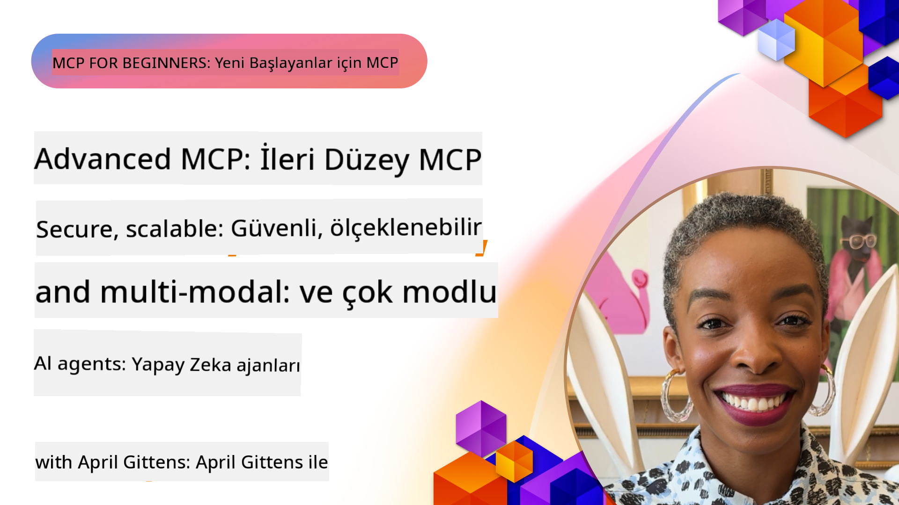

<!--
CO_OP_TRANSLATOR_METADATA:
{
  "original_hash": "d204bc94ea6027d06a703b21b711ca57",
  "translation_date": "2025-08-18T17:50:53+00:00",
  "source_file": "05-AdvancedTopics/README.md",
  "language_code": "tr"
}
-->
# MCP'de İleri Düzey Konular

_(Bu dersin videosunu izlemek için yukarıdaki görsele tıklayın)_

Bu bölüm, Model Context Protocol (MCP) uygulamasında çok modlu entegrasyon, ölçeklenebilirlik, güvenlik en iyi uygulamaları ve kurumsal entegrasyon gibi bir dizi ileri düzey konuyu ele alır. Bu konular, modern AI sistemlerinin taleplerini karşılayabilecek sağlam ve üretime hazır MCP uygulamaları oluşturmak için kritik öneme sahiptir.

## Genel Bakış

Bu ders, Model Context Protocol uygulamasında çok modlu entegrasyon, ölçeklenebilirlik, güvenlik en iyi uygulamaları ve kurumsal entegrasyon gibi ileri düzey kavramları inceler. Bu konular, karmaşık gereksinimleri karşılayabilecek üretim seviyesinde MCP uygulamaları oluşturmak için gereklidir.

## Öğrenme Hedefleri

Bu dersin sonunda şunları yapabileceksiniz:

- MCP çerçeveleri içinde çok modlu yetenekler uygulamak
- Yoğun talep senaryoları için ölçeklenebilir MCP mimarileri tasarlamak
- MCP'nin güvenlik ilkelerine uygun güvenlik en iyi uygulamalarını uygulamak
- MCP'yi kurumsal AI sistemleri ve çerçeveleriyle entegre etmek
- Üretim ortamlarında performansı ve güvenilirliği optimize etmek

## Dersler ve Örnek Projeler

| Bağlantı | Başlık | Açıklama |
|------|-------|-------------|
| [5.1 Azure ile Entegrasyon](./mcp-integration/README.md) | Azure ile Entegrasyon | MCP Sunucunuzu Azure üzerinde nasıl entegre edeceğinizi öğrenin |
| [5.2 Çok Modlu Örnek](./mcp-multi-modality/README.md) | MCP Çok Modlu Örnekler | Ses, görüntü ve çok modlu yanıtlar için örnekler |
| [5.3 MCP OAuth2 Örneği](../../../05-AdvancedTopics/mcp-oauth2-demo) | MCP OAuth2 Demo | MCP ile hem Yetkilendirme hem de Kaynak Sunucusu olarak OAuth2'yi gösteren minimal bir Spring Boot uygulaması. Güvenli token oluşturma, korumalı uç noktalar, Azure Container Apps dağıtımı ve API Yönetimi entegrasyonunu gösterir. |
| [5.4 Kök Bağlamlar](./mcp-root-contexts/README.md) | Kök Bağlamlar | Kök bağlamlar hakkında daha fazla bilgi edinin ve nasıl uygulayacağınızı öğrenin |
| [5.5 Yönlendirme](./mcp-routing/README.md) | Yönlendirme | Farklı yönlendirme türlerini öğrenin |
| [5.6 Örnekleme](./mcp-sampling/README.md) | Örnekleme | Örnekleme ile nasıl çalışacağınızı öğrenin |
| [5.7 Ölçeklendirme](./mcp-scaling/README.md) | Ölçeklendirme | Ölçeklendirme hakkında bilgi edinin |
| [5.8 Güvenlik](./mcp-security/README.md) | Güvenlik | MCP Sunucunuzu güvence altına alın |
| [5.9 Web Arama Örneği](./web-search-mcp/README.md) | Web Arama MCP | SerpAPI ile gerçek zamanlı web, haber, ürün arama ve Soru-Cevap entegrasyonu sağlayan Python MCP sunucusu ve istemcisi. Çoklu araç orkestrasyonu, harici API entegrasyonu ve sağlam hata yönetimini gösterir. |
| [5.10 Gerçek Zamanlı Akış](./mcp-realtimestreaming/README.md) | Akış | Gerçek zamanlı veri akışı, işletmelerin ve uygulamaların zamanında kararlar alabilmesi için bilgilere anında erişim gerektirdiği günümüz veri odaklı dünyasında önemli hale gelmiştir. |
| [5.11 Gerçek Zamanlı Web Arama](./mcp-realtimesearch/README.md) | Web Arama | MCP'nin gerçek zamanlı web aramayı, AI modelleri, arama motorları ve uygulamalar arasında bağlam yönetimi için standart bir yaklaşım sağlayarak nasıl dönüştürdüğünü öğrenin. |
| [5.12 Model Context Protocol Sunucuları için Entra ID Kimlik Doğrulama](./mcp-security-entra/README.md) | Entra ID Kimlik Doğrulama | Microsoft Entra ID, yalnızca yetkili kullanıcıların ve uygulamaların MCP sunucunuzla etkileşimde bulunmasını sağlamak için güçlü bir bulut tabanlı kimlik ve erişim yönetimi çözümü sunar. |
| [5.13 Azure AI Foundry Ajan Entegrasyonu](./mcp-foundry-agent-integration/README.md) | Azure AI Foundry Entegrasyonu | Model Context Protocol sunucularını Azure AI Foundry ajanlarıyla entegre etmeyi öğrenin, güçlü araç orkestrasyonu ve standart harici veri kaynağı bağlantılarıyla kurumsal AI yeteneklerini etkinleştirin. |
| [5.14 Bağlam Mühendisliği](./mcp-contextengineering/README.md) | Bağlam Mühendisliği | MCP sunucuları için bağlam mühendisliği tekniklerinin gelecekteki fırsatları, bağlam optimizasyonu, dinamik bağlam yönetimi ve MCP çerçevelerinde etkili istem mühendisliği stratejileri dahil. |

## Ek Referanslar

İleri MCP konuları hakkında en güncel bilgiler için şu kaynaklara başvurun:
- [MCP Belgeleri](https://modelcontextprotocol.io/)
- [MCP Spesifikasyonu](https://spec.modelcontextprotocol.io/)
- [GitHub Deposu](https://github.com/modelcontextprotocol)

## Temel Çıkarımlar

- Çok modlu MCP uygulamaları, AI yeteneklerini metin işleme ötesine taşır
- Ölçeklenebilirlik, kurumsal dağıtımlar için gereklidir ve yatay ve dikey ölçeklendirme ile ele alınabilir
- Kapsamlı güvenlik önlemleri, verileri korur ve uygun erişim kontrolünü sağlar
- Azure OpenAI ve Microsoft AI Foundry gibi platformlarla kurumsal entegrasyon, MCP yeteneklerini artırır
- İleri MCP uygulamaları, optimize edilmiş mimarilerden ve dikkatli kaynak yönetiminden faydalanır

## Egzersiz

Belirli bir kullanım senaryosu için kurumsal düzeyde bir MCP uygulaması tasarlayın:

1. Kullanım senaryonuz için çok modlu gereksinimleri belirleyin
2. Hassas verileri korumak için gereken güvenlik kontrollerini özetleyin
3. Değişken yükü karşılayabilecek ölçeklenebilir bir mimari tasarlayın
4. Kurumsal AI sistemleriyle entegrasyon noktalarını planlayın
5. Potansiyel performans darboğazlarını ve bunları hafifletme stratejilerini belgeleyin

## Ek Kaynaklar

- [Azure OpenAI Belgeleri](https://learn.microsoft.com/en-us/azure/ai-services/openai/)
- [Microsoft AI Foundry Belgeleri](https://learn.microsoft.com/en-us/ai-services/)

---

## Sıradaki Adım

- [5.1 MCP Entegrasyonu](./mcp-integration/README.md)

**Feragatname**:  
Bu belge, [Co-op Translator](https://github.com/Azure/co-op-translator) adlı yapay zeka çeviri hizmeti kullanılarak çevrilmiştir. Doğruluk için çaba göstersek de, otomatik çevirilerin hata veya yanlışlıklar içerebileceğini lütfen unutmayın. Orijinal belgenin kendi dilindeki hali yetkili kaynak olarak kabul edilmelidir. Kritik bilgiler için profesyonel insan çevirisi önerilir. Bu çevirinin kullanımından kaynaklanan yanlış anlamalar veya yanlış yorumlamalardan sorumlu değiliz.