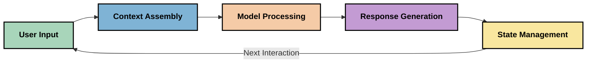
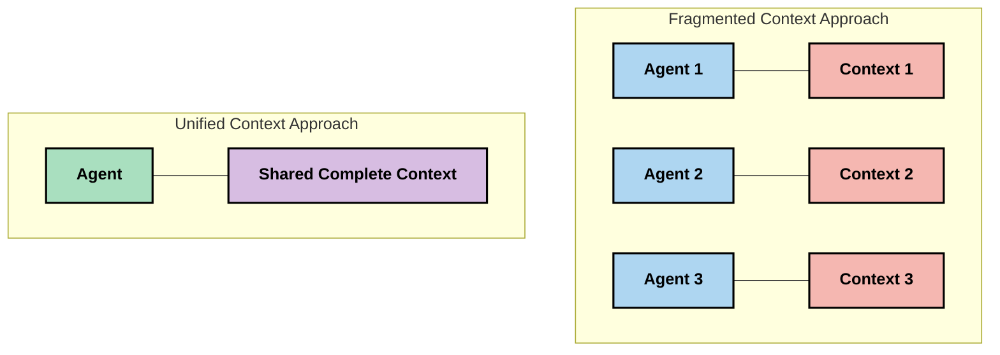
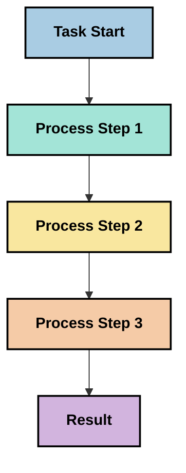
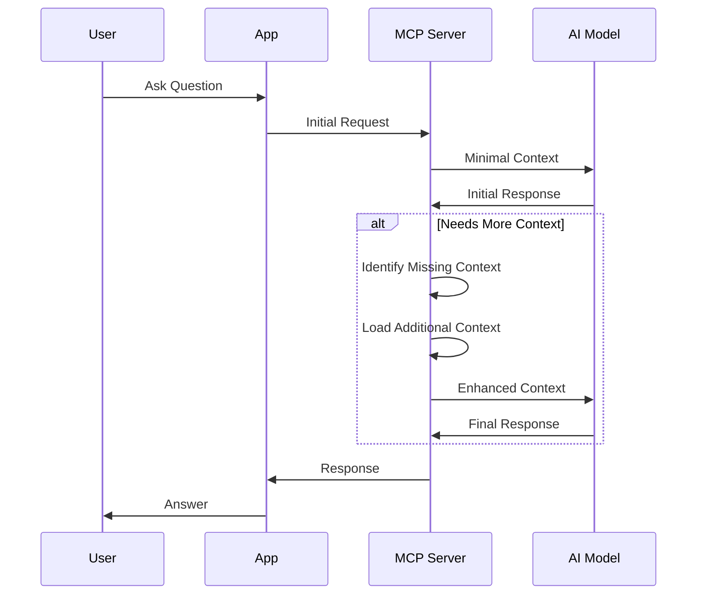
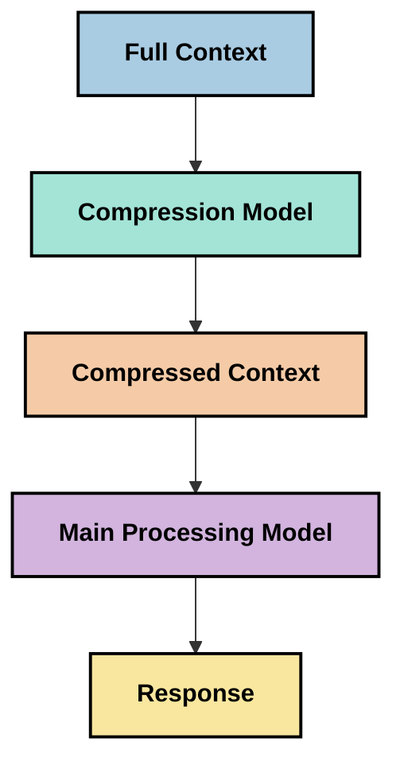

<!--
CO_OP_TRANSLATOR_METADATA:
{
  "original_hash": "fd169ca3071b81b5ee282e194bc823df",
  "translation_date": "2025-09-15T20:26:13+00:00",
  "source_file": "05-AdvancedTopics/mcp-contextengineering/README.md",
  "language_code": "tr"
}
-->
# Bağlam Mühendisliği: MCP Ekosisteminde Yükselen Bir Kavram

## Genel Bakış

Bağlam mühendisliği, AI alanında yükselen bir kavramdır ve müşteriler ile AI hizmetleri arasındaki etkileşimlerde bilginin nasıl yapılandırıldığını, iletildiğini ve sürdürüldüğünü inceler. Model Bağlam Protokolü (MCP) ekosistemi geliştikçe, bağlamı etkili bir şekilde yönetmenin önemi giderek artmaktadır. Bu modül, bağlam mühendisliği kavramını tanıtır ve MCP uygulamalarındaki potansiyel kullanım alanlarını keşfeder.

## Öğrenme Hedefleri

Bu modülün sonunda şunları yapabileceksiniz:

- Bağlam mühendisliği kavramını ve MCP uygulamalarındaki potansiyel rolünü anlayın
- MCP protokol tasarımının ele aldığı bağlam yönetimindeki temel zorlukları belirleyin
- Daha iyi bağlam yönetimi ile model performansını artırma tekniklerini keşfedin
- Bağlamın etkinliğini ölçme ve değerlendirme yaklaşımlarını düşünün
- MCP çerçevesi aracılığıyla AI deneyimlerini iyileştirmek için bu yükselen kavramları uygulayın

## Bağlam Mühendisliğine Giriş

Bağlam mühendisliği, kullanıcılar, uygulamalar ve AI modelleri arasındaki bilgi akışının bilinçli tasarımı ve yönetimine odaklanan bir kavramdır. Örneğin, istem mühendisliği gibi yerleşik alanlardan farklı olarak, bağlam mühendisliği henüz uygulayıcılar tarafından tanımlanmakta ve AI modellerine doğru bilgiyi doğru zamanda sağlama zorluklarını çözmek için çalışılmaktadır.

Büyük dil modelleri (LLM'ler) geliştikçe, bağlamın önemi giderek daha belirgin hale geldi. Sağlanan bağlamın kalitesi, uygunluğu ve yapısı, model çıktıları üzerinde doğrudan etkili olur. Bağlam mühendisliği, bu ilişkiyi inceler ve etkili bağlam yönetimi için ilkeler geliştirmeyi amaçlar.

> "2025 yılında, mevcut modeller son derece zeki olacak. Ancak en zeki insan bile, kendisinden ne yapması istendiğine dair bağlam olmadan işini etkili bir şekilde yapamayacak... 'Bağlam mühendisliği', istem mühendisliğinin bir sonraki seviyesidir. Dinamik bir sistemde bunu otomatik olarak yapmaktır." — Walden Yan, Cognition AI

Bağlam mühendisliği şu alanları kapsayabilir:

1. **Bağlam Seçimi**: Belirli bir görev için hangi bilginin önemli olduğunu belirlemek
2. **Bağlam Yapılandırması**: Bilgiyi modelin anlayışını en üst düzeye çıkaracak şekilde düzenlemek
3. **Bağlam İletimi**: Bilginin modele nasıl ve ne zaman gönderileceğini optimize etmek
4. **Bağlam Bakımı**: Bağlamın durumunu ve zaman içindeki evrimini yönetmek
5. **Bağlam Değerlendirmesi**: Bağlamın etkinliğini ölçmek ve iyileştirmek

Bu odak alanları, LLM'lere bağlam sağlamak için standart bir yol sunan MCP ekosistemi açısından özellikle önemlidir.

## Bağlam Yolculuğu Perspektifi

Bağlam mühendisliğini görselleştirmenin bir yolu, bir MCP sistemi aracılığıyla bilginin izlediği yolculuğu takip etmektir:



### Bağlam Yolculuğundaki Temel Aşamalar:

1. **Kullanıcı Girdisi**: Kullanıcıdan gelen ham bilgi (metin, görüntüler, belgeler)
2. **Bağlam Birleştirme**: Kullanıcı girdisini sistem bağlamı, konuşma geçmişi ve diğer alınan bilgilerle birleştirme
3. **Model İşleme**: AI modeli, birleştirilmiş bağlamı işler
4. **Yanıt Üretimi**: Model, sağlanan bağlama dayalı çıktılar üretir
5. **Durum Yönetimi**: Sistem, etkileşim temelinde iç durumunu günceller

Bu perspektif, AI sistemlerindeki bağlamın dinamik doğasını vurgular ve her aşamada bilgiyi en iyi şekilde nasıl yönetebileceğimizle ilgili önemli soruları gündeme getirir.

## Bağlam Mühendisliğinde Ortaya Çıkan İlkeler

Bağlam mühendisliği alanı şekillendikçe, uygulayıcılardan bazı erken ilkeler ortaya çıkmaya başlamaktadır. Bu ilkeler, MCP uygulama seçimlerini bilgilendirmeye yardımcı olabilir:

### İlke 1: Bağlamı Tamamen Paylaşın

Bağlam, bir sistemin tüm bileşenleri arasında tamamen paylaşılmalı, birden fazla ajan veya süreç arasında parçalanmamalıdır. Bağlam dağıtıldığında, sistemin bir bölümünde alınan kararlar başka bir yerde alınanlarla çelişebilir.



MCP uygulamalarında, bu, bağlamın tüm boru hattı boyunca sorunsuz bir şekilde akmasını sağlamak yerine bölümlere ayrılmamasını önerir.

### İlke 2: Eylemlerin Zımni Kararlar İçerdiğini Kabul Edin

Bir modelin gerçekleştirdiği her eylem, bağlamı nasıl yorumlayacağına dair zımni kararlar içerir. Farklı bağlamlar üzerinde birden fazla bileşen çalıştığında, bu zımni kararlar çelişebilir ve tutarsız sonuçlara yol açabilir.

Bu ilkenin MCP uygulamaları için önemli etkileri vardır:
- Parçalanmış bağlamla paralel yürütme yerine karmaşık görevlerin doğrusal işlenmesini tercih edin
- Tüm karar noktalarının aynı bağlamsal bilgiye erişimini sağlayın
- Daha sonraki adımların önceki kararların tam bağlamını görebileceği sistemler tasarlayın

### İlke 3: Bağlam Derinliğini Pencere Sınırlamalarıyla Dengeleyin

Konuşmalar ve süreçler uzadıkça, bağlam pencereleri sonunda taşar. Etkili bağlam mühendisliği, kapsamlı bağlam ile teknik sınırlamalar arasındaki bu gerilimi yönetme yaklaşımlarını araştırır.

Keşfedilen potansiyel yaklaşımlar şunları içerir:
- Temel bilgiyi korurken token kullanımını azaltan bağlam sıkıştırma
- Mevcut ihtiyaçlara göre bağlamın aşamalı olarak yüklenmesi
- Önceki etkileşimlerin özetlenmesi, önemli kararlar ve gerçekler korunarak

## Bağlam Zorlukları ve MCP Protokol Tasarımı

Model Bağlam Protokolü (MCP), bağlam yönetiminin benzersiz zorluklarının farkındalığıyla tasarlanmıştır. Bu zorlukları anlamak, MCP protokol tasarımının temel yönlerini açıklamaya yardımcı olur:

### Zorluk 1: Bağlam Penceresi Sınırlamaları
Çoğu AI modeli, bir seferde işleyebileceği bilgi miktarını sınırlayan sabit bağlam pencere boyutlarına sahiptir.

**MCP Tasarım Yanıtı:** 
- Protokol, verimli bir şekilde referans verilebilen yapılandırılmış, kaynak tabanlı bağlamı destekler
- Kaynaklar sayfalara ayrılabilir ve aşamalı olarak yüklenebilir

### Zorluk 2: Uygunluk Belirleme
Bağlama dahil edilecek en uygun bilgiyi belirlemek zordur.

**MCP Tasarım Yanıtı:**
- Esnek araçlar, ihtiyaçlara göre dinamik bilgi alımına olanak tanır
- Yapılandırılmış istemler, tutarlı bağlam organizasyonunu sağlar

### Zorluk 3: Bağlam Sürekliliği
Etkileşimler arasında durumu yönetmek, bağlamın dikkatli bir şekilde izlenmesini gerektirir.

**MCP Tasarım Yanıtı:**
- Standartlaştırılmış oturum yönetimi
- Bağlam evrimi için açıkça tanımlanmış etkileşim kalıpları

### Zorluk 4: Çok Modlu Bağlam
Farklı veri türleri (metin, görüntüler, yapılandırılmış veri) farklı işlemler gerektirir.

**MCP Tasarım Yanıtı:**
- Protokol tasarımı çeşitli içerik türlerini kapsar
- Çok modlu bilgilerin standartlaştırılmış temsili

### Zorluk 5: Güvenlik ve Gizlilik
Bağlam genellikle korunması gereken hassas bilgiler içerir.

**MCP Tasarım Yanıtı:**
- İstemci ve sunucu sorumlulukları arasında net sınırlar
- Veri maruziyetini en aza indirmek için yerel işlem seçenekleri

Bu zorlukları ve MCP'nin bunlara nasıl yanıt verdiğini anlamak, daha gelişmiş bağlam mühendisliği tekniklerini keşfetmek için bir temel sağlar.

## Bağlam Mühendisliğinde Ortaya Çıkan Yaklaşımlar

Bağlam mühendisliği alanı geliştikçe, birkaç umut verici yaklaşım ortaya çıkmaktadır. Bunlar, mevcut düşünceyi temsil eder ve henüz yerleşik en iyi uygulamalar değildir; MCP uygulamalarıyla daha fazla deneyim kazandıkça muhtemelen evrilecektir.

### 1. Tek İşlemli Doğrusal İşleme

Bağlamı dağıtan çok ajanlı mimarilerin aksine, bazı uygulayıcılar tek işlemli doğrusal işlemenin daha tutarlı sonuçlar ürettiğini keşfetmektedir. Bu, birleşik bağlamı koruma ilkesine uygundur.



Bu yaklaşım, paralel işlemden daha az verimli görünebilir, ancak her adım önceki kararların tam anlayışına dayandığı için genellikle daha tutarlı ve güvenilir sonuçlar üretir.

### 2. Bağlam Parçalama ve Önceliklendirme

Büyük bağlamları yönetilebilir parçalara ayırmak ve en önemli olanları önceliklendirmek.

```python
# Conceptual Example: Context Chunking and Prioritization
def process_with_chunked_context(documents, query):
    # 1. Break documents into smaller chunks
    chunks = chunk_documents(documents)
    
    # 2. Calculate relevance scores for each chunk
    scored_chunks = [(chunk, calculate_relevance(chunk, query)) for chunk in chunks]
    
    # 3. Sort chunks by relevance score
    sorted_chunks = sorted(scored_chunks, key=lambda x: x[1], reverse=True)
    
    # 4. Use the most relevant chunks as context
    context = create_context_from_chunks([chunk for chunk, score in sorted_chunks[:5]])
    
    # 5. Process with the prioritized context
    return generate_response(context, query)
```

Yukarıdaki kavram, büyük belgeleri yönetilebilir parçalara ayırma ve bağlam için yalnızca en uygun bölümleri seçme yöntemini gösterir. Bu yaklaşım, bağlam pencere sınırlamaları içinde çalışmaya yardımcı olurken büyük bilgi tabanlarından yararlanmayı sağlar.

### 3. Aşamalı Bağlam Yükleme

Bağlamı bir kerede değil, gerektiği gibi aşamalı olarak yüklemek.



Aşamalı bağlam yükleme, minimum bağlamla başlar ve yalnızca gerektiğinde genişler. Bu, basit sorgular için token kullanımını önemli ölçüde azaltırken karmaşık soruları ele alma yeteneğini korur.

### 4. Bağlam Sıkıştırma ve Özetleme

Bağlam boyutunu azaltırken temel bilgiyi korumak.



Bağlam sıkıştırma şunlara odaklanır:
- Gereksiz bilgiyi kaldırma
- Uzun içerikleri özetleme
- Temel gerçekleri ve ayrıntıları çıkarma
- Kritik bağlam öğelerini koruma
- Token verimliliği için optimize etme

Bu yaklaşım, uzun konuşmaları bağlam pencereleri içinde tutmak veya büyük belgeleri verimli bir şekilde işlemek için özellikle değerli olabilir. Bazı uygulayıcılar, konuşma geçmişini sıkıştırma ve özetleme için özel modeller kullanmaktadır.

## Keşifsel Bağlam Mühendisliği Düşünceleri

MCP uygulamalarıyla çalışırken bağlam mühendisliği alanını keşfederken dikkate alınması gereken birkaç husus vardır. Bunlar reçeteli en iyi uygulamalar değil, belirli kullanım durumunuzda iyileştirmeler sağlayabilecek keşif alanlarıdır.

### Bağlam Hedeflerinizi Düşünün

Karmaşık bağlam yönetimi çözümleri uygulamadan önce, neyi başarmaya çalıştığınızı açıkça ifade edin:
- Modelin başarılı olması için hangi özel bilgiye ihtiyaç var?
- Hangi bilgi temel, hangisi tamamlayıcı?
- Performans kısıtlamalarınız nelerdir (gecikme, token sınırları, maliyetler)?

### Katmanlı Bağlam Yaklaşımlarını Keşfedin

Bazı uygulayıcılar, kavramsal katmanlarda düzenlenmiş bağlamla başarı bulmaktadır:
- **Çekirdek Katman**: Modelin her zaman ihtiyaç duyduğu temel bilgi
- **Durumsal Katman**: Mevcut etkileşimle ilgili bağlam
- **Destekleyici Katman**: Faydalı olabilecek ek bilgi
- **Geri Dönüş Katmanı**: Sadece gerektiğinde erişilen bilgi

### Alım Stratejilerini Araştırın

Bağlamınızın etkinliği genellikle bilgiyi nasıl aldığınıza bağlıdır:
- Kavramsal olarak uygun bilgiyi bulmak için anlamsal arama ve gömme
- Belirli gerçek ayrıntılar için anahtar kelime tabanlı arama
- Birden fazla alım yöntemini birleştiren hibrit yaklaşımlar
- Kategoriler, tarihler veya kaynaklara dayalı kapsamı daraltmak için meta veri filtreleme

### Bağlam Tutarlılığını Deneyin

Bağlamınızın yapısı ve akışı modelin anlayışını etkileyebilir:
- İlgili bilgiyi bir arada gruplama
- Tutarlı biçimlendirme ve organizasyon kullanma
- Uygun olduğunda mantıksal veya kronolojik sıralamayı koruma
- Çelişkili bilgiden kaçınma

### Çok Ajanlı Mimari Ticaretlerini Tartın

Çok ajanlı mimariler birçok AI çerçevesinde popüler olsa da, bağlam yönetimi için önemli zorluklar içerir:
- Bağlam parçalanması, ajanlar arasında tutarsız kararlara yol açabilir
- Paralel işlem, uzlaştırılması zor çelişkiler getirebilir
- Ajanlar arasındaki iletişim yükü performans kazançlarını dengeleyebilir
- Tutarlılığı korumak için karmaşık durum yönetimi gereklidir

Çoğu durumda, parçalanmış bağlamla uzmanlaşmış birden fazla ajan yerine kapsamlı bağlam yönetimi ile tek ajanlı bir yaklaşım daha güvenilir sonuçlar üretebilir.

### Değerlendirme Yöntemleri Geliştirin

Bağlam mühendisliğini zamanla iyileştirmek için başarıyı nasıl ölçeceğinizi düşünün:
- Farklı bağlam yapılarını A/B testi
- Token kullanımı ve yanıt sürelerini izleme
- Kullanıcı memnuniyeti ve görev tamamlama oranlarını takip etme
- Bağlam stratejilerinin neden ve ne zaman başarısız olduğunu analiz etme

Bu hususlar, bağlam mühendisliği alanındaki aktif keşif alanlarını temsil eder. Alan olgunlaştıkça, daha kesin kalıplar ve uygulamalar muhtemelen ortaya çıkacaktır.

## Bağlam Etkinliğini Ölçmek: Gelişen Bir Çerçeve

Bağlam mühendisliği bir kavram olarak ortaya çıktıkça, uygulayıcılar bağlamın etkinliğini nasıl ölçebileceğimizi keşfetmeye başlıyor. Henüz yerleşik bir çerçeve yok, ancak gelecekteki çalışmalara rehberlik edebilecek çeşitli ölçütler değerlendiriliyor.

### Potansiyel Ölçüm Boyutları

#### 1. Girdi Verimliliği Düşünceleri

- **Bağlam-Yanıt Oranı**: Yanıt boyutuna kıyasla ne kadar bağlam gerekiyor?
- **Token Kullanımı**: Sağlanan bağlam tokenlarının yüzde kaçı yanıtı etkiliyor gibi görünüyor?
- **Bağlam Azaltma**: Ham bilgiyi ne kadar etkili bir şekilde sıkıştırabiliriz?

#### 2. Performans Düşünceleri

- **Gecikme Etkisi**: Bağlam yönetimi yanıt süresini nasıl etkiliyor?
- **Token Ekonomisi**: Token kullanımı etkili bir şekilde optimize ediliyor mu?
- **Alım Hassasiyeti**: Alınan bilgi ne kadar uygun?
- **Kaynak Kullanımı**: Hangi hesaplama kaynakları gerekiyor?

#### 3. Kalite Düşünceleri

- **Yanıt Uygunluğu**: Yanıt sorguyu ne kadar iyi karşılıyor?
- **Gerçek Doğruluk**: Bağlam yönetimi gerçek doğruluğu artırıyor mu?
- **Tutarlılık**: Benzer sorgular arasında yanıtlar tutarlı mı?
- **Halüsinasyon Oranı**: Daha iyi bağlam model halüsinasyonlarını azaltıyor mu?

#### 4. Kullanıcı Deneyimi Düşünceleri

- **Takip Oranı**: Kullanıcılar ne sıklıkla açıklama talep ediyor?
- **Görev Tamamlama**: Kullanıcılar hedeflerini başarıyla tamamlıyor mu?
- **Memnuniyet Göstergeleri**: Kullanıcılar deneyimlerini nasıl değerlendiriyor?

### Ölçüm İçin Keşifsel Yaklaşımlar

MCP uygulamalarında bağlam mühendisliğini denerken, şu keşifsel yaklaşımları düşünün:

1. **Temel Karşılaştırmalar**: Daha sofistike yöntemleri test etmeden önce basit bağlam yaklaşımlarıyla bir temel oluşturun

2. **Kademeli Değişiklikler**: Bağlam yönetiminin bir yönünü değiştirin ve etkilerini izole edin

3. **Kullanıcı Merkezli Değerlendirme**: Nicel ölçütleri nitel kullanıcı geri bildirimiyle birleştirin

4. **Başarısızlık Analizi**: Bağlam stratejilerinin başarısız olduğu durumları inceleyerek potansiyel iyileştirmeleri anlayın

5. **Çok Boyutlu Değerlendirme**: Verimlilik, kalite ve kullanıcı deneyimi arasındaki ticaretleri göz önünde bulundurun

Bu deneysel, çok yönlü ölçüm yaklaşımı, bağlam mühendisliğinin yükselen doğasıyla uyumludur.

## Son Düşünceler

Bağ
- [Model Context Protocol Website](https://modelcontextprotocol.io/)
- [Model Context Protocol Specification](https://github.com/modelcontextprotocol/modelcontextprotocol)
- [MCP Documentation](https://modelcontextprotocol.io/docs)
- [MCP C# SDK](https://github.com/modelcontextprotocol/csharp-sdk)
- [MCP Python SDK](https://github.com/modelcontextprotocol/python-sdk)
- [MCP TypeScript SDK](https://github.com/modelcontextprotocol/typescript-sdk)
- [MCP Inspector](https://github.com/modelcontextprotocol/inspector) - MCP sunucuları için görsel test aracı

### Bağlam Mühendisliği Makaleleri
- [Çoklu Ajanlar Oluşturmayın: Bağlam Mühendisliği İlkeleri](https://cognition.ai/blog/dont-build-multi-agents) - Walden Yan'ın bağlam mühendisliği ilkeleri üzerine görüşleri
- [Ajanlar Oluşturmak İçin Pratik Bir Kılavuz](https://cdn.openai.com/business-guides-and-resources/a-practical-guide-to-building-agents.pdf) - OpenAI'ın etkili ajan tasarımı üzerine kılavuzu
- [Etkili Ajanlar Oluşturmak](https://www.anthropic.com/engineering/building-effective-agents) - Anthropic'in ajan geliştirme yaklaşımı

### İlgili Araştırmalar
- [Büyük Dil Modelleri için Dinamik Geri Çağırma Artırımı](https://arxiv.org/abs/2310.01487) - Dinamik geri çağırma yöntemleri üzerine araştırma
- [Ortada Kaybolmak: Dil Modelleri Uzun Bağlamları Nasıl Kullanır?](https://arxiv.org/abs/2307.03172) - Bağlam işleme kalıpları üzerine önemli bir araştırma
- [CLIP Latentleri ile Hiyerarşik Metin Koşullu Görüntü Üretimi](https://arxiv.org/abs/2204.06125) - Bağlam yapılandırması üzerine DALL-E 2 makalesi
- [Büyük Dil Modeli Mimarilerinde Bağlamın Rolünü Keşfetmek](https://aclanthology.org/2023.findings-emnlp.124/) - Bağlam işleme üzerine son araştırmalar
- [Çoklu Ajan İşbirliği: Bir Araştırma](https://arxiv.org/abs/2304.03442) - Çoklu ajan sistemleri ve zorlukları üzerine araştırma

### Ek Kaynaklar
- [Bağlam Penceresi Optimizasyon Teknikleri](https://learn.microsoft.com/en-us/azure/ai-services/openai/concepts/context-window)
- [Gelişmiş RAG Teknikleri](https://www.microsoft.com/en-us/research/blog/retrieval-augmented-generation-rag-and-frontier-models/)
- [Semantic Kernel Dokümantasyonu](https://github.com/microsoft/semantic-kernel)
- [Bağlam Yönetimi için AI Araç Seti](https://github.com/microsoft/aitoolkit)

## Sıradaki Ne 

- [5.15 MCP Özel Taşıma](../mcp-transport/README.md)

---

**Feragatname**:  
Bu belge, AI çeviri hizmeti [Co-op Translator](https://github.com/Azure/co-op-translator) kullanılarak çevrilmiştir. Doğruluğu sağlamak için çaba göstersek de, otomatik çeviriler hata veya yanlışlıklar içerebilir. Belgenin orijinal dili, yetkili kaynak olarak kabul edilmelidir. Kritik bilgiler için profesyonel insan çevirisi önerilir. Bu çevirinin kullanımından kaynaklanan herhangi bir yanlış anlama veya yanlış yorumlama durumunda sorumluluk kabul edilmez.