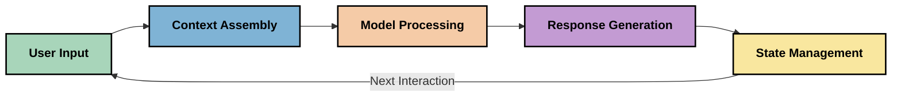
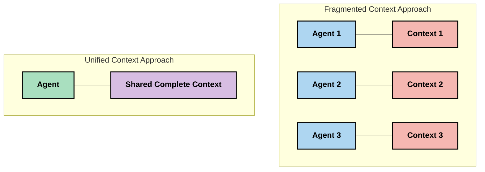
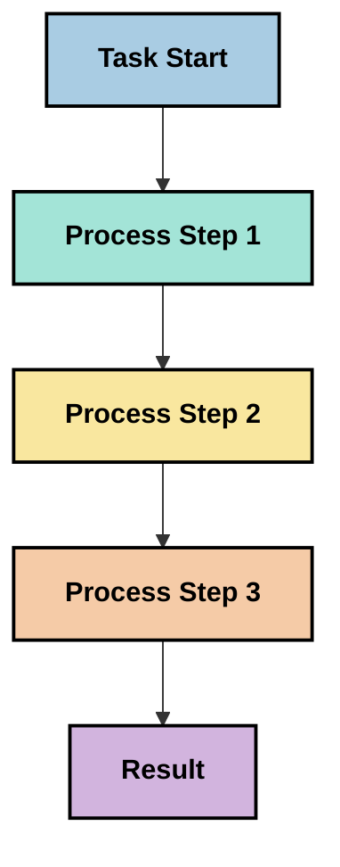
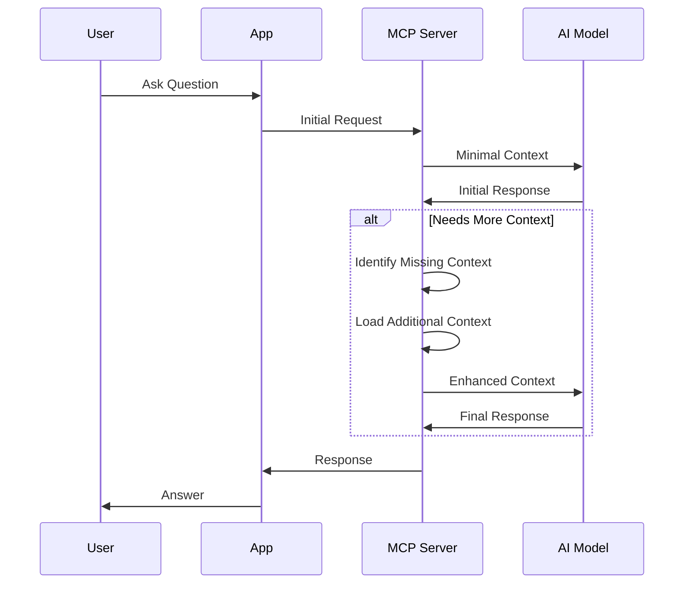
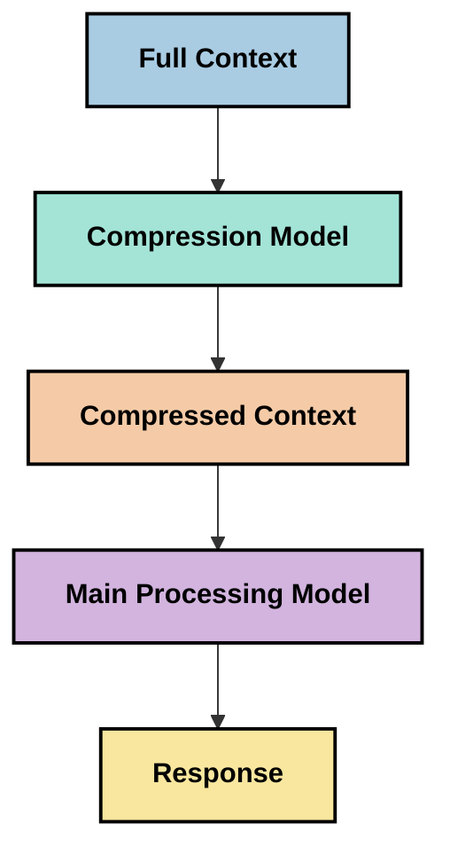

<!--
CO_OP_TRANSLATOR_METADATA:
{
  "original_hash": "5762e8e74dd99d8b7dbb31e69a82561e",
  "translation_date": "2025-07-17T01:47:58+00:00",
  "source_file": "05-AdvancedTopics/mcp-contextengineering/README.md",
  "language_code": "tr"
}
-->
# Bağlam Mühendisliği: MCP Ekosisteminde Yükselen Bir Kavram

## Genel Bakış

Bağlam mühendisliği, yapay zeka alanında ortaya çıkan ve bilgi akışının müşteriler ile yapay zeka hizmetleri arasındaki etkileşimler boyunca nasıl yapılandırıldığı, iletildiği ve sürdürüldüğünü inceleyen bir kavramdır. Model Context Protocol (MCP) ekosistemi geliştikçe, bağlamı etkili bir şekilde yönetmenin önemi giderek artmaktadır. Bu modül, bağlam mühendisliği kavramını tanıtarak MCP uygulamalarındaki potansiyel kullanım alanlarını keşfeder.

## Öğrenme Hedefleri

Bu modülün sonunda şunları yapabileceksiniz:

- Bağlam mühendisliği kavramını ve MCP uygulamalarındaki olası rolünü anlamak
- MCP protokol tasarımının ele aldığı bağlam yönetimiyle ilgili temel zorlukları tanımlamak
- Daha iyi bağlam yönetimiyle model performansını artırma tekniklerini keşfetmek
- Bağlam etkinliğini ölçme ve değerlendirme yaklaşımlarını düşünmek
- Bu yeni kavramları MCP çerçevesi aracılığıyla yapay zeka deneyimlerini geliştirmek için uygulamak

## Bağlam Mühendisliğine Giriş

Bağlam mühendisliği, kullanıcılar, uygulamalar ve yapay zeka modelleri arasındaki bilgi akışının kasıtlı olarak tasarlanması ve yönetilmesine odaklanan yeni bir kavramdır. Prompt mühendisliği gibi yerleşik alanların aksine, bağlam mühendisliği henüz uygulayıcılar tarafından tanımlanmakta ve yapay zeka modellerine doğru zamanda doğru bilgiyi sağlama konusunda karşılaşılan benzersiz zorlukları çözmeye çalışmaktadır.

Büyük dil modelleri (LLM’ler) geliştikçe, bağlamın önemi giderek daha belirgin hale gelmiştir. Sağladığımız bağlamın kalitesi, alaka düzeyi ve yapısı doğrudan model çıktısını etkiler. Bağlam mühendisliği bu ilişkiyi inceler ve etkili bağlam yönetimi için prensipler geliştirmeyi amaçlar.

> "2025 yılında, modeller son derece zeki olacak. Ama en akıllı insan bile, kendisinden istenen işi yaparken bağlam olmadan etkili olamaz... 'Bağlam mühendisliği', prompt mühendisliğinin bir sonraki seviyesidir. Bu, dinamik bir sistemde bunu otomatik olarak yapmaktır." — Walden Yan, Cognition AI

Bağlam mühendisliği şunları içerebilir:

1. **Bağlam Seçimi**: Belirli bir görev için hangi bilginin önemli olduğunun belirlenmesi  
2. **Bağlam Yapılandırması**: Bilginin modelin anlayışını maksimize edecek şekilde düzenlenmesi  
3. **Bağlam İletimi**: Bilginin modellere ne zaman ve nasıl iletileceğinin optimize edilmesi  
4. **Bağlam Bakımı**: Bağlamın zaman içindeki durumu ve evriminin yönetilmesi  
5. **Bağlam Değerlendirmesi**: Bağlamın etkinliğinin ölçülmesi ve iyileştirilmesi  

Bu odak alanları, uygulamaların LLM’lere bağlam sağlaması için standart bir yol sunan MCP ekosistemiyle özellikle ilgilidir.

## Bağlam Yolculuğu Perspektifi

Bağlam mühendisliğini görselleştirmenin bir yolu, bilgilerin MCP sistemi içindeki yolculuğunu takip etmektir:



### Bağlam Yolculuğundaki Temel Aşamalar:

1. **Kullanıcı Girdisi**: Kullanıcıdan gelen ham bilgi (metin, görseller, belgeler)  
2. **Bağlam Birleştirme**: Kullanıcı girdisinin sistem bağlamı, konuşma geçmişi ve diğer alınan bilgilerle birleştirilmesi  
3. **Model İşleme**: Yapay zeka modelinin birleştirilmiş bağlamı işlemesi  
4. **Yanıt Üretimi**: Modelin sağlanan bağlama dayanarak çıktı üretmesi  
5. **Durum Yönetimi**: Sistem iç durumunu etkileşimlere göre güncellemesi  

Bu perspektif, yapay zeka sistemlerinde bağlamın dinamik doğasını vurgular ve her aşamada bilgiyi en iyi şekilde nasıl yöneteceğimiz konusunda önemli sorular ortaya koyar.

## Bağlam Mühendisliğinde Ortaya Çıkan Prensipler

Bağlam mühendisliği alanı şekillenirken, uygulayıcılardan bazı erken prensipler ortaya çıkmaya başlamıştır. Bu prensipler MCP uygulama seçimlerini bilgilendirmede yardımcı olabilir:

### Prensip 1: Bağlamı Tam Olarak Paylaşın

Bağlam, sistemin tüm bileşenleri arasında parçalanmak yerine eksiksiz olarak paylaşılmalıdır. Bağlam dağıtıldığında, sistemin bir bölümünde alınan kararlar başka bir bölümdekilerle çelişebilir.



MCP uygulamalarında bu, bağlamın tüm işlem hattı boyunca kesintisiz akmasını sağlayacak sistemler tasarlamak anlamına gelir.

### Prensip 2: Eylemlerin Gizli Kararlar Taşıdığını Kabul Edin

Modelin her eylemi, bağlamın nasıl yorumlanacağına dair gizli kararlar içerir. Birden fazla bileşen farklı bağlamlar üzerinde işlem yaptığında, bu gizli kararlar çelişebilir ve tutarsız sonuçlara yol açabilir.

Bu prensibin MCP uygulamaları için önemli çıkarımları vardır:  
- Parçalanmış bağlamla paralel yürütme yerine karmaşık görevlerde doğrusal işleme tercih edin  
- Tüm karar noktalarının aynı bağlamsal bilgiye erişimini sağlayın  
- Sonraki adımların önceki kararların tam bağlamını görebileceği sistemler tasarlayın  

### Prensip 3: Bağlam Derinliği ile Pencere Sınırlamalarını Dengeleyin

Konuşmalar ve süreçler uzadıkça, bağlam pencereleri dolmaya başlar. Etkili bağlam mühendisliği, kapsamlı bağlam ile teknik sınırlamalar arasındaki bu gerilimi yönetme yollarını araştırır.

Araştırılan potansiyel yaklaşımlar şunlardır:  
- Temel bilgiyi korurken token kullanımını azaltan bağlam sıkıştırma  
- Güncel ihtiyaçlara göre bağlamın kademeli yüklenmesi  
- Önceki etkileşimlerin özetlenmesi, önemli kararlar ve gerçeklerin korunması  

## Bağlam Zorlukları ve MCP Protokol Tasarımı

Model Context Protocol (MCP), bağlam yönetiminin benzersiz zorluklarının farkında olarak tasarlanmıştır. Bu zorlukları anlamak, MCP protokol tasarımının temel yönlerini açıklamaya yardımcı olur:

### Zorluk 1: Bağlam Penceresi Sınırlamaları  
Çoğu yapay zeka modelinin sabit bağlam pencere boyutları vardır ve aynı anda işleyebilecekleri bilgi miktarını sınırlar.

**MCP Tasarım Yanıtı:**  
- Protokol, verimli referans verilebilen yapılandırılmış, kaynak tabanlı bağlamı destekler  
- Kaynaklar sayfalara ayrılabilir ve kademeli olarak yüklenebilir  

### Zorluk 2: Alaka Düzeyinin Belirlenmesi  
Bağlama dahil edilecek en alakalı bilgiyi belirlemek zordur.

**MCP Tasarım Yanıtı:**  
- İhtiyaca göre dinamik bilgi alımına olanak tanıyan esnek araçlar  
- Tutarlı bağlam organizasyonu için yapılandırılmış promptlar  

### Zorluk 3: Bağlam Sürekliliği  
Etkileşimler arasında durumu yönetmek bağlamın dikkatli takibini gerektirir.

**MCP Tasarım Yanıtı:**  
- Standartlaştırılmış oturum yönetimi  
- Bağlam evrimi için net tanımlanmış etkileşim desenleri  

### Zorluk 4: Çok Modlu Bağlam  
Farklı veri türleri (metin, görsel, yapılandırılmış veri) farklı işlemler gerektirir.

**MCP Tasarım Yanıtı:**  
- Protokol tasarımı çeşitli içerik türlerini destekler  
- Çok modlu bilgilerin standartlaştırılmış temsili  

### Zorluk 5: Güvenlik ve Gizlilik  
Bağlam genellikle korunması gereken hassas bilgiler içerir.

**MCP Tasarım Yanıtı:**  
- İstemci ve sunucu sorumlulukları arasında net sınırlar  
- Veri maruziyetini azaltmak için yerel işleme seçenekleri  

Bu zorlukları ve MCP’nin bunlara nasıl yanıt verdiğini anlamak, daha gelişmiş bağlam mühendisliği tekniklerini keşfetmek için temel oluşturur.

## Ortaya Çıkan Bağlam Mühendisliği Yaklaşımları

Bağlam mühendisliği alanı geliştikçe, birkaç umut vadeden yaklaşım ortaya çıkmaktadır. Bunlar yerleşik en iyi uygulamalar değil, mevcut düşünce biçimini temsil eder ve MCP uygulamalarıyla deneyim kazandıkça evrilecektir.

### 1. Tek İş Parçacıklı Doğrusal İşleme

Bağlamı dağıtan çoklu ajan mimarilerinin aksine, bazı uygulayıcılar tek iş parçacıklı doğrusal işlemenin daha tutarlı sonuçlar verdiğini keşfetmektedir. Bu, birleşik bağlamı koruma prensibiyle uyumludur.



Bu yaklaşım paralel işlemeye göre daha az verimli görünebilir, ancak her adım önceki kararların tam anlayışına dayandığı için genellikle daha tutarlı ve güvenilir sonuçlar üretir.

### 2. Bağlam Parçalama ve Önceliklendirme

Büyük bağlamları yönetilebilir parçalara bölmek ve en önemli olanları önceliklendirmek.

```python
# Conceptual Example: Context Chunking and Prioritization
def process_with_chunked_context(documents, query):
    # 1. Break documents into smaller chunks
    chunks = chunk_documents(documents)
    
    # 2. Calculate relevance scores for each chunk
    scored_chunks = [(chunk, calculate_relevance(chunk, query)) for chunk in chunks]
    
    # 3. Sort chunks by relevance score
    sorted_chunks = sorted(scored_chunks, key=lambda x: x[1], reverse=True)
    
    # 4. Use the most relevant chunks as context
    context = create_context_from_chunks([chunk for chunk, score in sorted_chunks[:5]])
    
    # 5. Process with the prioritized context
    return generate_response(context, query)
```

Yukarıdaki kavram, büyük belgeleri yönetilebilir parçalara ayırıp sadece en alakalı kısımları bağlam için seçmeyi gösterir. Bu yaklaşım, bağlam pencere sınırlamaları içinde çalışmaya yardımcı olurken büyük bilgi tabanlarından faydalanmayı sağlar.

### 3. Kademeli Bağlam Yükleme

Bağlamı hepsini birden yüklemek yerine ihtiyaç duyuldukça kademeli olarak yüklemek.



Kademeli bağlam yükleme, minimal bağlamla başlayıp yalnızca gerektiğinde genişler. Bu, basit sorgular için token kullanımını önemli ölçüde azaltırken karmaşık soruları ele alma yeteneğini korur.

### 4. Bağlam Sıkıştırma ve Özetleme

Bağlam boyutunu azaltırken temel bilgiyi korumak.



Bağlam sıkıştırma şunlara odaklanır:  
- Gereksiz bilgilerin çıkarılması  
- Uzun içeriklerin özetlenmesi  
- Anahtar gerçeklerin ve detayların çıkarılması  
- Kritik bağlam öğelerinin korunması  
- Token verimliliği için optimizasyon  

Bu yaklaşım, uzun konuşmaları bağlam pencereleri içinde tutmak veya büyük belgeleri verimli işlemek için özellikle değerlidir. Bazı uygulayıcılar, konuşma geçmişinin bağlam sıkıştırması ve özetlenmesi için özel modeller kullanmaktadır.

## Keşif Amaçlı Bağlam Mühendisliği Düşünceleri

Bağlam mühendisliği alanını keşfederken, MCP uygulamalarıyla çalışırken akılda tutulması gereken birkaç düşünce vardır. Bunlar zorunlu en iyi uygulamalar değil, belirli kullanım durumlarınızda iyileştirmeler sağlayabilecek keşif alanlarıdır.

### Bağlam Hedeflerinizi Belirleyin

Karmaşık bağlam yönetimi çözümlerini uygulamadan önce neyi başarmaya çalıştığınızı netleştirin:  
- Modelin başarılı olması için hangi özel bilgiye ihtiyacı var?  
- Hangi bilgiler temel, hangileri tamamlayıcı?  
- Performans kısıtlarınız nelerdir (gecikme, token sınırları, maliyetler)?  

### Katmanlı Bağlam Yaklaşımlarını Keşfedin

Bazı uygulayıcılar, bağlamı kavramsal katmanlarda düzenleyerek başarı elde etmektedir:  
- **Çekirdek Katman**: Modelin her zaman ihtiyaç duyduğu temel bilgi  
- **Durumsal Katman**: Mevcut etkileşime özgü bağlam  
- **Destekleyici Katman**: Yardımcı olabilecek ek bilgiler  
- **Yedek Katman**: Sadece gerektiğinde erişilen bilgiler  

### Alım Stratejilerini Araştırın

Bağlamınızın etkinliği, bilgiyi nasıl aldığınıza bağlıdır:  
- Kavramsal olarak alakalı bilgiyi bulmak için semantik arama ve gömme yöntemleri  
- Belirli gerçek detaylar için anahtar kelime tabanlı arama  
- Birden fazla alım yöntemini birleştiren hibrit yaklaşımlar  
- Kategoriler, tarihler veya kaynaklara göre kapsamı daraltmak için meta veri filtreleme  

### Bağlam Tutarlılığıyla Deneyler Yapın

Bağlamınızın yapısı ve akışı modelin anlayışını etkileyebilir:  
- İlgili bilgileri bir arada gruplayın  
- Tutarlı biçimlendirme ve organizasyon kullanın  
- Uygun olduğunda mantıksal veya kronolojik sıralamayı koruyun  
- Çelişkili bilgilerden kaçının  

### Çoklu Ajan Mimarilerinin Dezavantajlarını Tartın

Çoklu ajan mimarileri birçok yapay zeka çerçevesinde popüler olsa da, bağlam yönetimi için önemli zorluklar getirir:  
- Bağlam parçalanması ajanlar arasında tutarsız kararlara yol açabilir  
- Paralel işlem, uzlaştırılması zor çelişkiler yaratabilir  
- Ajanlar arası iletişim yükü performans kazançlarını azaltabilir  
- Tutarlılığı korumak için karmaşık durum yönetimi gerekir  

Birçok durumda, kapsamlı bağlam yönetimiyle tek ajan yaklaşımı, parçalanmış bağlamlı çoklu uzman ajanlardan daha güvenilir sonuçlar verebilir.

### Değerlendirme Yöntemleri Geliştirin

Bağlam mühendisliğini zamanla geliştirmek için başarıyı nasıl ölçeceğinizi düşünün:  
- Farklı bağlam yapıları için A/B testleri  
- Token kullanımı ve yanıt sürelerinin izlenmesi  
- Kullanıcı memnuniyeti ve görev tamamlama oranlarının takibi  
- Bağlam stratejilerinin neden ve ne zaman başarısız olduğunu analiz etme  

Bu düşünceler, bağlam mühendisliği alanında aktif keşif alanlarını temsil eder. Alan olgunlaştıkça daha belirgin kalıplar ve uygulamalar ortaya çıkacaktır.

## Bağlam Etkinliğini Ölçme: Gelişen Bir Çerçeve

Bağlam mühendisliği kavramı ortaya çıkarken, uygulayıcılar etkinliğini nasıl ölçebileceğimizi araştırmaya başlamıştır. Henüz yerleşik bir çerçeve yoktur, ancak gelecekteki çalışmaları yönlendirebilecek çeşitli metrikler değerlendirilmektedir.

### Potansiyel Ölçüm Boyutları

#### 1. Girdi Verimliliği Düşünceleri

- **Bağlam-Yanıt Oranı**: Yanıt boyutuna kıyasla ne kadar bağlam gerekiyor?  
- **Token Kullanımı**: Sağlanan bağlam tokenlarının yüzde kaçı yanıtı etkiliyor gibi görünüyor?  
- **Bağlam Azaltma**: Ham bilgiyi ne kadar etkili sıkıştırabiliriz?  

#### 2. Performans Düşünceleri

- **Gecikme Etkisi**: Bağlam yönetimi yanıt süresini nasıl etkiliyor?  
- **Token Ekonomisi**: Token kullanımı etkin şekilde optimize ediliyor mu?  
- **Alım Doğruluğu**: Alınan bilgi ne kadar alakalı?  
- **Kaynak Kullanımı**: Hangi hesaplama kaynakları gerekiyor?  

#### 3. Kalite Düşünceleri

- **Yanıt Alakası**: Yanıt sorguyu ne kadar iyi karşılıyor?  
- **Gerçek Doğruluğu**: Bağlam yönetimi gerçek doğruluğu artırıyor mu?  
- **Tutarlılık**: Benzer sorgularda yanıtlar tutarlı mı?  
- **Halüsinasyon Oranı**: Daha iyi bağlam model halüsinasyonlarını azaltıyor mu?  

#### 4. Kullanıcı Deneyimi Düşünceleri

- **Takip Oranı**: Kullanıcılar ne sıklıkla açıklama istiyor?  
- **Görev Tamamlama**: Kullanıcılar hedeflerine başarıyla ulaşıyor mu?  
- **Memnuniyet Göstergeleri**: Kullanıcılar deneyimlerini nasıl değerlendiriyor?  

### Ölçüme Yönelik Keşifçi Yaklaşımlar

MCP uygulamalarında bağlam mühendisliğiyle deney yaparken şu keşifçi yaklaşımları göz önünde bulundurun:

1. **Temel Karşılaştırmalar**: Daha karmaşık yöntemleri test etmeden önce basit bağlam yaklaşımlarıyla temel oluşturun  
2. **Kademeli Değişiklikler**: Bağlam yönetiminin bir yönünü değiştirerek etkisini izole edin  
3. **Kullanıcı Odaklı Değerlendirme**: Nicel metrikleri nitel kullanıcı geri bildirimiyle birleştirin  
4. **Başarısızlık Analizi**: Bağlam stratejilerinin başarısız olduğu durumları inceleyerek iyileştirme alanlarını belirleyin  
5. **Çok Boyutlu Değerlendirme**: Verimlilik, kalite ve kullanıcı deneyimi arasındaki dengeyi göz önünde bulundurun  

Bu deneysel, çok yönlü ölçüm yaklaşımı, bağlam mühendisliğinin gelişmekte olan doğasıyla uyumludur.

## Kapanış Düşünceleri

Ba
- [Model Context Protocol Web Sitesi](https://modelcontextprotocol.io/)
- [Model Context Protocol Spesifikasyonu](https://github.com/modelcontextprotocol/modelcontextprotocol)
- [MCP Dokümantasyonu](https://modelcontextprotocol.io/docs)
- [MCP C# SDK](https://github.com/modelcontextprotocol/csharp-sdk)
- [MCP Python SDK](https://github.com/modelcontextprotocol/python-sdk)
- [MCP TypeScript SDK](https://github.com/modelcontextprotocol/typescript-sdk)
- [MCP Inspector](https://github.com/modelcontextprotocol/inspector) - MCP sunucuları için görsel test aracı

### Context Engineering Makaleleri
- [Çoklu Ajanlar Oluşturmayın: Context Engineering İlkeleri](https://cognition.ai/blog/dont-build-multi-agents) - Walden Yan'ın context engineering ilkeleri üzerine görüşleri
- [Ajan Oluşturmak İçin Pratik Bir Rehber](https://cdn.openai.com/business-guides-and-resources/a-practical-guide-to-building-agents.pdf) - OpenAI'nin etkili ajan tasarımı rehberi
- [Etkili Ajanlar Oluşturmak](https://www.anthropic.com/engineering/building-effective-agents) - Anthropic'in ajan geliştirme yaklaşımı

### İlgili Araştırmalar
- [Büyük Dil Modelleri için Dinamik Retrieval Artırımı](https://arxiv.org/abs/2310.01487) - Dinamik retrieval yaklaşımları üzerine araştırma
- [Orta Kısımda Kaybolmak: Dil Modelleri Uzun Contextleri Nasıl Kullanır](https://arxiv.org/abs/2307.03172) - Context işleme kalıpları üzerine önemli araştırma
- [CLIP Latentleri ile Hiyerarşik Metin Koşullu Görüntü Üretimi](https://arxiv.org/abs/2204.06125) - Context yapılandırması hakkında bilgiler içeren DALL-E 2 makalesi
- [Büyük Dil Modeli Mimarilerinde Context'in Rolünü Keşfetmek](https://aclanthology.org/2023.findings-emnlp.124/) - Context yönetimi üzerine güncel araştırma
- [Çoklu Ajan İşbirliği: Bir Anket](https://arxiv.org/abs/2304.03442) - Çoklu ajan sistemleri ve zorlukları üzerine araştırma

### Ek Kaynaklar
- [Context Penceresi Optimizasyon Teknikleri](https://learn.microsoft.com/en-us/azure/ai-services/openai/concepts/context-window)
- [Gelişmiş RAG Teknikleri](https://www.microsoft.com/en-us/research/blog/retrieval-augmented-generation-rag-and-frontier-models/)
- [Semantic Kernel Dokümantasyonu](https://github.com/microsoft/semantic-kernel)
- [Context Yönetimi için AI Araç Seti](https://github.com/microsoft/aitoolkit)

## Sonraki Adım
- [6. Topluluk Katkıları](../../06-CommunityContributions/README.md)

**Feragatname**:  
Bu belge, AI çeviri servisi [Co-op Translator](https://github.com/Azure/co-op-translator) kullanılarak çevrilmiştir. Doğruluk için çaba göstersek de, otomatik çevirilerin hatalar veya yanlışlıklar içerebileceğini lütfen unutmayınız. Orijinal belge, kendi dilinde yetkili kaynak olarak kabul edilmelidir. Kritik bilgiler için profesyonel insan çevirisi önerilir. Bu çevirinin kullanımı sonucu oluşabilecek yanlış anlamalar veya yorum hatalarından sorumlu değiliz.