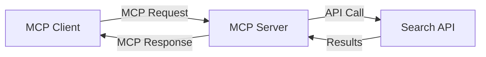
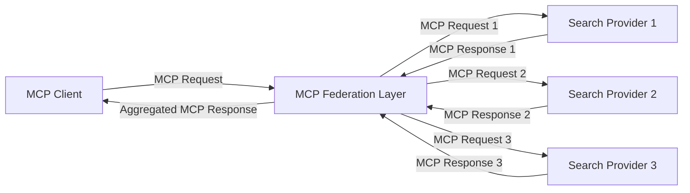
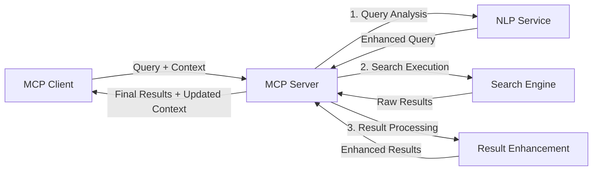

<!--
CO_OP_TRANSLATOR_METADATA:
{
  "original_hash": "eb12652eb7bd17f2193b835a344425c6",
  "translation_date": "2025-06-26T14:00:42+00:00",
  "source_file": "05-AdvancedTopics/mcp-realtimesearch/README.md",
  "language_code": "tr"
}
-->
## Kod Örnekleri Uyarısı

> **Önemli Not**: Aşağıdaki kod örnekleri, Model Context Protocol'ün (MCP) web arama işlevselliği ile entegrasyonunu göstermektedir. Resmi MCP SDK'larının kalıp ve yapılarından esinlenmiş olsa da, eğitim amaçlı olarak sadeleştirilmiştir.
> 
> Bu örnekler şunları gösterir:
> 
> 1. **Python Uygulaması**: Harici bir arama API'sine bağlanan ve web arama aracı sağlayan FastMCP sunucu uygulaması. Bu örnek, [resmi MCP Python SDK](https://github.com/modelcontextprotocol/python-sdk) kalıplarını takip ederek uygun yaşam döngüsü yönetimi, bağlam işleme ve araç uygulamasını göstermektedir. Sunucu, üretim ortamlarında eski SSE taşımacılığının yerini alan önerilen Streamable HTTP taşımacılığını kullanır.
> 
> 2. **JavaScript Uygulaması**: [resmi MCP TypeScript SDK](https://github.com/modelcontextprotocol/typescript-sdk) içindeki FastMCP kalıbını kullanan TypeScript/JavaScript uygulaması. Doğru araç tanımları ve istemci bağlantılarıyla bir arama sunucusu oluşturur. Oturum yönetimi ve bağlam koruma için en güncel önerilen kalıpları takip eder.
> 
> Bu örneklerin üretim kullanımı için ek hata yönetimi, kimlik doğrulama ve spesifik API entegrasyon kodları gerektireceğini unutmayın. Gösterilen arama API uç noktaları (`https://api.search-service.example/search`) yer tutucudur ve gerçek arama servis uç noktalarıyla değiştirilmelidir.
> 
> Tam uygulama detayları ve en güncel yaklaşımlar için lütfen [resmi MCP spesifikasyonuna](https://spec.modelcontextprotocol.io/) ve SDK dokümantasyonuna bakınız.

## Temel Kavramlar

### Model Context Protocol (MCP) Çerçevesi

Model Context Protocol, temelinde AI modelleri, uygulamalar ve servisler arasında bağlam alışverişi için standart bir yol sağlar. Gerçek zamanlı web aramada, bu çerçeve tutarlı, çok aşamalı arama deneyimleri oluşturmak için kritik önemdedir. Ana bileşenler şunlardır:

1. **İstemci-Sunucu Mimarisi**: MCP, arama istemcileri (istekte bulunanlar) ile arama sunucuları (sağlayıcılar) arasında net bir ayrım yaparak esnek dağıtım modellerine olanak tanır.

2. **JSON-RPC İletişimi**: Protokol mesaj alışverişi için JSON-RPC kullanır; bu da web teknolojileriyle uyumludur ve farklı platformlarda kolay uygulanabilir.

3. **Bağlam Yönetimi**: MCP, çoklu etkileşimlerde arama bağlamının korunması, güncellenmesi ve kullanılmasına yönelik yapılandırılmış yöntemler tanımlar.

4. **Araç Tanımları**: Arama yetenekleri, iyi tanımlanmış parametreler ve dönüş değerleri olan standartlaştırılmış araçlar olarak sunulur.

5. **Akış Desteği**: Protokol, gerçek zamanlı aramada sonuçların kademeli olarak gelmesi için gerekli olan akışlı sonuçları destekler.

### Web Arama Entegrasyon Kalıpları

MCP'yi web arama ile entegre ederken birkaç kalıp ortaya çıkar:

#### 1. Doğrudan Arama Sağlayıcı Entegrasyonu

Bu kalıpta MCP sunucusu, bir veya daha fazla arama API'siyle doğrudan iletişim kurar, MCP isteklerini API'ye özgü çağrılara dönüştürür ve sonuçları MCP yanıtları biçiminde formatlar.

#### 2. Bağlam Koruma ile Federasyonlu Arama

Bu kalıp, arama sorgularını birden çok MCP uyumlu arama sağlayıcısına dağıtarak, her birinin farklı içerik türleri veya arama yeteneklerinde uzmanlaşmasını sağlarken birleşik bir bağlamı korur.

#### 3. Bağlam Destekli Arama Zinciri

Bu kalıpta arama süreci birden fazla aşamaya bölünür, her adımda bağlam zenginleştirilir ve sonuçlar aşamalı olarak daha alakalı hale gelir.

### Arama Bağlamı Bileşenleri

MCP tabanlı web aramada bağlam genellikle şunları içerir:

- **Sorgu Geçmişi**: Oturumdaki önceki arama sorguları
- **Kullanıcı Tercihleri**: Dil, bölge, güvenli arama ayarları
- **Etkileşim Geçmişi**: Hangi sonuçların tıklandığı, sonuçlarda geçirilen süre
- **Arama Parametreleri**: Filtreler, sıralama düzenleri ve diğer arama değiştiricileri
- **Alan Bilgisi**: Aramayla ilgili konuya özgü bağlam
- **Zamansal Bağlam**: Zaman bazlı alaka faktörleri
- **Kaynak Tercihleri**: Güvenilen veya tercih edilen bilgi kaynakları

## Kullanım Alanları ve Uygulamalar

### Araştırma ve Bilgi Toplama

MCP, araştırma iş akışlarını şu şekilde geliştirir:

- Arama oturumları boyunca araştırma bağlamını korur
- Daha sofistike ve bağlamsal olarak alakalı sorgulara olanak tanır
- Çok kaynaklı arama federasyonunu destekler
- Arama sonuçlarından bilgi çıkarımını kolaylaştırır

### Gerçek Zamanlı Haber ve Trend Takibi

MCP destekli arama, haber takibi için avantajlar sunar:

- Yaklaşık gerçek zamanlı olarak ortaya çıkan haberlerin keşfi
- İlgili bilgilerin bağlamsal filtrelenmesi
- Birden çok kaynakta konu ve varlık takibi
- Kullanıcı bağlamına göre kişiselleştirilmiş haber uyarıları

### AI Destekli Tarama ve Araştırma

MCP, AI destekli tarama için yeni imkanlar yaratır:

- Mevcut tarayıcı etkinliğine dayalı bağlamsal arama önerileri
- Web aramanın LLM destekli asistanlarla sorunsuz entegrasyonu
- Korunan bağlamla çok aşamalı arama iyileştirmesi
- Geliştirilmiş doğrulama ve bilgi kontrolü

## Gelecek Trendler ve Yenilikler

### MCP'nin Web Aramada Evrimi

Gelecekte MCP'nin şu alanlarda gelişmesini bekliyoruz:

- **Multimodal Arama**: Metin, resim, ses ve video aramasını bağlam koruyarak entegre etme
- **Merkezi Olmayan Arama**: Dağıtık ve federasyonlu arama ekosistemlerini destekleme
- **Arama Gizliliği**: Bağlam farkındalığına sahip gizlilik koruyucu arama mekanizmaları
- **Sorgu Anlayışı**: Doğal dil arama sorgularının derin semantik analizi

### Teknolojide Olası Gelişmeler

MCP aramasının geleceğini şekillendirecek yeni teknolojiler:

1. **Sinirsel Arama Mimarileri**: MCP için optimize edilmiş gömme tabanlı arama sistemleri
2. **Kişiselleştirilmiş Arama Bağlamı**: Zaman içinde bireysel kullanıcı arama alışkanlıklarının öğrenilmesi
3. **Bilgi Grafiği Entegrasyonu**: Alan özelinde bilgi grafikleri ile bağlamsal arama geliştirme
4. **Çapraz Modal Bağlam**: Farklı arama modları arasında bağlamın korunması

## Uygulamalı Alıştırmalar

### Alıştırma 1: Temel MCP Arama Boru Hattı Kurulumu

Bu alıştırmada öğrenecekleriniz:
- Temel bir MCP arama ortamı yapılandırma
- Web arama için bağlam işleyicileri uygulama
- Arama yinelemeleri arasında bağlam korumayı test etme ve doğrulama

### Alıştırma 2: MCP Araması ile Araştırma Asistanı Oluşturma

Tam bir uygulama oluşturun:
- Doğal dil araştırma sorularını işleyen
- Bağlam farkındalığıyla web araması yapan
- Birden çok kaynaktan bilgi sentezleyen
- Düzenli araştırma sonuçları sunan

### Alıştırma 3: MCP ile Çok Kaynaklı Arama Federasyonu Uygulaması

İleri düzey alıştırma:
- Bağlam farkındalığıyla sorguları birden çok arama motoruna yönlendirme
- Sonuç sıralaması ve birleştirme
- Arama sonuçlarının bağlamsal çoğaltma engellemesi
- Kaynağa özgü meta verilerin işlenmesi

## Ek Kaynaklar

- [Model Context Protocol Spesifikasyonu](https://spec.modelcontextprotocol.io/) - Resmi MCP spesifikasyonu ve detaylı protokol dokümantasyonu
- [Model Context Protocol Dokümantasyonu](https://modelcontextprotocol.io/) - Ayrıntılı eğitimler ve uygulama rehberleri
- [MCP Python SDK](https://github.com/modelcontextprotocol/python-sdk) - MCP protokolünün resmi Python uygulaması
- [MCP TypeScript SDK](https://github.com/modelcontextprotocol/typescript-sdk) - MCP protokolünün resmi TypeScript uygulaması
- [MCP Referans Sunucuları](https://github.com/modelcontextprotocol/servers) - MCP sunucularının referans uygulamaları
- [Bing Web Search API Dokümantasyonu](https://learn.microsoft.com/en-us/bing/search-apis/bing-web-search/overview) - Microsoft’un web arama API'si
- [Google Custom Search JSON API](https://developers.google.com/custom-search/v1/overview) - Google’ın programlanabilir arama motoru
- [SerpAPI Dokümantasyonu](https://serpapi.com/search-api) - Arama motoru sonuç sayfası API'si
- [Meilisearch Dokümantasyonu](https://www.meilisearch.com/docs) - Açık kaynak arama motoru
- [Elasticsearch Dokümantasyonu](https://www.elastic.co/guide/index.html) - Dağıtık arama ve analiz motoru
- [LangChain Dokümantasyonu](https://python.langchain.com/docs/get_started/introduction) - LLM ile uygulama geliştirme

## Öğrenme Çıktıları

Bu modülü tamamladıktan sonra şunları yapabileceksiniz:

- Gerçek zamanlı web aramanın temellerini ve zorluklarını anlamak
- Model Context Protocol'ün (MCP) gerçek zamanlı web arama yeteneklerini nasıl geliştirdiğini açıklamak
- Popüler çerçeveler ve API'ler kullanarak MCP tabanlı arama çözümleri uygulamak
- MCP ile ölçeklenebilir, yüksek performanslı arama mimarileri tasarlamak ve dağıtmak
- MCP kavramlarını semantik arama, araştırma asistanlığı ve AI destekli tarama gibi çeşitli kullanım durumlarına uygulamak
- MCP tabanlı arama teknolojilerindeki yeni trendleri ve gelecekteki yenilikleri değerlendirmek

### Güven ve Emniyet Hususları

MCP tabanlı web arama çözümleri uygularken MCP spesifikasyonundan şu önemli prensipleri unutmayın:

1. **Kullanıcı Onayı ve Kontrolü**: Kullanıcılar, tüm veri erişimi ve işlemler için açıkça onay vermeli ve bunları anlamalıdır. Bu, harici veri kaynaklarına erişebilen web arama uygulamaları için özellikle önemlidir.

2. **Veri Gizliliği**: Arama sorguları ve sonuçları uygun şekilde işlenmeli, özellikle hassas bilgiler içeriyorsa. Kullanıcı verilerini korumak için uygun erişim kontrolleri uygulanmalıdır.

3. **Araç Güvenliği**: Arama araçları, keyfi kod yürütme yoluyla potansiyel güvenlik riskleri taşıdığından uygun yetkilendirme ve doğrulama uygulanmalıdır. Araç davranış açıklamaları, güvenilir bir sunucudan alınmadığı sürece güvenilmez kabul edilmelidir.

4. **Açık Dokümantasyon**: MCP tabanlı arama uygulamanızın yetenekleri, sınırlamaları ve güvenlik hususları hakkında net dokümantasyon sağlayın; MCP spesifikasyonundaki uygulama yönergelerini takip edin.

5. **Sağlam Onay Akışları**: Özellikle harici web kaynaklarıyla etkileşimde bulunan araçlar için, kullanım izni verilmeden önce her aracın ne yaptığını açıkça anlatan sağlam onay ve yetkilendirme akışları oluşturun.

MCP güvenlik ve emniyet hususları hakkında tam detaylar için [resmi dokümantasyona](https://modelcontextprotocol.io/specification/2025-03-26#security-and-trust-%26-safety) bakınız.

## Sonraki Adımlar

- [5.11 Model Context Protocol Sunucuları için Entra ID Kimlik Doğrulaması](../mcp-security-entra/README.md)

**Feragatname**:  
Bu belge, AI çeviri hizmeti [Co-op Translator](https://github.com/Azure/co-op-translator) kullanılarak çevrilmiştir. Doğruluk için çaba göstersek de, otomatik çevirilerin hatalar veya yanlışlıklar içerebileceğini lütfen unutmayın. Orijinal belge, kendi dilinde yetkili kaynak olarak kabul edilmelidir. Kritik bilgiler için profesyonel insan çevirisi önerilir. Bu çevirinin kullanımı nedeniyle ortaya çıkabilecek yanlış anlamalar veya yorum hatalarından sorumlu değiliz.