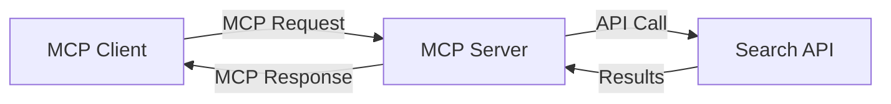
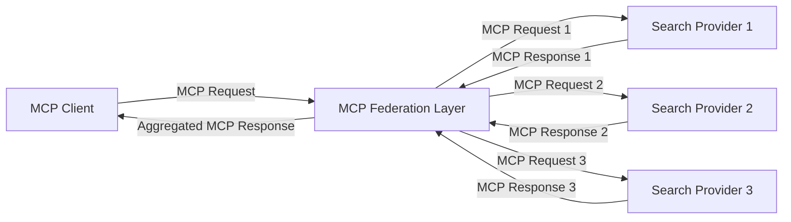
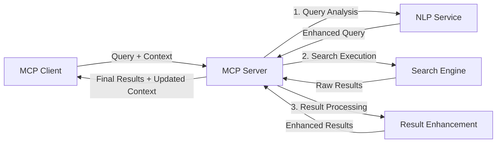

<!--
CO_OP_TRANSLATOR_METADATA:
{
  "original_hash": "16bef2c93c6a86d4ca6a8ce9e120e384",
  "translation_date": "2025-06-13T02:45:49+00:00",
  "source_file": "05-AdvancedTopics/mcp-realtimesearch/README.md",
  "language_code": "tr"
}
-->
## Kod Örnekleri Uyarısı

> **Önemli Not**: Aşağıdaki kod örnekleri, Model Context Protocol (MCP) ile web arama işlevselliğinin entegrasyonunu göstermektedir. Resmi MCP SDK yapıları ve kalıplarını takip etmelerine rağmen, eğitim amaçlı olarak basitleştirilmiştir.
> 
> Bu örneklerde şunlar gösterilmektedir:
> 
> 1. **Python Uygulaması**: Harici bir arama API’sine bağlanan ve web arama aracı sağlayan bir FastMCP sunucu uygulaması. Bu örnek, [resmi MCP Python SDK](https://github.com/modelcontextprotocol/python-sdk) kalıplarına uygun olarak yaşam döngüsü yönetimi, bağlam işleme ve araç uygulamasını göstermektedir. Sunucu, üretim dağıtımları için daha önce kullanılan SSE taşıma yönteminin yerini alan önerilen Streamable HTTP taşımasını kullanır.
> 
> 2. **JavaScript Uygulaması**: [resmi MCP TypeScript SDK](https://github.com/modelcontextprotocol/typescript-sdk) üzerinden FastMCP kalıbını kullanan TypeScript/JavaScript uygulaması; uygun araç tanımları ve istemci bağlantıları ile bir arama sunucusu oluşturur. Oturum yönetimi ve bağlam koruma için en güncel önerilen yöntemleri takip eder.
> 
> Bu örnekler, üretim ortamı için ek hata yönetimi, kimlik doğrulama ve özel API entegrasyon kodları gerektirir. Gösterilen arama API uç noktaları (`https://api.search-service.example/search`) yer tutucudur ve gerçek arama servis uç noktaları ile değiştirilmelidir.
> 
> Tam uygulama detayları ve en güncel yaklaşımlar için lütfen [resmi MCP spesifikasyonuna](https://spec.modelcontextprotocol.io/) ve SDK dokümantasyonuna başvurun.

## Temel Kavramlar

### Model Context Protocol (MCP) Çerçevesi

Temelde, Model Context Protocol AI modelleri, uygulamalar ve servisler arasında bağlam alışverişi için standart bir yol sağlar. Gerçek zamanlı web aramada, bu çerçeve tutarlı ve çok aşamalı arama deneyimleri oluşturmak için kritiktir. Ana bileşenler şunlardır:

1. **İstemci-Sunucu Mimarisi**: MCP, arama istemcileri (istekte bulunanlar) ile arama sunucuları (sağlayıcılar) arasında net bir ayrım yapar ve esnek dağıtım modellerine olanak tanır.

2. **JSON-RPC İletişimi**: Protokol, mesaj alışverişi için JSON-RPC kullanır; bu da web teknolojileriyle uyumlu ve farklı platformlarda kolay uygulanabilir olmasını sağlar.

3. **Bağlam Yönetimi**: MCP, birden çok etkileşim boyunca arama bağlamının korunması, güncellenmesi ve kullanılması için yapılandırılmış yöntemler tanımlar.

4. **Araç Tanımları**: Arama yetenekleri, iyi tanımlanmış parametreler ve dönüş değerleri olan standart araçlar olarak sunulur.

5. **Akış Desteği**: Protokol, sonuçların gerçek zamanlı olarak kademeli gelmesini sağlayan akışlı sonuçları destekler.

### Web Arama Entegrasyon Kalıpları

MCP’nin web arama ile entegrasyonunda çeşitli kalıplar ortaya çıkar:

#### 1. Doğrudan Arama Sağlayıcı Entegrasyonu

Bu kalıpta MCP sunucusu, bir veya birden fazla arama API’siyle doğrudan etkileşime girer, MCP isteklerini API’ye özgü çağrılara dönüştürür ve sonuçları MCP yanıtları olarak biçimlendirir.

#### 2. Bağlam Koruyucu Federasyonlu Arama

Bu kalıp, arama sorgularını bağlamı koruyarak farklı içerik türlerine veya arama yeteneklerine uzmanlaşmış birden çok MCP uyumlu arama sağlayıcısına dağıtır.

#### 3. Bağlam Zenginleştirilmiş Arama Zinciri

Bu kalıpta arama süreci birden çok aşamaya bölünür, her adımda bağlam zenginleştirilir ve sonuçlar kademeli olarak daha alakalı hale gelir.

### Arama Bağlamı Bileşenleri

MCP tabanlı web aramada bağlam genellikle şunları içerir:

- **Sorgu Geçmişi**: Oturumdaki önceki arama sorguları
- **Kullanıcı Tercihleri**: Dil, bölge, güvenli arama ayarları
- **Etkileşim Geçmişi**: Tıklanan sonuçlar, sonuçlarda geçirilen süre
- **Arama Parametreleri**: Filtreler, sıralama düzenleri ve diğer arama değiştiricileri
- **Alan Bilgisi**: Aramayla ilgili konuya özel bağlam
- **Zamansal Bağlam**: Zaman bazlı alaka faktörleri
- **Kaynak Tercihleri**: Güvenilen veya tercih edilen bilgi kaynakları

## Kullanım Alanları ve Uygulamalar

### Araştırma ve Bilgi Toplama

MCP, araştırma iş akışlarını şu şekilde geliştirir:

- Araştırma bağlamını arama oturumları boyunca koruma
- Daha sofistike ve bağlamsal olarak alakalı sorgular yapabilme
- Çok kaynaklı arama federasyonunu destekleme
- Arama sonuçlarından bilgi çıkarımını kolaylaştırma

### Gerçek Zamanlı Haber ve Trend Takibi

MCP destekli arama, haber takibinde avantajlar sağlar:

- Yaklaşık gerçek zamanlı olarak ortaya çıkan haber hikayelerini keşfetme
- Alakalı bilgilerin bağlamsal filtrelenmesi
- Çoklu kaynaklarda konu ve varlık takibi
- Kullanıcı bağlamına dayalı kişiselleştirilmiş haber uyarıları

### Yapay Zeka Destekli Tarama ve Araştırma

MCP, yapay zeka destekli tarama için yeni olanaklar yaratır:

- Mevcut tarayıcı etkinliğine dayalı bağlamsal arama önerileri
- Web arama ile LLM destekli asistanların sorunsuz entegrasyonu
- Bağlam koruyarak çok aşamalı arama iyileştirme
- Gelişmiş gerçek kontrolü ve bilgi doğrulama

## Gelecek Trendler ve Yenilikler

### MCP’nin Web Aramada Evrimi

Gelecekte MCP’nin şu alanlarda gelişmesini bekliyoruz:

- **Multimodal Arama**: Metin, resim, ses ve video aramayı bağlamı koruyarak entegre etme
- **Merkezi Olmayan Arama**: Dağıtık ve federasyonlu arama ekosistemlerini destekleme
- **Arama Gizliliği**: Bağlam farkındalığı olan gizlilik koruyucu arama mekanizmaları
- **Sorgu Anlayışı**: Doğal dil arama sorgularının derin anlamsal çözümlemesi

### Teknolojide Olası Gelişmeler

MCP aramasının geleceğini şekillendirecek ortaya çıkan teknolojiler:

1. **Sinirsel Arama Mimarileri**: MCP için optimize edilmiş gömülü tabanlı arama sistemleri
2. **Kişiselleştirilmiş Arama Bağlamı**: Bireysel kullanıcı arama alışkanlıklarını zamanla öğrenme
3. **Bilgi Grafiği Entegrasyonu**: Alan özel bilgi grafiklerinin bağlamsal aramayı geliştirmesi
4. **Çapraz Modal Bağlam**: Farklı arama modaliteleri arasında bağlam koruma

## Uygulamalı Egzersizler

### Egzersiz 1: Temel MCP Arama Boru Hattı Kurulumu

Bu egzersizde şunları öğreneceksiniz:
- Temel bir MCP arama ortamı yapılandırma
- Web arama için bağlam işleyicileri uygulama
- Arama yinelemeleri boyunca bağlam korumanın test edilmesi ve doğrulanması

### Egzersiz 2: MCP Araması ile Araştırma Asistanı Oluşturma

Tam bir uygulama oluşturun:
- Doğal dilde araştırma sorularını işleme
- Bağlam farkındalığı ile web aramaları yapma
- Çoklu kaynaktan bilgi sentezleme
- Düzenli araştırma sonuçları sunma

### Egzersiz 3: MCP ile Çok Kaynaklı Arama Federasyonu Uygulama

İleri seviye egzersiz:
- Çoklu arama motorlarına bağlam farkındalığı ile sorgu yönlendirme
- Sonuç sıralama ve birleştirme
- Arama sonuçlarının bağlamsal tekrarsızlaştırılması
- Kaynağa özgü meta verilerin yönetimi

## Ek Kaynaklar

- [Model Context Protocol Spesifikasyonu](https://spec.modelcontextprotocol.io/) - Resmi MCP spesifikasyonu ve detaylı protokol dokümantasyonu
- [Model Context Protocol Dokümantasyonu](https://modelcontextprotocol.io/) - Ayrıntılı eğitimler ve uygulama rehberleri
- [MCP Python SDK](https://github.com/modelcontextprotocol/python-sdk) - MCP protokolünün resmi Python uygulaması
- [MCP TypeScript SDK](https://github.com/modelcontextprotocol/typescript-sdk) - MCP protokolünün resmi TypeScript uygulaması
- [MCP Referans Sunucuları](https://github.com/modelcontextprotocol/servers) - MCP sunucularının referans uygulamaları
- [Bing Web Search API Dokümantasyonu](https://learn.microsoft.com/en-us/bing/search-apis/bing-web-search/overview) - Microsoft’un web arama API’si
- [Google Custom Search JSON API](https://developers.google.com/custom-search/v1/overview) - Google’ın programlanabilir arama motoru
- [SerpAPI Dokümantasyonu](https://serpapi.com/search-api) - Arama motoru sonuç sayfası API’si
- [Meilisearch Dokümantasyonu](https://www.meilisearch.com/docs) - Açık kaynaklı arama motoru
- [Elasticsearch Dokümantasyonu](https://www.elastic.co/guide/index.html) - Dağıtık arama ve analiz motoru
- [LangChain Dokümantasyonu](https://python.langchain.com/docs/get_started/introduction) - LLM ile uygulama geliştirme

## Öğrenme Kazanımları

Bu modülü tamamlayarak şunları yapabileceksiniz:

- Gerçek zamanlı web aramanın temellerini ve zorluklarını anlamak
- Model Context Protocol’ün (MCP) gerçek zamanlı web arama yeteneklerini nasıl geliştirdiğini açıklamak
- Popüler çerçeveler ve API’ler kullanarak MCP tabanlı arama çözümleri uygulamak
- MCP ile ölçeklenebilir, yüksek performanslı arama mimarileri tasarlamak ve dağıtmak
- MCP kavramlarını semantik arama, araştırma asistanlığı ve yapay zeka destekli tarama gibi çeşitli kullanım durumlarına uygulamak
- MCP tabanlı arama teknolojilerinde ortaya çıkan trendleri ve gelecekteki yenilikleri değerlendirmek

### Güvenlik ve Güvenilirlik Dikkatleri

MCP tabanlı web arama çözümleri uygularken, MCP spesifikasyonundan şu önemli prensipleri unutmayın:

1. **Kullanıcı Onayı ve Kontrolü**: Kullanıcılar tüm veri erişim ve işlemlerine açıkça onay vermeli ve bunları anlamalıdır. Bu, dış veri kaynaklarına erişebilen web arama uygulamaları için özellikle önemlidir.

2. **Veri Gizliliği**: Arama sorguları ve sonuçlarının, özellikle hassas bilgiler içeriyorsa, uygun şekilde işlenmesini sağlayın. Kullanıcı verilerini korumak için uygun erişim kontrolleri uygulayın.

3. **Araç Güvenliği**: Arama araçları, keyfi kod yürütme yoluyla potansiyel güvenlik riskleri oluşturabilir; bu nedenle doğru yetkilendirme ve doğrulama uygulayın. Araç davranış açıklamaları, güvenilir bir sunucudan alınmadıkça güvensiz kabul edilmelidir.

4. **Açık Dokümantasyon**: MCP tabanlı arama uygulamanızın yetenekleri, sınırlamaları ve güvenlik hususları hakkında açık dokümantasyon sağlayın; MCP spesifikasyonundaki uygulama rehberlerini takip edin.

5. **Sağlam Onay Akışları**: Her aracın ne yaptığını açıkça açıklayan ve kullanımı yetkilendirmeden önce onay akışları oluşturun; özellikle dış web kaynaklarıyla etkileşimli araçlar için.

MCP güvenlik ve güvenilirlik konularının tam detayları için [resmi dokümantasyona](https://modelcontextprotocol.io/specification/2025-03-26#security-and-trust-%26-safety) bakınız.

## Sonraki Adım

- [6. Topluluk Katkıları](../../06-CommunityContributions/README.md)

**Feragatname**:  
Bu belge, AI çeviri hizmeti [Co-op Translator](https://github.com/Azure/co-op-translator) kullanılarak çevrilmiştir. Doğruluk için çaba göstersek de, otomatik çevirilerin hata veya yanlışlık içerebileceğini lütfen unutmayın. Orijinal belge, kendi dilinde yetkili kaynak olarak kabul edilmelidir. Kritik bilgiler için profesyonel insan çevirisi önerilir. Bu çevirinin kullanımı sonucunda oluşabilecek yanlış anlamalar veya yanlış yorumlamalardan sorumlu değiliz.