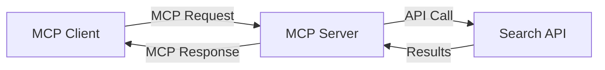
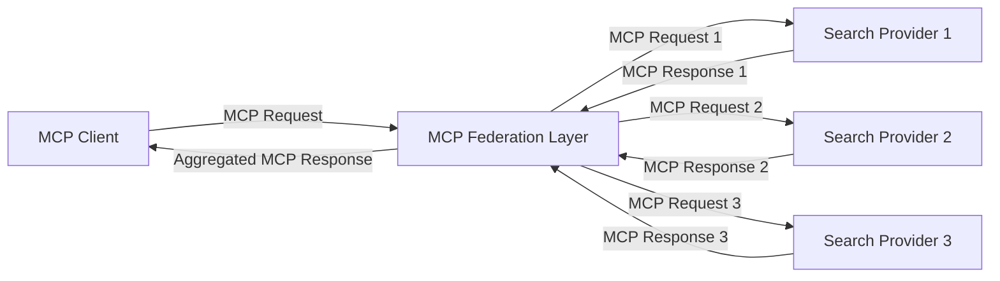
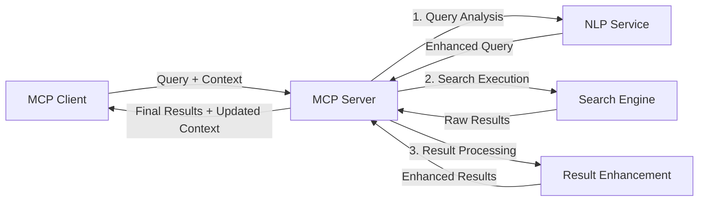

<!--
CO_OP_TRANSLATOR_METADATA:
{
  "original_hash": "333a03e51f90bdf3e6f1ba1694c73f36",
  "translation_date": "2025-07-17T01:29:47+00:00",
  "source_file": "05-AdvancedTopics/mcp-realtimesearch/README.md",
  "language_code": "tr"
}
-->
## Kod Örnekleri Uyarısı

> **Önemli Not**: Aşağıdaki kod örnekleri, Model Context Protocol (MCP) ile web arama işlevselliğinin entegrasyonunu göstermektedir. Resmi MCP SDK'larının kalıplarını ve yapısını takip etmelerine rağmen, eğitim amaçlı olarak basitleştirilmişlerdir.
> 
> Bu örnekler şunları göstermektedir:
> 
> 1. **Python Uygulaması**: Harici bir arama API'sine bağlanan ve web arama aracı sağlayan bir FastMCP sunucu uygulaması. Bu örnek, [resmi MCP Python SDK](https://github.com/modelcontextprotocol/python-sdk) kalıplarını takip ederek uygun yaşam döngüsü yönetimi, bağlam işleme ve araç uygulamasını göstermektedir. Sunucu, üretim dağıtımları için eski SSE taşıma yönteminin yerini alan önerilen Streamable HTTP taşımasını kullanmaktadır.
> 
> 2. **JavaScript Uygulaması**: [resmi MCP TypeScript SDK](https://github.com/modelcontextprotocol/typescript-sdk) içindeki FastMCP kalıbını kullanan TypeScript/JavaScript uygulaması; uygun araç tanımları ve istemci bağlantıları ile bir arama sunucusu oluşturur. Oturum yönetimi ve bağlam koruma için en güncel önerilen kalıpları takip eder.
> 
> Bu örnekler, üretim kullanımı için ek hata yönetimi, kimlik doğrulama ve özel API entegrasyon kodu gerektirebilir. Gösterilen arama API uç noktaları (`https://api.search-service.example/search`) yer tutucudur ve gerçek arama hizmeti uç noktaları ile değiştirilmelidir.
> 
> Tam uygulama detayları ve en güncel yaklaşımlar için lütfen [resmi MCP spesifikasyonuna](https://spec.modelcontextprotocol.io/) ve SDK dokümantasyonuna bakınız.

## Temel Kavramlar

### Model Context Protocol (MCP) Çerçevesi

Temelde, Model Context Protocol, AI modelleri, uygulamalar ve servisler arasında bağlam alışverişi için standart bir yol sağlar. Gerçek zamanlı web aramada, bu çerçeve tutarlı, çok aşamalı arama deneyimleri yaratmak için gereklidir. Ana bileşenler şunlardır:

1. **İstemci-Sunucu Mimarisi**: MCP, arama istemcileri (istekte bulunanlar) ile arama sunucuları (sağlayıcılar) arasında net bir ayrım kurar ve esnek dağıtım modellerine olanak tanır.

2. **JSON-RPC İletişimi**: Protokol, mesaj alışverişi için JSON-RPC kullanır; bu da web teknolojileriyle uyumlu ve farklı platformlarda kolay uygulanabilir olmasını sağlar.

3. **Bağlam Yönetimi**: MCP, birden çok etkileşim boyunca arama bağlamının korunması, güncellenmesi ve kullanılması için yapılandırılmış yöntemler tanımlar.

4. **Araç Tanımları**: Arama yetenekleri, iyi tanımlanmış parametreler ve dönüş değerleri olan standart araçlar olarak sunulur.

5. **Akış Desteği**: Protokol, sonuçların gerçek zamanlı ve kademeli olarak gelmesi gereken durumlar için akış desteği sağlar.

### Web Arama Entegrasyon Kalıpları

MCP'yi web arama ile entegre ederken birkaç kalıp ortaya çıkar:

#### 1. Doğrudan Arama Sağlayıcı Entegrasyonu

Bu kalıpta, MCP sunucusu bir veya daha fazla arama API'si ile doğrudan iletişim kurar, MCP isteklerini API'ye özgü çağrılara çevirir ve sonuçları MCP yanıtları olarak biçimlendirir.

#### 2. Bağlam Koruyarak Federasyonlu Arama

Bu kalıp, arama sorgularını birden çok MCP uyumlu arama sağlayıcısına dağıtır; her biri farklı içerik türleri veya arama yeteneklerinde uzmanlaşabilir ve birleşik bir bağlam korunur.

#### 3. Bağlam Destekli Arama Zinciri

Bu kalıpta, arama süreci birden çok aşamaya bölünür ve her adımda bağlam zenginleştirilir; böylece giderek daha alakalı sonuçlar elde edilir.

### Arama Bağlamı Bileşenleri

MCP tabanlı web aramada bağlam genellikle şunları içerir:

- **Sorgu Geçmişi**: Oturumdaki önceki arama sorguları
- **Kullanıcı Tercihleri**: Dil, bölge, güvenli arama ayarları
- **Etkileşim Geçmişi**: Hangi sonuçların tıklandığı, sonuçlarda geçirilen süre
- **Arama Parametreleri**: Filtreler, sıralama düzenleri ve diğer arama değiştiricileri
- **Alan Bilgisi**: Aramayla ilgili konuya özgü bağlam
- **Zamansal Bağlam**: Zaman bazlı alaka faktörleri
- **Kaynak Tercihleri**: Güvenilen veya tercih edilen bilgi kaynakları

## Kullanım Senaryoları ve Uygulamalar

### Araştırma ve Bilgi Toplama

MCP, araştırma iş akışlarını şu şekillerde geliştirir:

- Arama oturumları boyunca araştırma bağlamını korur
- Daha sofistike ve bağlamsal olarak alakalı sorgulara olanak tanır
- Çok kaynaklı arama federasyonunu destekler
- Arama sonuçlarından bilgi çıkarımını kolaylaştırır

### Gerçek Zamanlı Haber ve Trend Takibi

MCP destekli arama, haber takibi için avantajlar sunar:

- Ortaya çıkan haberlerin neredeyse gerçek zamanlı keşfi
- İlgili bilgilerin bağlamsal filtrelenmesi
- Birden çok kaynakta konu ve varlık takibi
- Kullanıcı bağlamına dayalı kişiselleştirilmiş haber uyarıları

### AI Destekli Tarama ve Araştırma

MCP, AI destekli tarama için yeni olanaklar yaratır:

- Mevcut tarayıcı etkinliğine dayalı bağlamsal arama önerileri
- Web aramanın LLM destekli asistanlarla sorunsuz entegrasyonu
- Korunan bağlamla çok aşamalı arama iyileştirmesi
- Gelişmiş gerçek kontrolü ve bilgi doğrulama

## Gelecek Trendler ve Yenilikler

### MCP'nin Web Aramada Evrimi

İleriye baktığımızda, MCP'nin şu alanlarda gelişmesini bekliyoruz:

- **Multimodal Arama**: Metin, resim, ses ve video aramalarını bağlam korunarak entegre etme
- **Merkeziyetsiz Arama**: Dağıtık ve federasyonlu arama ekosistemlerini destekleme
- **Arama Gizliliği**: Bağlam farkındalığına sahip gizliliği koruyan arama mekanizmaları  
- **Sorgu Anlama**: Doğal dil arama sorgularının derin anlamsal çözümlemesi  

### Teknolojide Olası Gelişmeler  

Geleceğin MCP aramasını şekillendirecek ortaya çıkan teknolojiler:  

1. **Sinirsel Arama Mimarileri**: MCP için optimize edilmiş gömme tabanlı arama sistemleri  
2. **Kişiselleştirilmiş Arama Bağlamı**: Bireysel kullanıcı arama alışkanlıklarının zamanla öğrenilmesi  
3. **Bilgi Grafiği Entegrasyonu**: Alan spesifik bilgi grafiklerinin bağlamsal aramayı güçlendirmesi  
4. **Çapraz Modlu Bağlam**: Farklı arama modları arasında bağlamın korunması  

## Uygulamalı Alıştırmalar  

### Alıştırma 1: Temel Bir MCP Arama Boru Hattı Kurulumu  

Bu alıştırmada şunları öğreneceksiniz:  
- Temel bir MCP arama ortamı yapılandırmak  
- Web araması için bağlam yöneticileri uygulamak  
- Arama yinelemeleri arasında bağlam korumasını test etmek ve doğrulamak  

### Alıştırma 2: MCP Araması ile Araştırma Asistanı Oluşturma  

Tam kapsamlı bir uygulama oluşturun:  
- Doğal dilde araştırma sorularını işleyen  
- Bağlam farkındalığına sahip web aramaları yapan  
- Birden fazla kaynaktan bilgileri sentezleyen  
- Düzenlenmiş araştırma sonuçlarını sunan  

### Alıştırma 3: MCP ile Çok Kaynaklı Arama Federasyonu Uygulaması  

İleri seviye alıştırma, şunları kapsar:  
- Bağlam farkındalığıyla sorguları birden fazla arama motoruna yönlendirme  
- Sonuçların sıralanması ve birleştirilmesi  
- Arama sonuçlarının bağlamsal tekrarsızlaştırılması  
- Kaynağa özgü meta verilerin yönetimi  

## Ek Kaynaklar  

- [Model Context Protocol Specification](https://spec.modelcontextprotocol.io/) - Resmi MCP spesifikasyonu ve detaylı protokol dokümantasyonu  
- [Model Context Protocol Documentation](https://modelcontextprotocol.io/) - Detaylı eğitimler ve uygulama rehberleri  
- [MCP Python SDK](https://github.com/modelcontextprotocol/python-sdk) - MCP protokolünün resmi Python uygulaması  
- [MCP TypeScript SDK](https://github.com/modelcontextprotocol/typescript-sdk) - MCP protokolünün resmi TypeScript uygulaması  
- [MCP Reference Servers](https://github.com/modelcontextprotocol/servers) - MCP sunucularının referans uygulamaları  
- [Bing Web Search API Documentation](https://learn.microsoft.com/en-us/bing/search-apis/bing-web-search/overview) - Microsoft’un web arama API’si  
- [Google Custom Search JSON API](https://developers.google.com/custom-search/v1/overview) - Google’ın programlanabilir arama motoru  
- [SerpAPI Documentation](https://serpapi.com/search-api) - Arama motoru sonuç sayfası API’si  
- [Meilisearch Documentation](https://www.meilisearch.com/docs) - Açık kaynak arama motoru  
- [Elasticsearch Documentation](https://www.elastic.co/guide/index.html) - Dağıtık arama ve analiz motoru  
- [LangChain Documentation](https://python.langchain.com/docs/get_started/introduction) - LLM’lerle uygulama geliştirme  

## Öğrenme Çıktıları  

Bu modülü tamamladıktan sonra şunları yapabileceksiniz:  

- Gerçek zamanlı web aramasının temellerini ve zorluklarını anlamak  
- Model Context Protocol’ün (MCP) gerçek zamanlı web arama yeteneklerini nasıl geliştirdiğini açıklamak  
- Popüler çerçeveler ve API’ler kullanarak MCP tabanlı arama çözümleri uygulamak  
- MCP ile ölçeklenebilir, yüksek performanslı arama mimarileri tasarlamak ve dağıtmak  
- MCP kavramlarını anlamsal arama, araştırma asistanlığı ve yapay zeka destekli gezinme gibi çeşitli kullanım senaryolarına uygulamak  
- MCP tabanlı arama teknolojilerindeki yeni trendleri ve gelecekteki yenilikleri değerlendirmek  

### Güven ve Emniyet Hususları  

MCP tabanlı web arama çözümleri uygularken, MCP spesifikasyonundan şu önemli prensipleri unutmayın:  

1. **Kullanıcı Onayı ve Kontrolü**: Kullanıcılar tüm veri erişimi ve işlemlerine açıkça onay vermeli ve bunları anlamalıdır. Bu, özellikle harici veri kaynaklarına erişebilen web arama uygulamaları için önemlidir.  

2. **Veri Gizliliği**: Arama sorguları ve sonuçlarının uygun şekilde ele alındığından emin olun, özellikle hassas bilgiler içerebilecek durumlarda. Kullanıcı verilerini korumak için uygun erişim kontrolleri uygulayın.  

3. **Araç Güvenliği**: Arama araçları, keyfi kod yürütme yoluyla potansiyel güvenlik riskleri oluşturabilir; bu nedenle uygun yetkilendirme ve doğrulama mekanizmaları uygulayın. Araç davranış açıklamaları, güvenilir bir sunucudan alınmadıkça güvenilmez olarak değerlendirilmelidir.  

4. **Açık Dokümantasyon**: MCP tabanlı arama uygulamanızın yetenekleri, sınırlamaları ve güvenlik hususları hakkında açık dokümantasyon sağlayın; MCP spesifikasyonundaki uygulama rehberlerine uyun.  

5. **Sağlam Onay Akışları**: Özellikle harici web kaynaklarıyla etkileşimde bulunan araçlar için, her aracın ne yaptığını açıkça açıklayan ve kullanımını yetkilendirmeden önce onay alan sağlam onay ve yetkilendirme akışları oluşturun.  

MCP güvenlik ve güvenilirlik konularının tam detayları için [resmi dokümantasyona](https://modelcontextprotocol.io/specification/2025-03-26#security-and-trust-%26-safety) bakınız.  

## Sonraki Adımlar  

- [5.12 Entra ID Authentication for Model Context Protocol Servers](../mcp-security-entra/README.md)

**Feragatname**:  
Bu belge, AI çeviri servisi [Co-op Translator](https://github.com/Azure/co-op-translator) kullanılarak çevrilmiştir. Doğruluk için çaba göstersek de, otomatik çevirilerin hatalar veya yanlışlıklar içerebileceğini lütfen unutmayınız. Orijinal belge, kendi dilinde yetkili kaynak olarak kabul edilmelidir. Kritik bilgiler için profesyonel insan çevirisi önerilir. Bu çevirinin kullanımı sonucu oluşabilecek yanlış anlamalar veya yorum hatalarından sorumlu değiliz.