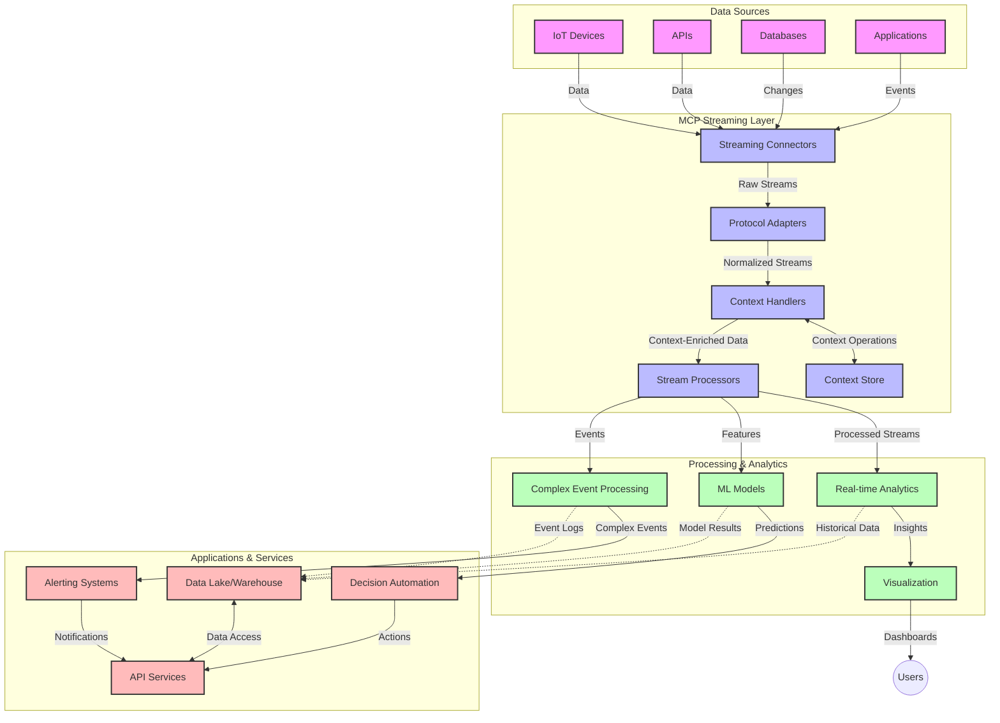

<!--
CO_OP_TRANSLATOR_METADATA:
{
  "original_hash": "195f7287638b77a549acadd96c8f981c",
  "translation_date": "2025-07-14T01:40:00+00:00",
  "source_file": "05-AdvancedTopics/mcp-realtimestreaming/README.md",
  "language_code": "tr"
}
-->
# Gerçek Zamanlı Veri Akışı için Model Context Protokolü

## Genel Bakış

Gerçek zamanlı veri akışı, işletmelerin ve uygulamaların zamanında kararlar alabilmek için anında bilgiye erişim gerektirdiği günümüz veri odaklı dünyasında vazgeçilmez hale gelmiştir. Model Context Protokolü (MCP), bu gerçek zamanlı akış süreçlerini optimize etmede önemli bir ilerlemeyi temsil eder; veri işleme verimliliğini artırır, bağlamsal bütünlüğü korur ve genel sistem performansını iyileştirir.

Bu modül, MCP'nin AI modelleri, akış platformları ve uygulamalar arasında bağlam yönetimi için standart bir yaklaşım sunarak gerçek zamanlı veri akışını nasıl dönüştürdüğünü inceler.

## Gerçek Zamanlı Veri Akışına Giriş

Gerçek zamanlı veri akışı, verinin üretildiği anda sürekli olarak aktarılması, işlenmesi ve analiz edilmesini sağlayan teknolojik bir paradigmadır; böylece sistemler yeni bilgilere anında tepki verebilir. Statik veri kümeleri üzerinde çalışan geleneksel toplu işleme yöntemlerinin aksine, akış işlemleri hareket halindeki veriyi işler ve gecikmeyi en aza indirerek içgörüler ve aksiyonlar sunar.

### Gerçek Zamanlı Veri Akışının Temel Kavramları:

- **Sürekli Veri Akışı**: Veri, kesintisiz ve sonsuz bir olay veya kayıt akışı olarak işlenir.
- **Düşük Gecikmeli İşleme**: Sistemler, veri üretimi ile işlenmesi arasındaki süreyi en aza indirecek şekilde tasarlanır.
- **Ölçeklenebilirlik**: Akış mimarileri, değişken veri hacmi ve hızını yönetebilmelidir.
- **Hata Toleransı**: Sistemler, kesintisiz veri akışını sağlamak için arızalara karşı dayanıklı olmalıdır.
- **Durumlu İşleme**: Anlamlı analiz için olaylar arasında bağlamın korunması önemlidir.

### Model Context Protokolü ve Gerçek Zamanlı Akış

Model Context Protokolü (MCP), gerçek zamanlı akış ortamlarındaki birkaç kritik sorunu ele alır:

1. **Bağlamsal Süreklilik**: MCP, bağlamın dağıtık akış bileşenleri arasında nasıl korunduğunu standartlaştırır; böylece AI modelleri ve işleme düğümleri ilgili geçmiş ve çevresel bağlama erişebilir.

2. **Verimli Durum Yönetimi**: Bağlam iletimi için yapılandırılmış mekanizmalar sağlayarak, MCP akış boru hatlarındaki durum yönetimi yükünü azaltır.

3. **Birlikte Çalışabilirlik**: MCP, farklı akış teknolojileri ve AI modelleri arasında bağlam paylaşımı için ortak bir dil oluşturur; daha esnek ve genişletilebilir mimariler mümkün kılar.

4. **Akışa Özel Bağlam**: MCP uygulamaları, gerçek zamanlı karar verme için en önemli bağlam öğelerini önceliklendirebilir; performans ve doğruluk açısından optimize eder.

5. **Uyarlanabilir İşleme**: MCP aracılığıyla uygun bağlam yönetimi sayesinde, akış sistemleri verideki değişen koşullar ve kalıplara göre dinamik olarak işleme ayarlamaları yapabilir.

IoT sensör ağlarından finansal ticaret platformlarına kadar modern uygulamalarda, MCP'nin akış teknolojileriyle entegrasyonu, karmaşık ve gelişen durumlara gerçek zamanlı olarak uygun şekilde yanıt verebilen daha akıllı, bağlam farkındalıklı işleme sağlar.

## Öğrenme Hedefleri

Bu dersin sonunda şunları yapabileceksiniz:

- Gerçek zamanlı veri akışının temellerini ve zorluklarını anlamak
- Model Context Protokolü'nün (MCP) gerçek zamanlı veri akışını nasıl geliştirdiğini açıklamak
- Kafka ve Pulsar gibi popüler çerçevelerle MCP tabanlı akış çözümleri uygulamak
- MCP ile hata toleranslı, yüksek performanslı akış mimarileri tasarlamak ve dağıtmak
- MCP kavramlarını IoT, finansal ticaret ve AI destekli analiz kullanım senaryolarına uygulamak
- MCP tabanlı akış teknolojilerindeki yeni trendleri ve gelecekteki yenilikleri değerlendirmek

### Tanım ve Önemi

Gerçek zamanlı veri akışı, verinin minimum gecikmeyle sürekli olarak üretilmesi, işlenmesi ve iletilmesini içerir. Toplu işleme yöntemlerinin aksine, veriler gruplar halinde toplanıp işlenmez; veri geldikçe kademeli olarak işlenir ve anında içgörüler ve aksiyonlar sağlar.

Gerçek zamanlı veri akışının temel özellikleri şunlardır:

- **Düşük Gecikme**: Verinin milisaniyelerden saniyelere kadar işlenip analiz edilmesi
- **Sürekli Akış**: Çeşitli kaynaklardan kesintisiz veri akışları
- **Anında İşleme**: Verinin toplu değil, geldiği anda analiz edilmesi
- **Olay Tabanlı Mimari**: Olaylar gerçekleştiği anda tepki verilmesi

### Geleneksel Veri Akışındaki Zorluklar

Geleneksel veri akışı yaklaşımları birkaç sınırlamayla karşılaşır:

1. **Bağlam Kaybı**: Dağıtık sistemler arasında bağlamın korunmasında zorluk
2. **Ölçeklenebilirlik Sorunları**: Yüksek hacimli ve hızlı veriyi yönetmede zorluklar
3. **Entegrasyon Karmaşıklığı**: Farklı sistemler arasında birlikte çalışabilirlik problemleri
4. **Gecikme Yönetimi**: İşlem süresi ile veri akış hızı arasında denge kurma
5. **Veri Tutarlılığı**: Akış boyunca veri doğruluğu ve bütünlüğünü sağlama

## Model Context Protokolü (MCP) Anlayışı

### MCP Nedir?

Model Context Protokolü (MCP), AI modelleri ve uygulamalar arasında verimli iletişimi kolaylaştırmak için tasarlanmış standart bir iletişim protokolüdür. Gerçek zamanlı veri akışı bağlamında MCP, şunları sağlar:

- Veri boru hattı boyunca bağlamın korunması
- Veri alışverişi formatlarının standartlaştırılması
- Büyük veri setlerinin iletiminde optimizasyon
- Modelden modele ve modelden uygulamaya iletişimin geliştirilmesi

### Temel Bileşenler ve Mimari

Gerçek zamanlı akış için MCP mimarisi birkaç temel bileşenden oluşur:

1. **Bağlam Yöneticileri**: Akış boru hattı boyunca bağlamsal bilgiyi yönetir ve korur
2. **Akış İşleyicileri**: Bağlam farkındalığı ile gelen veri akışlarını işler
3. **Protokol Adaptörleri**: Farklı akış protokolleri arasında bağlamı koruyarak dönüşüm yapar
4. **Bağlam Deposu**: Bağlamsal bilgiyi verimli şekilde depolar ve geri getirir
5. **Akış Bağlayıcıları**: Kafka, Pulsar, Kinesis gibi çeşitli akış platformlarına bağlanır



### MCP Gerçek Zamanlı Veri İşlemeyi Nasıl İyileştirir?

MCP, geleneksel akış zorluklarını şu yollarla çözer:

- **Bağlamsal Bütünlük**: Veri noktaları arasındaki ilişkileri tüm boru hattı boyunca korur
- **Optimum İletim**: Akıllı bağlam yönetimiyle veri alışverişindeki gereksiz tekrarları azaltır
- **Standart Arayüzler**: Akış bileşenleri için tutarlı API’ler sağlar
- **Azaltılmış Gecikme**: Verimli bağlam işleme ile işlem yükünü minimize eder
- **Gelişmiş Ölçeklenebilirlik**: Bağlamı koruyarak yatay ölçeklemeyi destekler

## Entegrasyon ve Uygulama

Gerçek zamanlı veri akış sistemleri, hem performans hem de bağlamsal bütünlüğü korumak için dikkatli mimari tasarım ve uygulama gerektirir. Model Context Protokolü, AI modelleri ve akış teknolojilerini entegre etmek için standart bir yaklaşım sunar; böylece daha gelişmiş, bağlam farkındalıklı işleme boru hatları oluşturulabilir.

### MCP Entegrasyonunun Akış Mimarilerindeki Genel Görünümü

Gerçek zamanlı akış ortamlarında MCP uygulaması birkaç önemli hususu içerir:

1. **Bağlam Serileştirme ve Taşıma**: MCP, bağlamsal bilgiyi akış veri paketleri içinde kodlamak için verimli mekanizmalar sağlar; böylece önemli bağlam, veri işleme boru hattı boyunca takip edilir. Bu, akış taşıma için optimize edilmiş standart serileştirme formatlarını içerir.

2. **Durumlu Akış İşleme**: MCP, işleme düğümleri arasında tutarlı bağlam temsili sağlayarak daha akıllı durumlu işleme imkanı sunar. Bu, durum yönetiminin geleneksel olarak zor olduğu dağıtık akış mimarilerinde özellikle değerlidir.

3. **Olay Zamanı ve İşlem Zamanı**: MCP uygulamaları, olayların ne zaman gerçekleştiği ile ne zaman işlendiği arasındaki farkı ele almalıdır. Protokol, olay zamanı semantiğini koruyan zamansal bağlamı içerebilir.

4. **Geri Basınç Yönetimi**: MCP, bağlam yönetimini standartlaştırarak akış sistemlerinde geri basıncın yönetilmesine yardımcı olur; bileşenlerin işleme kapasitelerini iletip akış hızını ayarlamalarını sağlar.

5. **Bağlam Penceresi ve Toplama**: MCP, zamansal ve ilişkisel bağlamların yapılandırılmış temsillerini sağlayarak daha gelişmiş pencereleme işlemlerine olanak tanır; böylece olay akışları üzerinde daha anlamlı toplamalara imkan verir.

6. **Tam-Özellikle İşleme**: Tam-özellikle (exactly-once) semantiği gerektiren akış sistemlerinde MCP, işleme durumunu izlemek ve doğrulamak için işleme meta verilerini içerebilir.

MCP’nin çeşitli akış teknolojilerinde uygulanması, bağlam yönetimi için birleşik bir yaklaşım yaratır; özel entegrasyon kodu ihtiyacını azaltırken, veri boru hattı boyunca anlamlı bağlamın korunmasını artırır.

### MCP’nin Çeşitli Veri Akış Çerçevelerindeki Kullanımı

Aşağıdaki örnekler, JSON-RPC tabanlı protokolü ve farklı taşıma mekanizmalarını içeren mevcut MCP spesifikasyonunu temel alır. Kod, Kafka ve Pulsar gibi akış platformlarını MCP protokolü ile tam uyumlu şekilde entegre eden özel taşıyıcıların nasıl uygulanabileceğini gösterir.

Örnekler, MCP’nin merkezinde yer alan bağlamsal farkındalığı koruyarak gerçek zamanlı veri işleme sağlamak için akış platformlarının MCP ile nasıl entegre edilebileceğini göstermeyi amaçlar. Bu yaklaşım, kod örneklerinin Haziran 2025 itibarıyla MCP spesifikasyonunun güncel durumunu doğru şekilde yansıtmasını sağlar.

MCP, popüler akış çerçeveleriyle entegre edilebilir:

#### Apache Kafka Entegrasyonu

```python
import asyncio
import json
from typing import Dict, Any, Optional
from confluent_kafka import Consumer, Producer, KafkaError
from mcp.client import Client, ClientCapabilities
from mcp.core.message import JsonRpcMessage
from mcp.core.transports import Transport

# Custom transport class to bridge MCP with Kafka
class KafkaMCPTransport(Transport):
    def __init__(self, bootstrap_servers: str, input_topic: str, output_topic: str):
        self.bootstrap_servers = bootstrap_servers
        self.input_topic = input_topic
        self.output_topic = output_topic
        self.producer = Producer({'bootstrap.servers': bootstrap_servers})
        self.consumer = Consumer({
            'bootstrap.servers': bootstrap_servers,
            'group.id': 'mcp-client-group',
            'auto.offset.reset': 'earliest'
        })
        self.message_queue = asyncio.Queue()
        self.running = False
        self.consumer_task = None
        
    async def connect(self):
        """Connect to Kafka and start consuming messages"""
        self.consumer.subscribe([self.input_topic])
        self.running = True
        self.consumer_task = asyncio.create_task(self._consume_messages())
        return self
        
    async def _consume_messages(self):
        """Background task to consume messages from Kafka and queue them for processing"""
        while self.running:
            try:
                msg = self.consumer.poll(1.0)
                if msg is None:
                    await asyncio.sleep(0.1)
                    continue
                
                if msg.error():
                    if msg.error().code() == KafkaError._PARTITION_EOF:
                        continue
                    print(f"Consumer error: {msg.error()}")
                    continue
                
                # Parse the message value as JSON-RPC
                try:
                    message_str = msg.value().decode('utf-8')
                    message_data = json.loads(message_str)
                    mcp_message = JsonRpcMessage.from_dict(message_data)
                    await self.message_queue.put(mcp_message)
                except Exception as e:
                    print(f"Error parsing message: {e}")
            except Exception as e:
                print(f"Error in consumer loop: {e}")
                await asyncio.sleep(1)
    
    async def read(self) -> Optional[JsonRpcMessage]:
        """Read the next message from the queue"""
        try:
            message = await self.message_queue.get()
            return message
        except Exception as e:
            print(f"Error reading message: {e}")
            return None
    
    async def write(self, message: JsonRpcMessage) -> None:
        """Write a message to the Kafka output topic"""
        try:
            message_json = json.dumps(message.to_dict())
            self.producer.produce(
                self.output_topic,
                message_json.encode('utf-8'),
                callback=self._delivery_report
            )
            self.producer.poll(0)  # Trigger callbacks
        except Exception as e:
            print(f"Error writing message: {e}")
    
    def _delivery_report(self, err, msg):
        """Kafka producer delivery callback"""
        if err is not None:
            print(f'Message delivery failed: {err}')
        else:
            print(f'Message delivered to {msg.topic()} [{msg.partition()}]')
    
    async def close(self) -> None:
        """Close the transport"""
        self.running = False
        if self.consumer_task:
            self.consumer_task.cancel()
            try:
                await self.consumer_task
            except asyncio.CancelledError:
                pass
        self.consumer.close()
        self.producer.flush()

# Example usage of the Kafka MCP transport
async def kafka_mcp_example():
    # Create MCP client with Kafka transport
    client = Client(
        {"name": "kafka-mcp-client", "version": "1.0.0"},
        ClientCapabilities({})
    )
    
    # Create and connect the Kafka transport
    transport = KafkaMCPTransport(
        bootstrap_servers="localhost:9092",
        input_topic="mcp-responses",
        output_topic="mcp-requests"
    )
    
    await client.connect(transport)
    
    try:
        # Initialize the MCP session
        await client.initialize()
        
        # Example of executing a tool via MCP
        response = await client.execute_tool(
            "process_data",
            {
                "data": "sample data",
                "metadata": {
                    "source": "sensor-1",
                    "timestamp": "2025-06-12T10:30:00Z"
                }
            }
        )
        
        print(f"Tool execution response: {response}")
        
        # Clean shutdown
        await client.shutdown()
    finally:
        await transport.close()

# Run the example
if __name__ == "__main__":
    asyncio.run(kafka_mcp_example())
```

#### Apache Pulsar Uygulaması

```python
import asyncio
import json
import pulsar
from typing import Dict, Any, Optional
from mcp.core.message import JsonRpcMessage
from mcp.core.transports import Transport
from mcp.server import Server, ServerOptions
from mcp.server.tools import Tool, ToolExecutionContext, ToolMetadata

# Create a custom MCP transport that uses Pulsar
class PulsarMCPTransport(Transport):
    def __init__(self, service_url: str, request_topic: str, response_topic: str):
        self.service_url = service_url
        self.request_topic = request_topic
        self.response_topic = response_topic
        self.client = pulsar.Client(service_url)
        self.producer = self.client.create_producer(response_topic)
        self.consumer = self.client.subscribe(
            request_topic,
            "mcp-server-subscription",
            consumer_type=pulsar.ConsumerType.Shared
        )
        self.message_queue = asyncio.Queue()
        self.running = False
        self.consumer_task = None
    
    async def connect(self):
        """Connect to Pulsar and start consuming messages"""
        self.running = True
        self.consumer_task = asyncio.create_task(self._consume_messages())
        return self
    
    async def _consume_messages(self):
        """Background task to consume messages from Pulsar and queue them for processing"""
        while self.running:
            try:
                # Non-blocking receive with timeout
                msg = self.consumer.receive(timeout_millis=500)
                
                # Process the message
                try:
                    message_str = msg.data().decode('utf-8')
                    message_data = json.loads(message_str)
                    mcp_message = JsonRpcMessage.from_dict(message_data)
                    await self.message_queue.put(mcp_message)
                    
                    # Acknowledge the message
                    self.consumer.acknowledge(msg)
                except Exception as e:
                    print(f"Error processing message: {e}")
                    # Negative acknowledge if there was an error
                    self.consumer.negative_acknowledge(msg)
            except Exception as e:
                # Handle timeout or other exceptions
                await asyncio.sleep(0.1)
    
    async def read(self) -> Optional[JsonRpcMessage]:
        """Read the next message from the queue"""
        try:
            message = await self.message_queue.get()
            return message
        except Exception as e:
            print(f"Error reading message: {e}")
            return None
    
    async def write(self, message: JsonRpcMessage) -> None:
        """Write a message to the Pulsar output topic"""
        try:
            message_json = json.dumps(message.to_dict())
            self.producer.send(message_json.encode('utf-8'))
        except Exception as e:
            print(f"Error writing message: {e}")
    
    async def close(self) -> None:
        """Close the transport"""
        self.running = False
        if self.consumer_task:
            self.consumer_task.cancel()
            try:
                await self.consumer_task
            except asyncio.CancelledError:
                pass
        self.consumer.close()
        self.producer.close()
        self.client.close()

# Define a sample MCP tool that processes streaming data
@Tool(
    name="process_streaming_data",
    description="Process streaming data with context preservation",
    metadata=ToolMetadata(
        required_capabilities=["streaming"]
    )
)
async def process_streaming_data(
    ctx: ToolExecutionContext,
    data: str,
    source: str,
    priority: str = "medium"
) -> Dict[str, Any]:
    """
    Process streaming data while preserving context
    
    Args:
        ctx: Tool execution context
        data: The data to process
        source: The source of the data
        priority: Priority level (low, medium, high)
        
    Returns:
        Dict containing processed results and context information
    """
    # Example processing that leverages MCP context
    print(f"Processing data from {source} with priority {priority}")
    
    # Access conversation context from MCP
    conversation_id = ctx.conversation_id if hasattr(ctx, 'conversation_id') else "unknown"
    
    # Return results with enhanced context
    return {
        "processed_data": f"Processed: {data}",
        "context": {
            "conversation_id": conversation_id,
            "source": source,
            "priority": priority,
            "processing_timestamp": ctx.get_current_time_iso()
        }
    }

# Example MCP server implementation using Pulsar transport
async def run_mcp_server_with_pulsar():
    # Create MCP server
    server = Server(
        {"name": "pulsar-mcp-server", "version": "1.0.0"},
        ServerOptions(
            capabilities={"streaming": True}
        )
    )
    
    # Register our tool
    server.register_tool(process_streaming_data)
    
    # Create and connect Pulsar transport
    transport = PulsarMCPTransport(
        service_url="pulsar://localhost:6650",
        request_topic="mcp-requests",
        response_topic="mcp-responses"
    )
    
    try:
        # Start the server with the Pulsar transport
        await server.run(transport)
    finally:
        await transport.close()

# Run the server
if __name__ == "__main__":
    asyncio.run(run_mcp_server_with_pulsar())
```

### Dağıtım İçin En İyi Uygulamalar

MCP’yi gerçek zamanlı akış için uygularken:

1. **Hata Toleransı Tasarlayın**:
   - Uygun hata yönetimi uygulayın
   - Başarısız mesajlar için dead-letter kuyrukları kullanın
   - İdempotent işlemciler tasarlayın

2. **Performans İçin Optimize Edin**:
   - Uygun tampon boyutları yapılandırın
   - Gerektiğinde toplu işleme (batching) kullanın
   - Geri basınç mekanizmaları uygulayın

3. **İzleme ve Gözlemleyin**:
   - Akış işleme metriklerini takip edin
   - Bağlam yayılımını izleyin
   - Anormallikler için uyarılar kurun

4. **Akışlarınızı Güvenceye Alın**:
   - Hassas veriler için şifreleme uygulayın
   - Kimlik doğrulama ve yetkilendirme kullanın
   - Uygun erişim kontrolleri uygulayın

### MCP’nin IoT ve Edge Bilişimdeki Rolü

MCP, IoT akışlarını şu şekillerde geliştirir:

- İşleme boru hattı boyunca cihaz bağlamını korur
- Verimli edge-to-cloud veri akışı sağlar
- IoT veri akışlarında gerçek zamanlı analizleri destekler
- Bağlam ile cihazlar arası iletişimi kolaylaştırır

Örnek: Akıllı Şehir Sensör Ağları  
```
Sensors → Edge Gateways → MCP Stream Processors → Real-time Analytics → Automated Responses
```

### Finansal İşlemler ve Yüksek Frekanslı Ticaretteki Rolü

MCP, finansal veri akışında önemli avantajlar sunar:

- Ticaret kararları için ultra düşük gecikmeli işleme
- İşlem bağlamının tüm işleme süreci boyunca korunması
- Bağlamsal farkındalıkla karmaşık olay işleme desteği
- Dağıtık ticaret sistemlerinde veri tutarlılığının sağlanması

### AI Destekli Veri Analizini Geliştirme

MCP, akış analizlerinde yeni olanaklar yaratır:

- Gerçek zamanlı model eğitimi ve çıkarımı
- Akış verilerinden sürekli öğrenme
- Bağlam farkındalıklı özellik çıkarımı
- Korunan bağlam ile çoklu model çıkarım boru hatları

## Gelecek Trendler ve Yenilikler

### Gerçek Zamanlı Ortamlarda MCP’nin Evrimi

İleriye dönük olarak MCP’nin şu alanlarda gelişmesini bekliyoruz:

- **Kuantum Bilişim Entegrasyonu**: Kuantum tabanlı akış sistemlerine hazırlık
- **Edge-Native İşleme**: Daha fazla bağlam farkındalıklı işlemin uç cihazlara taşınması
- **Otonom Akış Yönetimi**: Kendi kendini optimize eden akış boru hatları
- **Federated Streaming**: Gizliliği koruyarak dağıtık işleme

### Teknolojide Olası İlerlemeler

MCP akışlarının geleceğini şekillendirecek yeni teknolojiler:

1. **AI-Optimizasyonlu Akış Protokolleri**: AI iş yüklerine özel tasarlanmış protokoller
2. **Nöromorfik Bilişim Entegrasyonu**: Beyin esinli akış işleme
3. **Sunucusuz Akış**: Altyapı yönetimi olmadan olay tabanlı, ölçeklenebilir akış
4. **Dağıtık Bağlam Depoları**: Küresel dağıtımlı ancak yüksek tutarlılığa sahip bağlam yönetimi

## Uygulamalı Alıştırmalar

### Alıştırma 1: Temel Bir MCP Akış Boru Hattı Kurulumu

Bu alıştırmada şunları öğreneceksiniz:  
- Temel bir MCP akış ortamı yapılandırma  
- Akış işleme için bağlam yöneticileri uygulama  
- Bağlam korumanın test edilmesi ve doğrulanması

### Alıştırma 2: Gerçek Zamanlı Analitik Gösterge Paneli Oluşturma

Tam bir uygulama oluşturun:  
- MCP kullanarak akış verisi alma  
- Bağlamı koruyarak akışı işleme  
- Sonuçları gerçek zamanlı görselleştirme

### Alıştırma 3: MCP ile Karmaşık Olay İşleme Uygulaması

İleri seviye alıştırma:  
- Akışlarda desen tespiti  
- Birden fazla akış arasında bağlamsal korelasyon  
- Korunan bağlam ile karmaşık olaylar oluşturma

## Ek Kaynaklar

- [Model Context Protocol Specification](https://github.com/modelcontextprotocol) - Resmi MCP spesifikasyonu ve dokümantasyonu  
- [Apache Kafka Documentation](https://kafka.apache.org/documentation/) - Kafka hakkında bilgi edinme  
- [Apache Pulsar](https://pulsar.apache.org/) - Birleşik mesajlaşma ve akış platformu  
- [Streaming Systems: The What, Where, When, and How of Large-Scale Data Processing](https://www.oreilly.com/library/view/streaming-systems/9781491983867/) - Akış mimarileri üzerine kapsamlı kitap  
- [Microsoft Azure Event Hubs](https://learn.microsoft.com/azure/event-hubs/event-hubs-about) - Yönetilen olay akışı servisi  
- [MLflow Documentation](https://mlflow.org/docs/latest/index.html) - ML model takibi ve dağıtımı için  
- [Real-Time Analytics with Apache Storm](https://storm.apache.org/releases/current/index.html) - Gerçek zamanlı hesaplama için işleme çerçevesi  
- [Flink ML](https://nightlies.apache.org/flink/flink-ml-docs-master/) - Apache Flink için makine öğrenimi kütüphanesi  
- [LangChain Documentation](https://python.langchain.com/docs/get_started/introduction) - LLM’lerle uygulama geliştirme

## Öğrenme Çıktıları

Bu modülü tamamladıktan sonra:

- Gerçek zamanlı veri akışının temellerini ve zorluklarını anlayabileceksiniz  
- Model Context Protokolü’nün (MCP) gerçek zamanlı veri akışını nasıl geliştirdiğini açıklayabileceksiniz  
- Kafka ve Pulsar gibi popüler çerçevelerle MCP tabanlı akış çözümleri uygulayabileceksiniz  
- MCP ile hata toleranslı, yüksek performanslı akış mimarileri tasarlayıp dağıtabileceksiniz  
- MCP kavramlarını IoT, finansal ticaret ve AI destekli

**Feragatname**:  
Bu belge, AI çeviri hizmeti [Co-op Translator](https://github.com/Azure/co-op-translator) kullanılarak çevrilmiştir. Doğruluk için çaba göstersek de, otomatik çevirilerin hatalar veya yanlışlıklar içerebileceğini lütfen unutmayınız. Orijinal belge, kendi dilinde yetkili kaynak olarak kabul edilmelidir. Kritik bilgiler için profesyonel insan çevirisi önerilir. Bu çevirinin kullanımı sonucu ortaya çıkabilecek yanlış anlamalar veya yanlış yorumlamalardan sorumlu değiliz.