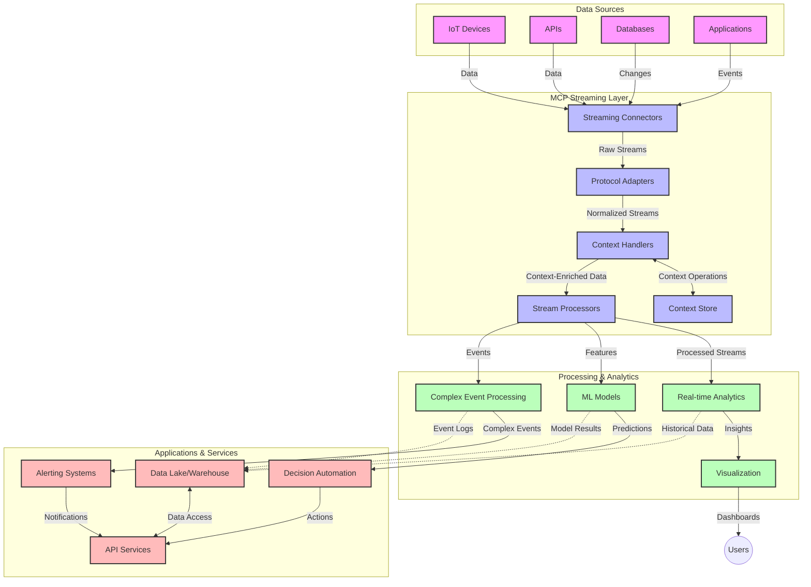

<!--
CO_OP_TRANSLATOR_METADATA:
{
  "original_hash": "68c518dbff8a3b127ed2aa934054c56c",
  "translation_date": "2025-06-11T17:14:06+00:00",
  "source_file": "05-AdvancedTopics/mcp-realtimestreaming/README.md",
  "language_code": "tr"
}
-->
# Model Context Protocol Gerçek Zamanlı Veri Akışı için

## Genel Bakış

Gerçek zamanlı veri akışı, işletmelerin ve uygulamaların zamanında kararlar alabilmek için bilgilere anında erişim gerektirdiği günümüz veri odaklı dünyasında vazgeçilmez hale gelmiştir. Model Context Protocol (MCP), bu gerçek zamanlı akış süreçlerini optimize etmede önemli bir gelişme sunar; veri işleme verimliliğini artırır, bağlamsal bütünlüğü korur ve genel sistem performansını iyileştirir.

Bu modül, MCP’nin AI modelleri, akış platformları ve uygulamalar arasında bağlam yönetimine standart bir yaklaşım sunarak gerçek zamanlı veri akışını nasıl dönüştürdüğünü inceler.

## Gerçek Zamanlı Veri Akışına Giriş

Gerçek zamanlı veri akışı, verilerin üretildiği anda sürekli olarak aktarılmasını, işlenmesini ve analiz edilmesini sağlayan teknolojik bir paradigmadır; böylece sistemler yeni bilgilere anında tepki verebilir. Statik veri kümeleri üzerinde çalışan geleneksel toplu işleme yöntemlerinden farklı olarak, akış veriyi hareket halindeyken işler ve minimum gecikmeyle içgörüler ve aksiyonlar sunar.

### Gerçek Zamanlı Veri Akışının Temel Kavramları:

- **Sürekli Veri Akışı**: Veri, kesintisiz ve hiç bitmeyen olaylar veya kayıtlar dizisi olarak işlenir.
- **Düşük Gecikmeli İşleme**: Sistemler, veri üretimi ile işleme arasındaki süreyi en aza indirecek şekilde tasarlanır.
- **Ölçeklenebilirlik**: Akış mimarileri, değişken veri hacmi ve hızını karşılayabilmelidir.
- **Hata Toleransı**: Kesintisiz veri akışını sağlamak için sistemlerin arızalara karşı dayanıklı olması gerekir.
- **Durumlu İşleme**: Anlamlı analiz için olaylar arasında bağlamın korunması önemlidir.

### Model Context Protocol ve Gerçek Zamanlı Akış

Model Context Protocol (MCP), gerçek zamanlı akış ortamlarında karşılaşılan kritik bazı zorlukları ele alır:

1. **Bağlamsal Süreklilik**: MCP, dağıtık akış bileşenleri arasında bağlamın nasıl korunacağını standartlaştırarak AI modelleri ve işlem düğümlerinin ilgili geçmiş ve çevresel bağlama erişimini sağlar.

2. **Verimli Durum Yönetimi**: Bağlam iletimi için yapılandırılmış mekanizmalar sunarak, MCP akış boru hatlarındaki durum yönetimi yükünü azaltır.

3. **Birlikte Çalışabilirlik**: MCP, farklı akış teknolojileri ve AI modelleri arasında bağlam paylaşımı için ortak bir dil oluşturarak daha esnek ve genişletilebilir mimariler sağlar.

4. **Akışa Özel Optimizasyon**: MCP uygulamaları, gerçek zamanlı karar verme için en önemli bağlam öğelerini önceliklendirebilir; performans ve doğruluk açısından optimizasyon sağlar.

5. **Uyarlanabilir İşleme**: MCP ile uygun bağlam yönetimi sayesinde, akış sistemleri veri içindeki değişen koşullar ve kalıplara göre dinamik olarak işleme ayarlamaları yapabilir.

IoT sensör ağlarından finansal ticaret platformlarına kadar modern uygulamalarda, MCP’nin akış teknolojileriyle entegrasyonu, karmaşık ve gelişen durumlara gerçek zamanlı olarak uygun yanıt verebilen daha akıllı, bağlam farkındalıklı işlemleri mümkün kılar.

## Öğrenme Hedefleri

Bu dersin sonunda:

- Gerçek zamanlı veri akışının temelini ve zorluklarını anlayabileceksiniz
- Model Context Protocol (MCP)’nin gerçek zamanlı veri akışını nasıl geliştirdiğini açıklayabileceksiniz
- Kafka ve Pulsar gibi popüler frameworklerle MCP tabanlı akış çözümleri uygulayabileceksiniz
- MCP ile hata toleranslı, yüksek performanslı akış mimarileri tasarlayıp dağıtabileceksiniz
- MCP kavramlarını IoT, finansal ticaret ve AI destekli analiz senaryolarına uygulayabileceksiniz
- MCP tabanlı akış teknolojilerindeki gelişen trendleri ve gelecekteki yenilikleri değerlendirebileceksiniz

### Tanım ve Önemi

Gerçek zamanlı veri akışı, verinin sürekli olarak üretilmesi, işlenmesi ve minimum gecikmeyle teslim edilmesini içerir. Toplu işlemde veriler gruplar halinde toplanıp işlenirken, akış verisi geldiği anda artımlı olarak işlenir; böylece anlık içgörüler ve aksiyonlar mümkün olur.

Gerçek zamanlı veri akışının temel özellikleri şunlardır:

- **Düşük Gecikme**: Verinin milisaniyelerden saniyelere kadar işlenip analiz edilmesi
- **Sürekli Akış**: Çeşitli kaynaklardan kesintisiz veri akışları
- **Anlık İşleme**: Verinin toplu değil, geldiği anda analiz edilmesi
- **Olay Tabanlı Mimari**: Olaylar gerçekleştiği anda tepki verme

### Geleneksel Veri Akışındaki Zorluklar

Geleneksel veri akışı yaklaşımları birkaç sınırlamayla karşılaşır:

1. **Bağlam Kaybı**: Dağıtık sistemler arasında bağlamın korunmasında zorluk
2. **Ölçeklenebilirlik Sorunları**: Yüksek hacimli ve hızlı veriyi karşılamada güçlükler
3. **Entegrasyon Karmaşıklığı**: Farklı sistemler arasında birlikte çalışabilirlik problemleri
4. **Gecikme Yönetimi**: İşlem süresi ile veri akış hızı arasındaki denge
5. **Veri Tutarlılığı**: Akış boyunca veri doğruluğu ve eksiksizliğinin sağlanması

## Model Context Protocol (MCP) Anlama

### MCP Nedir?

Model Context Protocol (MCP), AI modelleri ve uygulamalar arasında verimli iletişimi kolaylaştırmak için tasarlanmış standart bir iletişim protokolüdür. Gerçek zamanlı veri akışı bağlamında MCP:

- Veri boru hattı boyunca bağlamın korunmasını sağlar
- Veri alışverişi formatlarını standartlaştırır
- Büyük veri setlerinin iletimini optimize eder
- Modelden modele ve modelden uygulamaya iletişimi geliştirir

### Temel Bileşenler ve Mimari

Gerçek zamanlı akış için MCP mimarisi birkaç temel bileşenden oluşur:

1. **Bağlam Yöneticileri**: Akış boru hattı boyunca bağlamsal bilgiyi yönetir ve korur
2. **Akış İşleyicileri**: Bağlam farkındalıklı tekniklerle gelen veri akışlarını işler
3. **Protokol Adaptörleri**: Farklı akış protokolleri arasında bağlamı koruyarak dönüşüm yapar
4. **Bağlam Deposu**: Bağlamsal bilgiyi verimli şekilde saklar ve erişir
5. **Akış Bağlayıcıları**: Kafka, Pulsar, Kinesis gibi çeşitli akış platformlarına bağlantı sağlar



### MCP Gerçek Zamanlı Veri İşlemeyi Nasıl İyileştirir?

MCP, geleneksel akış zorluklarını şu şekilde çözer:

- **Bağlamsal Bütünlük**: Veri noktaları arasındaki ilişkileri boru hattı boyunca korur
- **Optimum İletim**: Akıllı bağlam yönetimiyle veri alışverişindeki tekrarları azaltır
- **Standart Arayüzler**: Akış bileşenleri için tutarlı API’ler sağlar
- **Azaltılmış Gecikme**: Verimli bağlam işleme ile işlem yükünü düşürür
- **Gelişmiş Ölçeklenebilirlik**: Bağlamı koruyarak yatay ölçeklemeyi destekler

## Entegrasyon ve Uygulama

Gerçek zamanlı veri akışı sistemleri, performans ve bağlamsal bütünlüğü korumak için dikkatli mimari tasarım ve uygulama gerektirir. Model Context Protocol, AI modelleri ile akış teknolojilerinin entegrasyonunda standart bir yaklaşım sunarak daha gelişmiş, bağlam farkındalıklı işleme boru hatları oluşturulmasına olanak tanır.

### MCP’nin Akış Mimarilerindeki Entegrasyonuna Genel Bakış

Gerçek zamanlı akış ortamlarında MCP uygulaması aşağıdaki önemli hususları içerir:

1. **Bağlam Serileştirme ve Taşıma**: MCP, bağlamsal bilgiyi akış veri paketleri içinde kodlamak için verimli mekanizmalar sağlar; böylece gerekli bağlam, veri boyunca işleme boru hattında takip edilir. Bu, akış taşıma için optimize edilmiş standart serileştirme formatlarını içerir.

2. **Durumlu Akış İşleme**: MCP, işleme düğümleri arasında tutarlı bağlam temsili sağlayarak daha akıllı durumlu işleme mümkün kılar. Bu, durum yönetiminin geleneksel olarak zor olduğu dağıtık akış mimarilerinde özellikle değerlidir.

3. **Olay Zamanı ve İşlem Zamanı**: MCP uygulamaları, olayların gerçekleşme zamanı ile işlenme zamanı arasındaki farkı ele almak zorundadır. Protokol, olay zamanı semantiğini koruyan zamansal bağlamı içerebilir.

4. **Geri Basınç Yönetimi**: Bağlam yönetimini standartlaştırarak MCP, akış sistemlerinde geri basıncın yönetilmesine yardımcı olur; bileşenlerin işleme kapasitelerini iletip akış hızını ayarlamalarına olanak tanır.

5. **Bağlam Penceresi ve Toplama**: MCP, zamansal ve ilişkisel bağlamların yapılandırılmış temsillerini sunarak daha anlamlı toplama işlemlerine imkan veren gelişmiş pencereleme işlemlerini kolaylaştırır.

6. **Tam-Özdeş İşleme**: Tam-özdeş semantiği gerektiren akış sistemlerinde MCP, işleme durumunu izlemek ve doğrulamak için işleme meta verisi içerebilir.

MCP’nin çeşitli akış teknolojilerinde uygulanması, bağlam yönetimi için birleşik bir yaklaşım yaratır; özel entegrasyon kodu ihtiyacını azaltırken, veri boru hattı boyunca anlamlı bağlamın korunmasını güçlendirir.

### MCP’nin Çeşitli Veri Akış Framework’lerinde Kullanımı

MCP, popüler akış framework’leri ile entegre edilebilir:

#### Apache Kafka Entegrasyonu

```python
from mcp_streaming import MCPKafkaConnector

# Initialize MCP Kafka connector
connector = MCPKafkaConnector(
    bootstrap_servers='localhost:9092',
    context_preservation=True
)

# Create a context-aware consumer
consumer = connector.create_consumer('input-topic')

# Process streaming data with context
for message in consumer:
    context = message.get_context()
    data = message.get_value()
    
    # Process with context awareness
    result = process_with_context(data, context)
    
    # Produce output with preserved context
    connector.produce('output-topic', result, context=context)
```

#### Apache Pulsar Uygulaması

```python
from mcp_streaming import MCPPulsarClient

# Initialize MCP Pulsar client
client = MCPPulsarClient('pulsar://localhost:6650')

# Subscribe with context awareness
consumer = client.subscribe('input-topic', 'subscription-name', 
                           context_enabled=True)

# Process messages with context preservation
while True:
    message = consumer.receive()
    context = message.get_context()
    
    # Process with context
    result = process_with_context(message.data(), context)
    
    # Acknowledge the message
    consumer.acknowledge(message)
    
    # Send result with preserved context
    producer = client.create_producer('output-topic')
    producer.send(result, context=context)
```

### Dağıtım İçin En İyi Uygulamalar

MCP’yi gerçek zamanlı akışta uygularken:

1. **Hata Toleransı Tasarımı**:
   - Uygun hata yönetimi uygulayın
   - Başarısız mesajlar için dead-letter kuyrukları kullanın
   - İdempotent işlemciler tasarlayın

2. **Performans Optimizasyonu**:
   - Uygun tampon boyutları yapılandırın
   - Gerekli yerlerde toplu işlem kullanın
   - Geri basınç mekanizmalarını uygulayın

3. **İzleme ve Gözlem**:
   - Akış işleme metriklerini takip edin
   - Bağlam yayılımını izleyin
   - Anormallikler için uyarılar kurun

4. **Akışlarınızı Güvenceye Alın**:
   - Hassas veriler için şifreleme uygulayın
   - Kimlik doğrulama ve yetkilendirme kullanın
   - Uygun erişim kontrolleri uygulayın

### MCP’nin IoT ve Uç Bilişimdeki Rolü

MCP, IoT akışlarını şu şekillerde geliştirir:

- İşlem boru hattı boyunca cihaz bağlamını korur
- Uçtan buluta verimli veri akışı sağlar
- IoT veri akışlarında gerçek zamanlı analizleri destekler
- Bağlamla cihazlar arası iletişimi kolaylaştırır

Örnek: Akıllı Şehir Sensör Ağları  
```
Sensors → Edge Gateways → MCP Stream Processors → Real-time Analytics → Automated Responses
```

### Finansal İşlemler ve Yüksek Frekanslı Ticarette MCP’nin Rolü

MCP, finansal veri akışında önemli avantajlar sağlar:

- Ticaret kararları için ultra düşük gecikmeli işleme
- İşlem bağlamını işlem boyunca koruma
- Bağlam farkındalıklı karmaşık olay işleme desteği
- Dağıtık ticaret sistemlerinde veri tutarlılığını sağlama

### AI Destekli Veri Analitiğini Geliştirme

MCP, akış analitiğinde yeni imkanlar yaratır:

- Gerçek zamanlı model eğitimi ve çıkarımı
- Akış verilerinden sürekli öğrenme
- Bağlam farkındalıklı özellik çıkarımı
- Korunan bağlamla çoklu model çıkarım boru hatları

## Gelecek Trendler ve Yenilikler

### MCP’nin Gerçek Zamanlı Ortamlardaki Evrimi

İleriye dönük olarak MCP’nin şu alanlarda gelişmesini bekliyoruz:

- **Kuantum Hesaplama Entegrasyonu**: Kuantum tabanlı akış sistemlerine hazırlık
- **Uç-Native İşleme**: Daha fazla bağlam farkındalıklı işlemin uç cihazlarda yapılması
- **Otonom Akış Yönetimi**: Kendi kendini optimize eden akış boru hatları
- **Federated Streaming**: Gizliliği koruyarak dağıtık işlem

### Teknolojide Olası Gelişmeler

MCP akışlarının geleceğini şekillendirecek gelişen teknolojiler:

1. **AI-Optimizasyonlu Akış Protokolleri**: AI iş yüklerine özel tasarlanmış protokoller
2. **Nöromorfik Hesaplama Entegrasyonu**: Beyin ilhamlı hesaplama ile akış işleme
3. **Sunucusuz Akış**: Altyapı yönetimi olmadan olay tabanlı, ölçeklenebilir akış
4. **Dağıtık Bağlam Depoları**: Küresel çapta dağıtılmış ama yüksek tutarlılıkta bağlam yönetimi

## Uygulamalı Alıştırmalar

### Alıştırma 1: Temel MCP Akış Boru Hattı Kurulumu

Bu alıştırmada öğrenecekleriniz:

- Temel bir MCP akış ortamı yapılandırma
- Akış işleme için bağlam yöneticileri uygulama
- Bağlam korumanın test edilip doğrulanması

### Alıştırma 2: Gerçek Zamanlı Analitik Gösterge Tablosu Oluşturma

Tamamlanacak uygulama:

- MCP kullanarak veri akışı alma
- Bağlamı koruyarak akışı işleme
- Sonuçları gerçek zamanlı görselleştirme

### Alıştırma 3: MCP ile Karmaşık Olay İşleme Uygulaması

İleri seviye alıştırma:

- Akışlarda desen tespiti
- Çoklu akışlar arasında bağlamsal korelasyon
- Korunan bağlamla karmaşık olaylar oluşturma

## Ek Kaynaklar

- [Model Context Protocol Specification](https://github.com/microsoft/model-context-protocol) - Resmi MCP spesifikasyonu ve dokümantasyonu  
- [Apache Kafka Documentation](https://kafka.apache.org/documentation/) - Kafka ile akış işleme hakkında bilgi  
- [Apache Pulsar](https://pulsar.apache.org/) - Birleşik mesajlaşma ve akış platformu  
- [Streaming Systems: The What, Where, When, and How of Large-Scale Data Processing](https://www.oreilly.com/library/view/streaming-systems/9781491983867/) - Akış mimarileri üzerine kapsamlı kitap  
- [Microsoft Azure Event Hubs](https://learn.microsoft.com/en-us/azure/event-hubs/event-hubs-about) - Yönetilen olay akışı servisi  
- [MLflow Documentation](https://mlflow.org/docs/latest/index.html) - ML model takibi ve dağıtımı için  
- [Real-Time Analytics with Apache Storm](https://storm.apache.org/releases/current/index.html) - Gerçek zamanlı hesaplama için işleme framework’ü  
- [Flink ML](https://nightlies.apache.org/flink/flink-ml-docs-master/) - Apache Flink için makine öğrenimi kütüphanesi  
- [LangChain Documentation](https://python.langchain.com/docs/get_started/introduction) - LLM’lerle uygulama geliştirme

## Öğrenme Çıktıları

Bu modülü tamamladıktan sonra:

- Gerçek zamanlı veri akışının temelini ve zorluklarını anlayabileceksiniz
- Model Context Protocol (MCP)’nin gerçek zamanlı veri akışını nasıl geliştirdiğini açıklayabileceksiniz
- Kafka ve Pulsar gibi popüler frameworklerle MCP tabanlı akış çözümleri uygulayabileceksiniz
- MCP ile hata toleranslı, yüksek performanslı akış mimarileri tasarlayıp dağıtabileceksiniz
- MCP kavramlarını IoT, finansal ticaret ve AI destekli analiz senaryolarına uygulayabileceksiniz
- MCP tabanlı akış teknolojilerindeki gelişen trendleri ve gelecekteki yenilikleri değerlendirebileceksiniz

## Sırada Ne Var

- [6. Community Contributions](../../06-CommunityContributions/README.md)

**Feragatname**:  
Bu belge, AI çeviri servisi [Co-op Translator](https://github.com/Azure/co-op-translator) kullanılarak çevrilmiştir. Doğruluk için çaba gösterilse de, otomatik çevirilerin hatalar veya yanlışlıklar içerebileceğini lütfen unutmayın. Orijinal belge, kendi dilinde yetkili kaynak olarak kabul edilmelidir. Kritik bilgiler için profesyonel insan çevirisi önerilir. Bu çevirinin kullanımı sonucunda oluşabilecek yanlış anlamalar veya yanlış yorumlamalardan sorumlu değiliz.