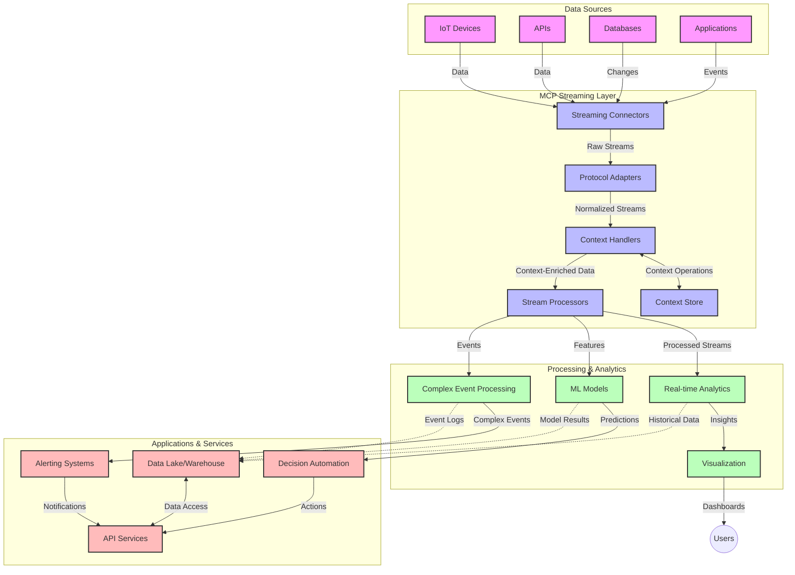

<!--
CO_OP_TRANSLATOR_METADATA:
{
  "original_hash": "b41174ac781ebf228b2043cbdfc09105",
  "translation_date": "2025-06-12T00:32:06+00:00",
  "source_file": "05-AdvancedTopics/mcp-realtimestreaming/README.md",
  "language_code": "tr"
}
-->
# Gerçek Zamanlı Veri Akışı için Model Context Protokolü

## Genel Bakış

Gerçek zamanlı veri akışı, işletmelerin ve uygulamaların zamanında kararlar alabilmek için bilgilere anında erişim gerektirdiği günümüz veri odaklı dünyasında vazgeçilmez hale gelmiştir. Model Context Protokolü (MCP), bu gerçek zamanlı akış süreçlerini optimize etmede önemli bir gelişmeyi temsil eder; veri işleme verimliliğini artırır, bağlamsal bütünlüğü korur ve genel sistem performansını iyileştirir.

Bu modül, MCP'nin AI modelleri, akış platformları ve uygulamalar arasında bağlam yönetimi için standart bir yaklaşım sunarak gerçek zamanlı veri akışını nasıl dönüştürdüğünü inceler.

## Gerçek Zamanlı Veri Akışına Giriş

Gerçek zamanlı veri akışı, verinin üretildiği anda sürekli olarak aktarılmasını, işlenmesini ve analiz edilmesini sağlayan teknolojik bir paradigma olup, sistemlerin yeni bilgilere anında tepki vermesine olanak tanır. Statik veri setleri üzerinde çalışan geleneksel toplu işlemeye kıyasla, akış veriyi hareket halindeyken işler ve minimum gecikmeyle içgörüler ve aksiyonlar sunar.

### Gerçek Zamanlı Veri Akışının Temel Kavramları:

- **Sürekli Veri Akışı**: Veri, kesintisiz ve sonu olmayan bir olay veya kayıt akışı olarak işlenir.
- **Düşük Gecikmeli İşleme**: Sistemler, veri üretimi ile işlenmesi arasındaki süreyi en aza indirecek şekilde tasarlanır.
- **Ölçeklenebilirlik**: Akış mimarileri değişken veri hacmi ve hızını yönetebilmelidir.
- **Hata Toleransı**: Sistemler, kesintisiz veri akışını sağlamak için arızalara karşı dayanıklı olmalıdır.
- **Durumlu İşleme**: Olaylar arasında bağlamın korunması anlamlı analiz için kritiktir.

### Model Context Protokolü ve Gerçek Zamanlı Akış

Model Context Protokolü (MCP), gerçek zamanlı akış ortamlarında karşılaşılan birkaç kritik sorunu ele alır:

1. **Bağlamsal Süreklilik**: MCP, bağlamın dağıtık akış bileşenleri arasında nasıl korunduğunu standartlaştırır; böylece AI modelleri ve işlem düğümleri ilgili geçmiş ve çevresel bağlama erişebilir.

2. **Verimli Durum Yönetimi**: MCP, bağlam iletimi için yapılandırılmış mekanizmalar sunarak akış hatlarındaki durum yönetimi yükünü azaltır.

3. **Birlikte Çalışabilirlik**: MCP, farklı akış teknolojileri ve AI modelleri arasında bağlam paylaşımı için ortak bir dil oluşturur; daha esnek ve genişletilebilir mimariler sağlar.

4. **Akışa Optimizasyonlu Bağlam**: MCP uygulamaları, gerçek zamanlı karar verme için en alakalı bağlam öğelerini önceliklendirebilir; performans ve doğruluk için optimize eder.

5. **Uyarlanabilir İşleme**: MCP aracılığıyla doğru bağlam yönetimi ile akış sistemleri, verideki değişen koşullara ve desenlere göre dinamik olarak işleme ayarlaması yapabilir.

IoT sensör ağlarından finansal ticaret platformlarına kadar modern uygulamalarda, MCP’nin akış teknolojileriyle entegrasyonu, karmaşık ve gelişen durumlara gerçek zamanlı uygun şekilde yanıt verebilen daha akıllı, bağlam farkındalıklı işlemleri mümkün kılar.

## Öğrenme Hedefleri

Bu dersin sonunda şunları yapabileceksiniz:

- Gerçek zamanlı veri akışının temellerini ve zorluklarını anlamak
- Model Context Protokolü (MCP)’nün gerçek zamanlı veri akışını nasıl geliştirdiğini açıklamak
- Kafka ve Pulsar gibi popüler çerçeveler kullanarak MCP tabanlı akış çözümleri uygulamak
- MCP ile hata toleranslı, yüksek performanslı akış mimarileri tasarlamak ve dağıtmak
- MCP kavramlarını IoT, finansal ticaret ve AI destekli analiz kullanım senaryolarına uygulamak
- MCP tabanlı akış teknolojilerindeki gelişen trendleri ve gelecekteki yenilikleri değerlendirmek

### Tanım ve Önemi

Gerçek zamanlı veri akışı, verinin minimum gecikmeyle sürekli üretilmesi, işlenmesi ve teslim edilmesini kapsar. Verinin gruplar halinde toplandığı ve işlendiği toplu işleme yönteminin aksine, akış verisi geldiği anda kademeli olarak işlenir; bu da anlık içgörüler ve aksiyonlar sağlar.

Gerçek zamanlı veri akışının temel özellikleri şunlardır:

- **Düşük Gecikme**: Veriyi milisaniyelerden saniyelere kadar işleyip analiz etmek
- **Sürekli Akış**: Çeşitli kaynaklardan kesintisiz veri akışı
- **Anında İşleme**: Veriyi toplu değil, geldiği anda analiz etmek
- **Olay Tabanlı Mimari**: Olaylar gerçekleştiği anda tepki vermek

### Geleneksel Veri Akışındaki Zorluklar

Geleneksel veri akışı yaklaşımları birkaç sınırlamayla karşılaşır:

1. **Bağlam Kaybı**: Dağıtık sistemler arasında bağlamın korunmasında zorluk
2. **Ölçeklenebilirlik Sorunları**: Yüksek hacimli ve hızlı veriyi yönetmede güçlük
3. **Entegrasyon Karmaşıklığı**: Farklı sistemler arasında birlikte çalışabilirlik problemleri
4. **Gecikme Yönetimi**: İşlem süresi ile veri akışı dengesi
5. **Veri Tutarlılığı**: Akış boyunca veri doğruluğu ve tamlığının sağlanması

## Model Context Protokolü (MCP) Anlama

### MCP Nedir?

Model Context Protokolü (MCP), AI modelleri ve uygulamalar arasında verimli etkileşimi kolaylaştırmak için tasarlanmış standart bir iletişim protokolüdür. Gerçek zamanlı veri akışı bağlamında MCP, aşağıdaki çerçeveyi sağlar:

- Veri hattı boyunca bağlamın korunması
- Veri değişim formatlarının standartlaştırılması
- Büyük veri setlerinin iletiminde optimizasyon
- Modelden modele ve modelden uygulamaya iletişimin geliştirilmesi

### Temel Bileşenler ve Mimari

Gerçek zamanlı akış için MCP mimarisi birkaç önemli bileşenden oluşur:

1. **Bağlam Yöneticileri**: Akış hattı boyunca bağlamsal bilgiyi yönetir ve korur
2. **Akış İşleyicileri**: Bağlam farkındalıklı tekniklerle gelen veri akışlarını işler
3. **Protokol Adaptörleri**: Farklı akış protokolleri arasında bağlamı koruyarak dönüşüm yapar
4. **Bağlam Deposu**: Bağlamsal bilgiyi verimli şekilde depolar ve erişir
5. **Akış Bağlayıcıları**: Kafka, Pulsar, Kinesis gibi çeşitli akış platformlarına bağlanır



### MCP Gerçek Zamanlı Veri İşlemeyi Nasıl Geliştirir?

MCP, geleneksel akış zorluklarını şu yollarla çözer:

- **Bağlamsal Bütünlük**: Veri noktaları arasındaki ilişkileri tüm hat boyunca korur
- **Optimum İletim**: Akıllı bağlam yönetimi ile veri değişimindeki gereksiz tekrarları azaltır
- **Standart Arayüzler**: Akış bileşenleri için tutarlı API’ler sunar
- **Azaltılmış Gecikme**: Verimli bağlam işleme ile işlem yükünü minimize eder
- **Gelişmiş Ölçeklenebilirlik**: Bağlamı koruyarak yatay ölçeklemeyi destekler

## Entegrasyon ve Uygulama

Gerçek zamanlı veri akış sistemleri, hem performans hem de bağlamsal bütünlüğü korumak için dikkatli mimari tasarım ve uygulama gerektirir. Model Context Protokolü, AI modelleri ve akış teknolojilerinin entegrasyonunda standart bir yaklaşım sunarak daha sofistike, bağlam farkındalıklı işlem hatları oluşturulmasını sağlar.

### Akış Mimarilerinde MCP Entegrasyonuna Genel Bakış

Gerçek zamanlı akış ortamlarında MCP uygulaması birkaç önemli hususu içerir:

1. **Bağlam Serileştirme ve Taşıma**: MCP, bağlamsal bilgiyi akış veri paketlerine kodlamak için verimli mekanizmalar sunar; böylece kritik bağlam, işlem hattı boyunca veriyle birlikte taşınır. Bu, akış taşıma için optimize edilmiş standart serileştirme formatlarını kapsar.

2. **Durumlu Akış İşleme**: MCP, işlem düğümleri arasında tutarlı bağlam temsili sağlayarak daha akıllı durumlu işleme mümkün kılar. Bu, durum yönetiminin geleneksel olarak zor olduğu dağıtık akış mimarilerinde özellikle değerlidir.

3. **Olay Zamanı ve İşlem Zamanı**: MCP uygulamaları, olayların ne zaman gerçekleştiği ile ne zaman işlendiği arasındaki farkı ele almalıdır. Protokol, olay zamanı anlamını koruyan zamansal bağlamı içerebilir.

4. **Backpressure Yönetimi**: MCP, bağlam yönetimini standartlaştırarak akış sistemlerinde backpressure’ı yönetmeye yardımcı olur; bileşenlerin işlem kapasitelerini iletişim kurup akışı buna göre ayarlamasını sağlar.

5. **Bağlam Penceresi ve Toplama**: MCP, zamansal ve ilişkisel bağlamların yapılandırılmış temsillerini sağlayarak daha anlamlı toplamalara olanak tanıyan gelişmiş pencereleme işlemlerini destekler.

6. **Tam-İşleme (Exactly-Once) İşlemi**: Tam-işleme semantiği gerektiren akış sistemlerinde, MCP işleme durumunu izlemek ve doğrulamak için işlem meta verisini dahil edebilir.

MCP’nin çeşitli akış teknolojileri genelinde uygulanması, bağlam yönetiminde birleşik bir yaklaşım yaratır; özel entegrasyon kodu ihtiyacını azaltırken, verinin işlem hattı boyunca anlamlı bağlamını koruma yeteneğini artırır.

### Farklı Veri Akış Çerçevelerinde MCP

Bu örnekler, JSON-RPC tabanlı protokolü ve farklı taşıma mekanizmalarını içeren mevcut MCP spesifikasyonuna uygundur. Kod, Kafka ve Pulsar gibi akış platformlarının MCP protokolü ile tam uyumluluğu koruyarak nasıl özel taşıyıcılar olarak uygulanabileceğini gösterir.

Örnekler, akış platformlarının MCP ile entegre edilerek gerçek zamanlı veri işleme sağlarken MCP’nin merkezindeki bağlamsal farkındalığı koruyabileceğini göstermeyi amaçlar. Bu yaklaşım, Haziran 2025 itibarıyla MCP spesifikasyonunun güncel durumunu doğru yansıtır.

MCP, popüler akış çerçeveleriyle entegre edilebilir:

#### Apache Kafka Entegrasyonu

```python
import asyncio
import json
from typing import Dict, Any, Optional
from confluent_kafka import Consumer, Producer, KafkaError
from mcp.client import Client, ClientCapabilities
from mcp.core.message import JsonRpcMessage
from mcp.core.transports import Transport

# Custom transport class to bridge MCP with Kafka
class KafkaMCPTransport(Transport):
    def __init__(self, bootstrap_servers: str, input_topic: str, output_topic: str):
        self.bootstrap_servers = bootstrap_servers
        self.input_topic = input_topic
        self.output_topic = output_topic
        self.producer = Producer({'bootstrap.servers': bootstrap_servers})
        self.consumer = Consumer({
            'bootstrap.servers': bootstrap_servers,
            'group.id': 'mcp-client-group',
            'auto.offset.reset': 'earliest'
        })
        self.message_queue = asyncio.Queue()
        self.running = False
        self.consumer_task = None
        
    async def connect(self):
        """Connect to Kafka and start consuming messages"""
        self.consumer.subscribe([self.input_topic])
        self.running = True
        self.consumer_task = asyncio.create_task(self._consume_messages())
        return self
        
    async def _consume_messages(self):
        """Background task to consume messages from Kafka and queue them for processing"""
        while self.running:
            try:
                msg = self.consumer.poll(1.0)
                if msg is None:
                    await asyncio.sleep(0.1)
                    continue
                
                if msg.error():
                    if msg.error().code() == KafkaError._PARTITION_EOF:
                        continue
                    print(f"Consumer error: {msg.error()}")
                    continue
                
                # Parse the message value as JSON-RPC
                try:
                    message_str = msg.value().decode('utf-8')
                    message_data = json.loads(message_str)
                    mcp_message = JsonRpcMessage.from_dict(message_data)
                    await self.message_queue.put(mcp_message)
                except Exception as e:
                    print(f"Error parsing message: {e}")
            except Exception as e:
                print(f"Error in consumer loop: {e}")
                await asyncio.sleep(1)
    
    async def read(self) -> Optional[JsonRpcMessage]:
        """Read the next message from the queue"""
        try:
            message = await self.message_queue.get()
            return message
        except Exception as e:
            print(f"Error reading message: {e}")
            return None
    
    async def write(self, message: JsonRpcMessage) -> None:
        """Write a message to the Kafka output topic"""
        try:
            message_json = json.dumps(message.to_dict())
            self.producer.produce(
                self.output_topic,
                message_json.encode('utf-8'),
                callback=self._delivery_report
            )
            self.producer.poll(0)  # Trigger callbacks
        except Exception as e:
            print(f"Error writing message: {e}")
    
    def _delivery_report(self, err, msg):
        """Kafka producer delivery callback"""
        if err is not None:
            print(f'Message delivery failed: {err}')
        else:
            print(f'Message delivered to {msg.topic()} [{msg.partition()}]')
    
    async def close(self) -> None:
        """Close the transport"""
        self.running = False
        if self.consumer_task:
            self.consumer_task.cancel()
            try:
                await self.consumer_task
            except asyncio.CancelledError:
                pass
        self.consumer.close()
        self.producer.flush()

# Example usage of the Kafka MCP transport
async def kafka_mcp_example():
    # Create MCP client with Kafka transport
    client = Client(
        {"name": "kafka-mcp-client", "version": "1.0.0"},
        ClientCapabilities({})
    )
    
    # Create and connect the Kafka transport
    transport = KafkaMCPTransport(
        bootstrap_servers="localhost:9092",
        input_topic="mcp-responses",
        output_topic="mcp-requests"
    )
    
    await client.connect(transport)
    
    try:
        # Initialize the MCP session
        await client.initialize()
        
        # Example of executing a tool via MCP
        response = await client.execute_tool(
            "process_data",
            {
                "data": "sample data",
                "metadata": {
                    "source": "sensor-1",
                    "timestamp": "2025-06-12T10:30:00Z"
                }
            }
        )
        
        print(f"Tool execution response: {response}")
        
        # Clean shutdown
        await client.shutdown()
    finally:
        await transport.close()

# Run the example
if __name__ == "__main__":
    asyncio.run(kafka_mcp_example())
```

#### Apache Pulsar Uygulaması

```python
import asyncio
import json
import pulsar
from typing import Dict, Any, Optional
from mcp.core.message import JsonRpcMessage
from mcp.core.transports import Transport
from mcp.server import Server, ServerOptions
from mcp.server.tools import Tool, ToolExecutionContext, ToolMetadata

# Create a custom MCP transport that uses Pulsar
class PulsarMCPTransport(Transport):
    def __init__(self, service_url: str, request_topic: str, response_topic: str):
        self.service_url = service_url
        self.request_topic = request_topic
        self.response_topic = response_topic
        self.client = pulsar.Client(service_url)
        self.producer = self.client.create_producer(response_topic)
        self.consumer = self.client.subscribe(
            request_topic,
            "mcp-server-subscription",
            consumer_type=pulsar.ConsumerType.Shared
        )
        self.message_queue = asyncio.Queue()
        self.running = False
        self.consumer_task = None
    
    async def connect(self):
        """Connect to Pulsar and start consuming messages"""
        self.running = True
        self.consumer_task = asyncio.create_task(self._consume_messages())
        return self
    
    async def _consume_messages(self):
        """Background task to consume messages from Pulsar and queue them for processing"""
        while self.running:
            try:
                # Non-blocking receive with timeout
                msg = self.consumer.receive(timeout_millis=500)
                
                # Process the message
                try:
                    message_str = msg.data().decode('utf-8')
                    message_data = json.loads(message_str)
                    mcp_message = JsonRpcMessage.from_dict(message_data)
                    await self.message_queue.put(mcp_message)
                    
                    # Acknowledge the message
                    self.consumer.acknowledge(msg)
                except Exception as e:
                    print(f"Error processing message: {e}")
                    # Negative acknowledge if there was an error
                    self.consumer.negative_acknowledge(msg)
            except Exception as e:
                # Handle timeout or other exceptions
                await asyncio.sleep(0.1)
    
    async def read(self) -> Optional[JsonRpcMessage]:
        """Read the next message from the queue"""
        try:
            message = await self.message_queue.get()
            return message
        except Exception as e:
            print(f"Error reading message: {e}")
            return None
    
    async def write(self, message: JsonRpcMessage) -> None:
        """Write a message to the Pulsar output topic"""
        try:
            message_json = json.dumps(message.to_dict())
            self.producer.send(message_json.encode('utf-8'))
        except Exception as e:
            print(f"Error writing message: {e}")
    
    async def close(self) -> None:
        """Close the transport"""
        self.running = False
        if self.consumer_task:
            self.consumer_task.cancel()
            try:
                await self.consumer_task
            except asyncio.CancelledError:
                pass
        self.consumer.close()
        self.producer.close()
        self.client.close()

# Define a sample MCP tool that processes streaming data
@Tool(
    name="process_streaming_data",
    description="Process streaming data with context preservation",
    metadata=ToolMetadata(
        required_capabilities=["streaming"]
    )
)
async def process_streaming_data(
    ctx: ToolExecutionContext,
    data: str,
    source: str,
    priority: str = "medium"
) -> Dict[str, Any]:
    """
    Process streaming data while preserving context
    
    Args:
        ctx: Tool execution context
        data: The data to process
        source: The source of the data
        priority: Priority level (low, medium, high)
        
    Returns:
        Dict containing processed results and context information
    """
    # Example processing that leverages MCP context
    print(f"Processing data from {source} with priority {priority}")
    
    # Access conversation context from MCP
    conversation_id = ctx.conversation_id if hasattr(ctx, 'conversation_id') else "unknown"
    
    # Return results with enhanced context
    return {
        "processed_data": f"Processed: {data}",
        "context": {
            "conversation_id": conversation_id,
            "source": source,
            "priority": priority,
            "processing_timestamp": ctx.get_current_time_iso()
        }
    }

# Example MCP server implementation using Pulsar transport
async def run_mcp_server_with_pulsar():
    # Create MCP server
    server = Server(
        {"name": "pulsar-mcp-server", "version": "1.0.0"},
        ServerOptions(
            capabilities={"streaming": True}
        )
    )
    
    # Register our tool
    server.register_tool(process_streaming_data)
    
    # Create and connect Pulsar transport
    transport = PulsarMCPTransport(
        service_url="pulsar://localhost:6650",
        request_topic="mcp-requests",
        response_topic="mcp-responses"
    )
    
    try:
        # Start the server with the Pulsar transport
        await server.run(transport)
    finally:
        await transport.close()

# Run the server
if __name__ == "__main__":
    asyncio.run(run_mcp_server_with_pulsar())
```

### Dağıtım İçin En İyi Uygulamalar

MCP ile gerçek zamanlı akış uygularken:

1. **Hata Toleransı İçin Tasarla**:
   - Uygun hata yönetimi uygula
   - Başarısız mesajlar için dead-letter kuyrukları kullan
   - İdempotent işlemciler tasarla

2. **Performans İçin Optimize Et**:
   - Uygun tampon boyutlarını yapılandır
   - Gerekli yerlerde toplu işlem kullan
   - Backpressure mekanizmalarını uygula

3. **İzle ve Gözlemle**:
   - Akış işleme metriklerini takip et
   - Bağlam yayılımını izle
   - Anormallikler için uyarılar kur

4. **Akışlarını Güvende Tut**:
   - Hassas veriler için şifreleme uygula
   - Kimlik doğrulama ve yetkilendirme kullan
   - Uygun erişim kontrolleri uygula

### MCP’nin IoT ve Edge Bilişimdeki Rolü

MCP, IoT akışını şu şekillerde geliştirir:

- İşlem hattı boyunca cihaz bağlamını korur
- Verimli edge-to-cloud veri akışını mümkün kılar
- IoT veri akışlarında gerçek zamanlı analizleri destekler
- Bağlam ile cihazlar arası iletişimi kolaylaştırır

Örnek: Akıllı Şehir Sensör Ağları  
```
Sensors → Edge Gateways → MCP Stream Processors → Real-time Analytics → Automated Responses
```

### Finansal İşlemler ve Yüksek Frekanslı Ticarette MCP’nin Rolü

MCP, finansal veri akışında önemli avantajlar sunar:

- Ticaret kararları için ultra düşük gecikmeli işlem
- İşlem bağlamını tüm işleme boyunca koruma
- Bağlam farkındalıklı karmaşık olay işleme desteği
- Dağıtık ticaret sistemlerinde veri tutarlılığını sağlama

### AI Destekli Veri Analizini Geliştirme

MCP, akış analizinde yeni olanaklar yaratır:

- Gerçek zamanlı model eğitimi ve çıkarımı
- Akış verisinden sürekli öğrenme
- Bağlam farkındalıklı özellik çıkarımı
- Korunan bağlam ile çoklu model çıkarım hatları

## Gelecek Trendler ve Yenilikler

### Gerçek Zamanlı Ortamlarda MCP’nin Evrimi

İleriye baktığımızda MCP’nin şu alanlarda gelişmesini bekliyoruz:

- **Kuantum Bilişim Entegrasyonu**: Kuantum tabanlı akış sistemlerine hazırlık
- **Edge-Native İşleme**: Daha fazla bağlam farkındalıklı işlemin uç cihazlara taşınması
- **Otonom Akış Yönetimi**: Kendi kendini optimize eden akış hatları
- **Federated Streaming**: Gizliliği koruyarak dağıtık işlem

### Teknolojide Muhtemel İlerlemeler

MCP akışlarının geleceğini şekillendirecek yeni teknolojiler:

1. **AI-Optimizasyonlu Akış Protokolleri**: AI iş yükleri için özel protokoller
2. **Nöromorfik Bilişim Entegrasyonu**: Beyin esinli hesaplama ile akış işleme
3. **Serverless Streaming**: Altyapı yönetimi olmadan olay tabanlı, ölçeklenebilir akış
4. **Dağıtık Bağlam Depoları**: Küresel çapta dağıtılmış ama yüksek tutarlılıkta bağlam yönetimi

## Uygulamalı Alıştırmalar

### Alıştırma 1: Temel Bir MCP Akış Hattı Kurulumu

Bu alıştırmada şunları öğreneceksiniz:  
- Temel bir MCP akış ortamı yapılandırmak  
- Akış işlemesi için bağlam yöneticileri uygulamak  
- Bağlam korumasını test etmek ve doğrulamak

### Alıştırma 2: Gerçek Zamanlı Analitik Panosu Oluşturma

Tam bir uygulama geliştirin:  
- MCP kullanarak akış verisi alma  
- Bağlamı koruyarak akışı işleme  
- Sonuçları gerçek zamanlı görselleştirme

### Alıştırma 3: MCP ile Karmaşık Olay İşleme Uygulaması

İleri seviye alıştırma:  
- Akışlarda desen tespiti  
- Birden fazla akış arasında bağlamsal korelasyon  
- Korunan bağlam ile karmaşık olaylar oluşturma

## Ek Kaynaklar

- [Model Context Protocol Specification](https://github.com/modelcontextprotocol) - Resmi MCP spesifikasyonu ve dokümantasyonu  
- [Apache Kafka Documentation](https://kafka.apache.org/documentation/) - Kafka hakkında bilgi edinmek için  
- [Apache Pulsar](https://pulsar.apache.org/) - Birleşik mesajlaşma ve akış platformu  
- [Streaming Systems: The What, Where, When, and How of Large-Scale Data Processing](https://www.oreilly.com/library/view/streaming-systems/9781491983867/) - Akış mimarileri üzerine kapsamlı kitap  
- [Microsoft Azure Event Hubs](https://learn.microsoft.com/azure/event-hubs/event-hubs-about) - Yönetilen olay akışı servisi  
- [MLflow Documentation](https://mlflow.org/docs/latest/index.html) - ML model takibi ve dağıtımı için  
- [Real-Time Analytics with Apache Storm](https://storm.apache.org/releases/current/index.html) - Gerçek zamanlı hesaplama çerçevesi  
- [Flink ML](https://nightlies.apache.org/flink/flink-ml-docs-master/) - Apache Flink için makine öğrenimi kütüphanesi  
- [LangChain Documentation](https://python.langchain.com/docs/get_started/introduction) - LLM ile uygulama geliştirme

## Öğrenme Çıktıları

Bu modülü tamamlayarak şunları yapabileceksiniz:

- Gerçek zamanlı veri akışının temellerini ve zorluklarını anlamak  
- Model Context Protokolü (MCP)’nün gerçek zamanlı veri akışını nasıl geliştirdiğini açıklamak  
- Kafka ve Pulsar gibi popüler çerçevelerle MCP tabanlı akış çözümleri uygulamak  
- MCP ile hata toleranslı, yüksek performanslı akış mimarileri tasarlamak ve dağıtmak  
- MCP kavramlarını IoT, finansal ticaret ve AI destekli analiz senaryolarına uygulamak  
- MCP tabanlı akış teknolojilerindeki yeni trendleri ve gelecekteki yenilikleri değerlendirmek

## Sonraki Adım

- [6. Community Contributions](../../06-CommunityContributions/README.md)

**Feragatname**:  
Bu belge, AI çeviri servisi [Co-op Translator](https://github.com/Azure/co-op-translator) kullanılarak çevrilmiştir. Doğruluk için çaba göstersek de, otomatik çevirilerin hata veya yanlışlık içerebileceğini lütfen unutmayın. Orijinal belge, kendi dilinde yetkili kaynak olarak kabul edilmelidir. Kritik bilgiler için profesyonel insan çevirisi önerilir. Bu çevirinin kullanımı sonucu oluşabilecek yanlış anlamalar veya yanlış yorumlamalardan sorumlu değiliz.