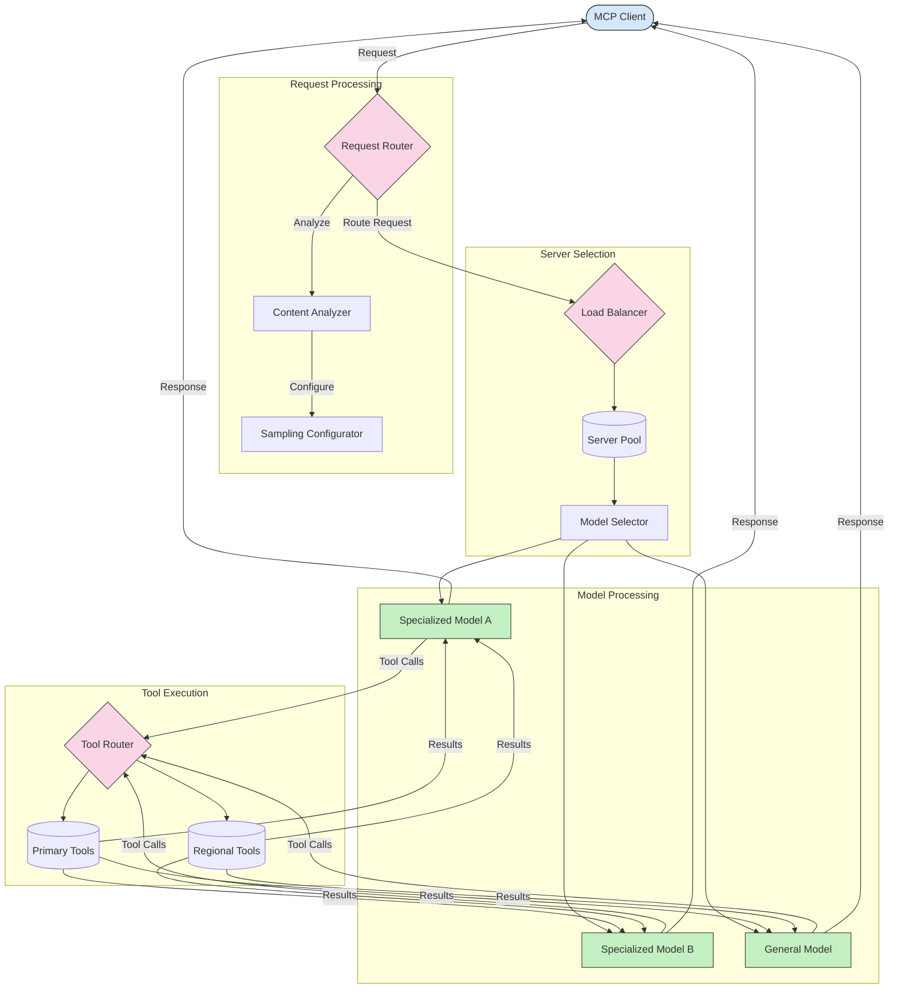

<!--
CO_OP_TRANSLATOR_METADATA:
{
  "original_hash": "2f1b473818b5a6cc9a9bbf777fffa6d4",
  "translation_date": "2025-07-14T21:47:35+00:00",
  "source_file": "05-AdvancedTopics/mcp-routing/README.md",
  "language_code": "tr"
}
-->
## Dinamik Araç Yönlendirme

Araç yönlendirme, araç çağrılarının bağlama göre en uygun hizmete yönlendirilmesini sağlar. Örneğin, bir hava durumu aracı çağrısı, kullanıcının konumuna bağlı olarak bölgesel bir uç noktaya yönlendirilmesi gerekebilir veya bir hesap makinesi aracı, belirli bir API sürümünü kullanmak zorunda olabilir.

Aşağıda, istek analizi, bölgesel uç noktalar ve sürüm desteğine dayalı dinamik araç yönlendirmeyi gösteren bir örnek uygulamaya bakalım.

## MCP'de Örnekleme ve Yönlendirme Mimarisi

Örnekleme, Model Context Protocol (MCP) içinde verimli istek işleme ve yönlendirme sağlayan kritik bir bileşendir. Gelen isteklerin içerik türü, kullanıcı bağlamı ve sistem yükü gibi çeşitli kriterlere göre en uygun model veya hizmete yönlendirilmesini belirlemek için analiz edilmesini içerir.

Örnekleme ve yönlendirme birleştirilerek kaynak kullanımını optimize eden ve yüksek erişilebilirlik sağlayan sağlam bir mimari oluşturulabilir. Örnekleme süreci istekleri sınıflandırmak için kullanılırken, yönlendirme onları uygun model veya hizmetlere yönlendirir.

Aşağıdaki diyagram, örnekleme ve yönlendirmenin kapsamlı bir MCP mimarisinde nasıl birlikte çalıştığını göstermektedir:

## Sonraki Adımlar

- [5.6 Sampling](../mcp-sampling/README.md)

**Feragatname**:  
Bu belge, AI çeviri servisi [Co-op Translator](https://github.com/Azure/co-op-translator) kullanılarak çevrilmiştir. Doğruluk için çaba göstersek de, otomatik çevirilerin hatalar veya yanlışlıklar içerebileceğini lütfen unutmayınız. Orijinal belge, kendi dilinde yetkili kaynak olarak kabul edilmelidir. Kritik bilgiler için profesyonel insan çevirisi önerilir. Bu çevirinin kullanımı sonucu ortaya çıkabilecek yanlış anlamalar veya yorum hatalarından sorumlu değiliz.