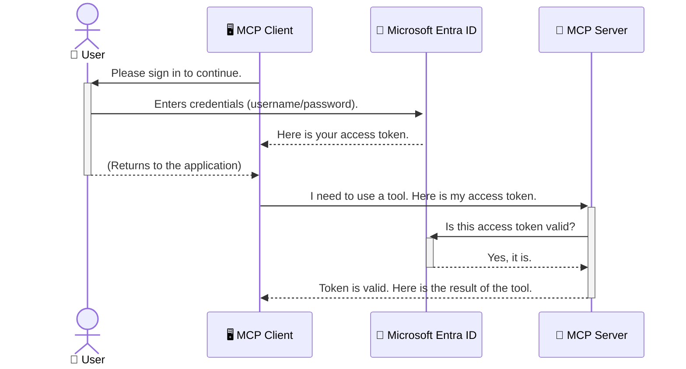

<!--
CO_OP_TRANSLATOR_METADATA:
{
  "original_hash": "0abf26a6c4dbe905d5d49ccdc0ccfe92",
  "translation_date": "2025-06-26T16:29:28+00:00",
  "source_file": "05-AdvancedTopics/mcp-security-entra/README.md",
  "language_code": "tr"
}
-->
# AI İş Akışlarını Güvence Altına Alma: Model Context Protocol Sunucuları için Entra ID Kimlik Doğrulaması

## Giriş  
Model Context Protocol (MCP) sunucunuzu güvence altına almak, evinizin ön kapısını kilitlemek kadar önemlidir. MCP sunucunuzu açık bırakmak, araçlarınızın ve verilerinizin yetkisiz erişime maruz kalmasına yol açar ve bu da güvenlik ihlallerine neden olabilir. Microsoft Entra ID, yalnızca yetkili kullanıcıların ve uygulamaların MCP sunucunuzla etkileşim kurmasını sağlamak için güçlü, bulut tabanlı bir kimlik ve erişim yönetimi çözümü sunar. Bu bölümde, AI iş akışlarınızı Entra ID kimlik doğrulamasıyla nasıl koruyacağınızı öğreneceksiniz.

## Öğrenme Hedefleri  
Bu bölümü tamamladıktan sonra şunları yapabileceksiniz:

- MCP sunucularının güvence altına alınmasının önemini kavramak.  
- Microsoft Entra ID ve OAuth 2.0 kimlik doğrulamasının temel prensiplerini açıklamak.  
- Genel (public) ve gizli (confidential) istemciler arasındaki farkları anlamak.  
- Hem yerel (genel istemci) hem de uzaktan (gizli istemci) MCP sunucu senaryolarında Entra ID kimlik doğrulamasını uygulamak.  
- AI iş akışları geliştirirken güvenlik en iyi uygulamalarını kullanmak.

## Güvenlik ve MCP  

Evinizin ön kapısını kilitlemeden bırakmayacağınız gibi, MCP sunucunuzu da herkesin erişimine açık bırakmamalısınız. AI iş akışlarınızı güvence altına almak, sağlam, güvenilir ve güvenli uygulamalar oluşturmanın temelidir. Bu bölümde, Microsoft Entra ID kullanarak MCP sunucularınızı nasıl koruyacağınızı öğreneceksiniz; böylece yalnızca yetkili kullanıcılar ve uygulamalar araçlarınıza ve verilerinize erişebilecektir.

## MCP Sunucuları için Güvenliğin Önemi  

MCP sunucunuzun e-posta gönderebilen veya müşteri veritabanına erişebilen bir aracı olduğunu düşünün. Güvenli olmayan bir sunucu, bu aracı herkesin kullanabilmesi anlamına gelir; bu da yetkisiz veri erişimi, spam veya diğer kötü niyetli faaliyetlere yol açabilir.

Kimlik doğrulama uygulayarak, sunucunuza gelen her isteğin doğrulandığından emin olursunuz; böylece isteği yapan kullanıcı veya uygulamanın kimliği teyit edilir. Bu, AI iş akışlarınızı güvence altına almanın ilk ve en kritik adımıdır.

## Microsoft Entra ID'ye Giriş  

[**Microsoft Entra ID**](https://adoption.microsoft.com/microsoft-security/entra/), bulut tabanlı bir kimlik ve erişim yönetimi hizmetidir. Uygulamalarınız için evrensel bir güvenlik görevlisi gibi düşünebilirsiniz. Kullanıcı kimliklerini doğrulama (kimlik doğrulama) ve ne yapabileceklerini belirleme (yetkilendirme) karmaşık süreçlerini yönetir.

Entra ID kullanarak şunları yapabilirsiniz:

- Kullanıcılar için güvenli oturum açma sağlamak.  
- API’leri ve servisleri korumak.  
- Erişim politikalarını merkezi bir yerden yönetmek.

MCP sunucuları için Entra ID, sunucunuzun yeteneklerine kimlerin erişebileceğini yönetmek için güçlü ve yaygın olarak güvenilen bir çözüm sunar.

---

## Sihirli Kısım: Entra ID Kimlik Doğrulaması Nasıl Çalışır?  

Entra ID, kimlik doğrulama için **OAuth 2.0** gibi açık standartları kullanır. Ayrıntılar karmaşık olabilir ancak temel kavram basit ve bir benzetmeyle açıklanabilir.

### OAuth 2.0’a Nazik Bir Giriş: Vale Anahtarı  

OAuth 2.0’ı arabanız için bir vale hizmeti gibi düşünün. Bir restorana gittiğinizde valeye anahtarınızın tamamını vermezsiniz. Bunun yerine, sınırlı izinlere sahip bir **vale anahtarı** verirsiniz—arabanızı çalıştırabilir ve kapıları kilitleyebilir, ancak bagaj kapağını veya torpido gözünü açamaz.

Bu benzetmede:

- **Siz** **Kullanıcı**'sınız.  
- **Arabanız** değerli araç ve verilerinizle **MCP Sunucusu**'dur.  
- **Vale** **Microsoft Entra ID**'dir.  
- **Park Görevlisi** MCP sunucusuna erişmeye çalışan **MCP İstemcisi** (uygulama)dır.  
- **Vale Anahtarı** ise **Erişim Tokenı**dır.

Erişim tokenı, MCP istemcisinin Entra ID’den oturum açtıktan sonra aldığı güvenli bir metin dizisidir. İstemci, her istekte bu tokenı MCP sunucusuna sunar. Sunucu, tokenı doğrulayarak isteğin geçerli olduğunu ve istemcinin gerekli izinlere sahip olduğunu onaylar; böylece gerçek kimlik bilgilerinizi (örneğin şifrenizi) asla işlememiş olur.

### Kimlik Doğrulama Akışı  

Süreç pratikte şu şekilde işler:



### Microsoft Authentication Library (MSAL) Tanıtımı  

Koda geçmeden önce, örneklerde göreceğiniz önemli bir bileşeni tanıtmak faydalı: **Microsoft Authentication Library (MSAL)**.

MSAL, Microsoft tarafından geliştirilen ve geliştiricilerin kimlik doğrulamayı çok daha kolay yönetmesini sağlayan bir kütüphanedir. Güvenlik tokenlarını yönetmek, oturum açma işlemlerini kolaylaştırmak ve oturum yenilemeyi sağlamak için karmaşık kodlar yazmanıza gerek kalmaz; MSAL tüm bu ağır işleri üstlenir.

MSAL kullanmanız şiddetle tavsiye edilir çünkü:

- **Güvenlidir:** Endüstri standardı protokolleri ve güvenlik en iyi uygulamalarını uygular, böylece kodunuzdaki güvenlik açıklarını azaltır.  
- **Geliştirmeyi Basitleştirir:** OAuth 2.0 ve OpenID Connect protokollerinin karmaşıklığını soyutlar, böylece uygulamanıza sadece birkaç satır kodla sağlam kimlik doğrulama ekleyebilirsiniz.  
- **Sürekli Güncellenir:** Microsoft, MSAL’ı yeni güvenlik tehditlerine ve platform değişikliklerine karşı sürekli günceller.

MSAL, .NET, JavaScript/TypeScript, Python, Java, Go ve iOS ile Android gibi mobil platformlar dahil olmak üzere pek çok dil ve uygulama çerçevesini destekler. Bu sayede tüm teknoloji yığını boyunca tutarlı kimlik doğrulama desenleri kullanabilirsiniz.

MSAL hakkında daha fazla bilgi için resmi [MSAL genel bakış dokümantasyonuna](https://learn.microsoft.com/entra/identity-platform/msal-overview) göz atabilirsiniz.

---

## MCP Sunucunuzu Entra ID ile Güvence Altına Alma: Adım Adım Rehber  

Şimdi, yerel bir MCP sunucusunu (örneğin `stdio`) using Entra ID. This example uses a **public client**, which is suitable for applications running on a user's machine, like a desktop app or a local development server.

### Scenario 1: Securing a Local MCP Server (with a Public Client)

In this scenario, we'll look at an MCP server that runs locally, communicates over `stdio`, and uses Entra ID to authenticate the user before allowing access to its tools. The server will have a single tool that fetches the user's profile information from the Microsoft Graph API.

#### 1. Setting Up the Application in Entra ID

Before writing any code, you need to register your application in Microsoft Entra ID. This tells Entra ID about your application and grants it permission to use the authentication service.

1. Navigate to the **[Microsoft Entra portal](https://entra.microsoft.com/)**.
2. Go to **App registrations** and click **New registration**.
3. Give your application a name (e.g., "My Local MCP Server").
4. For **Supported account types**, select **Accounts in this organizational directory only**.
5. You can leave the **Redirect URI** blank for this example.
6. Click **Register**.

Once registered, take note of the **Application (client) ID** and **Directory (tenant) ID**. You'll need these in your code.

#### 2. The Code: A Breakdown

Let's look at the key parts of the code that handle authentication. The full code for this example is available in the [Entra ID - Local - WAM](https://github.com/Azure-Samples/mcp-auth-servers/tree/main/src/entra-id-local-wam) folder of the [mcp-auth-servers GitHub repository](https://github.com/Azure-Samples/mcp-auth-servers).

**`AuthenticationService.cs`**

This class is responsible for handling the interaction with Entra ID.

- **`CreateAsync`**: This method initializes the `PublicClientApplication` from the MSAL (Microsoft Authentication Library). It's configured with your application's `clientId` and `tenantId`.
- **`WithBroker`**: This enables the use of a broker (like the Windows Web Account Manager), which provides a more secure and seamless single sign-on experience.
- **`AcquireTokenAsync`** yöntemiyle iletişim kuran) nasıl güvence altına alacağınızı inceleyelim: Bu temel yöntem, önce tokenı sessizce almaya çalışır (yani kullanıcı zaten geçerli bir oturuma sahipse tekrar oturum açması gerekmez). Sessiz token alınamazsa, kullanıcıdan etkileşimli olarak oturum açması istenir.

```csharp
// Simplified for clarity
public static async Task<AuthenticationService> CreateAsync(ILogger<AuthenticationService> logger)
{
    var msalClient = PublicClientApplicationBuilder
        .Create(_clientId) // Your Application (client) ID
        .WithAuthority(AadAuthorityAudience.AzureAdMyOrg)
        .WithTenantId(_tenantId) // Your Directory (tenant) ID
        .WithBroker(new BrokerOptions(BrokerOptions.OperatingSystems.Windows))
        .Build();

    // ... cache registration ...

    return new AuthenticationService(logger, msalClient);
}

public async Task<string> AcquireTokenAsync()
{
    try
    {
        // Try silent authentication first
        var accounts = await _msalClient.GetAccountsAsync();
        var account = accounts.FirstOrDefault();

        AuthenticationResult? result = null;

        if (account != null)
        {
            result = await _msalClient.AcquireTokenSilent(_scopes, account).ExecuteAsync();
        }
        else
        {
            // If no account, or silent fails, go interactive
            result = await _msalClient.AcquireTokenInteractive(_scopes).ExecuteAsync();
        }

        return result.AccessToken;
    }
    catch (Exception ex)
    {
        _logger.LogError(ex, "An error occurred while acquiring the token.");
        throw; // Optionally rethrow the exception for higher-level handling
    }
}
```

**`Program.cs`**

This is where the MCP server is set up and the authentication service is integrated.

- **`AddSingleton<AuthenticationService>`**: This registers the `AuthenticationService` with the dependency injection container, so it can be used by other parts of the application (like our tool).
- **`GetUserDetailsFromGraph` tool**: This tool requires an instance of `AuthenticationService`. Before it does anything, it calls `authService.AcquireTokenAsync()`** ile geçerli bir erişim tokenı alınır. Kimlik doğrulama başarılıysa, bu token Microsoft Graph API’yi çağırmak ve kullanıcının bilgilerini almak için kullanılır.

```csharp
// Simplified for clarity
[McpServerTool(Name = "GetUserDetailsFromGraph")]
public static async Task<string> GetUserDetailsFromGraph(
    AuthenticationService authService)
{
    try
    {
        // This will trigger the authentication flow
        var accessToken = await authService.AcquireTokenAsync();

        // Use the token to create a GraphServiceClient
        var graphClient = new GraphServiceClient(
            new BaseBearerTokenAuthenticationProvider(new TokenProvider(authService)));

        var user = await graphClient.Me.GetAsync();

        return System.Text.Json.JsonSerializer.Serialize(user);
    }
    catch (Exception ex)
    {
        return $"Error: {ex.Message}";
    }
}
```

#### 3. Hepsi Birlikte Nasıl Çalışır?  

1. MCP istemcisi, `GetUserDetailsFromGraph` tool, the tool first calls `AcquireTokenAsync`.
2. `AcquireTokenAsync` triggers the MSAL library to check for a valid token.
3. If no token is found, MSAL, through the broker, will prompt the user to sign in with their Entra ID account.
4. Once the user signs in, Entra ID issues an access token.
5. The tool receives the token and uses it to make a secure call to the Microsoft Graph API.
6. The user's details are returned to the MCP client.

This process ensures that only authenticated users can use the tool, effectively securing your local MCP server.

### Scenario 2: Securing a Remote MCP Server (with a Confidential Client)

When your MCP server is running on a remote machine (like a cloud server) and communicates over a protocol like HTTP Streaming, the security requirements are different. In this case, you should use a **confidential client** and the **Authorization Code Flow**. This is a more secure method because the application's secrets are never exposed to the browser.

This example uses a TypeScript-based MCP server that uses Express.js to handle HTTP requests.

#### 1. Setting Up the Application in Entra ID

The setup in Entra ID is similar to the public client, but with one key difference: you need to create a **client secret**.

1. Navigate to the **[Microsoft Entra portal](https://entra.microsoft.com/)**.
2. In your app registration, go to the **Certificates & secrets** tab.
3. Click **New client secret**, give it a description, and click **Add**.
4. **Important:** Copy the secret value immediately. You will not be able to see it again.
5. You also need to configure a **Redirect URI**. Go to the **Authentication** tab, click **Add a platform**, select **Web**, and enter the redirect URI for your application (e.g., `http://localhost:3001/auth/callback`).

> **⚠️ Important Security Note:** For production applications, Microsoft strongly recommends using **secretless authentication** methods such as **Managed Identity** or **Workload Identity Federation** instead of client secrets. Client secrets pose security risks as they can be exposed or compromised. Managed identities provide a more secure approach by eliminating the need to store credentials in your code or configuration.
>
> For more information about managed identities and how to implement them, see the [Managed identities for Azure resources overview](https://learn.microsoft.com/entra/identity/managed-identities-azure-resources/overview).

#### 2. The Code: A Breakdown

This example uses a session-based approach. When the user authenticates, the server stores the access token and refresh token in a session and gives the user a session token. This session token is then used for subsequent requests. The full code for this example is available in the [Entra ID - Confidential client](https://github.com/Azure-Samples/mcp-auth-servers/tree/main/src/entra-id-cca-session) folder of the [mcp-auth-servers GitHub repository](https://github.com/Azure-Samples/mcp-auth-servers).

**`Server.ts`**

This file sets up the Express server and the MCP transport layer.

- **`requireBearerAuth`**: This is middleware that protects the `/sse` and `/message` endpoints. It checks for a valid bearer token in the `Authorization` header of the request.
- **`EntraIdServerAuthProvider`**: This is a custom class that implements the `McpServerAuthorizationProvider` interface. It's responsible for handling the OAuth 2.0 flow.
- **`/auth/callback`** gibi bir uç noktayı kullanmaya çalıştığında, bu uç nokta kullanıcı Entra ID’de kimlik doğrulamasını tamamladıktan sonra yönlendirme işlemini ele alır. Yetkilendirme kodunu erişim tokenı ve yenileme tokenı ile değiştirir.

```typescript
// Simplified for clarity
const app = express();
const { server } = createServer();
const provider = new EntraIdServerAuthProvider();

// Protect the SSE endpoint
app.get("/sse", requireBearerAuth({
  provider,
  requiredScopes: ["User.Read"]
}), async (req, res) => {
  // ... connect to the transport ...
});

// Protect the message endpoint
app.post("/message", requireBearerAuth({
  provider,
  requiredScopes: ["User.Read"]
}), async (req, res) => {
  // ... handle the message ...
});

// Handle the OAuth 2.0 callback
app.get("/auth/callback", (req, res) => {
  provider.handleCallback(req.query.code, req.query.state)
    .then(result => {
      // ... handle success or failure ...
    });
});
```

**`Tools.ts`**

This file defines the tools that the MCP server provides. The `getUserDetails`** aracı önceki örneğe benzer, ancak erişim tokenını oturumdan alır.

```typescript
// Simplified for clarity
server.setRequestHandler(CallToolRequestSchema, async (request) => {
  const { name } = request.params;
  const context = request.params?.context as { token?: string } | undefined;
  const sessionToken = context?.token;

  if (name === ToolName.GET_USER_DETAILS) {
    if (!sessionToken) {
      throw new AuthenticationError("Authentication token is missing or invalid. Ensure the token is provided in the request context.");
    }

    // Get the Entra ID token from the session store
    const tokenData = tokenStore.getToken(sessionToken);
    const entraIdToken = tokenData.accessToken;

    const graphClient = Client.init({
      authProvider: (done) => {
        done(null, entraIdToken);
      }
    });

    const user = await graphClient.api('/me').get();

    // ... return user details ...
  }
});
```

**`auth/EntraIdServerAuthProvider.ts`**

This class handles the logic for:

- Redirecting the user to the Entra ID sign-in page.
- Exchanging the authorization code for an access token.
- Storing the tokens in the `tokenStore`.
- Refreshing the access token when it expires.

#### 3. How It All Works Together

1. When a user first tries to connect to the MCP server, the `requireBearerAuth` middleware will see that they don't have a valid session and will redirect them to the Entra ID sign-in page.
2. The user signs in with their Entra ID account.
3. Entra ID redirects the user back to the `/auth/callback` endpoint with an authorization code.
4. The server exchanges the code for an access token and a refresh token, stores them, and creates a session token which is sent to the client.
5. The client can now use this session token in the `Authorization` header for all future requests to the MCP server.
6. When the `getUserDetails`** aracı çağrıldığında, oturum tokenını kullanarak Entra ID erişim tokenını bulur ve ardından Microsoft Graph API çağrısı yapar.

Bu akış, genel istemci akışından daha karmaşıktır, ancak internet üzerinden erişilen uç noktalar için gereklidir. Uzaktaki MCP sunucuları halka açık internet üzerinden erişilebilir olduğundan, yetkisiz erişim ve olası saldırılara karşı daha güçlü güvenlik önlemleri gerektirir.

## Güvenlik En İyi Uygulamaları  

- **Her zaman HTTPS kullanın:** İstemci ile sunucu arasındaki iletişimi şifreleyerek tokenların ele geçirilmesini önleyin.  
- **Rol Tabanlı Erişim Kontrolü (RBAC) uygulayın:** Sadece kullanıcının *kimliğini doğrulamakla* kalmayın, *ne yapmaya yetkili olduğunu* da kontrol edin. Entra ID’de roller tanımlayabilir ve MCP sunucunuzda bunları kontrol edebilirsiniz.  
- **İzleme ve denetim yapın:** Tüm kimlik doğrulama olaylarını kaydedin, böylece şüpheli faaliyetleri tespit edip müdahale edebilirsiniz.  
- **Oran sınırlaması ve kısıtlama işlemleri:** Microsoft Graph ve diğer API’ler kötüye kullanımı önlemek için oran sınırlaması uygular. MCP sunucunuzda HTTP 429 (Çok Fazla İstek) yanıtlarını yönetmek için üstel geri çekilme (exponential backoff) ve yeniden deneme mantığı uygulayın. Sık erişilen verileri önbelleğe almayı düşünün.  
- **Tokenları güvenli şekilde saklayın:** Erişim ve yenileme tokenlarını güvenli şekilde depolayın. Yerel uygulamalarda sistemin güvenli depolama mekanizmalarını kullanın. Sunucu uygulamalarında ise şifreli depolama veya Azure Key Vault gibi güvenli anahtar yönetim hizmetlerini tercih edin.  
- **Token süresi dolma yönetimi:** Erişim tokenlarının ömrü sınırlıdır. Yenileme tokenları kullanarak otomatik token yenileme uygulayın, böylece kullanıcı deneyimi kesintisiz olur ve yeniden kimlik doğrulama gerektirmez.  
- **Azure API Management kullanmayı düşünün:** MCP sunucunuzda doğrudan güvenlik uygulamak size ince ayar kontrolü sağlar ancak API Gateway’ler (örneğin Azure API Management) kimlik doğrulama, yetkilendirme, oran sınırlama ve izleme gibi birçok güvenlik sorununu otomatik olarak yönetebilir. Bu, istemcileriniz ile MCP sunucularınız arasında merkezi bir güvenlik katmanı oluşturur. MCP ile API Gateway kullanımı hakkında daha fazla bilgi için [Azure API Management Your Auth Gateway For MCP Servers](https://techcommunity.microsoft.com/blog/integrationsonazureblog/azure-api-management-your-auth-gateway-for-mcp-servers/4402690) makalesine bakabilirsiniz.

## Önemli Noktalar  

- MCP sunucunuzu güvence altına almak, verilerinizi ve araçlarınızı korumak için çok önemlidir.  
- Microsoft Entra ID, kimlik doğrulama ve yetkilendirme için güçlü ve ölçeklenebilir bir çözüm sunar.  
- Yerel uygulamalar için **genel istemci**, uzaktaki sunucular için **gizli istemci** kullanın.  
- Web uygulamaları için en güvenli seçenek **Authorization Code Flow**’dur.

## Alıştırma  

1. İnşa etmeyi düşündüğünüz bir MCP sunucusunu hayal edin. Yerel mi yoksa uzaktan mı olacak?  
2. Cevabınıza göre genel mi yoksa gizli istemci mi kullanırsınız?  
3. MCP sunucunuzun Microsoft Graph üzerinde işlem yapabilmesi için hangi izinleri talep eder?

## Uygulamalı Alıştırmalar  

### Alıştırma 1: Entra ID’de Uygulama Kaydı  
Microsoft Entra portalına gidin.  
MCP sunucunuz için yeni bir uygulama kaydı oluşturun.  
Uygulama (istemci) kimliği ve Dizin (kiracı) kimliğini not edin.

### Alıştırma 2: Yerel MCP Sunucusunu Güvenceye Alma (Genel İstemci)  
- MSAL (Microsoft Authentication Library) kullanarak kullanıcı kimlik doğrulamasını entegre etmek için kod örneğini takip edin.  
- Microsoft Graph’tan kullanıcı bilgisi alan MCP aracını çağırarak kimlik doğrulama akışını test edin.

### Alıştırma 3: Uzaktaki MCP Sunucusunu Güvenceye Alma (Gizli İstemci)  
- Entra ID’de gizli istemci kaydı yapın ve bir istemci sırrı oluşturun.  
- Express.js MCP sunucunuzu Authorization Code Flow kullanacak şekilde yapılandırın.  
- Korunan uç noktaları test edin ve token tabanlı erişimi doğrulayın.

### Alıştırma 4: Güvenlik En İyi Uygulamalarını Uygulama  
- Yerel veya uzaktaki sunucunuz için HTTPS etkinleştirin.  
- Sunucu mantığınızda rol tabanlı erişim kontrolü (RBAC) uygulayın.  
- Token süresi dolma yönetimi ve güvenli token depolama ekleyin.

## Kaynaklar  

1. **MSAL Genel Bakış Dokümantasyonu**  
   Microsoft Authentication Library’nin (MSAL) platformlar arası güvenli token edinimini nasıl sağladığını öğrenin:  
   [Microsoft Learn’de MSAL Genel Bakış](https://learn.microsoft.com/en-gb/entra/msal/overview)

2. **Azure-Samples/mcp-auth-servers GitHub Deposu**  
   Kimlik doğrulama akışlarını gösteren MCP sunucularının referans uygulamaları:  
   [Azure-Samples/mcp-auth-servers GitHub’da](https://github.com/Azure-Samples/mcp-auth-servers)

3. **Azure Kaynakları için Yönetilen Kimlikler Genel Bakış**  
   Sistem veya kullanıcı atamalı yönetilen kimlikler kullanarak gizli bilgileri nasıl ortadan kaldıracağınızı anlayın:  
   [Microsoft Learn’de Yönetilen Kimlikler Genel Bakış](https://learn.microsoft.com/en-us/entra/identity/managed-identities-azure-resources/)

4. **Azure API Management: MCP Sunucuları için Kimlik Doğrulama Geçidi**  
   MCP sunucuları için güvenli OAuth2 geçidi olarak APIM kullanımı hakkında detaylı inceleme:  
   [Azure API Management Your Auth Gateway For MCP Servers](https://techcommunity.microsoft.com/blog/integrationsonazureblog/azure-api-management-your-auth-gateway-for-mcp-servers/4402690)

5. **Microsoft Graph İzinleri Referansı**  
   Microsoft Graph için yetkilendirilmiş ve uygulama izinlerinin kapsamlı listesi:  
   [Microsoft Graph İzinleri Referansı](https://learn.microsoft.com/zh-tw/graph/permissions-reference)

## Öğrenme Çıktıları  
Bu bölümü tamamladıktan sonra:

- MCP sunucuları ve AI iş akışları için kimlik doğrulamanın neden kritik olduğunu açıklayabileceksiniz.  
- Hem yerel hem de uzaktaki MCP sunucu senaryoları için Entra ID kimlik doğrulamasını kurup yapılandırabileceksiniz.  
- Sunucunuzun dağıtımına göre uygun istemci türünü (genel veya gizli) seçebileceksiniz.  
- Token depolama ve rol tabanlı yetkilendirme dahil olmak üzere güvenli kodlama uygulamalarını hayata geçirebileceksiniz.  
- MCP sunucunuzu ve araçlarını yetkisiz erişime karşı güvenle koruyabileceksiniz.

## Sonraki Adım  

- [6. Topluluk Katkıları](../../06-CommunityContributions/README.md)

**Feragatname**:  
Bu belge, AI çeviri servisi [Co-op Translator](https://github.com/Azure/co-op-translator) kullanılarak çevrilmiştir. Doğruluk için çaba sarf etsek de, otomatik çevirilerin hata veya yanlışlık içerebileceğini lütfen unutmayın. Orijinal belge, kendi dilinde yetkili kaynak olarak kabul edilmelidir. Kritik bilgiler için profesyonel insan çevirisi önerilir. Bu çevirinin kullanımı sonucunda oluşabilecek yanlış anlamalar veya yanlış yorumlamalardan dolayı sorumluluk kabul edilmemektedir.