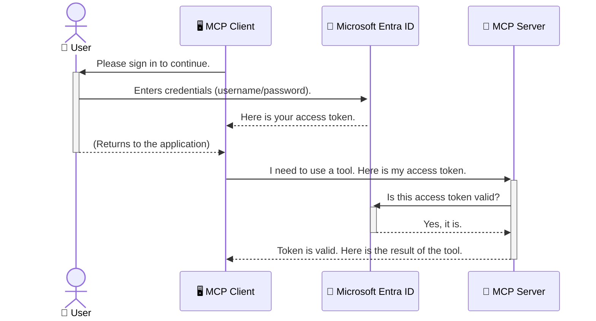

<!--
CO_OP_TRANSLATOR_METADATA:
{
  "original_hash": "6e562d7e5a77c8982da4aa8f762ad1d8",
  "translation_date": "2025-07-02T09:26:27+00:00",
  "source_file": "05-AdvancedTopics/mcp-security-entra/README.md",
  "language_code": "tr"
}
-->
# Yapay Zeka İş Akışlarını Güvence Altına Alma: Model Context Protocol Sunucuları için Entra ID Kimlik Doğrulaması

## Giriş  
Model Context Protocol (MCP) sunucunuzu güvence altına almak, evinizin ön kapısını kilitlemek kadar önemlidir. MCP sunucunuzu açık bırakmak, araçlarınızı ve verilerinizi yetkisiz erişime maruz bırakır ve bu da güvenlik ihlallerine yol açabilir. Microsoft Entra ID, yalnızca yetkili kullanıcıların ve uygulamaların MCP sunucunuzla etkileşime girmesini sağlayan güçlü, bulut tabanlı bir kimlik ve erişim yönetimi çözümü sunar. Bu bölümde, Entra ID kimlik doğrulamasını kullanarak yapay zeka iş akışlarınızı nasıl koruyacağınızı öğreneceksiniz.

## Öğrenme Hedefleri  
Bu bölümü tamamladıktan sonra:

- MCP sunucularının güvenliğinin neden önemli olduğunu anlayabileceksiniz.  
- Microsoft Entra ID ve OAuth 2.0 kimlik doğrulamasının temellerini açıklayabileceksiniz.  
- Genel (public) ve gizli (confidential) istemciler arasındaki farkı ayırt edebileceksiniz.  
- Hem yerel (public client) hem de uzak (confidential client) MCP sunucu senaryolarında Entra ID kimlik doğrulamasını uygulayabileceksiniz.  
- Yapay zeka iş akışları geliştirirken güvenlik en iyi uygulamalarını uygulayabileceksiniz.

## Güvenlik ve MCP  

Tıpkı evinizin ön kapısını açık bırakmayacağınız gibi, MCP sunucunuzu da herkesin erişimine açık bırakmamalısınız. Yapay zeka iş akışlarınızı güvence altına almak, sağlam, güvenilir ve güvenli uygulamalar oluşturmak için gereklidir. Bu bölümde, Microsoft Entra ID kullanarak MCP sunucularınızı nasıl koruyacağınızı öğreneceksiniz; böylece yalnızca yetkili kullanıcılar ve uygulamalar araçlarınız ve verilerinizle etkileşime girebilecek.

## MCP Sunucuları için Güvenliğin Önemi  

MCP sunucunuzda e-posta gönderebilen veya müşteri veritabanına erişebilen bir araç olduğunu düşünün. Güvensiz bir sunucu, herhangi birinin bu aracı kullanabilmesi anlamına gelir; bu da yetkisiz veri erişimi, spam veya diğer kötü niyetli faaliyetlere yol açabilir.

Kimlik doğrulamayı uygulayarak, sunucunuza yapılan her isteğin doğrulandığından emin olursunuz; isteği yapan kullanıcı veya uygulamanın kimliği teyit edilir. Bu, yapay zeka iş akışlarınızı güvence altına almanın ilk ve en kritik adımıdır.

## Microsoft Entra ID'ye Giriş  

[**Microsoft Entra ID**](https://adoption.microsoft.com/microsoft-security/entra/) bulut tabanlı bir kimlik ve erişim yönetimi hizmetidir. Bunu, uygulamalarınız için evrensel bir güvenlik görevlisi olarak düşünebilirsiniz. Kullanıcı kimliklerini doğrulama (kimlik doğrulama) ve ne yapmalarına izin verileceğini belirleme (yetkilendirme) süreçlerini yönetir.

Entra ID kullanarak:

- Kullanıcılar için güvenli oturum açmayı etkinleştirebilirsiniz.  
- API’leri ve hizmetleri koruyabilirsiniz.  
- Erişim politikalarını merkezi bir yerden yönetebilirsiniz.

MCP sunucuları için Entra ID, sunucunuzun yeteneklerine kimlerin erişebileceğini yönetmek için güçlü ve yaygın olarak güvenilen bir çözüm sunar.

---

## Entra ID Kimlik Doğrulamasının İşleyişi: Temel Bilgiler  

Entra ID, kimlik doğrulamayı yönetmek için **OAuth 2.0** gibi açık standartları kullanır. Ayrıntılar karmaşık olabilir, ancak temel kavram basittir ve bir benzetmeyle anlaşılabilir.

### OAuth 2.0’a Nazik Bir Giriş: Vale Anahtarı  

OAuth 2.0’ı, arabanız için bir vale hizmeti gibi düşünün. Bir restorana geldiğinizde, valeye anahtarınızın tamamını vermezsiniz. Bunun yerine, sınırlı izinlere sahip bir **vale anahtarı** verirsiniz—arabanızı çalıştırabilir ve kapıları kilitleyebilir, ancak bagajı veya torpido gözünü açamaz.

Bu benzetmede:

- **Siz** kullanıcı (User) olursunuz.  
- **Arabanız**, değerli araçlarınız ve verilerinizle birlikte **MCP Sunucusudur**.  
- **Vale** Microsoft Entra ID’dir.  
- **Park Görevlisi** MCP istemcisidir (sunucuya erişmeye çalışan uygulama).  
- **Vale Anahtarı** ise erişim belirtecidir (Access Token).

Erişim belirteci, MCP istemcisinin, sizin oturum açmanızın ardından Entra ID’den aldığı güvenli bir metin dizisidir. İstemci, bu belirteci her istekte MCP sunucusuna sunar. Sunucu, belirteci doğrulayarak isteğin meşru olduğunu ve istemcinin gerekli izinlere sahip olduğunu teyit eder; bu süreçte gerçek kimlik bilgilerinizi (örneğin şifrenizi) asla kullanmaz.

### Kimlik Doğrulama Akışı  

İşleyiş şu şekildedir:



### Microsoft Authentication Library (MSAL) Tanıtımı  

Koda geçmeden önce, örneklerde göreceğiniz önemli bir bileşeni tanıtmakta fayda var: **Microsoft Authentication Library (MSAL)**.

MSAL, geliştiricilerin kimlik doğrulamayı çok daha kolay yönetmesini sağlayan Microsoft tarafından geliştirilmiş bir kütüphanedir. Güvenlik belirteçlerini yönetmek, oturum açmayı sağlamak ve oturum yenilemek için karmaşık kodlar yazmak yerine, MSAL bu ağır işleri üstlenir.

MSAL kullanmanız şiddetle tavsiye edilir çünkü:

- **Güvenlidir:** Endüstri standardı protokoller ve güvenlik en iyi uygulamalarını uygular, böylece kodunuzdaki güvenlik açıklarını azaltır.  
- **Geliştirmeyi Basitleştirir:** OAuth 2.0 ve OpenID Connect protokollerinin karmaşıklığını soyutlar, uygulamanıza birkaç satır kodla sağlam kimlik doğrulama eklemenizi sağlar.  
- **Bakımı Yapılır:** Microsoft, yeni güvenlik tehditleri ve platform değişikliklerine karşı MSAL’ı sürekli günceller.

MSAL, .NET, JavaScript/TypeScript, Python, Java, Go ve iOS ile Android gibi mobil platformlar dahil olmak üzere birçok dil ve uygulama çatısını destekler. Bu sayede tüm teknoloji yığını boyunca tutarlı kimlik doğrulama kalıpları kullanabilirsiniz.

MSAL hakkında daha fazla bilgi için resmi [MSAL genel bakış dokümantasyonuna](https://learn.microsoft.com/entra/identity-platform/msal-overview) göz atabilirsiniz.

---

## MCP Sunucunuzu Entra ID ile Güvence Altına Alma: Adım Adım Rehber  

Şimdi, yerel bir MCP sunucusunu (örneğin `stdio` üzerinden iletişim kuran) nasıl güvence altına alacağımızı inceleyelim.  

**`AuthenticationService.cs` içindeki `CreateAsync` yöntemi:** Bu temel yöntemdir. Öncelikle sessizce (silent) bir token almaya çalışır; yani kullanıcı geçerli bir oturuma sahipse tekrar oturum açması gerekmez. Sessiz token alınamazsa, kullanıcıdan etkileşimli olarak oturum açması istenir.

```csharp
// Simplified for clarity
public static async Task<AuthenticationService> CreateAsync(ILogger<AuthenticationService> logger)
{
    var msalClient = PublicClientApplicationBuilder
        .Create(_clientId) // Your Application (client) ID
        .WithAuthority(AadAuthorityAudience.AzureAdMyOrg)
        .WithTenantId(_tenantId) // Your Directory (tenant) ID
        .WithBroker(new BrokerOptions(BrokerOptions.OperatingSystems.Windows))
        .Build();

    // ... cache registration ...

    return new AuthenticationService(logger, msalClient);
}

public async Task<string> AcquireTokenAsync()
{
    try
    {
        // Try silent authentication first
        var accounts = await _msalClient.GetAccountsAsync();
        var account = accounts.FirstOrDefault();

        AuthenticationResult? result = null;

        if (account != null)
        {
            result = await _msalClient.AcquireTokenSilent(_scopes, account).ExecuteAsync();
        }
        else
        {
            // If no account, or silent fails, go interactive
            result = await _msalClient.AcquireTokenInteractive(_scopes).ExecuteAsync();
        }

        return result.AccessToken;
    }
    catch (Exception ex)
    {
        _logger.LogError(ex, "An error occurred while acquiring the token.");
        throw; // Optionally rethrow the exception for higher-level handling
    }
}
```

**`Program.cs` içinde:** `AddSingleton<AuthenticationService>` ile `AuthenticationService` tekil olarak eklenir. `GetUserDetailsFromGraph` yöntemi, `authService.AcquireTokenAsync()` ile geçerli bir erişim belirteci alır. Kimlik doğrulama başarılı olursa, bu belirteci Microsoft Graph API’sini çağırmak ve kullanıcının bilgilerini almak için kullanır.

```csharp
// Simplified for clarity
[McpServerTool(Name = "GetUserDetailsFromGraph")]
public static async Task<string> GetUserDetailsFromGraph(
    AuthenticationService authService)
{
    try
    {
        // This will trigger the authentication flow
        var accessToken = await authService.AcquireTokenAsync();

        // Use the token to create a GraphServiceClient
        var graphClient = new GraphServiceClient(
            new BaseBearerTokenAuthenticationProvider(new TokenProvider(authService)));

        var user = await graphClient.Me.GetAsync();

        return System.Text.Json.JsonSerializer.Serialize(user);
    }
    catch (Exception ex)
    {
        return $"Error: {ex.Message}";
    }
}
```

#### 3. Bütünün İşleyişi  

1. MCP istemcisi `GetUserDetailsFromGraph` çağrısı yaptığında, `AcquireTokenAsync` yöntemi ile erişim belirteci alınır.  
2. MCP sunucusu, `http://localhost:3001/auth/callback` gibi bir uç noktaya sahiptir; burası kullanıcı Entra ID ile kimlik doğrulandıktan sonra yönlendirme adresidir. Bu uç nokta yetkilendirme kodunu erişim belirtecine ve yenileme belirtecine dönüştürür.

```typescript
// Simplified for clarity
const app = express();
const { server } = createServer();
const provider = new EntraIdServerAuthProvider();

// Protect the SSE endpoint
app.get("/sse", requireBearerAuth({
  provider,
  requiredScopes: ["User.Read"]
}), async (req, res) => {
  // ... connect to the transport ...
});

// Protect the message endpoint
app.post("/message", requireBearerAuth({
  provider,
  requiredScopes: ["User.Read"]
}), async (req, res) => {
  // ... handle the message ...
});

// Handle the OAuth 2.0 callback
app.get("/auth/callback", (req, res) => {
  provider.handleCallback(req.query.code, req.query.state)
    .then(result => {
      // ... handle success or failure ...
    });
});
```

**`Tools.ts` içindeki `getUserDetails` aracı**, önceki örneğe benzer, ancak erişim belirtecini oturumdan alır.

```typescript
// Simplified for clarity
server.setRequestHandler(CallToolRequestSchema, async (request) => {
  const { name } = request.params;
  const context = request.params?.context as { token?: string } | undefined;
  const sessionToken = context?.token;

  if (name === ToolName.GET_USER_DETAILS) {
    if (!sessionToken) {
      throw new AuthenticationError("Authentication token is missing or invalid. Ensure the token is provided in the request context.");
    }

    // Get the Entra ID token from the session store
    const tokenData = tokenStore.getToken(sessionToken);
    const entraIdToken = tokenData.accessToken;

    const graphClient = Client.init({
      authProvider: (done) => {
        done(null, entraIdToken);
      }
    });

    const user = await graphClient.api('/me').get();

    // ... return user details ...
  }
});
```

**`auth/EntraIdServerAuthProvider.ts` içindeki tokenStore**, `requireBearerAuth` ve `/auth/callback` gibi bileşenler, `getUserDetails` aracı çağrıldığında, oturum belirtecini kullanarak Entra ID erişim belirtecini bulur ve ardından Microsoft Graph API’yi çağırır.

Bu akış, genel istemci (public client) akışından daha karmaşıktır, ancak internet üzerinden erişilen uç noktalar için gereklidir. Uzak MCP sunucuları genel internet üzerinden erişilebilir olduğundan, yetkisiz erişim ve potansiyel saldırılara karşı daha güçlü güvenlik önlemleri gerektirir.

## Güvenlik En İyi Uygulamaları  

- **Her zaman HTTPS kullanın:** İstemci ile sunucu arasındaki iletişimi şifreleyerek belirteçlerin ele geçirilmesini önleyin.  
- **Rol Tabanlı Erişim Kontrolü (RBAC) uygulayın:** Sadece kullanıcının kimliğinin doğrulanıp doğrulanmadığını değil, ne yapmaya yetkili olduğunu da kontrol edin. Entra ID’de roller tanımlayabilir ve MCP sunucunuzda bunları denetleyebilirsiniz.  
- **İzleme ve denetim yapın:** Tüm kimlik doğrulama olaylarını kaydedin, böylece şüpheli aktiviteleri tespit edip yanıt verebilirsiniz.  
- **Oran sınırlaması ve kısıtlama yönetin:** Microsoft Graph ve diğer API’ler kötüye kullanımı önlemek için oran sınırlaması uygular. MCP sunucunuzda, HTTP 429 (Too Many Requests) yanıtlarını yönetmek için üssel geri çekilme ve yeniden deneme mantığı uygulayın. Sık erişilen verileri önbelleğe almayı düşünün.  
- **Belirteç depolamasını güvenli yapın:** Erişim ve yenileme belirteçlerini güvenli bir şekilde saklayın. Yerel uygulamalar için sistemin güvenli depolama mekanizmalarını kullanın. Sunucu uygulamaları için şifreli depolama veya Azure Key Vault gibi güvenli anahtar yönetim servislerini tercih edin.  
- **Belirteç süresi dolma yönetimi:** Erişim belirteçlerinin ömrü sınırlıdır. Yenileme belirteçlerini kullanarak otomatik belirteç yenileme uygulayın, böylece kullanıcıların yeniden kimlik doğrulaması yapması gerekmez.  
- **Azure API Management kullanmayı düşünün:** MCP sunucunuzda doğrudan güvenlik uygulamak size ayrıntılı kontrol sağlar, ancak Azure API Management gibi API Gateway’ler kimlik doğrulama, yetkilendirme, oran sınırlaması ve izleme gibi birçok güvenlik sorununu otomatik olarak yönetebilir. Bu, istemcileriniz ile MCP sunucularınız arasında merkezi bir güvenlik katmanı sağlar. MCP ile API Gateway kullanımı hakkında daha fazla bilgi için [Azure API Management Your Auth Gateway For MCP Servers](https://techcommunity.microsoft.com/blog/integrationsonazureblog/azure-api-management-your-auth-gateway-for-mcp-servers/4402690) bağlantısına bakabilirsiniz.

## Önemli Noktalar  

- MCP sunucunuzu güvence altına almak, verilerinizi ve araçlarınızı korumak için çok önemlidir.  
- Microsoft Entra ID, kimlik doğrulama ve yetkilendirme için güçlü ve ölçeklenebilir bir çözüm sunar.  
- Yerel uygulamalar için **public client**, uzak sunucular için **confidential client** kullanın.  
- Web uygulamaları için en güvenli seçenek **Authorization Code Flow**dur.

## Alıştırma  

1. Kendi kuracağınız bir MCP sunucusunu düşünün. Yerel mi yoksa uzak mı olacak?  
2. Cevabınıza göre, public client mı yoksa confidential client mı kullanırsınız?  
3. MCP sunucunuzun Microsoft Graph üzerinde işlem yapabilmek için hangi izinleri talep etmesini istersiniz?

## Uygulamalı Alıştırmalar  

### Alıştırma 1: Entra ID’de Bir Uygulama Kaydı Oluşturun  
- Microsoft Entra portalına gidin.  
- MCP sunucunuz için yeni bir uygulama kaydedin.  
- Uygulama (client) ID ve Dizin (tenant) ID bilgilerini not edin.

### Alıştırma 2: Yerel MCP Sunucusunu Güvence Altına Alma (Public Client)  
- Kullanıcı kimlik doğrulaması için MSAL entegrasyonunu kod örneğine göre yapın.  
- Microsoft Graph’tan kullanıcı bilgilerini alan MCP aracını çağırarak kimlik doğrulama akışını test edin.

### Alıştırma 3: Uzak MCP Sunucusunu Güvence Altına Alma (Confidential Client)  
- Entra ID’de confidential client kaydı oluşturun ve bir client secret oluşturun.  
- Express.js MCP sunucunuzu Authorization Code Flow kullanacak şekilde yapılandırın.  
- Korunan uç noktaları test edin ve token tabanlı erişimi doğrulayın.

### Alıştırma 4: Güvenlik En İyi Uygulamalarını Uygulayın  
- Yerel veya uzak sunucunuzda HTTPS’yi etkinleştirin.  
- Sunucu mantığınızda rol tabanlı erişim kontrolü (RBAC) uygulayın.  
- Belirteç süresi dolma yönetimi ve güvenli belirteç depolama ekleyin.

## Kaynaklar  

1. **MSAL Genel Bakış Dokümantasyonu**  
   Microsoft Authentication Library (MSAL) ile platformlar arası güvenli belirteç edinimini öğrenin:  
   [Microsoft Learn’de MSAL Genel Bakış](https://learn.microsoft.com/en-gb/entra/msal/overview)

2. **Azure-Samples/mcp-auth-servers GitHub Deposu**  
   Kimlik doğrulama akışlarını gösteren MCP sunucusu referans uygulamaları:  
   [Azure-Samples/mcp-auth-servers GitHub](https://github.com/Azure-Samples/mcp-auth-servers)

3. **Azure Kaynakları için Yönetilen Kimlikler Genel Bakış**  
   Sistem veya kullanıcı atanmış yönetilen kimlikler kullanarak gizli bilgileri ortadan kaldırma:  
   [Microsoft Learn’de Yönetilen Kimlikler Genel Bakış](https://learn.microsoft.com/en-us/entra/identity/managed-identities-azure-resources/)

4. **Azure API Management: MCP Sunucuları için Kimlik Doğrulama Geçidi**  
   MCP sunucuları için güvenli OAuth2 geçidi olarak APIM kullanımı:  
   [Azure API Management Your Auth Gateway For MCP Servers](https://techcommunity.microsoft.com/blog/integrationsonazureblog/azure-api-management-your-auth-gateway-for-mcp-servers/4402690)

5. **Microsoft Graph İzin Referansı**  
   Microsoft Graph için devredilen ve uygulama izinlerinin kapsamlı listesi:  
   [Microsoft Graph İzin Referansı](https://learn.microsoft.com/zh-tw/graph/permissions-reference)

## Öğrenme Çıktıları  
Bu bölümü tamamladıktan sonra:

- MCP sunucuları ve yapay zeka iş akışları için kimlik doğrulamanın neden kritik olduğunu açıklayabileceksiniz.  
- Hem yerel hem de uzak MCP sunucu senaryoları için Entra ID kimlik doğrulamasını kurup yapılandırabileceksiniz.  
- Sunucunuzun dağıtımına göre uygun istemci türünü (public veya confidential) seçebileceksiniz.  
- Belirteç depolama ve rol tabanlı yetkilendirme gibi güvenli kodlama uygulamalarını hayata geçirebileceksiniz.  
- MCP sunucunuzu ve araçlarını yetkisiz erişimden güvenle koruyabileceksiniz.

## Sonraki Adım  

- [5.13 Model Context Protocol (MCP) Azure AI Foundry Entegrasyonu](../mcp-foundry-agent-integration/README.md)

**Feragatname**:  
Bu belge, AI çeviri servisi [Co-op Translator](https://github.com/Azure/co-op-translator) kullanılarak çevrilmiştir. Doğruluk için çaba sarf etsek de, otomatik çevirilerin hatalar veya yanlışlıklar içerebileceğini lütfen unutmayınız. Orijinal belge, kendi dilinde yetkili kaynak olarak kabul edilmelidir. Kritik bilgiler için profesyonel insan çevirisi önerilir. Bu çevirinin kullanımı sonucu oluşabilecek yanlış anlamalar veya yorum hatalarından sorumlu değiliz.