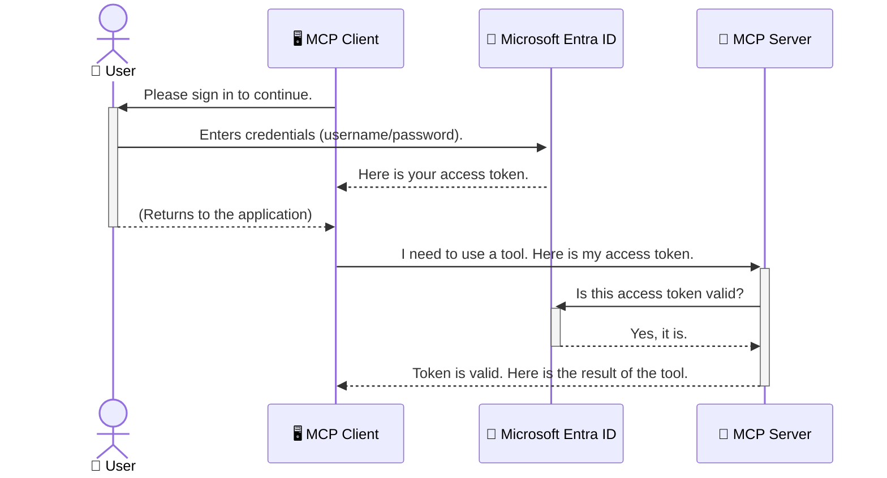

<!--
CO_OP_TRANSLATOR_METADATA:
{
  "original_hash": "6e562d7e5a77c8982da4aa8f762ad1d8",
  "translation_date": "2025-07-14T03:02:40+00:00",
  "source_file": "05-AdvancedTopics/mcp-security-entra/README.md",
  "language_code": "tr"
}
-->
# AI İş Akışlarını Güvence Altına Alma: Model Context Protocol Sunucuları için Entra ID Kimlik Doğrulaması

## Giriş  
Model Context Protocol (MCP) sunucunuzu güvence altına almak, evinizin ön kapısını kilitlemek kadar önemlidir. MCP sunucunuzu açık bırakmak, araçlarınızı ve verilerinizi yetkisiz erişime maruz bırakır ve bu da güvenlik ihlallerine yol açabilir. Microsoft Entra ID, yalnızca yetkili kullanıcıların ve uygulamaların MCP sunucunuzla etkileşimde bulunmasını sağlamak için güçlü, bulut tabanlı bir kimlik ve erişim yönetimi çözümü sunar. Bu bölümde, AI iş akışlarınızı Entra ID kimlik doğrulamasıyla nasıl koruyacağınızı öğreneceksiniz.

## Öğrenme Hedefleri  
Bu bölümü tamamladıktan sonra şunları yapabileceksiniz:

- MCP sunucularını güvence altına almanın önemini kavramak.  
- Microsoft Entra ID ve OAuth 2.0 kimlik doğrulamasının temel prensiplerini açıklamak.  
- Genel (public) ve gizli (confidential) istemciler arasındaki farkı anlamak.  
- Hem yerel (public client) hem de uzak (confidential client) MCP sunucu senaryolarında Entra ID kimlik doğrulamasını uygulamak.  
- AI iş akışları geliştirirken güvenlik en iyi uygulamalarını uygulamak.

## Güvenlik ve MCP  

Ev kapınızı kilitlemeden dışarı çıkmazsınız; aynı şekilde MCP sunucunuzu da herkesin erişimine açık bırakmamalısınız. AI iş akışlarınızı güvence altına almak, sağlam, güvenilir ve güvenli uygulamalar oluşturmak için gereklidir. Bu bölümde, Microsoft Entra ID kullanarak MCP sunucularınızı nasıl koruyacağınızı öğreneceksiniz; böylece yalnızca yetkili kullanıcılar ve uygulamalar araçlarınıza ve verilerinize erişebilecek.

## MCP Sunucuları için Güvenliğin Önemi  

MCP sunucunuzda e-posta gönderebilen veya müşteri veritabanına erişebilen bir araç olduğunu düşünün. Güvenliği sağlanmamış bir sunucu, bu aracı herkesin kullanabilmesi anlamına gelir; bu da yetkisiz veri erişimi, spam veya diğer kötü niyetli faaliyetlere yol açabilir.

Kimlik doğrulama uygulayarak, sunucunuza yapılan her isteğin doğrulanmasını sağlarsınız; böylece isteği yapan kullanıcı veya uygulamanın kimliği teyit edilir. Bu, AI iş akışlarınızı güvence altına almanın ilk ve en kritik adımıdır.

## Microsoft Entra ID’ye Giriş  

[**Microsoft Entra ID**](https://adoption.microsoft.com/microsoft-security/entra/), bulut tabanlı bir kimlik ve erişim yönetimi hizmetidir. Uygulamalarınız için evrensel bir güvenlik görevlisi gibi düşünebilirsiniz. Kullanıcı kimliklerini doğrulama (kimlik doğrulama) ve ne yapabileceklerini belirleme (yetkilendirme) süreçlerini yönetir.

Entra ID kullanarak:

- Kullanıcılar için güvenli oturum açma sağlayabilirsiniz.  
- API’leri ve servisleri koruyabilirsiniz.  
- Erişim politikalarını merkezi bir yerden yönetebilirsiniz.

MCP sunucuları için Entra ID, sunucunuzun yeteneklerine kimlerin erişebileceğini yönetmek için güçlü ve yaygın olarak güvenilen bir çözüm sunar.

---

## Büyüyü Anlamak: Entra ID Kimlik Doğrulaması Nasıl Çalışır?  

Entra ID, kimlik doğrulama için **OAuth 2.0** gibi açık standartları kullanır. Detaylar karmaşık olabilir, ancak temel kavram basittir ve bir benzetmeyle anlaşılabilir.

### OAuth 2.0’a Nazik Bir Giriş: Vale Anahtarı  

OAuth 2.0’ı, arabanız için bir vale hizmeti gibi düşünün. Bir restorana gittiğinizde, valeye anahtarınızın tamamını vermezsiniz. Bunun yerine, sınırlı izinlere sahip bir **vale anahtarı** verirsiniz—arabanızı çalıştırabilir ve kapıları kilitleyebilir, ancak bagajı veya torpido gözünü açamaz.

Bu benzetmede:

- **Siz** kullanıcı (User) olursunuz.  
- **Arabanız**, değerli araçlar ve verilerle dolu **MCP Sunucusu**dur.  
- **Vale**, **Microsoft Entra ID**dir.  
- **Otopark Görevlisi**, sunucuya erişmeye çalışan **MCP İstemcisi**dir (uygulama).  
- **Vale Anahtarı**, **Erişim Token’ı (Access Token)**dır.

Erişim token’ı, MCP istemcisinin Entra ID’den oturum açtıktan sonra aldığı güvenli bir metin dizisidir. İstemci, her istekte bu token’ı MCP sunucusuna sunar. Sunucu, token’ı doğrulayarak isteğin meşru olduğunu ve istemcinin gerekli izinlere sahip olduğunu teyit eder; böylece gerçek kimlik bilgilerinizi (örneğin şifrenizi) hiç kullanmadan güvenli erişim sağlanır.

### Kimlik Doğrulama Akışı  

İşleyiş şu şekildedir:



### Microsoft Authentication Library (MSAL) Tanıtımı  

Koda geçmeden önce, örneklerde göreceğiniz önemli bir bileşeni tanıtmakta fayda var: **Microsoft Authentication Library (MSAL)**.

MSAL, Microsoft tarafından geliştirilen ve geliştiricilerin kimlik doğrulamayı çok daha kolay yönetmesini sağlayan bir kütüphanedir. Güvenlik token’larını yönetmek, oturum açma işlemlerini ve yenilemelerini yazmak yerine, MSAL bu karmaşık işleri sizin için halleder.

MSAL kullanmanız şiddetle tavsiye edilir çünkü:

- **Güvenlidir:** Endüstri standartı protokolleri ve güvenlik en iyi uygulamalarını uygular, böylece kodunuzdaki güvenlik açıklarını azaltır.  
- **Geliştirmeyi Basitleştirir:** OAuth 2.0 ve OpenID Connect protokollerinin karmaşıklığını soyutlar, uygulamanıza sadece birkaç satır kodla sağlam kimlik doğrulama eklemenizi sağlar.  
- **Bakımı Yapılır:** Microsoft, MSAL’ı aktif olarak günceller ve yeni güvenlik tehditlerine ve platform değişikliklerine karşı korur.

MSAL, .NET, JavaScript/TypeScript, Python, Java, Go ve iOS ile Android gibi mobil platformlar dahil olmak üzere birçok dil ve uygulama çerçevesini destekler. Bu sayede tüm teknoloji yığını boyunca tutarlı kimlik doğrulama desenleri kullanabilirsiniz.

MSAL hakkında daha fazla bilgi için resmi [MSAL genel bakış dokümantasyonuna](https://learn.microsoft.com/entra/identity-platform/msal-overview) göz atabilirsiniz.

---

## MCP Sunucunuzu Entra ID ile Güvence Altına Alma: Adım Adım Rehber  

Şimdi, Entra ID kullanarak yerel bir MCP sunucusunu (`stdio` üzerinden iletişim kuran) nasıl güvence altına alacağınızı adım adım inceleyelim. Bu örnek, kullanıcının bilgisayarında çalışan masaüstü uygulaması veya yerel geliştirme sunucusu gibi uygulamalar için uygun olan **public client** (genel istemci) kullanır.

### Senaryo 1: Yerel MCP Sunucusunu Güvence Altına Alma (Public Client ile)  

Bu senaryoda, yerel olarak çalışan, `stdio` üzerinden iletişim kuran ve kullanıcıyı doğrulamak için Entra ID kullanan bir MCP sunucusuna bakacağız. Sunucuda, Microsoft Graph API’den kullanıcının profil bilgilerini alan tek bir araç olacak.

#### 1. Entra ID’de Uygulama Kaydı  

Kod yazmaya başlamadan önce, uygulamanızı Microsoft Entra ID’de kaydetmeniz gerekir. Bu, Entra ID’ye uygulamanız hakkında bilgi verir ve kimlik doğrulama hizmetini kullanma izni sağlar.

1. **[Microsoft Entra portalına](https://entra.microsoft.com/)** gidin.  
2. **App registrations** bölümüne gidin ve **New registration** butonuna tıklayın.  
3. Uygulamanıza bir isim verin (örneğin, "My Local MCP Server").  
4. **Supported account types** için **Accounts in this organizational directory only** seçeneğini işaretleyin.  
5. Bu örnek için **Redirect URI** boş bırakılabilir.  
6. **Register** butonuna tıklayın.

Kayıt tamamlandıktan sonra, **Application (client) ID** ve **Directory (tenant) ID** bilgilerini not alın. Bunlar kodunuzda kullanılacak.

#### 2. Kod: Parçalarına Bakış  

Kimlik doğrulamayı yöneten kodun önemli kısımlarına bakalım. Bu örneğin tam kodu, [mcp-auth-servers GitHub deposundaki Entra ID - Local - WAM](https://github.com/Azure-Samples/mcp-auth-servers/tree/main/src/entra-id-local-wam) klasöründe bulunabilir.

**`AuthenticationService.cs`**

Bu sınıf, Entra ID ile etkileşimi yönetir.

- **`CreateAsync`**: MSAL’dan `PublicClientApplication` nesnesini başlatır. Uygulamanızın `clientId` ve `tenantId` ile yapılandırılır.  
- **`WithBroker`**: Windows Web Account Manager gibi bir broker kullanımını etkinleştirir; bu, daha güvenli ve kesintisiz tek oturum açma deneyimi sağlar.  
- **`AcquireTokenAsync`**: Temel yöntemdir. Öncelikle sessizce (kullanıcıdan tekrar oturum açma istemeden) token almaya çalışır. Eğer sessiz token alınamazsa, kullanıcıdan etkileşimli olarak oturum açması istenir.

```csharp
// Simplified for clarity
public static async Task<AuthenticationService> CreateAsync(ILogger<AuthenticationService> logger)
{
    var msalClient = PublicClientApplicationBuilder
        .Create(_clientId) // Your Application (client) ID
        .WithAuthority(AadAuthorityAudience.AzureAdMyOrg)
        .WithTenantId(_tenantId) // Your Directory (tenant) ID
        .WithBroker(new BrokerOptions(BrokerOptions.OperatingSystems.Windows))
        .Build();

    // ... cache registration ...

    return new AuthenticationService(logger, msalClient);
}

public async Task<string> AcquireTokenAsync()
{
    try
    {
        // Try silent authentication first
        var accounts = await _msalClient.GetAccountsAsync();
        var account = accounts.FirstOrDefault();

        AuthenticationResult? result = null;

        if (account != null)
        {
            result = await _msalClient.AcquireTokenSilent(_scopes, account).ExecuteAsync();
        }
        else
        {
            // If no account, or silent fails, go interactive
            result = await _msalClient.AcquireTokenInteractive(_scopes).ExecuteAsync();
        }

        return result.AccessToken;
    }
    catch (Exception ex)
    {
        _logger.LogError(ex, "An error occurred while acquiring the token.");
        throw; // Optionally rethrow the exception for higher-level handling
    }
}
```

**`Program.cs`**

Burada MCP sunucusu kurulur ve kimlik doğrulama servisi entegre edilir.

- **`AddSingleton<AuthenticationService>`**: `AuthenticationService`’i bağımlılık enjeksiyon konteynerine kaydeder, böylece uygulamanın diğer bölümleri (örneğin araçlar) tarafından kullanılabilir.  
- **`GetUserDetailsFromGraph` aracı**: Bu araç, `AuthenticationService` örneğine ihtiyaç duyar. Herhangi bir işlem yapmadan önce `authService.AcquireTokenAsync()` çağrısı ile geçerli bir erişim token’ı alır. Kimlik doğrulama başarılı olursa, token’ı kullanarak Microsoft Graph API’den kullanıcının bilgilerini çeker.

```csharp
// Simplified for clarity
[McpServerTool(Name = "GetUserDetailsFromGraph")]
public static async Task<string> GetUserDetailsFromGraph(
    AuthenticationService authService)
{
    try
    {
        // This will trigger the authentication flow
        var accessToken = await authService.AcquireTokenAsync();

        // Use the token to create a GraphServiceClient
        var graphClient = new GraphServiceClient(
            new BaseBearerTokenAuthenticationProvider(new TokenProvider(authService)));

        var user = await graphClient.Me.GetAsync();

        return System.Text.Json.JsonSerializer.Serialize(user);
    }
    catch (Exception ex)
    {
        return $"Error: {ex.Message}";
    }
}
```

#### 3. Tüm Sürecin İşleyişi  

1. MCP istemcisi `GetUserDetailsFromGraph` aracını kullanmaya çalıştığında, araç önce `AcquireTokenAsync` çağrısı yapar.  
2. `AcquireTokenAsync`, MSAL kütüphanesini geçerli bir token için kontrol etmeye yönlendirir.  
3. Token bulunamazsa, MSAL broker aracılığıyla kullanıcıdan Entra ID hesabıyla oturum açması istenir.  
4. Kullanıcı oturum açtıktan sonra, Entra ID bir erişim token’ı verir.  
5. Araç token’ı alır ve Microsoft Graph API’ye güvenli bir çağrı yapar.  
6. Kullanıcının bilgileri MCP istemcisine döner.

Bu süreç, yalnızca kimliği doğrulanmış kullanıcıların aracı kullanmasını sağlar ve yerel MCP sunucunuzu etkili şekilde güvence altına alır.

### Senaryo 2: Uzak MCP Sunucusunu Güvence Altına Alma (Confidential Client ile)  

MCP sunucunuz uzak bir makinede (örneğin bulut sunucusu) çalışıyorsa ve HTTP Streaming gibi bir protokol üzerinden iletişim kuruyorsa, güvenlik gereksinimleri farklıdır. Bu durumda, **confidential client** ve **Authorization Code Flow** kullanmalısınız. Bu yöntem daha güvenlidir çünkü uygulamanın gizli anahtarları asla tarayıcıya açılmaz.

Bu örnek, HTTP isteklerini yönetmek için Express.js kullanan TypeScript tabanlı bir MCP sunucusudur.

#### 1. Entra ID’de Uygulama Kaydı  

Entra ID’deki kayıt, public client’a benzer ancak önemli bir fark vardır: **client secret** oluşturmanız gerekir.

1. **[Microsoft Entra portalına](https://entra.microsoft.com/)** gidin.  
2. Uygulama kaydınızda **Certificates & secrets** sekmesine gidin.  
3. **New client secret** butonuna tıklayın, bir açıklama girin ve **Add** deyin.  
4. **Önemli:** Secret değerini hemen kopyalayın. Daha sonra tekrar göremezsiniz.  
5. Ayrıca bir **Redirect URI** yapılandırmanız gerekir. **Authentication** sekmesine gidin, **Add a platform** seçeneğine tıklayın, **Web**’i seçin ve uygulamanız için yönlendirme URI’sini girin (örneğin, `http://localhost:3001/auth/callback`).

> **⚠️ Önemli Güvenlik Notu:** Üretim uygulamaları için Microsoft, client secret yerine **secretless authentication** yöntemleri kullanmanızı şiddetle önerir; örneğin **Managed Identity** veya **Workload Identity Federation**. Client secret’lar güvenlik riski taşır çünkü açığa çıkabilir veya ele geçirilebilir. Yönetilen kimlikler, kimlik bilgilerini kodunuzda veya yapılandırmada saklama ihtiyacını ortadan kaldırarak daha güvenli bir yaklaşım sunar.  
>  
> Yönetilen kimlikler ve uygulama yöntemleri hakkında daha fazla bilgi için [Managed identities for Azure resources overview](https://learn.microsoft.com/entra/identity/managed-identities-azure-resources/overview) sayfasına bakabilirsiniz.

#### 2. Kod: Parçalarına Bakış  

Bu örnek, oturum tabanlı bir yaklaşım kullanır. Kullanıcı kimlik doğrulaması yaptığında, sunucu erişim token’ı ve yenileme token’ını bir oturumda saklar ve kullanıcıya bir oturum token’ı verir. Bu oturum token’ı sonraki isteklerde kullanılır. Örnek kod, [mcp-auth-servers GitHub deposundaki Entra ID - Confidential client](https://github.com/Azure-Samples/mcp-auth-servers/tree/main/src/entra-id-cca-session) klasöründe bulunabilir.

**`Server.ts`**

Bu dosya Express sunucusunu ve MCP iletişim katmanını kurar.

- **`requireBearerAuth`**: `/sse` ve `/message` uç noktalarını koruyan bir middleware’dir. İsteklerin `Authorization` başlığında geçerli bir bearer token olup olmadığını kontrol eder.  
- **`EntraIdServerAuthProvider`**: `McpServerAuthorizationProvider` arayüzünü uygulayan özel bir sınıftır. OAuth 2.0 akışını yönetmekten sorumludur.  
- **`/auth/callback`**: Kullanıcı kimlik doğrulamasından sonra Entra ID’den gelen yönlendirmeyi işler. Yetkilendirme kodunu erişim token’ı ve yenileme token’ı ile değiştirir.

```typescript
// Simplified for clarity
const app = express();
const { server } = createServer();
const provider = new EntraIdServerAuthProvider();

// Protect the SSE endpoint
app.get("/sse", requireBearerAuth({
  provider,
  requiredScopes: ["User.Read"]
}), async (req, res) => {
  // ... connect to the transport ...
});

// Protect the message endpoint
app.post("/message", requireBearerAuth({
  provider,
  requiredScopes: ["User.Read"]
}), async (req, res) => {
  // ... handle the message ...
});

// Handle the OAuth 2.0 callback
app.get("/auth/callback", (req, res) => {
  provider.handleCallback(req.query.code, req.query.state)
    .then(result => {
      // ... handle success or failure ...
    });
});
```

**`Tools.ts`**

Bu dosya MCP sunucusunun sağladığı araçları tanımlar. `getUserDetails` aracı önceki örneğe benzer, ancak erişim token’ını oturumdan alır.

```typescript
// Simplified for clarity
server.setRequestHandler(CallToolRequestSchema, async (request) => {
  const { name } = request.params;
  const context = request.params?.context as { token?: string } | undefined;
  const sessionToken = context?.token;

  if (name === ToolName.GET_USER_DETAILS) {
    if (!sessionToken) {
      throw new AuthenticationError("Authentication token is missing or invalid. Ensure the token is provided in the request context.");
    }

    // Get the Entra ID token from the session store
    const tokenData = tokenStore.getToken(sessionToken);
    const entraIdToken = tokenData.accessToken;

    const graphClient = Client.init({
      authProvider: (done) => {
        done(null, entraIdToken);
      }
    });

    const user = await graphClient.api('/me').get();

    // ... return user details ...
  }
});
```

**`auth/EntraIdServerAuthProvider.ts`**

Bu sınıf şu işlemleri yönetir:

- Kullanıcıyı Entra ID oturum açma sayfasına yönlendirmek.  
- Yetkilendirme kodunu erişim token’ına çevirmek.  
- Token’ları `tokenStore` içinde saklamak.  
- Erişim token’ı süresi dolduğunda yenilemek.

#### 3. Tüm Sürecin İşleyişi  

1. Kullanıcı MCP sunucusuna ilk kez bağlanmaya çalıştığında, `requireBearerAuth` middleware geçerli bir oturum olmadığını görür ve kullanıcıyı Entra ID oturum açma sayfasına yönlendirir.  
2. Kullanıcı Entra ID hesabıyla oturum açar.  
3. Entra ID, kullanıcıyı yetkilendirme koduyla birlikte `/auth/callback` uç noktasına yönlendirir.
4. Sunucu, kodu bir erişim belirteci ve yenileme belirteci ile değiştirir, bunları depolar ve istemciye gönderilen bir oturum belirteci oluşturur.  
5. İstemci artık bu oturum belirtecini MCP sunucusuna yapılacak tüm gelecekteki isteklerde `Authorization` başlığında kullanabilir.  
6. `getUserDetails` aracı çağrıldığında, oturum belirtecini kullanarak Entra ID erişim belirtecini bulur ve ardından Microsoft Graph API'yi çağırmak için bunu kullanır.  

Bu akış, genel istemci akışından daha karmaşıktır ancak internet üzerinden erişilen uç noktalar için gereklidir. Uzaktaki MCP sunucuları genel internet üzerinden erişilebilir olduğundan, yetkisiz erişim ve olası saldırılara karşı daha güçlü güvenlik önlemleri gerektirir.  


## Güvenlik En İyi Uygulamaları

- **Her zaman HTTPS kullanın**: İstemci ile sunucu arasındaki iletişimi şifreleyerek belirteçlerin ele geçirilmesini önleyin.  
- **Rol Tabanlı Erişim Kontrolü (RBAC) uygulayın**: Sadece kullanıcının *kimliğinin doğrulanıp doğrulanmadığını* değil, *ne yapmaya yetkili olduğunu* kontrol edin. Entra ID’de roller tanımlayabilir ve bunları MCP sunucunuzda kontrol edebilirsiniz.  
- **İzleme ve denetim yapın**: Tüm kimlik doğrulama olaylarını kaydederek şüpheli aktiviteleri tespit edip müdahale edebilirsiniz.  
- **Oran sınırlaması ve kısıtlama yönetimi uygulayın**: Microsoft Graph ve diğer API’ler kötüye kullanımı önlemek için oran sınırlaması uygular. MCP sunucunuzda HTTP 429 (Çok Fazla İstek) yanıtlarını düzgün yönetmek için üssel geri çekilme ve yeniden deneme mantığı uygulayın. Sık erişilen verileri önbelleğe almayı düşünerek API çağrılarını azaltabilirsiniz.  
- **Belirteçleri güvenli şekilde saklayın**: Erişim ve yenileme belirteçlerini güvenli bir şekilde depolayın. Yerel uygulamalar için sistemin güvenli depolama mekanizmalarını kullanın. Sunucu uygulamaları için şifreli depolama veya Azure Key Vault gibi güvenli anahtar yönetim hizmetlerini tercih edin.  
- **Belirteç süresi dolma yönetimi**: Erişim belirteçlerinin sınırlı bir ömrü vardır. Yenileme belirteçlerini kullanarak otomatik belirteç yenileme uygulayın, böylece kullanıcıların tekrar kimlik doğrulaması yapmasına gerek kalmadan kesintisiz deneyim sağlanır.  
- **Azure API Management kullanmayı düşünün**: Güvenliği doğrudan MCP sunucunuzda uygulamak size ince ayar kontrolü sağlasa da, Azure API Management gibi API Ağ Geçitleri kimlik doğrulama, yetkilendirme, oran sınırlaması ve izleme gibi birçok güvenlik konusunu otomatik olarak yönetebilir. Bu, istemcileriniz ile MCP sunucularınız arasında merkezi bir güvenlik katmanı sağlar. MCP ile API Ağ Geçitleri kullanımı hakkında daha fazla bilgi için [Azure API Management Your Auth Gateway For MCP Servers](https://techcommunity.microsoft.com/blog/integrationsonazureblog/azure-api-management-your-auth-gateway-for-mcp-servers/4402690) sayfasına bakabilirsiniz.  


## Önemli Noktalar

- MCP sunucunuzu korumak, verilerinizi ve araçlarınızı korumak için hayati öneme sahiptir.  
- Microsoft Entra ID, kimlik doğrulama ve yetkilendirme için sağlam ve ölçeklenebilir bir çözüm sunar.  
- Yerel uygulamalar için **public client**, uzak sunucular için **confidential client** kullanın.  
- Web uygulamaları için en güvenli seçenek **Authorization Code Flow**dur.  


## Alıştırma

1. Kendi kurabileceğiniz bir MCP sunucusunu düşünün. Yerel bir sunucu mu yoksa uzak bir sunucu mu olurdu?  
2. Cevabınıza göre public client mı yoksa confidential client mı kullanırdınız?  
3. MCP sunucunuzun Microsoft Graph üzerinde işlem yapabilmesi için hangi izinleri talep ederdi?  


## Uygulamalı Alıştırmalar

### Alıştırma 1: Entra ID’de Uygulama Kaydı  
Microsoft Entra portalına gidin.  
MCP sunucunuz için yeni bir uygulama kaydedin.  
Uygulama (client) ID ve Dizin (tenant) ID’sini not edin.  

### Alıştırma 2: Yerel MCP Sunucusunu Güvenceye Alma (Public Client)  
- Kullanıcı kimlik doğrulaması için MSAL (Microsoft Authentication Library) entegrasyonunu kod örneğine göre yapın.  
- Microsoft Graph’tan kullanıcı bilgisi alan MCP aracını çağırarak kimlik doğrulama akışını test edin.  

### Alıştırma 3: Uzak MCP Sunucusunu Güvenceye Alma (Confidential Client)  
- Entra ID’de confidential client kaydı yapın ve bir client secret oluşturun.  
- Express.js MCP sunucunuzu Authorization Code Flow kullanacak şekilde yapılandırın.  
- Korunan uç noktaları test edin ve belirteç tabanlı erişimi doğrulayın.  

### Alıştırma 4: Güvenlik En İyi Uygulamalarını Uygulama  
- Yerel veya uzak sunucunuzda HTTPS’yi etkinleştirin.  
- Sunucu mantığınızda rol tabanlı erişim kontrolü (RBAC) uygulayın.  
- Belirteç süresi dolma yönetimi ve güvenli belirteç depolama ekleyin.  


## Kaynaklar

1. **MSAL Genel Bakış Dokümantasyonu**  
   Microsoft Authentication Library (MSAL)’in platformlar arası güvenli belirteç edinimini nasıl sağladığını öğrenin:  
   [MSAL Overview on Microsoft Learn](https://learn.microsoft.com/en-gb/entra/msal/overview)  

2. **Azure-Samples/mcp-auth-servers GitHub Deposu**  
   Kimlik doğrulama akışlarını gösteren MCP sunucu referans uygulamaları:  
   [Azure-Samples/mcp-auth-servers on GitHub](https://github.com/Azure-Samples/mcp-auth-servers)  

3. **Azure Kaynakları için Yönetilen Kimlikler Genel Bakış**  
   Sistem veya kullanıcı atamalı yönetilen kimlikler kullanarak gizli anahtarları ortadan kaldırmayı öğrenin:  
   [Managed Identities Overview on Microsoft Learn](https://learn.microsoft.com/en-us/entra/identity/managed-identities-azure-resources/)  

4. **Azure API Management: MCP Sunucuları için Yetkilendirme Geçidiniz**  
   MCP sunucuları için güvenli OAuth2 geçidi olarak APIM kullanımı hakkında detaylı bilgi:  
   [Azure API Management Your Auth Gateway For MCP Servers](https://techcommunity.microsoft.com/blog/integrationsonazureblog/azure-api-management-your-auth-gateway-for-mcp-servers/4402690)  

5. **Microsoft Graph İzinleri Referansı**  
   Microsoft Graph için devredilen ve uygulama izinlerinin kapsamlı listesi:  
   [Microsoft Graph Permissions Reference](https://learn.microsoft.com/zh-tw/graph/permissions-reference)  


## Öğrenme Çıktıları  
Bu bölümü tamamladıktan sonra şunları yapabileceksiniz:  

- MCP sunucuları ve AI iş akışları için kimlik doğrulamanın neden kritik olduğunu açıklayabilmek.  
- Yerel ve uzak MCP sunucu senaryoları için Entra ID kimlik doğrulamasını kurup yapılandırmak.  
- Sunucunuzun dağıtımına göre uygun istemci türünü (public veya confidential) seçmek.  
- Belirteç depolama ve rol tabanlı yetkilendirme dahil güvenli kodlama uygulamalarını hayata geçirmek.  
- MCP sunucunuzu ve araçlarını yetkisiz erişime karşı güvenle koruyabilmek.  


## Sonraki Adım  

- [5.13 Model Context Protocol (MCP) Azure AI Foundry ile Entegrasyonu](../mcp-foundry-agent-integration/README.md)

**Feragatname**:  
Bu belge, AI çeviri servisi [Co-op Translator](https://github.com/Azure/co-op-translator) kullanılarak çevrilmiştir. Doğruluk için çaba göstersek de, otomatik çevirilerin hatalar veya yanlışlıklar içerebileceğini lütfen unutmayın. Orijinal belge, kendi dilinde yetkili kaynak olarak kabul edilmelidir. Kritik bilgiler için profesyonel insan çevirisi önerilir. Bu çevirinin kullanımı sonucu ortaya çıkabilecek yanlış anlamalar veya yorum hatalarından sorumlu değiliz.