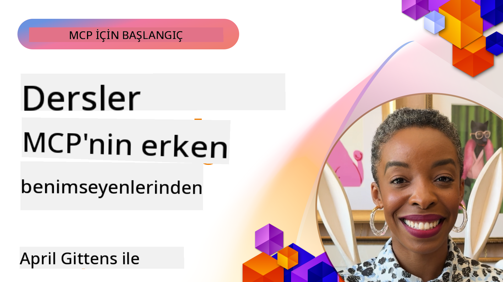

<!--
CO_OP_TRANSLATOR_METADATA:
{
  "original_hash": "41f16dac486d2086a53bc644a01cbe42",
  "translation_date": "2025-08-18T17:46:10+00:00",
  "source_file": "07-LessonsfromEarlyAdoption/README.md",
  "language_code": "tr"
}
-->
# 🌟 Erken Benimseyenlerden Dersler

[](https://youtu.be/jds7dSmNptE)

_(Bu dersin videosunu izlemek için yukarıdaki görsele tıklayın)_

## 🎯 Bu Modül Neleri Kapsıyor?

Bu modül, gerçek organizasyonların ve geliştiricilerin Model Context Protocol (MCP)'yi nasıl kullanarak gerçek zorlukları çözdüğünü ve yenilikleri nasıl yönlendirdiğini inceliyor. Ayrıntılı vaka çalışmaları ve uygulamalı projelerle MCP'nin dil modellerini, araçları ve kurumsal verileri güvenli ve ölçeklenebilir bir şekilde entegre ederek nasıl birleştirdiğini keşfedeceksiniz.

### 📚 MCP'yi İş Başında Görün

Bu ilkeleri üretime hazır araçlarda uygulandığını görmek ister misiniz? Bugün kullanabileceğiniz gerçek Microsoft MCP sunucularını sergileyen [**Geliştirici Verimliliğini Dönüştüren 10 Microsoft MCP Sunucusu**](microsoft-mcp-servers.md) rehberimize göz atın.

## Genel Bakış

Bu ders, erken benimseyenlerin Model Context Protocol (MCP)'yi kullanarak gerçek dünya zorluklarını nasıl çözdüğünü ve endüstrilerde yenilikleri nasıl yönlendirdiğini inceliyor. Ayrıntılı vaka çalışmaları ve uygulamalı projelerle MCP'nin büyük dil modellerini, araçları ve kurumsal verileri standartlaştırılmış, güvenli ve ölçeklenebilir bir çerçevede nasıl birleştirdiğini göreceksiniz. MCP tabanlı çözümler tasarlama ve oluşturma konusunda pratik deneyim kazanacak, kanıtlanmış uygulama modellerinden öğrenecek ve MCP'yi üretim ortamlarında dağıtmak için en iyi uygulamaları keşfedeceksiniz. Ders ayrıca ortaya çıkan trendleri, gelecekteki yönleri ve MCP teknolojisinin ve gelişen ekosisteminin ön saflarında kalmanıza yardımcı olacak açık kaynak kaynaklarını vurguluyor.

## Öğrenme Hedefleri

- Farklı endüstrilerdeki gerçek MCP uygulamalarını analiz edin  
- Tam MCP tabanlı uygulamalar tasarlayın ve oluşturun  
- MCP teknolojisindeki ortaya çıkan trendleri ve gelecekteki yönleri keşfedin  
- Gerçek geliştirme senaryolarında en iyi uygulamaları uygulayın  

## Gerçek Dünya MCP Uygulamaları

### Vaka Çalışması 1: Kurumsal Müşteri Destek Otomasyonu

Bir çok uluslu şirket, müşteri destek sistemleri arasında AI etkileşimlerini standartlaştırmak için MCP tabanlı bir çözüm uyguladı. Bu çözüm sayesinde:  

- Birden fazla LLM sağlayıcısı için birleşik bir arayüz oluşturuldu  
- Departmanlar arasında tutarlı prompt yönetimi sağlandı  
- Güçlü güvenlik ve uyumluluk kontrolleri uygulandı  
- Belirli ihtiyaçlara göre farklı AI modelleri arasında kolay geçiş sağlandı  

**Teknik Uygulama:**  

```python
# Python MCP server implementation for customer support
import logging
import asyncio
from modelcontextprotocol import create_server, ServerConfig
from modelcontextprotocol.server import MCPServer
from modelcontextprotocol.transports import create_http_transport
from modelcontextprotocol.resources import ResourceDefinition
from modelcontextprotocol.prompts import PromptDefinition
from modelcontextprotocol.tool import ToolDefinition

# Configure logging
logging.basicConfig(level=logging.INFO)

async def main():
    # Create server configuration
    config = ServerConfig(
        name="Enterprise Customer Support Server",
        version="1.0.0",
        description="MCP server for handling customer support inquiries"
    )
    
    # Initialize MCP server
    server = create_server(config)
    
    # Register knowledge base resources
    server.resources.register(
        ResourceDefinition(
            name="customer_kb",
            description="Customer knowledge base documentation"
        ),
        lambda params: get_customer_documentation(params)
    )
    
    # Register prompt templates
    server.prompts.register(
        PromptDefinition(
            name="support_template",
            description="Templates for customer support responses"
        ),
        lambda params: get_support_templates(params)
    )
    
    # Register support tools
    server.tools.register(
        ToolDefinition(
            name="ticketing",
            description="Create and update support tickets"
        ),
        handle_ticketing_operations
    )
    
    # Start server with HTTP transport
    transport = create_http_transport(port=8080)
    await server.run(transport)

if __name__ == "__main__":
    asyncio.run(main())
```  

**Sonuçlar:** Model maliyetlerinde %30 azalma, yanıt tutarlılığında %45 iyileşme ve küresel operasyonlarda artırılmış uyumluluk.  

### Vaka Çalışması 2: Sağlık Tanı Asistanı

Bir sağlık hizmeti sağlayıcısı, hassas hasta verilerini korurken birden fazla özel tıbbi AI modelini entegre etmek için bir MCP altyapısı geliştirdi:  

- Genel ve uzman tıbbi modeller arasında sorunsuz geçiş  
- Katı gizlilik kontrolleri ve denetim izleri  
- Mevcut Elektronik Sağlık Kaydı (EHR) sistemleriyle entegrasyon  
- Tıbbi terminoloji için tutarlı prompt mühendisliği  

**Teknik Uygulama:**  

```csharp
// C# MCP host application implementation in healthcare application
using Microsoft.Extensions.DependencyInjection;
using ModelContextProtocol.SDK.Client;
using ModelContextProtocol.SDK.Security;
using ModelContextProtocol.SDK.Resources;

public class DiagnosticAssistant
{
    private readonly MCPHostClient _mcpClient;
    private readonly PatientContext _patientContext;
    
    public DiagnosticAssistant(PatientContext patientContext)
    {
        _patientContext = patientContext;
        
        // Configure MCP client with healthcare-specific settings
        var clientOptions = new ClientOptions
        {
            Name = "Healthcare Diagnostic Assistant",
            Version = "1.0.0",
            Security = new SecurityOptions
            {
                Encryption = EncryptionLevel.Medical,
                AuditEnabled = true
            }
        };
        
        _mcpClient = new MCPHostClientBuilder()
            .WithOptions(clientOptions)
            .WithTransport(new HttpTransport("https://healthcare-mcp.example.org"))
            .WithAuthentication(new HIPAACompliantAuthProvider())
            .Build();
    }
    
    public async Task<DiagnosticSuggestion> GetDiagnosticAssistance(
        string symptoms, string patientHistory)
    {
        // Create request with appropriate resources and tool access
        var resourceRequest = new ResourceRequest
        {
            Name = "patient_records",
            Parameters = new Dictionary<string, object>
            {
                ["patientId"] = _patientContext.PatientId,
                ["requestingProvider"] = _patientContext.ProviderId
            }
        };
        
        // Request diagnostic assistance using appropriate prompt
        var response = await _mcpClient.SendPromptRequestAsync(
            promptName: "diagnostic_assistance",
            parameters: new Dictionary<string, object>
            {
                ["symptoms"] = symptoms,
                patientHistory = patientHistory,
                relevantGuidelines = _patientContext.GetRelevantGuidelines()
            });
            
        return DiagnosticSuggestion.FromMCPResponse(response);
    }
}
```  

**Sonuçlar:** Hekimler için iyileştirilmiş tanı önerileri, tam HIPAA uyumluluğu ve sistemler arası bağlam geçişinde önemli azalma.  

### Vaka Çalışması 3: Finansal Hizmetler Risk Analizi

Bir finans kurumu, farklı departmanlar arasında risk analizi süreçlerini standartlaştırmak için MCP'yi uyguladı:  

- Kredi riski, dolandırıcılık tespiti ve yatırım risk modelleri için birleşik bir arayüz oluşturuldu  
- Katı erişim kontrolleri ve model sürümleme uygulandı  
- Tüm AI önerilerinin denetlenebilirliği sağlandı  
- Çeşitli sistemler arasında tutarlı veri formatlama korundu  

**Teknik Uygulama:**  

```java
// Java MCP server for financial risk assessment
import org.mcp.server.*;
import org.mcp.security.*;

public class FinancialRiskMCPServer {
    public static void main(String[] args) {
        // Create MCP server with financial compliance features
        MCPServer server = new MCPServerBuilder()
            .withModelProviders(
                new ModelProvider("risk-assessment-primary", new AzureOpenAIProvider()),
                new ModelProvider("risk-assessment-audit", new LocalLlamaProvider())
            )
            .withPromptTemplateDirectory("./compliance/templates")
            .withAccessControls(new SOCCompliantAccessControl())
            .withDataEncryption(EncryptionStandard.FINANCIAL_GRADE)
            .withVersionControl(true)
            .withAuditLogging(new DatabaseAuditLogger())
            .build();
            
        server.addRequestValidator(new FinancialDataValidator());
        server.addResponseFilter(new PII_RedactionFilter());
        
        server.start(9000);
        
        System.out.println("Financial Risk MCP Server running on port 9000");
    }
}
```  

**Sonuçlar:** Artırılmış düzenleyici uyumluluk, model dağıtım döngülerinde %40 hızlanma ve departmanlar arasında iyileştirilmiş risk değerlendirme tutarlılığı.  

### Vaka Çalışması 4: Microsoft Playwright MCP Sunucusu ile Tarayıcı Otomasyonu

Microsoft, Model Context Protocol aracılığıyla güvenli, standartlaştırılmış tarayıcı otomasyonu sağlamak için [Playwright MCP sunucusunu](https://github.com/microsoft/playwright-mcp) geliştirdi. Bu üretime hazır sunucu, AI ajanlarının ve LLM'lerin web tarayıcılarıyla kontrollü, denetlenebilir ve genişletilebilir bir şekilde etkileşim kurmasını sağlar—otomatik web testi, veri çıkarma ve uçtan uca iş akışları gibi kullanım senaryolarını mümkün kılar.  

> **🎯 Üretime Hazır Araç**  
>  
> Bu vaka çalışması, bugün kullanabileceğiniz gerçek bir MCP sunucusunu sergiliyor! Playwright MCP Sunucusu ve diğer 9 üretime hazır Microsoft MCP sunucusu hakkında daha fazla bilgi edinin: [**Microsoft MCP Sunucuları Rehberi**](microsoft-mcp-servers.md#8--playwright-mcp-server).  

**Ana Özellikler:**  
- Tarayıcı otomasyon yeteneklerini (navigasyon, form doldurma, ekran görüntüsü alma vb.) MCP araçları olarak sunar  
- Yetkisiz işlemleri önlemek için katı erişim kontrolleri ve sandboxing uygular  
- Tüm tarayıcı etkileşimleri için ayrıntılı denetim günlükleri sağlar  
- Azure OpenAI ve diğer LLM sağlayıcıları ile entegrasyonu destekler  
- GitHub Copilot'un Kodlama Ajanı'na web tarama yetenekleri sağlar  

**Teknik Uygulama:**  

```typescript
// TypeScript: Registering Playwright browser automation tools in an MCP server
import { createServer, ToolDefinition } from 'modelcontextprotocol';
import { launch } from 'playwright';

const server = createServer({
  name: 'Playwright MCP Server',
  version: '1.0.0',
  description: 'MCP server for browser automation using Playwright'
});

// Register a tool for navigating to a URL and capturing a screenshot
server.tools.register(
  new ToolDefinition({
    name: 'navigate_and_screenshot',
    description: 'Navigate to a URL and capture a screenshot',
    parameters: {
      url: { type: 'string', description: 'The URL to visit' }
    }
  }),
  async ({ url }) => {
    const browser = await launch();
    const page = await browser.newPage();
    await page.goto(url);
    const screenshot = await page.screenshot();
    await browser.close();
    return { screenshot };
  }
);

// Start the MCP server
server.listen(8080);
```  

**Sonuçlar:**  
- AI ajanları ve LLM'ler için güvenli, programlanabilir tarayıcı otomasyonu sağlandı  
- Web uygulamaları için manuel test çabası azaltıldı ve test kapsamı iyileştirildi  
- Kurumsal ortamlarda tarayıcı tabanlı araç entegrasyonu için yeniden kullanılabilir, genişletilebilir bir çerçeve sağlandı  
- GitHub Copilot'un web tarama yeteneklerini güçlendirdi  

**Referanslar:**  
- [Playwright MCP Sunucusu GitHub Deposu](https://github.com/microsoft/playwright-mcp)  
- [Microsoft AI ve Otomasyon Çözümleri](https://azure.microsoft.com/en-us/products/ai-services/)  

### Vaka Çalışması 5: Azure MCP – Kurumsal Düzeyde Model Context Protocol Hizmeti

Azure MCP Sunucusu ([https://aka.ms/azmcp](https://aka.ms/azmcp)), Microsoft’un Model Context Protocol’ün yönetilen, kurumsal düzeydeki uygulamasıdır. Bu hizmet, ölçeklenebilir, güvenli ve uyumlu MCP sunucu yeteneklerini bir bulut hizmeti olarak sunar. Azure MCP, organizasyonların MCP sunucularını hızla dağıtmasını, yönetmesini ve Azure AI, veri ve güvenlik hizmetleriyle entegre etmesini sağlar, operasyonel yükü azaltır ve AI benimsemesini hızlandırır.  

> **🎯 Üretime Hazır Araç**  
>  
> Bu, bugün kullanabileceğiniz gerçek bir MCP sunucusudur! Azure AI Foundry MCP Sunucusu hakkında daha fazla bilgi edinin: [**Microsoft MCP Sunucuları Rehberi**](microsoft-mcp-servers.md).  

- Yerleşik ölçeklendirme, izleme ve güvenlik ile tamamen yönetilen MCP sunucu barındırma  
- Azure OpenAI, Azure AI Search ve diğer Azure hizmetleri ile yerel entegrasyon  
- Microsoft Entra ID aracılığıyla kurumsal kimlik doğrulama ve yetkilendirme  
- Özel araçlar, prompt şablonları ve kaynak bağlayıcıları desteği  
- Kurumsal güvenlik ve düzenleyici gerekliliklere uyum  

**Teknik Uygulama:**  

```yaml
# Example: Azure MCP server deployment configuration (YAML)
apiVersion: mcp.microsoft.com/v1
kind: McpServer
metadata:
  name: enterprise-mcp-server
spec:
  modelProviders:
    - name: azure-openai
      type: AzureOpenAI
      endpoint: https://<your-openai-resource>.openai.azure.com/
      apiKeySecret: <your-azure-keyvault-secret>
  tools:
    - name: document_search
      type: AzureAISearch
      endpoint: https://<your-search-resource>.search.windows.net/
      apiKeySecret: <your-azure-keyvault-secret>
  authentication:
    type: EntraID
    tenantId: <your-tenant-id>
  monitoring:
    enabled: true
    logAnalyticsWorkspace: <your-log-analytics-id>
```  

**Sonuçlar:**  
- Kurumsal AI projeleri için hazır, uyumlu MCP sunucu platformu ile değer elde etme süresi azaltıldı  
- LLM'lerin, araçların ve kurumsal veri kaynaklarının entegrasyonu basitleştirildi  
- MCP iş yükleri için artırılmış güvenlik, gözlemlenebilirlik ve operasyonel verimlilik  
- Azure SDK en iyi uygulamaları ve güncel kimlik doğrulama modelleri ile kod kalitesi iyileştirildi  

**Referanslar:**  
- [Azure MCP Belgeleri](https://aka.ms/azmcp)  
- [Azure MCP Sunucusu GitHub Deposu](https://github.com/Azure/azure-mcp)  
- [Azure AI Hizmetleri](https://azure.microsoft.com/en-us/products/ai-services/)  
- [Microsoft MCP Merkezi](https://mcp.azure.com)  

### Vaka Çalışması 6: NLWeb

MCP (Model Context Protocol), Chatbotlar ve AI asistanlarının araçlarla etkileşim kurmasını sağlayan yeni bir protokoldür. Her NLWeb örneği aynı zamanda bir MCP sunucusudur ve bir web sitesine doğal dilde bir soru sormak için kullanılan bir temel yöntem olan "ask" yöntemini destekler. Döndürülen yanıt, web verilerini tanımlamak için yaygın olarak kullanılan bir sözlük olan schema.org'u kullanır. Kabaca konuşursak, MCP, NLWeb'in Http'nin HTML'ye olduğu gibidir. NLWeb, protokolleri, Schema.org formatlarını ve örnek kodları birleştirerek sitelerin bu uç noktaları hızla oluşturmasına yardımcı olur ve hem insanlar için konuşma arayüzleri hem de makineler için doğal ajan-ajan etkileşimi sağlar.  

NLWeb'in iki farklı bileşeni vardır:  
- Bir siteyle doğal dilde arayüz oluşturmak için çok basit bir protokol ve döndürülen yanıt için json ve schema.org'u kullanan bir format. REST API belgelerine daha fazla bilgi için bakın.  
- (1)'in mevcut işaretlemeyi kullanan basit bir uygulaması, ürünler, tarifler, cazibe merkezleri, incelemeler vb. öğeler listesi olarak soyutlanabilen siteler için. Kullanıcı arayüzü widget'ları ile birlikte, siteler içeriklerine kolayca konuşma arayüzleri sağlayabilir. Bir sohbet sorgusunun yaşam döngüsü hakkında daha fazla bilgi için belgeleri inceleyin.  

**Referanslar:**  
- [Azure MCP Belgeleri](https://aka.ms/azmcp)  
- [NLWeb](https://github.com/microsoft/NlWeb)  

### Vaka Çalışması 7: Azure AI Foundry MCP Sunucusu – Kurumsal AI Ajanı Entegrasyonu

Azure AI Foundry MCP sunucuları, MCP'nin kurumsal ortamlarda AI ajanlarını ve iş akışlarını düzenlemek ve yönetmek için nasıl kullanılabileceğini gösterir. MCP'yi Azure AI Foundry ile entegre ederek, organizasyonlar ajan etkileşimlerini standartlaştırabilir, Foundry'nin iş akışı yönetiminden yararlanabilir ve güvenli, ölçeklenebilir dağıtımları garanti edebilir.  

> **🎯 Üretime Hazır Araç**  
>  
> Bu, bugün kullanabileceğiniz gerçek bir MCP sunucusudur! Azure AI Foundry MCP Sunucusu hakkında daha fazla bilgi edinin: [**Microsoft MCP Sunucuları Rehberi**](microsoft-mcp-servers.md#9--azure-ai-foundry-mcp-server).  

**Ana Özellikler:**  
- Azure'un AI ekosistemine, model kataloglarına ve dağıtım yönetimine kapsamlı erişim  
- RAG uygulamaları için Azure AI Search ile bilgi indeksleme  
- AI model performansı ve kalite güvencesi için değerlendirme araçları  
- Azure AI Foundry Catalog ve Labs ile ileri araştırma modelleri entegrasyonu  
- Üretim senaryoları için ajan yönetimi ve değerlendirme yetenekleri  

**Sonuçlar:**  
- AI ajan iş akışlarının hızlı prototiplenmesi ve sağlam izlenmesi  
- Gelişmiş senaryolar için Azure AI hizmetleri ile sorunsuz entegrasyon  
- Ajan boru hatlarını oluşturmak, dağıtmak ve izlemek için birleşik bir arayüz  
- Kurumsal güvenlik, uyumluluk ve operasyonel verimlilikte iyileşme  
- Karmaşık ajan odaklı süreçler üzerinde kontrol sağlarken AI benimsemesini hızlandırma  

**Referanslar:**  
- [Azure AI Foundry MCP Sunucusu GitHub Deposu](https://github.com/azure-ai-foundry/mcp-foundry)  
- [Azure AI Ajanlarını MCP ile Entegre Etme (Microsoft Foundry Blog)](https://devblogs.microsoft.com/foundry/integrating-azure-ai-agents-mcp/)  

### Vaka Çalışması 8: Foundry MCP Playground – Deney ve Prototipleme

Foundry MCP Playground, MCP sunucuları ve Azure AI Foundry entegrasyonları ile deney yapmak için hazır bir ortam sunar. Geliştiriciler, Azure AI Foundry Catalog ve Labs'tan kaynaklar kullanarak AI modelleri ve ajan iş akışlarını hızla prototipleme, test etme ve değerlendirme yapabilir. Playground, kurulum sürecini basitleştirir, örnek projeler sağlar ve işbirlikçi geliştirmeyi destekler, en iyi uygulamaları ve yeni senaryoları keşfetmeyi kolaylaştırır. Karmaşık altyapıya ihtiyaç duymadan fikirleri doğrulamak, deneyleri paylaşmak ve öğrenmeyi hızlandırmak isteyen ekipler için özellikle kullanışlıdır. Playground, MCP ve Azure AI Foundry ekosisteminde yenilik ve topluluk katkılarını teşvik ederek giriş engelini düşürür.  

**Referanslar:**  
- [Foundry MCP Playground GitHub Deposu](https://github.com/azure-ai-foundry/foundry-mcp-playground)  

### Vaka Çalışması 9: Microsoft Learn Docs MCP Sunucusu – AI Destekli Dokümantasyon Erişimi

Microsoft Learn Docs MCP Sunucusu, Model Context Protocol aracılığıyla AI asistanlarına resmi Microsoft dokümantasyonuna gerçek zamanlı erişim sağlayan bulut barındırmalı bir hizmettir. Bu üretime hazır sunucu, kapsamlı Microsoft Learn ekosistemine bağlanır ve tüm resmi Microsoft kaynakları arasında anlamsal arama sağlar.
> **🎯 Üretime Hazır Araç**
> 
> Bugün kullanabileceğiniz gerçek bir MCP sunucusu! Microsoft Learn Docs MCP Sunucusu hakkında daha fazla bilgi için [**Microsoft MCP Sunucuları Kılavuzu**](microsoft-mcp-servers.md#1--microsoft-learn-docs-mcp-server) bölümüne göz atın.
**Anahtar Özellikler:**
- Microsoft'un resmi belgelerine, Azure dokümanlarına ve Microsoft 365 belgelerine gerçek zamanlı erişim
- Bağlam ve niyeti anlayan gelişmiş anlamsal arama yetenekleri
- Microsoft Learn içeriği yayınlandıkça her zaman güncel bilgi
- Microsoft Learn, Azure belgeleri ve Microsoft 365 kaynakları arasında kapsamlı içerik
- Makale başlıkları ve URL'leri ile birlikte en fazla 10 yüksek kaliteli içerik parçası döndürür

**Neden Kritik:**
- Microsoft teknolojileri için "güncel olmayan AI bilgisi" sorununu çözer
- AI asistanlarının en son .NET, C#, Azure ve Microsoft 365 özelliklerine erişmesini sağlar
- Doğru kod üretimi için otoriter, birinci taraf bilgi sunar
- Hızla gelişen Microsoft teknolojileriyle çalışan geliştiriciler için vazgeçilmezdir

**Sonuçlar:**
- Microsoft teknolojileri için AI tarafından üretilen kodun doğruluğunda büyük bir iyileşme
- Güncel belgeleri ve en iyi uygulamaları aramak için harcanan sürede azalma
- IDE'den çıkmadan bağlama duyarlı belge erişimi ile geliştirici verimliliğinde artış

**Referanslar:**
- [Microsoft Learn Docs MCP Server GitHub Deposu](https://github.com/MicrosoftDocs/mcp)
- [Microsoft Learn Belgeleri](https://learn.microsoft.com/)

## Uygulamalı Projeler

### Proje 1: Çoklu Sağlayıcı MCP Sunucusu Oluşturma

**Amaç:** Belirli kriterlere göre istekleri birden fazla AI model sağlayıcısına yönlendirebilen bir MCP sunucusu oluşturun.

**Gereksinimler:**

- En az üç farklı model sağlayıcısını destekleyin (ör. OpenAI, Anthropic, yerel modeller)
- İstek metadatasına dayalı bir yönlendirme mekanizması uygulayın
- Sağlayıcı kimlik bilgilerini yönetmek için bir yapılandırma sistemi oluşturun
- Performansı ve maliyetleri optimize etmek için önbellekleme ekleyin
- Kullanımı izlemek için basit bir kontrol paneli oluşturun

**Uygulama Adımları:**

1. Temel MCP sunucu altyapısını kurun
2. Her bir AI model hizmeti için sağlayıcı adaptörlerini uygulayın
3. İstek özelliklerine dayalı yönlendirme mantığını oluşturun
4. Sık yapılan istekler için önbellekleme mekanizmaları ekleyin
5. İzleme kontrol panelini geliştirin
6. Çeşitli istek desenleriyle test edin

**Teknolojiler:** Python (.NET/Java/Python tercihinize bağlı olarak), Redis önbellekleme için ve kontrol paneli için basit bir web çerçevesi seçin.

### Proje 2: Kurumsal Prompt Yönetim Sistemi

**Amaç:** Prompt şablonlarını bir organizasyon genelinde yönetmek, sürümlemek ve dağıtmak için MCP tabanlı bir sistem geliştirin.

**Gereksinimler:**

- Prompt şablonları için merkezi bir depo oluşturun
- Sürümleme ve onay iş akışlarını uygulayın
- Örnek girdilerle şablon test etme yetenekleri geliştirin
- Rol tabanlı erişim kontrolleri oluşturun
- Şablon alma ve dağıtım için bir API oluşturun

**Uygulama Adımları:**

1. Şablon depolama için veritabanı şemasını tasarlayın
2. Şablon CRUD işlemleri için temel API'yi oluşturun
3. Sürümleme sistemini uygulayın
4. Onay iş akışını geliştirin
5. Test çerçevesini oluşturun
6. Yönetim için basit bir web arayüzü oluşturun
7. MCP sunucusuyla entegre edin

**Teknolojiler:** Tercih ettiğiniz backend çerçevesi, SQL veya NoSQL veritabanı ve yönetim arayüzü için bir frontend çerçevesi seçin.

### Proje 3: MCP Tabanlı İçerik Üretim Platformu

**Amaç:** MCP'yi kullanarak farklı içerik türlerinde tutarlı sonuçlar sağlayan bir içerik üretim platformu oluşturun.

**Gereksinimler:**

- Birden fazla içerik formatını destekleyin (blog yazıları, sosyal medya, pazarlama metni)
- Özelleştirme seçenekleriyle şablon tabanlı üretim uygulayın
- İçerik inceleme ve geri bildirim sistemi oluşturun
- İçerik performans metriklerini takip edin
- İçerik sürümleme ve yinelemeyi destekleyin

**Uygulama Adımları:**

1. MCP istemci altyapısını kurun
2. Farklı içerik türleri için şablonlar oluşturun
3. İçerik üretim hattını oluşturun
4. İnceleme sistemini uygulayın
5. Metrik takip sistemini geliştirin
6. Şablon yönetimi ve içerik üretimi için bir kullanıcı arayüzü oluşturun

**Teknolojiler:** Tercih ettiğiniz programlama dili, web çerçevesi ve veritabanı sistemi.

## MCP Teknolojisi için Gelecek Yönelimler

### Ortaya Çıkan Trendler

1. **Çok Modlu MCP**
   - MCP'nin görüntü, ses ve video modelleriyle etkileşimleri standartlaştıracak şekilde genişletilmesi
   - Çapraz modlu akıl yürütme yeteneklerinin geliştirilmesi
   - Farklı modlar için standartlaştırılmış prompt formatları

2. **Federasyonlu MCP Altyapısı**
   - Organizasyonlar arasında kaynak paylaşımı yapabilen dağıtılmış MCP ağları
   - Güvenli model paylaşımı için standartlaştırılmış protokoller
   - Gizliliği koruyan hesaplama teknikleri

3. **MCP Pazar Yerleri**
   - MCP şablonları ve eklentileri paylaşmak ve ticarileştirmek için ekosistemler
   - Kalite güvencesi ve sertifikasyon süreçleri
   - Model pazar yerleriyle entegrasyon

4. **Edge Computing için MCP**
   - Kaynak kısıtlı edge cihazlar için MCP standartlarının uyarlanması
   - Düşük bant genişliği ortamları için optimize edilmiş protokoller
   - IoT ekosistemleri için özel MCP uygulamaları

5. **Düzenleyici Çerçeveler**
   - Düzenleyici uyumluluk için MCP uzantılarının geliştirilmesi
   - Standartlaştırılmış denetim izleri ve açıklanabilirlik arayüzleri
   - Gelişmekte olan AI yönetim çerçeveleriyle entegrasyon

### Microsoft'tan MCP Çözümleri

Microsoft ve Azure, çeşitli senaryolarda MCP'yi uygulamak için geliştiricilere yardımcı olan birkaç açık kaynak deposu geliştirdi:

#### Microsoft Organizasyonu

1. [playwright-mcp](https://github.com/microsoft/playwright-mcp) - Tarayıcı otomasyonu ve test için bir Playwright MCP sunucusu
2. [files-mcp-server](https://github.com/microsoft/files-mcp-server) - Yerel test ve topluluk katkısı için bir OneDrive MCP sunucusu uygulaması
3. [NLWeb](https://github.com/microsoft/NlWeb) - AI Web için temel bir katman oluşturmayı hedefleyen açık protokoller ve açık kaynak araçlar koleksiyonu

#### Azure-Samples Organizasyonu

1. [mcp](https://github.com/Azure-Samples/mcp) - Azure'da MCP sunucuları oluşturmak ve entegre etmek için örnekler, araçlar ve kaynaklar
2. [mcp-auth-servers](https://github.com/Azure-Samples/mcp-auth-servers) - Mevcut Model Context Protocol spesifikasyonu ile kimlik doğrulama gösteren referans MCP sunucuları
3. [remote-mcp-functions](https://github.com/Azure-Samples/remote-mcp-functions) - Azure Functions'da özel uzak MCP sunucuları oluşturmak ve dağıtmak için hızlı başlangıç şablonları
4. [remote-mcp-functions-python](https://github.com/Azure-Samples/remote-mcp-functions-python) - Python kullanarak Azure Functions'da özel uzak MCP sunucuları oluşturmak ve dağıtmak için hızlı başlangıç şablonu
5. [remote-mcp-functions-dotnet](https://github.com/Azure-Samples/remote-mcp-functions-dotnet) - .NET/C# kullanarak Azure Functions'da özel uzak MCP sunucuları oluşturmak ve dağıtmak için hızlı başlangıç şablonu
6. [remote-mcp-functions-typescript](https://github.com/Azure-Samples/remote-mcp-functions-typescript) - TypeScript kullanarak Azure Functions'da özel uzak MCP sunucuları oluşturmak ve dağıtmak için hızlı başlangıç şablonu
7. [remote-mcp-apim-functions-python](https://github.com/Azure-Samples/remote-mcp-apim-functions-python) - Python kullanarak Azure API Management ile Uzak MCP sunucularına AI Gateway entegrasyonu
8. [AI-Gateway](https://github.com/Azure-Samples/AI-Gateway) - Azure OpenAI ve AI Foundry ile entegrasyon dahil MCP yeteneklerini içeren APIM ❤️ AI deneyleri

Bu depolar, Model Context Protocol ile çalışmak için farklı programlama dilleri ve Azure hizmetleri arasında çeşitli uygulamalar, şablonlar ve kaynaklar sağlar. Temel sunucu uygulamalarından kimlik doğrulama, bulut dağıtımı ve kurumsal entegrasyon senaryolarına kadar bir dizi kullanım durumunu kapsar.

#### MCP Kaynaklar Dizini

Resmi Microsoft MCP deposundaki [MCP Kaynaklar dizini](https://github.com/microsoft/mcp/tree/main/Resources), Model Context Protocol sunucularıyla kullanılmak üzere örnek kaynaklar, prompt şablonları ve araç tanımları içeren küratörlü bir koleksiyon sunar. Bu dizin, geliştiricilerin MCP ile hızlı bir şekilde başlamasına yardımcı olmak için yeniden kullanılabilir yapı taşları ve en iyi uygulama örnekleri sunar:

- **Prompt Şablonları:** Yaygın AI görevleri ve senaryoları için kullanıma hazır prompt şablonları, kendi MCP sunucu uygulamalarınıza uyarlanabilir.
- **Araç Tanımları:** Farklı MCP sunucuları arasında araç entegrasyonu ve çağrısını standartlaştırmak için örnek araç şemaları ve metadatalar.
- **Kaynak Örnekleri:** MCP çerçevesi içinde veri kaynaklarına, API'lere ve harici hizmetlere bağlanmak için örnek kaynak tanımları.
- **Referans Uygulamalar:** Gerçek dünya MCP projelerinde kaynakları, promptları ve araçları nasıl yapılandıracağınızı ve organize edeceğinizi gösteren pratik örnekler.

Bu kaynaklar, geliştirmeyi hızlandırır, standardizasyonu teşvik eder ve MCP tabanlı çözümler oluştururken en iyi uygulamaları sağlamaya yardımcı olur.

#### MCP Kaynaklar Dizini

- [MCP Kaynaklar (Örnek Promptlar, Araçlar ve Kaynak Tanımları)](https://github.com/microsoft/mcp/tree/main/Resources)

### Araştırma Fırsatları

- MCP çerçeveleri içinde verimli prompt optimizasyon teknikleri
- Çok kiracılı MCP dağıtımları için güvenlik modelleri
- Farklı MCP uygulamaları arasında performans karşılaştırmaları
- MCP sunucuları için resmi doğrulama yöntemleri

## Sonuç

Model Context Protocol (MCP), endüstriler arasında standartlaştırılmış, güvenli ve birlikte çalışabilir AI entegrasyonunun geleceğini hızla şekillendiriyor. Bu dersteki vaka çalışmaları ve uygulamalı projeler aracılığıyla, Microsoft ve Azure gibi erken benimseyenlerin MCP'yi gerçek dünya zorluklarını çözmek, AI benimsemesini hızlandırmak ve uyumluluk, güvenlik ve ölçeklenebilirlik sağlamak için nasıl kullandığını gördünüz. MCP'nin modüler yaklaşımı, büyük dil modellerini, araçları ve kurumsal verileri birleşik, denetlenebilir bir çerçevede bağlamayı mümkün kılar. MCP gelişmeye devam ettikçe, toplulukla etkileşimde bulunmak, açık kaynak kaynaklarını keşfetmek ve en iyi uygulamaları uygulamak, sağlam ve geleceğe hazır AI çözümleri oluşturmanın anahtarı olacaktır.

## Ek Kaynaklar

- [MCP Foundry GitHub Deposu](https://github.com/azure-ai-foundry/mcp-foundry)
- [Foundry MCP Playground](https://github.com/azure-ai-foundry/foundry-mcp-playground)
- [Azure AI Agentlerini MCP ile Entegre Etme (Microsoft Foundry Blog)](https://devblogs.microsoft.com/foundry/integrating-azure-ai-agents-mcp/)
- [MCP GitHub Deposu (Microsoft)](https://github.com/microsoft/mcp)
- [MCP Kaynaklar Dizini (Örnek Promptlar, Araçlar ve Kaynak Tanımları)](https://github.com/microsoft/mcp/tree/main/Resources)
- [MCP Topluluğu ve Belgeler](https://modelcontextprotocol.io/introduction)
- [Azure MCP Belgeleri](https://aka.ms/azmcp)
- [Playwright MCP Sunucusu GitHub Deposu](https://github.com/microsoft/playwright-mcp)
- [Files MCP Sunucusu (OneDrive)](https://github.com/microsoft/files-mcp-server)
- [Azure-Samples MCP](https://github.com/Azure-Samples/mcp)
- [MCP Auth Sunucuları (Azure-Samples)](https://github.com/Azure-Samples/mcp-auth-servers)
- [Uzak MCP Fonksiyonları (Azure-Samples)](https://github.com/Azure-Samples/remote-mcp-functions)
- [Uzak MCP Fonksiyonları Python (Azure-Samples)](https://github.com/Azure-Samples/remote-mcp-functions-python)
- [Uzak MCP Fonksiyonları .NET (Azure-Samples)](https://github.com/Azure-Samples/remote-mcp-functions-dotnet)
- [Uzak MCP Fonksiyonları TypeScript (Azure-Samples)](https://github.com/Azure-Samples/remote-mcp-functions-typescript)
- [Uzak MCP APIM Fonksiyonları Python (Azure-Samples)](https://github.com/Azure-Samples/remote-mcp-apim-functions-python)
- [AI-Gateway (Azure-Samples)](https://github.com/Azure-Samples/AI-Gateway)
- [Microsoft AI ve Otomasyon Çözümleri](https://azure.microsoft.com/en-us/products/ai-services/)

## Alıştırmalar

1. Vaka çalışmalarından birini analiz edin ve alternatif bir uygulama yaklaşımı önerin.
2. Proje fikirlerinden birini seçin ve ayrıntılı bir teknik spesifikasyon oluşturun.
3. Vaka çalışmalarında ele alınmayan bir sektörü araştırın ve MCP'nin bu sektörün özel zorluklarını nasıl çözebileceğini açıklayın.
4. Gelecek yönelimlerden birini keşfedin ve bunu desteklemek için yeni bir MCP uzantısı konsepti oluşturun.

Sonraki: [Microsoft MCP Sunucusu](../07-LessonsfromEarlyAdoption/microsoft-mcp-servers.md)

**Feragatname**:  
Bu belge, AI çeviri hizmeti [Co-op Translator](https://github.com/Azure/co-op-translator) kullanılarak çevrilmiştir. Doğruluk için çaba göstersek de, otomatik çevirilerin hata veya yanlışlıklar içerebileceğini lütfen unutmayın. Orijinal belgenin kendi dilindeki hali yetkili kaynak olarak kabul edilmelidir. Kritik bilgiler için profesyonel insan çevirisi önerilir. Bu çevirinin kullanımından kaynaklanan herhangi bir yanlış anlama veya yanlış yorumlama durumunda sorumluluk kabul edilmez.