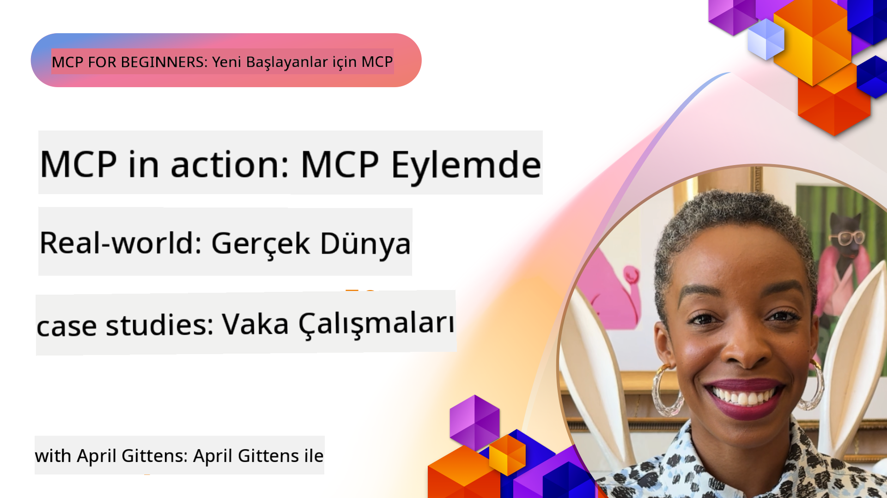

<!--
CO_OP_TRANSLATOR_METADATA:
{
  "original_hash": "1611dc5f6a2a35a789fc4c95fc5bfbe8",
  "translation_date": "2025-09-26T18:24:01+00:00",
  "source_file": "09-CaseStudy/README.md",
  "language_code": "tr"
}
-->
# MCP Eylemde: Gerçek Dünya Örnekleri

_(Bu dersin videosunu izlemek için yukarıdaki görsele tıklayın)_

Model Context Protocol (MCP), yapay zeka uygulamalarının veri, araçlar ve hizmetlerle etkileşim biçimini dönüştürüyor. Bu bölüm, MCP'nin çeşitli kurumsal senaryolardaki pratik uygulamalarını gösteren gerçek dünya örneklerini sunuyor.

## Genel Bakış

Bu bölüm, MCP uygulamalarının somut örneklerini sergileyerek, organizasyonların bu protokolü karmaşık iş zorluklarını çözmek için nasıl kullandığını vurguluyor. Bu örnekleri inceleyerek MCP'nin gerçek dünya senaryolarındaki çok yönlülüğü, ölçeklenebilirliği ve pratik faydaları hakkında fikir sahibi olacaksınız.

## Temel Öğrenme Hedefleri

Bu örnekleri inceleyerek şunları öğreneceksiniz:

- MCP'nin belirli iş problemlerini çözmek için nasıl uygulanabileceğini anlamak
- Farklı entegrasyon modelleri ve mimari yaklaşımlar hakkında bilgi edinmek
- MCP'nin kurumsal ortamlarda uygulanması için en iyi uygulamaları tanımak
- Gerçek dünya uygulamalarında karşılaşılan zorluklar ve çözümler hakkında fikir sahibi olmak
- Kendi projelerinizde benzer modelleri uygulama fırsatlarını belirlemek

## Öne Çıkan Örnekler

### 1. [Azure AI Seyahat Acenteleri – Referans Uygulama](./travelagentsample.md)

Bu örnek, MCP, Azure OpenAI ve Azure AI Search kullanarak çoklu ajanlı, yapay zeka destekli bir seyahat planlama uygulaması oluşturmayı gösteren Microsoft'un kapsamlı referans çözümünü inceliyor. Proje şunları sergiliyor:

- MCP aracılığıyla çoklu ajan koordinasyonu
- Azure AI Search ile kurumsal veri entegrasyonu
- Azure hizmetlerini kullanarak güvenli ve ölçeklenebilir mimari
- Yeniden kullanılabilir MCP bileşenleri ile genişletilebilir araçlar
- Azure OpenAI tarafından desteklenen konuşma tabanlı kullanıcı deneyimi

Mimari ve uygulama detayları, MCP'yi koordinasyon katmanı olarak kullanarak karmaşık çoklu ajan sistemleri oluşturma konusunda değerli bilgiler sunuyor.

### 2. [YouTube Verilerinden Azure DevOps Öğelerini Güncelleme](./UpdateADOItemsFromYT.md)

Bu örnek, MCP'nin iş akışı süreçlerini otomatikleştirmek için pratik bir uygulamasını gösteriyor. MCP araçlarının nasıl kullanılabileceğini gösteriyor:

- Çevrimiçi platformlardan (YouTube) veri çıkarma
- Azure DevOps sistemlerinde iş öğelerini güncelleme
- Tekrarlanabilir otomasyon iş akışları oluşturma
- Farklı sistemler arasında veri entegrasyonu

Bu örnek, nispeten basit MCP uygulamalarının bile rutin görevleri otomatikleştirerek ve sistemler arasında veri tutarlılığını artırarak önemli verimlilik kazançları sağlayabileceğini gösteriyor.

### 3. [MCP ile Gerçek Zamanlı Dokümantasyon Erişimi](./docs-mcp/README.md)

Bu örnek, bir Python konsol istemcisini bir Model Context Protocol (MCP) sunucusuna bağlayarak gerçek zamanlı, bağlama duyarlı Microsoft dokümantasyonunu almayı ve kaydetmeyi gösteriyor. Şunları öğreneceksiniz:

- Python istemcisi ve resmi MCP SDK kullanarak bir MCP sunucusuna bağlanma
- Verimli, gerçek zamanlı veri alımı için akışlı HTTP istemcileri kullanma
- Sunucudaki dokümantasyon araçlarını çağırma ve yanıtları doğrudan konsola kaydetme
- Terminalden ayrılmadan iş akışınıza güncel Microsoft dokümantasyonunu entegre etme

Bölüm, uygulamalı bir görev, minimal bir çalışma kod örneği ve daha derin öğrenme için ek kaynaklara bağlantılar içeriyor. MCP'nin dokümantasyon erişimini ve geliştirici verimliliğini konsol tabanlı ortamlarda nasıl dönüştürebileceğini anlamak için tam yürütme ve kodu inceleyin.

### 4. [MCP ile Etkileşimli Çalışma Planı Oluşturucu Web Uygulaması](./docs-mcp/README.md)

Bu örnek, Chainlit ve Model Context Protocol (MCP) kullanarak kişiselleştirilmiş çalışma planları oluşturmak için etkileşimli bir web uygulaması oluşturmayı gösteriyor. Kullanıcılar bir konu (örneğin "AI-900 sertifikası") ve bir çalışma süresi (örneğin 8 hafta) belirtebilir ve uygulama haftalık olarak önerilen içeriklerin bir dökümünü sağlar. Chainlit, konuşma tabanlı bir sohbet arayüzü sunarak deneyimi ilgi çekici ve uyarlanabilir hale getirir.

- Chainlit tarafından desteklenen konuşma tabanlı web uygulaması
- Konu ve süre için kullanıcı odaklı istemler
- MCP kullanarak haftalık içerik önerileri
- Sohbet arayüzünde gerçek zamanlı, uyarlanabilir yanıtlar

Proje, modern bir web ortamında dinamik, kullanıcı odaklı eğitim araçları oluşturmak için konuşma tabanlı yapay zeka ve MCP'nin nasıl birleştirilebileceğini gösteriyor.

### 5. [VS Code'da MCP Sunucusu ile Editör İçi Dokümantasyon](./docs-mcp/README.md)

Bu örnek, Microsoft Learn Docs'u doğrudan VS Code ortamınıza getirerek tarayıcı sekmeleri arasında geçiş yapma ihtiyacını ortadan kaldırmayı gösteriyor. Şunları göreceksiniz:

- MCP paneli veya komut paleti kullanarak VS Code içinde belgeleri anında arama ve okuma
- README veya kurs markdown dosyalarınıza doğrudan bağlantılar eklemek için belgeleri referans alma
- GitHub Copilot ve MCP'yi bir arada kullanarak belgeler ve kod iş akışları için kesintisiz, yapay zeka destekli entegrasyon
- Gerçek zamanlı geri bildirim ve Microsoft kaynaklı doğrulukla belgelerinizi doğrulama ve geliştirme
- Sürekli dokümantasyon doğrulama için MCP'yi GitHub iş akışlarıyla entegre etme

Uygulama şunları içerir:

- Kolay kurulum için örnek `.vscode/mcp.json` yapılandırması
- Editör içi deneyimin ekran görüntüsü tabanlı yürütmeleri
- Maksimum verimlilik için Copilot ve MCP'yi birleştirme ipuçları

Bu senaryo, kurs yazarları, dokümantasyon yazarları ve belgeler, Copilot ve doğrulama araçlarıyla çalışırken editörlerinde odaklanmak isteyen geliştiriciler için idealdir—hepsi MCP tarafından desteklenir.

### 6. [APIM MCP Sunucusu Oluşturma](./apimsample.md)

Bu örnek, Azure API Management (APIM) kullanarak bir MCP sunucusu oluşturmanın adım adım rehberini sunar. Şunları kapsar:

- Azure API Management'ta bir MCP sunucusu kurma
- API işlemlerini MCP araçları olarak sunma
- Hız sınırlama ve güvenlik için politikalar yapılandırma
- MCP sunucusunu Visual Studio Code ve GitHub Copilot kullanarak test etme

Bu örnek, Azure'un yeteneklerini kullanarak çeşitli uygulamalarda kullanılabilecek sağlam bir MCP sunucusu oluşturmayı ve yapay zeka sistemlerinin kurumsal API'lerle entegrasyonunu artırmayı gösteriyor.

### 7. [GitHub MCP Registry — Ajanik Entegrasyonu Hızlandırma](https://github.com/mcp)

Bu örnek, GitHub'ın Eylül 2025'te başlattığı MCP Registry'nin yapay zeka ekosistemindeki kritik bir sorunu nasıl çözdüğünü inceliyor: Model Context Protocol (MCP) sunucularının parçalanmış keşfi ve dağıtımı.

#### Genel Bakış
**MCP Registry**, daha önce entegrasyonu yavaş ve hataya açık hale getiren farklı depolar ve kayıtlar arasında dağılmış MCP sunucularının büyüyen sorununu çözüyor. Bu sunucular, yapay zeka ajanlarının API'ler, veritabanları ve dokümantasyon kaynakları gibi harici sistemlerle etkileşim kurmasını sağlar.

#### Sorun Tanımı
Ajanik iş akışları oluşturan geliştiriciler şu zorluklarla karşılaştı:
- MCP sunucularının farklı platformlarda **zayıf bulunabilirliği**
- Forumlar ve belgeler arasında dağılmış **tekrarlayan kurulum soruları**
- Doğrulanmamış ve güvenilmeyen kaynaklardan gelen **güvenlik riskleri**
- Sunucu kalitesi ve uyumluluğunda **standart eksikliği**

#### Çözüm Mimarisi
GitHub'ın MCP Registry, güvenilir MCP sunucularını şu özelliklerle merkezileştirir:
- Kurulumun kolaylaştırılması için **tek tıkla entegrasyon** 
- Yıldızlar, etkinlik ve topluluk doğrulaması ile **gürültüden sinyal sıralaması**
- GitHub Copilot ve diğer MCP uyumlu araçlarla **doğrudan entegrasyon**
- Hem topluluk hem de kurumsal ortakların katkıda bulunmasını sağlayan **açık katkı modeli**

#### İş Etkisi
Kayıt, ölçülebilir iyileştirmeler sağladı:
- Resmi belgeleri doğrudan ajanlara aktaran Microsoft Learn MCP Sunucusu gibi araçları kullanan geliştiriciler için **daha hızlı başlangıç**
- PR oluşturma, CI yeniden çalıştırma, kod tarama gibi doğal dil GitHub otomasyonu sağlayan `github-mcp-server` gibi özel sunucularla **artırılmış verimlilik**
- Küratörlü listeler ve şeffaf yapılandırma standartları aracılığıyla **daha güçlü ekosistem güveni**

#### Stratejik Değer
Ajan yaşam döngüsü yönetimi ve tekrarlanabilir iş akışlarında uzmanlaşan uygulayıcılar için MCP Registry şunları sağlar:
- Standartlaştırılmış bileşenlerle **modüler ajan dağıtım** yetenekleri
- Tutarlı test ve doğrulama için **kayıt destekli değerlendirme hatları**
- Farklı yapay zeka platformları arasında **çapraz araç uyumluluğu**

Bu örnek, MCP Registry'nin sadece bir dizin olmadığını, aynı zamanda ölçeklenebilir, gerçek dünya modeli entegrasyonu ve ajanik sistem dağıtımı için temel bir platform olduğunu gösteriyor.

## Sonuç

Bu yedi kapsamlı örnek, Model Context Protocol'ün çeşitli gerçek dünya senaryolarındaki olağanüstü çok yönlülüğünü ve pratik uygulamalarını gösteriyor. Karmaşık çoklu ajan seyahat planlama sistemlerinden kurumsal API yönetimine, belgelerle iş akışlarını kolaylaştırmaya ve devrim niteliğindeki GitHub MCP Registry'ye kadar, bu örnekler MCP'nin yapay zeka sistemlerini ihtiyaç duydukları araçlar, veriler ve hizmetlerle bağlamak için standartlaştırılmış, ölçeklenebilir bir yol sağladığını gösteriyor.

Örnekler MCP uygulamasının birçok boyutunu kapsıyor:
- **Kurumsal Entegrasyon**: Azure API Management ve Azure DevOps otomasyonu
- **Çoklu Ajan Koordinasyonu**: Koordine edilmiş yapay zeka ajanlarıyla seyahat planlama
- **Geliştirici Verimliliği**: VS Code entegrasyonu ve gerçek zamanlı dokümantasyon erişimi
- **Ekosistem Gelişimi**: GitHub'ın MCP Registry'si temel bir platform olarak
- **Eğitim Uygulamaları**: Etkileşimli çalışma planı oluşturucular ve konuşma tabanlı arayüzler

Bu uygulamaları inceleyerek şunlar hakkında kritik bilgiler edineceksiniz:
- Farklı ölçekler ve kullanım durumları için **mimari modeller**
- İşlevsellik ile sürdürülebilirliği dengeleyen **uygulama stratejileri**
- Üretim dağıtımları için **güvenlik ve ölçeklenebilirlik** düşünceleri
- MCP sunucu geliştirme ve istemci entegrasyonu için **en iyi uygulamalar**
- Yapay zeka destekli çözümler oluşturmak için **ekosistem düşüncesi**

Bu örnekler, MCP'nin sadece teorik bir çerçeve olmadığını, karmaşık iş zorluklarına pratik çözümler sağlayan olgun, üretime hazır bir protokol olduğunu kolektif olarak gösteriyor. İster basit otomasyon araçları ister sofistike çoklu ajan sistemleri oluşturuyor olun, burada gösterilen modeller ve yaklaşımlar kendi MCP projeleriniz için sağlam bir temel sağlar.

## Ek Kaynaklar

- [Azure AI Seyahat Acenteleri GitHub Deposu](https://github.com/Azure-Samples/azure-ai-travel-agents)
- [Azure DevOps MCP Aracı](https://github.com/microsoft/azure-devops-mcp)
- [Playwright MCP Aracı](https://github.com/microsoft/playwright-mcp)
- [Microsoft Docs MCP Sunucusu](https://github.com/MicrosoftDocs/mcp)
- [GitHub MCP Registry — Ajanik Entegrasyonu Hızlandırma](https://github.com/mcp)
- [MCP Topluluk Örnekleri](https://github.com/microsoft/mcp)

Sonraki: Uygulamalı Laboratuvar [Yapay Zeka İş Akışlarını Kolaylaştırma: AI Toolkit ile MCP Sunucusu Oluşturma](../10-StreamliningAIWorkflowsBuildingAnMCPServerWithAIToolkit/README.md)

---

