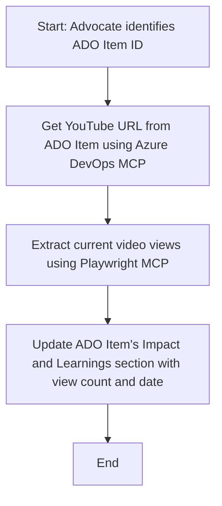

<!--
CO_OP_TRANSLATOR_METADATA:
{
  "original_hash": "14a2dfbea55ef735660a06bd6bdfe5f3",
  "translation_date": "2025-07-14T06:12:15+00:00",
  "source_file": "09-CaseStudy/UpdateADOItemsFromYT.md",
  "language_code": "tr"
}
-->
# Vaka Çalışması: MCP ile YouTube Verilerinden Azure DevOps Öğelerinin Güncellenmesi

> **Disclaimer:** YouTube gibi platformlardan alınan verilerle Azure DevOps öğelerinin güncellenmesini otomatikleştirebilen mevcut çevrimiçi araçlar ve raporlar bulunmaktadır. Aşağıdaki senaryo, MCP araçlarının otomasyon ve entegrasyon görevlerinde nasıl kullanılabileceğini göstermek amacıyla örnek bir kullanım durumu olarak sunulmuştur.

## Genel Bakış

Bu vaka çalışması, Model Context Protocol (MCP) ve araçlarının, YouTube gibi çevrimiçi platformlardan alınan bilgilerle Azure DevOps (ADO) iş öğelerinin güncellenmesini otomatikleştirmek için nasıl kullanılabileceğine dair bir örnek sunmaktadır. Anlatılan senaryo, bu araçların daha geniş yeteneklerinin sadece bir göstergesidir ve benzer birçok otomasyon ihtiyacına uyarlanabilir.

Bu örnekte, bir Advocate çevrimiçi oturumları ADO öğeleriyle takip eder; her öğe bir YouTube video URL’si içerir. MCP araçları kullanılarak, Advocate ADO öğelerini video görüntüleme sayısı gibi en güncel video metrikleriyle tekrarlanabilir ve otomatik bir şekilde güncel tutabilir. Bu yaklaşım, çevrimiçi kaynaklardan alınan bilgilerin ADO veya diğer sistemlere entegre edilmesi gereken diğer durumlara da genellenebilir.

## Senaryo

Bir Advocate, çevrimiçi oturumların ve topluluk etkileşimlerinin etkisini takip etmekle sorumludur. Her oturum, 'DevRel' projesinde bir ADO iş öğesi olarak kaydedilir ve iş öğesi YouTube video URL’si için bir alan içerir. Oturumun erişimini doğru şekilde raporlamak için Advocate, ADO öğesini mevcut video görüntüleme sayısı ve bu bilginin alındığı tarih ile güncellemelidir.

## Kullanılan Araçlar

- [Azure DevOps MCP](https://github.com/microsoft/azure-devops-mcp): MCP aracılığıyla ADO iş öğelerine programatik erişim ve güncelleme sağlar.
- [Playwright MCP](https://github.com/microsoft/playwright-mcp): YouTube video istatistikleri gibi canlı verileri web sayfalarından çıkarmak için tarayıcı işlemlerini otomatikleştirir.

## Adım Adım İş Akışı

1. **ADO Öğesini Belirle**: 'DevRel' projesindeki ADO iş öğesi kimliği (örneğin, 1234) ile başla.
2. **YouTube URL’sini Al**: Azure DevOps MCP aracıyla iş öğesinden YouTube URL’sini al.
3. **Video Görüntüleme Sayısını Çıkar**: Playwright MCP aracıyla YouTube URL’sine git ve mevcut görüntüleme sayısını çıkar.
4. **ADO Öğesini Güncelle**: Azure DevOps MCP aracıyla en son görüntüleme sayısını ve alınma tarihini ADO iş öğesinin 'Impact and Learnings' bölümüne yaz.

## Örnek Komut

```bash
- Work with the ADO Item ID: 1234
- The project is '2025-Awesome'
- Get the YouTube URL for the ADO item
- Use Playwright to get the current views from the YouTube video
- Update the ADO item with the current video views and the updated date of the information
```

## Mermaid Akış Diyagramı



## Teknik Uygulama

- **MCP Orkestrasyonu**: İş akışı, Azure DevOps MCP ve Playwright MCP araçlarının kullanımını koordine eden bir MCP sunucusu tarafından yönetilir.
- **Otomasyon**: Süreç manuel olarak tetiklenebilir veya ADO öğelerinin güncel kalması için düzenli aralıklarla çalışacak şekilde zamanlanabilir.
- **Genişletilebilirlik**: Aynı desen, ADO öğelerinin diğer çevrimiçi metriklerle (örneğin, beğeniler, yorumlar) veya farklı platformlardan güncellenmesi için genişletilebilir.

## Sonuçlar ve Etki

- **Verimlilik**: Advocate’lerin video metriklerini alma ve güncelleme işlemlerini otomatikleştirerek manuel çabayı azaltır.
- **Doğruluk**: ADO öğelerinin çevrimiçi kaynaklardan alınan en güncel verileri yansıtmasını sağlar.
- **Tekrarlanabilirlik**: Benzer senaryolar için diğer veri kaynakları veya metriklerle kullanılabilecek yeniden kullanılabilir bir iş akışı sunar.

## Kaynaklar

- [Azure DevOps MCP](https://github.com/microsoft/azure-devops-mcp)
- [Playwright MCP](https://github.com/microsoft/playwright-mcp)
- [Model Context Protocol (MCP)](https://modelcontextprotocol.io/)

**Feragatname**:  
Bu belge, AI çeviri servisi [Co-op Translator](https://github.com/Azure/co-op-translator) kullanılarak çevrilmiştir. Doğruluk için çaba göstersek de, otomatik çevirilerin hatalar veya yanlışlıklar içerebileceğini lütfen unutmayın. Orijinal belge, kendi dilinde yetkili kaynak olarak kabul edilmelidir. Kritik bilgiler için profesyonel insan çevirisi önerilir. Bu çevirinin kullanımı sonucu ortaya çıkabilecek yanlış anlamalar veya yorum hatalarından sorumlu değiliz.