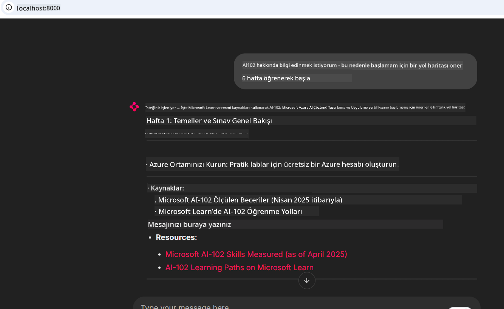
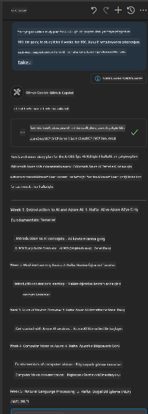

<!--
CO_OP_TRANSLATOR_METADATA:
{
  "original_hash": "4319d291c9d124ecafea52b3d04bfa0e",
  "translation_date": "2025-07-14T06:23:59+00:00",
  "source_file": "09-CaseStudy/docs-mcp/README.md",
  "language_code": "tr"
}
-->
# Vaka Çalışması: Bir İstemciden Microsoft Learn Docs MCP Sunucusuna Bağlanma

Hiç kodunuzdaki bir problemi çözerken dokümantasyon siteleri, Stack Overflow ve sonsuz arama motoru sekmeleri arasında gidip gelirken kendinizi buldunuz mu? Belki dokümanlar için ayrı bir monitörünüz var ya da IDE ile tarayıcı arasında sürekli alt-tab yapıyorsunuz. Dokümantasyonu doğrudan iş akışınıza—uygulamalarınıza, IDE’nize veya kendi özel araçlarınıza entegre edebilseydiniz, daha iyi olmaz mıydı? Bu vaka çalışmasında, kendi istemci uygulamanızdan Microsoft Learn Docs MCP sunucusuna doğrudan nasıl bağlanacağınızı keşfedeceğiz.

## Genel Bakış

Modern geliştirme sadece kod yazmaktan ibaret değil—doğru bilgiyi doğru zamanda bulmakla ilgili. Dokümantasyon her yerde, ancak genellikle en çok ihtiyaç duyduğunuz yerde değil: araçlarınızın ve iş akışlarınızın içinde. Dokümantasyon alımını doğrudan uygulamalarınıza entegre ederek zaman kazanabilir, bağlam değiştirmeyi azaltabilir ve verimliliği artırabilirsiniz. Bu bölümde, bir istemciyi Microsoft Learn Docs MCP sunucusuna nasıl bağlayacağınızı göstereceğiz, böylece uygulamanızdan hiç çıkmadan gerçek zamanlı, bağlam odaklı dokümantasyona erişebileceksiniz.

Bağlantı kurma, istek gönderme ve akış yanıtlarını verimli şekilde işleme süreçlerini adım adım inceleyeceğiz. Bu yöntem sadece iş akışınızı kolaylaştırmakla kalmaz, aynı zamanda daha akıllı ve yardımcı geliştirici araçları oluşturmanın kapısını açar.

## Öğrenme Hedefleri

Neden bunu yapıyoruz? Çünkü en iyi geliştirici deneyimleri sürtüşmeyi ortadan kaldıranlardır. Kod editörünüzün, sohbet botunuzun veya web uygulamanızın Microsoft Learn’in en güncel içeriğini kullanarak dokümantasyon sorularınızı anında yanıtlayabildiği bir dünya hayal edin. Bu bölümün sonunda şunları bileceksiniz:

- Dokümantasyon için MCP sunucu-istemci iletişiminin temellerini anlamak
- Microsoft Learn Docs MCP sunucusuna bağlanan bir konsol veya web uygulaması geliştirmek
- Gerçek zamanlı dokümantasyon alımı için akışlı HTTP istemcileri kullanmak
- Uygulamanızda dokümantasyon yanıtlarını kaydetmek ve yorumlamak

Bu becerilerin, sadece tepki veren değil, gerçekten etkileşimli ve bağlam farkında araçlar oluşturmanıza nasıl yardımcı olacağını göreceksiniz.

## Senaryo 1 - MCP ile Gerçek Zamanlı Dokümantasyon Alımı

Bu senaryoda, bir istemciyi Microsoft Learn Docs MCP sunucusuna bağlayarak uygulamanızdan hiç çıkmadan gerçek zamanlı, bağlam odaklı dokümantasyona nasıl erişeceğinizi göstereceğiz.

Hadi bunu pratiğe dökelim. Göreviniz, Microsoft Learn Docs MCP sunucusuna bağlanan, `microsoft_docs_search` aracını çağıran ve akış yanıtını konsola kaydeden bir uygulama yazmak.

### Neden bu yöntem?
Çünkü bu, daha gelişmiş entegrasyonlar oluşturmanın temelidir—ister bir sohbet botu, ister bir IDE eklentisi, ister bir web kontrol paneli geliştirmek isteyin.

Bu senaryoya ait kod ve talimatları bu vaka çalışmasının [`solution`](./solution/README.md) klasöründe bulabilirsiniz. Adımlar size bağlantıyı kurmada rehberlik edecek:
- Bağlantı için resmi MCP SDK ve akış destekli HTTP istemcisini kullanmak
- Dokümantasyon almak için `microsoft_docs_search` aracını sorgu parametresiyle çağırmak
- Doğru kayıt ve hata yönetimi uygulamak
- Kullanıcıların birden fazla arama sorgusu girmesine izin veren etkileşimli bir konsol arayüzü oluşturmak

Bu senaryo şunları gösterir:
- Docs MCP sunucusuna bağlanmak
- Sorgu göndermek
- Sonuçları ayrıştırmak ve yazdırmak

Çözümün çalışması şöyle görünebilir:

```
Prompt> What is Azure Key Vault?
Answer> Azure Key Vault is a cloud service for securely storing and accessing secrets. ...
```

Aşağıda minimal bir örnek çözüm var. Tam kod ve detaylar solution klasöründe mevcut.

<details>
<summary>Python</summary>

```python
import asyncio
from mcp.client.streamable_http import streamablehttp_client
from mcp import ClientSession

async def main():
    async with streamablehttp_client("https://learn.microsoft.com/api/mcp") as (read_stream, write_stream, _):
        async with ClientSession(read_stream, write_stream) as session:
            await session.initialize()
            result = await session.call_tool("microsoft_docs_search", {"query": "Azure Functions best practices"})
            print(result.content)

if __name__ == "__main__":
    asyncio.run(main())
```

- Tam uygulama ve kayıt için [`scenario1.py`](../../../../09-CaseStudy/docs-mcp/solution/python/scenario1.py) dosyasına bakın.
- Kurulum ve kullanım talimatları için aynı klasördeki [`README.md`](./solution/python/README.md) dosyasını inceleyin.
</details>

## Senaryo 2 - MCP ile Etkileşimli Çalışma Planı Oluşturucu Web Uygulaması

Bu senaryoda, Docs MCP’yi bir web geliştirme projesine nasıl entegre edeceğinizi öğreneceksiniz. Amaç, kullanıcıların Microsoft Learn dokümantasyonunu doğrudan web arayüzünden arayabilmesini sağlamak ve dokümantasyonu uygulamanızda veya sitenizde anında erişilebilir kılmaktır.

Şunları göreceksiniz:
- Bir web uygulaması kurmak
- Docs MCP sunucusuna bağlanmak
- Kullanıcı girdisini işlemek ve sonuçları göstermek

Çözümün çalışması şöyle görünebilir:

```
User> I want to learn about AI102 - so suggest the roadmap to get it started from learn for 6 weeks

Assistant> Here’s a detailed 6-week roadmap to start your preparation for the AI-102: Designing and Implementing a Microsoft Azure AI Solution certification, using official Microsoft resources and focusing on exam skills areas:

---
## Week 1: Introduction & Fundamentals
- **Understand the Exam**: Review the [AI-102 exam skills outline](https://learn.microsoft.com/en-us/credentials/certifications/exams/ai-102/).
- **Set up Azure**: Sign up for a free Azure account if you don't have one.
- **Learning Path**: [Introduction to Azure AI services](https://learn.microsoft.com/en-us/training/modules/intro-to-azure-ai/)
- **Focus**: Get familiar with Azure portal, AI capabilities, and necessary tools.

....more weeks of the roadmap...

Let me know if you want module-specific recommendations or need more customized weekly tasks!
```

Aşağıda minimal bir örnek çözüm var. Tam kod ve detaylar solution klasöründe mevcut.



<details>
<summary>Python (Chainlit)</summary>

Chainlit, konuşma tabanlı yapay zeka web uygulamaları oluşturmak için bir çerçevedir. MCP araçlarını çağırabilen ve sonuçları gerçek zamanlı gösterebilen etkileşimli sohbet botları ve asistanlar oluşturmayı kolaylaştırır. Hızlı prototipleme ve kullanıcı dostu arayüzler için idealdir.

```python
import chainlit as cl
import requests

MCP_URL = "https://learn.microsoft.com/api/mcp"

@cl.on_message
def handle_message(message):
    query = {"question": message}
    response = requests.post(MCP_URL, json=query)
    if response.ok:
        result = response.json()
        cl.Message(content=result.get("answer", "No answer found.")).send()
    else:
        cl.Message(content="Error: " + response.text).send()
```

- Tam uygulama için [`scenario2.py`](../../../../09-CaseStudy/docs-mcp/solution/python/scenario2.py) dosyasına bakın.
- Kurulum ve çalıştırma talimatları için [`README.md`](./solution/python/README.md) dosyasını inceleyin.
</details>

## Senaryo 3: VS Code İçinde MCP Sunucusu ile Editör İçi Dokümantasyon

Microsoft Learn Docs’u doğrudan VS Code içinde almak istiyorsanız (tarayıcı sekmeleri arasında geçiş yapmak yerine), MCP sunucusunu editörünüzde kullanabilirsiniz. Bu sayede:
- Kodlama ortamınızdan çıkmadan VS Code içinde doküman arayabilir ve okuyabilirsiniz.
- Dokümantasyona referans verebilir ve bağlantıları doğrudan README veya kurs dosyalarınıza ekleyebilirsiniz.
- GitHub Copilot ve MCP’yi bir arada kullanarak kesintisiz, yapay zekâ destekli bir dokümantasyon iş akışı oluşturabilirsiniz.

**Şunları göreceksiniz:**
- Çalışma alanı köküne geçerli bir `.vscode/mcp.json` dosyası eklemek (aşağıdaki örneğe bakın).
- VS Code’da MCP panelini açmak veya komut paletini kullanarak doküman aramak ve eklemek.
- Markdown dosyalarınızda çalışırken doğrudan dokümantasyona referans vermek.
- Bu iş akışını GitHub Copilot ile birleştirerek verimliliği artırmak.

VS Code’da MCP sunucusunu kurmaya dair bir örnek:

```json
{
  "servers": {
    "LearnDocsMCP": {
      "url": "https://learn.microsoft.com/api/mcp"
    }
  }
}
```

</details>

> Ekran görüntüleri ve adım adım rehber için [`README.md`](./solution/scenario3/README.md) dosyasına bakın.



Bu yöntem, teknik kurslar hazırlayan, dokümantasyon yazan veya sık sık referans gerektiren kod geliştiren herkes için idealdir.

## Önemli Noktalar

Dokümantasyonu doğrudan araçlarınıza entegre etmek sadece bir kolaylık değil—verimlilik için bir devrimdir. Microsoft Learn Docs MCP sunucusuna istemcinizden bağlanarak:

- Kodunuz ve dokümantasyon arasında bağlam değiştirmeyi ortadan kaldırabilirsiniz
- Güncel, bağlam odaklı dokümanları gerçek zamanlı alabilirsiniz
- Daha akıllı, daha etkileşimli geliştirici araçları oluşturabilirsiniz

Bu beceriler, sadece verimli değil, aynı zamanda kullanımı keyifli çözümler yaratmanıza yardımcı olacak.

## Ek Kaynaklar

Bilginizi derinleştirmek için şu resmi kaynakları inceleyin:

- [Microsoft Learn Docs MCP Server (GitHub)](https://github.com/MicrosoftDocs/mcp)
- [Azure MCP Server ile Başlarken (mcp-python)](https://learn.microsoft.com/en-us/azure/developer/azure-mcp-server/get-started#create-the-python-app)
- [Azure MCP Server Nedir?](https://learn.microsoft.com/en-us/azure/developer/azure-mcp-server/)
- [Model Context Protocol (MCP) Tanıtımı](https://modelcontextprotocol.io/introduction)
- [MCP Sunucusundan Eklenti Ekleme (Python)](https://learn.microsoft.com/en-us/semantic-kernel/concepts/plugins/adding-mcp-plugins)

**Feragatname**:  
Bu belge, AI çeviri servisi [Co-op Translator](https://github.com/Azure/co-op-translator) kullanılarak çevrilmiştir. Doğruluk için çaba göstersek de, otomatik çevirilerin hatalar veya yanlışlıklar içerebileceğini lütfen unutmayın. Orijinal belge, kendi dilinde yetkili kaynak olarak kabul edilmelidir. Kritik bilgiler için profesyonel insan çevirisi önerilir. Bu çevirinin kullanımı sonucu ortaya çıkabilecek yanlış anlamalar veya yorum hatalarından sorumlu değiliz.