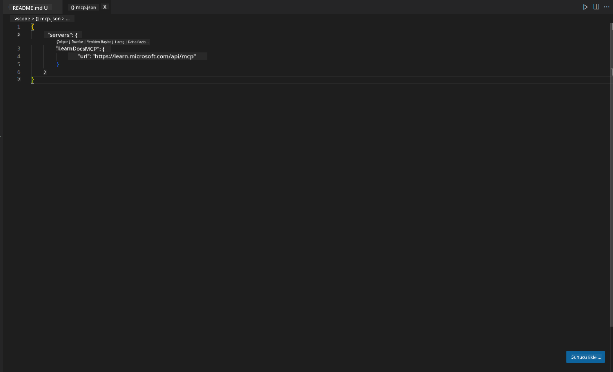
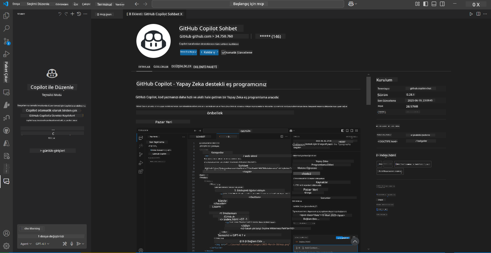
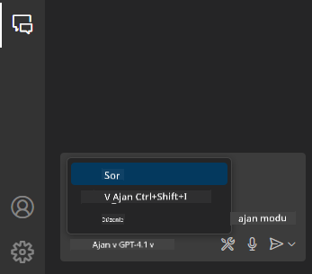
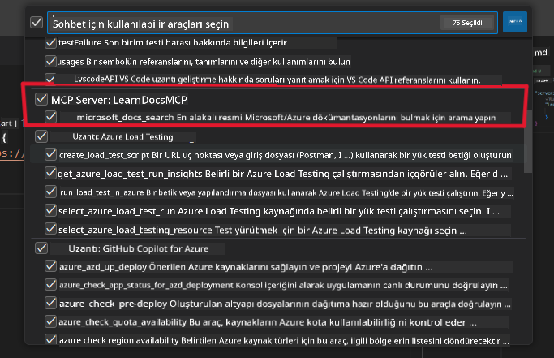
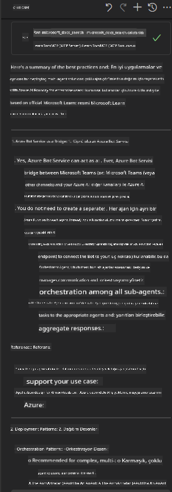

<!--
CO_OP_TRANSLATOR_METADATA:
{
  "original_hash": "db532b1ec386c9ce38c791653dc3c881",
  "translation_date": "2025-07-14T06:51:24+00:00",
  "source_file": "09-CaseStudy/docs-mcp/solution/scenario3/README.md",
  "language_code": "tr"
}
-->
# Senaryo 3: VS Code'da MCP Sunucusu ile Editör İçi Dokümantasyon

## Genel Bakış

Bu senaryoda, Microsoft Learn Dokümanlarını MCP sunucusu kullanarak doğrudan Visual Studio Code ortamınıza nasıl getireceğinizi öğreneceksiniz. Sürekli tarayıcı sekmeleri arasında geçiş yaparak dokümantasyon aramak yerine, resmi dokümanlara doğrudan editörünüzün içinden erişebilir, arama yapabilir ve referans verebilirsiniz. Bu yöntem iş akışınızı hızlandırır, odaklanmanızı sağlar ve GitHub Copilot gibi araçlarla sorunsuz entegrasyon imkanı sunar.

- Kodlama ortamınızdan çıkmadan VS Code içinde dokümanları arayın ve okuyun.
- Dokümantasyonlara referans verin ve bağlantıları doğrudan README veya kurs dosyalarınıza ekleyin.
- GitHub Copilot ve MCP’yi birlikte kullanarak yapay zekâ destekli kesintisiz bir dokümantasyon iş akışı oluşturun.

## Öğrenme Hedefleri

Bu bölümün sonunda, VS Code içinde MCP sunucusunu kurup kullanarak dokümantasyon ve geliştirme iş akışınızı nasıl geliştireceğinizi anlayacaksınız. Şunları yapabileceksiniz:

- Dokümantasyon araması için MCP sunucusunu kullanacak şekilde çalışma alanınızı yapılandırmak.
- VS Code içinden doğrudan dokümantasyon aramak ve eklemek.
- Daha verimli, yapay zekâ destekli bir iş akışı için GitHub Copilot ve MCP’nin gücünü birleştirmek.

Bu beceriler, odaklanmanızı artırmanıza, dokümantasyon kalitenizi iyileştirmenize ve geliştirici ya da teknik yazar olarak verimliliğinizi yükseltmenize yardımcı olacak.

## Çözüm

Editör içi dokümantasyon erişimi sağlamak için MCP sunucusunu VS Code ve GitHub Copilot ile entegre eden bir dizi adımı takip edeceksiniz. Bu çözüm, kurs yazarları, dokümantasyon yazarları ve dokümanlar ile Copilot arasında çalışırken odaklarını editörde tutmak isteyen geliştiriciler için idealdir.

- Kurs veya proje dokümantasyonu yazarken README dosyasına hızlıca referans bağlantıları ekleyin.
- Copilot’u kod üretmek için, MCP’yi ise ilgili dokümanları anında bulup alıntılamak için kullanın.
- Editörünüzde odaklanmaya devam edin ve verimliliğinizi artırın.

### Adım Adım Rehber

Başlamak için aşağıdaki adımları izleyin. Her adım için, süreci görsel olarak göstermek amacıyla assets klasöründen bir ekran görüntüsü ekleyebilirsiniz.

1. **MCP yapılandırmasını ekleyin:**  
   Proje kök dizininizde `.vscode/mcp.json` dosyası oluşturun ve aşağıdaki yapılandırmayı ekleyin:  
   ```json
   {
     "servers": {
       "LearnDocsMCP": {
         "url": "https://learn.microsoft.com/api/mcp"
       }
     }
   }
   ```  
   Bu yapılandırma, VS Code’a [`Microsoft Learn Docs MCP server`](https://github.com/MicrosoftDocs/mcp) ile nasıl bağlantı kurulacağını söyler.

   
    
2. **GitHub Copilot Chat panelini açın:**  
   Eğer GitHub Copilot eklentisi yüklü değilse, VS Code’daki Extensions görünümüne gidip yükleyin. Doğrudan [Visual Studio Code Marketplace](https://marketplace.visualstudio.com/items?itemName=GitHub.copilot-chat) üzerinden de indirebilirsiniz. Ardından, yan panelden Copilot Chat panelini açın.

   

3. **Agent modunu etkinleştirin ve araçları doğrulayın:**  
   Copilot Chat panelinde agent modunu etkinleştirin.

   

   Agent modunu açtıktan sonra, MCP sunucusunun kullanılabilir araçlar arasında listelendiğinden emin olun. Bu, Copilot agent’ın ilgili bilgileri almak için dokümantasyon sunucusuna erişebilmesini sağlar.

   

4. **Yeni bir sohbet başlatın ve agent’a komut verin:**  
   Copilot Chat panelinde yeni bir sohbet açın. Artık agent’a dokümantasyon sorgularınızı iletebilirsiniz. Agent, MCP sunucusunu kullanarak ilgili Microsoft Learn dokümanlarını doğrudan editörünüzde getirecek ve gösterecektir.

   - *"X konusu için bir çalışma planı hazırlamaya çalışıyorum. 8 hafta boyunca çalışacağım, her hafta için hangi içerikleri almam gerektiğini öner."*

   

5. **Canlı Sorgu:**

   > Azure AI Foundry Discord’daki [#get-help](https://discord.gg/D6cRhjHWSC) bölümünden canlı bir sorgu alalım ([orijinal mesajı görüntüle](https://discord.com/channels/1113626258182504448/1385498306720829572)):  
   
   *"Azure AI Foundry üzerinde geliştirilen AI ajanlarıyla çoklu ajan çözümünü nasıl dağıtacağım konusunda cevap arıyorum. Copilot Studio kanalları gibi doğrudan bir dağıtım yöntemi olmadığını görüyorum. Peki, kurumsal kullanıcıların etkileşimde bulunup işi halletmesi için bu dağıtımı yapmanın farklı yolları nelerdir?  
   MS Teams ile Azure AI Foundry Ajanları arasında köprü görevi görecek Azure Bot servisini kullanabileceğimizi söyleyen birçok makale/blog var, peki Azure fonksiyonu aracılığıyla Orchestrator Agent’a bağlanan bir Azure bot kurarsam bu işe yarar mı yoksa çoklu ajan çözümündeki her AI ajanı için Bot framework’te orkestrasyon yapmak üzere ayrı Azure fonksiyonları mı oluşturmam gerekir? Başka önerilere de açığım."*

   

   Agent, ilgili dokümantasyon bağlantıları ve özetlerle yanıt verecek; bunları markdown dosyalarınıza doğrudan ekleyebilir veya kodunuzda referans olarak kullanabilirsiniz.

### Örnek Sorgular

Deneyebileceğiniz bazı örnek sorgular şunlardır. Bu sorgular, MCP sunucusu ve Copilot’un VS Code’dan çıkmadan anında, bağlama duyarlı dokümantasyon ve referanslar sunmak için nasıl birlikte çalıştığını gösterecektir:

- "Azure Functions tetikleyicilerini nasıl kullanırım göster."
- "Azure Key Vault için resmi dokümantasyon bağlantısı ekle."
- "Azure kaynaklarını güvence altına almak için en iyi uygulamalar nelerdir?"
- "Azure AI servisleri için hızlı başlangıç rehberi bul."

Bu sorgular, MCP sunucusu ve Copilot’un VS Code’dan çıkmadan anında, bağlama duyarlı dokümantasyon ve referanslar sağlamak için nasıl birlikte çalıştığını gösterecektir.

---

**Feragatname**:  
Bu belge, AI çeviri servisi [Co-op Translator](https://github.com/Azure/co-op-translator) kullanılarak çevrilmiştir. Doğruluk için çaba göstersek de, otomatik çevirilerin hatalar veya yanlışlıklar içerebileceğini lütfen unutmayınız. Orijinal belge, kendi dilinde yetkili kaynak olarak kabul edilmelidir. Kritik bilgiler için profesyonel insan çevirisi önerilir. Bu çevirinin kullanımı sonucu oluşabilecek yanlış anlamalar veya yorum hatalarından sorumlu değiliz.