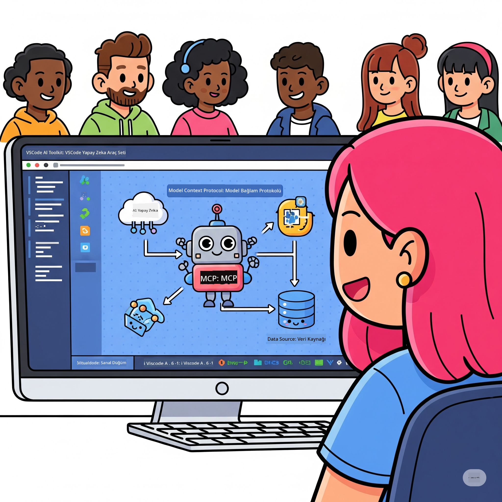
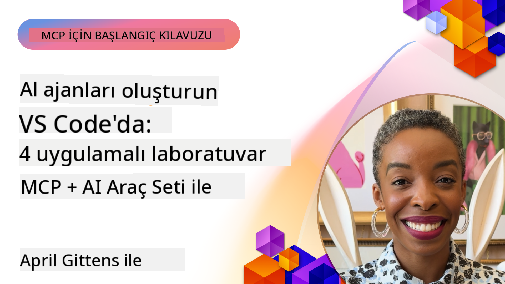

<!--
CO_OP_TRANSLATOR_METADATA:
{
  "original_hash": "1b000fd6e1b04c047578bfc5d07d54eb",
  "translation_date": "2025-08-18T18:05:30+00:00",
  "source_file": "10-StreamliningAIWorkflowsBuildingAnMCPServerWithAIToolkit/README.md",
  "language_code": "tr"
}
-->
# AI İş Akışlarını Kolaylaştırma: AI Toolkit ile MCP Sunucusu Oluşturma

## 🎯 Genel Bakış

_(Bu dersin videosunu izlemek için yukarıdaki görsele tıklayın)_

**Model Context Protocol (MCP) Atölyesi**'ne hoş geldiniz! Bu kapsamlı uygulamalı atölye, AI uygulama geliştirmede devrim yaratmak için iki ileri teknolojiyi bir araya getiriyor:

- **🔗 Model Context Protocol (MCP)**: AI araçlarının sorunsuz entegrasyonu için açık bir standart
- **🛠️ Visual Studio Code için AI Toolkit (AITK)**: Microsoft'un güçlü AI geliştirme uzantısı

### 🎓 Öğrenecekleriniz

Bu atölyenin sonunda, AI modellerini gerçek dünya araçları ve hizmetleriyle birleştiren akıllı uygulamalar oluşturma sanatında ustalaşacaksınız. Otomatik testlerden özel API entegrasyonlarına kadar, karmaşık iş zorluklarını çözmek için pratik beceriler kazanacaksınız.

## 🏗️ Teknoloji Yığını

### 🔌 Model Context Protocol (MCP)

MCP, AI için **"USB-C"** gibidir - AI modellerini harici araçlara ve veri kaynaklarına bağlayan evrensel bir standart.

**✨ Temel Özellikler:**

- 🔄 **Standartlaştırılmış Entegrasyon**: AI araç bağlantıları için evrensel arayüz
- 🏛️ **Esnek Mimari**: stdio/SSE taşımacılığı ile yerel ve uzak sunucular
- 🧰 **Zengin Ekosistem**: Tek bir protokolde araçlar, istemler ve kaynaklar
- 🔒 **Kurumsal Düzeyde Hazır**: Dahili güvenlik ve güvenilirlik

**🎯 MCP Neden Önemlidir:**
USB-C'nin kablo karmaşasını ortadan kaldırdığı gibi, MCP de AI entegrasyonlarının karmaşıklığını ortadan kaldırır. Tek bir protokol, sonsuz olasılık.

### 🤖 Visual Studio Code için AI Toolkit (AITK)

Microsoft'un VS Code'u bir AI gücüne dönüştüren amiral gemisi AI geliştirme uzantısı.

**🚀 Temel Yetkinlikler:**

- 📦 **Model Kataloğu**: Azure AI, GitHub, Hugging Face, Ollama'dan modellere erişim
- ⚡ **Yerel Çıkarım**: ONNX ile optimize edilmiş CPU/GPU/NPU çalıştırma
- 🏗️ **Ajan Oluşturucu**: MCP entegrasyonu ile görsel AI ajan geliştirme
- 🎭 **Çok Modlu**: Metin, görsel ve yapılandırılmış çıktı desteği

**💡 Geliştirme Avantajları:**

- Sıfır yapılandırma ile model dağıtımı
- Görsel istem mühendisliği
- Gerçek zamanlı test ortamı
- MCP sunucusuyla sorunsuz entegrasyon

## 📚 Öğrenme Yolculuğu

### [🚀 Modül 1: AI Toolkit Temelleri](./lab1/README.md)

**Süre**: 15 dakika

- 🛠️ AI Toolkit'i VS Code'a kurun ve yapılandırın
- 🗂️ Model Kataloğunu keşfedin (GitHub, ONNX, OpenAI, Anthropic, Google'dan 100+ model)
- 🎮 Gerçek zamanlı model testi için Etkileşimli Oyun Alanını öğrenin
- 🤖 Ajan Oluşturucu ile ilk AI ajanınızı oluşturun
- 📊 Dahili metriklerle model performansını değerlendirin (F1, alaka düzeyi, benzerlik, tutarlılık)
- ⚡ Toplu işleme ve çok modlu destek yeteneklerini öğrenin

**🎯 Öğrenme Çıktısı**: AITK yeteneklerini kapsamlı bir şekilde anlayarak işlevsel bir AI ajanı oluşturun

### [🌐 Modül 2: AI Toolkit ile MCP Temelleri](./lab2/README.md)

**Süre**: 20 dakika

- 🧠 Model Context Protocol (MCP) mimarisi ve kavramlarını öğrenin
- 🌐 Microsoft'un MCP sunucu ekosistemini keşfedin
- 🤖 Playwright MCP sunucusunu kullanarak bir tarayıcı otomasyon ajanı oluşturun
- 🔧 MCP sunucularını AI Toolkit Ajan Oluşturucu ile entegre edin
- 📊 Ajanlarınızda MCP araçlarını yapılandırın ve test edin
- 🚀 MCP destekli ajanları üretim için dışa aktarın ve dağıtın

**🎯 Öğrenme Çıktısı**: Harici araçlarla güçlendirilmiş bir AI ajanı dağıtın

### [🔧 Modül 3: AI Toolkit ile Gelişmiş MCP Geliştirme](./lab3/README.md)

**Süre**: 20 dakika

- 💻 AI Toolkit kullanarak özel MCP sunucuları oluşturun
- 🐍 En son MCP Python SDK'sını (v1.9.3) yapılandırın ve kullanın
- 🔍 Hata ayıklama için MCP Inspector'ı kurun ve kullanın
- 🛠️ Profesyonel hata ayıklama iş akışlarıyla bir Hava Durumu MCP Sunucusu oluşturun
- 🧪 Ajan Oluşturucu ve Inspector ortamlarında MCP sunucularını hata ayıklayın

**🎯 Öğrenme Çıktısı**: Modern araçlarla özel MCP sunucuları geliştirin ve hata ayıklayın

### [🐙 Modül 4: Pratik MCP Geliştirme - Özel GitHub Klon Sunucusu](./lab4/README.md)

**Süre**: 30 dakika

- 🏗️ Geliştirme iş akışları için gerçek bir GitHub Klon MCP Sunucusu oluşturun
- 🔄 Doğrulama ve hata işleme ile akıllı depo klonlama uygulayın
- 📁 Akıllı dizin yönetimi ve VS Code entegrasyonu oluşturun
- 🤖 Özel MCP araçlarıyla GitHub Copilot Ajan Modunu kullanın
- 🛡️ Üretime hazır güvenilirlik ve platformlar arası uyumluluk uygulayın

**🎯 Öğrenme Çıktısı**: Gerçek geliştirme iş akışlarını kolaylaştıran üretime hazır bir MCP sunucusu dağıtın

## 💡 Gerçek Dünya Uygulamaları ve Etkisi

### 🏢 Kurumsal Kullanım Senaryoları

#### 🔄 DevOps Otomasyonu

Geliştirme iş akışınızı akıllı otomasyonla dönüştürün:

- **Akıllı Depo Yönetimi**: AI destekli kod inceleme ve birleştirme kararları
- **Akıllı CI/CD**: Kod değişikliklerine dayalı otomatik boru hattı optimizasyonu
- **Sorun Sınıflandırma**: Otomatik hata sınıflandırma ve atama

#### 🧪 Kalite Güvencesinde Devrim

AI destekli otomasyonla testleri geliştirin:

- **Akıllı Test Oluşturma**: Kapsamlı test paketlerini otomatik olarak oluşturun
- **Görsel Regresyon Testi**: AI destekli UI değişiklik tespiti
- **Performans İzleme**: Proaktif sorun tespiti ve çözümü

#### 📊 Veri Hattı Zekası

Daha akıllı veri işleme iş akışları oluşturun:

- **Uyarlanabilir ETL Süreçleri**: Kendini optimize eden veri dönüşümleri
- **Anomali Tespiti**: Gerçek zamanlı veri kalitesi izleme
- **Akıllı Yönlendirme**: Akıllı veri akışı yönetimi

#### 🎧 Müşteri Deneyimi Geliştirme

Olağanüstü müşteri etkileşimleri oluşturun:

- **Bağlam Farkında Destek**: Müşteri geçmişine erişimi olan AI ajanları
- **Proaktif Sorun Çözümü**: Öngörücü müşteri hizmetleri
- **Çok Kanallı Entegrasyon**: Platformlar arası birleşik AI deneyimi

## 🛠️ Ön Koşullar ve Kurulum

### 💻 Sistem Gereksinimleri

| Bileşen | Gereksinim | Notlar |
|---------|------------|-------|
| **İşletim Sistemi** | Windows 10+, macOS 10.15+, Linux | Modern bir işletim sistemi |
| **Visual Studio Code** | En son kararlı sürüm | AITK için gerekli |
| **Node.js** | v18.0+ ve npm | MCP sunucu geliştirme için |
| **Python** | 3.10+ | Python MCP sunucuları için isteğe bağlı |
| **Bellek** | Minimum 8GB RAM | Yerel modeller için 16GB önerilir |

### 🔧 Geliştirme Ortamı

#### Önerilen VS Code Uzantıları

- **AI Toolkit** (ms-windows-ai-studio.windows-ai-studio)
- **Python** (ms-python.python)
- **Python Debugger** (ms-python.debugpy)
- **GitHub Copilot** (GitHub.copilot) - İsteğe bağlı ancak faydalı

#### İsteğe Bağlı Araçlar

- **uv**: Modern Python paket yöneticisi
- **MCP Inspector**: MCP sunucuları için görsel hata ayıklama aracı
- **Playwright**: Web otomasyon örnekleri için

## 🎖️ Öğrenme Çıktıları ve Sertifikasyon Yolu

### 🏆 Beceri Ustalığı Kontrol Listesi

Bu atölyeyi tamamlayarak aşağıdaki alanlarda ustalık kazanacaksınız:

#### 🎯 Temel Yetkinlikler

- [ ] **MCP Protokol Ustalığı**: Mimari ve uygulama desenlerinde derin anlayış
- [ ] **AITK Yetkinliği**: Hızlı geliştirme için AI Toolkit'in uzman düzeyinde kullanımı
- [ ] **Özel Sunucu Geliştirme**: MCP sunucularını oluşturma, dağıtma ve bakımını yapma
- [ ] **Araç Entegrasyonu Mükemmelliği**: AI'ı mevcut geliştirme iş akışlarına sorunsuz bir şekilde bağlama
- [ ] **Sorun Çözme Uygulaması**: Öğrenilen becerileri gerçek iş zorluklarına uygulama

#### 🔧 Teknik Beceriler

- [ ] AI Toolkit'i VS Code'da kurma ve yapılandırma
- [ ] Özel MCP sunucuları tasarlama ve uygulama
- [ ] GitHub Modellerini MCP mimarisiyle entegre etme
- [ ] Playwright ile otomatik test iş akışları oluşturma
- [ ] AI ajanlarını üretim için dağıtma
- [ ] MCP sunucu performansını hata ayıklama ve optimize etme

#### 🚀 İleri Düzey Yetenekler

- [ ] Kurumsal ölçekli AI entegrasyonları tasarlama
- [ ] AI uygulamaları için güvenlik en iyi uygulamalarını uygulama
- [ ] Ölçeklenebilir MCP sunucu mimarileri tasarlama
- [ ] Belirli alanlar için özel araç zincirleri oluşturma
- [ ] AI tabanlı geliştirme konusunda başkalarına mentorluk yapma

## 📖 Ek Kaynaklar

- [MCP Spesifikasyonu](https://modelcontextprotocol.io/docs)
- [AI Toolkit GitHub Deposu](https://github.com/microsoft/vscode-ai-toolkit)
- [Örnek MCP Sunucuları Koleksiyonu](https://github.com/modelcontextprotocol/servers)
- [En İyi Uygulamalar Kılavuzu](https://modelcontextprotocol.io/docs/best-practices)

---

**🚀 AI geliştirme iş akışınızı devrimleştirmeye hazır mısınız?**

MCP ve AI Toolkit ile birlikte akıllı uygulamaların geleceğini inşa edelim!

**Feragatname**:  
Bu belge, [Co-op Translator](https://github.com/Azure/co-op-translator) adlı bir yapay zeka çeviri hizmeti kullanılarak çevrilmiştir. Doğruluk için çaba göstersek de, otomatik çevirilerin hata veya yanlışlıklar içerebileceğini lütfen unutmayın. Belgenin orijinal dili, yetkili kaynak olarak kabul edilmelidir. Kritik bilgiler için profesyonel bir insan çevirisi önerilir. Bu çevirinin kullanımından kaynaklanan herhangi bir yanlış anlama veya yanlış yorumlama durumunda sorumluluk kabul edilmez.